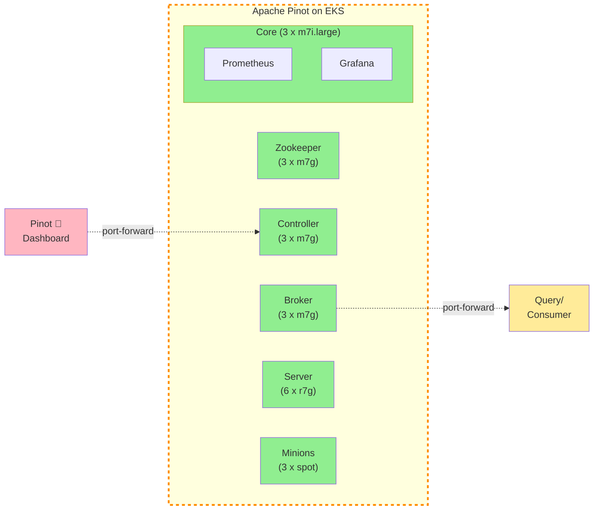
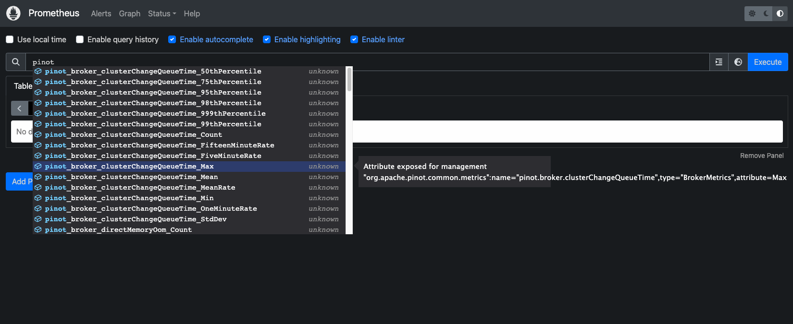

## Deploying Apache Pinot (🍷) on EKS

[Apache Pinot](https://pinot.apache.org/) is real-time distributed OLAP datastore, purpose built for low-latency and high-throughput analytics. You can use pinot to ingest and immediately query data from streaming or batch data sources e.g. Apache Kafka, Amazon Kinesis Data Streams, Amazon S3, etc).

Apache Pinot includes the following characteristics:

- **Ultra low-latency** analytics even at extremely high throughput.
- **Columnar data store** with several smart indexing and pre-aggregation techniques.
- **Scaling up** and **out** with no upper bound.
- **Consistent performance** based on the size of your cluster and an expected query per second (QPS) threshold.

It's a perfect solution for user-facing real-time analytics and other analytical use cases, including internal dashboards, anomaly detection, and ad hoc data exploration. You can learn more about Apache Pinot and its components in its [documentation](https://docs.pinot.apache.org/).

In this stack, we will deploy Apache Pinot on Kubernetes cluster managed by Elastic Kubernetes Service (EKS). Some of the benefits of deploying Apache Pinot on EKS cluster are

- Manage Apache Pinot Cluster using Kubernetes
- Scale each layer independently
- No single point of failure
- Auto recovery

## Architecture



In this setup we deploy all Apache Pinot components in private subnets across 2 availability zones. This allows for greater flexibility and resilience. The architecture uses:

- **Controllers & Brokers**: m7g.2xlarge on-demand instances (8 vCPU, 32 GiB RAM, Graviton3)
- **Servers**: r7g.2xlarge on-demand instances (8 vCPU, 64 GiB RAM, memory-optimized for data serving)
- **Minions**: Spot instances when available (stateless background tasks)
- **Zookeeper**: 3-node ensemble for cluster coordination (m7g instances with persistent storage)

### Component Details

**Zookeeper Cluster**
- Deployed as a StatefulSet with 3 replicas for high availability
- Manages cluster metadata, leader election, and distributed coordination
- Uses persistent volumes (10Gi data + datalog) with pod anti-affinity to ensure pods run on different nodes
- Configured with `jute.maxbuffer=4000000` to handle large Pinot table schemas and segment metadata

:::note
We deploy Zookeeper using a custom StatefulSet manifest instead of the Bitnami Helm chart subchart, as the Bitnami Zookeeper chart has been deprecated. This approach gives us full control over the Zookeeper configuration and ensures long-term maintainability.
:::

**Storage Configuration**
- Server segments: 100Gi gp3 EBS volumes per server pod
- Zookeeper: 10Gi gp3 EBS volumes for data and transaction logs
- Storage class: gp3 (AWS default)
- **DeepStore**: S3 bucket for segment backup and recovery (shared across data stacks)

**Metrics & Monitoring**
- JMX Prometheus exporter enabled on port 8008 for all components
- ServiceMonitor resources configured for Prometheus scraping (30s interval)
- Metrics exposed for controllers, brokers, and servers

**S3 DeepStore Integration**
- Segments are automatically backed up to S3 after creation
- Enables faster recovery and pod replacement without rebuilding segments
- Reduces dependency on local EBS storage
- Configured at the infrastructure level (no per-table configuration needed)

Access to Controller and Broker components is via kubectl port-forwarding.

:::tip
To see Pinot in action with real-time data ingestion, check out the [Kafka Integration](./kafka-integration) example that demonstrates streaming data from Kafka into Pinot tables.
:::


> Note: Based on your use case, you will need to update the cluster size and configuration to better suite your use case. You can read more about Apache Pinot capacity planning [here](https://startree.ai/blog/capacity-planning-in-apache-pinot-part-1) and [here](https://startree.ai/blog/capacity-planning-in-apache-pinot-part-2).

## S3 DeepStore Configuration

This deployment includes S3 DeepStore for segment backup and recovery. DeepStore provides:

- **Disaster Recovery**: Segments persist in S3 even if all server pods are deleted
- **Faster Scaling**: New servers download pre-built segments from S3 instead of rebuilding
- **Operational Flexibility**: Safely delete/recreate pods without data loss

The infrastructure automatically configures:
- Shared S3 bucket for all data stacks (with prefix-based organization)
- IAM permissions via EKS Pod Identity
- S3PinotFS plugin on controller and server components
- Server-side upload to S3 when segments complete

Tables automatically use DeepStore without additional configuration. See the [Kafka Integration](./kafka-integration) example to see it in action.

## Prerequisites 📝

Ensure that you have following tools installed on your machine.

1. [aws cli](https://docs.aws.amazon.com/cli/latest/userguide/install-cliv2.html)
2. [kubectl](https://Kubernetes.io/docs/tasks/tools/)
3. [terraform](https://learn.hashicorp.com/tutorials/terraform/install-cli)

## Deployment ⚙️

### Deploy the EKS Cluster with Apache Pinot

## Step 1: Clone Repository & Navigate

First, clone the repository. Navigate to apache pinot folder.

```bash
git clone https://github.com/awslabs/data-on-eks.git
cd data-on-eks/data-stacks/pinot-on-eks
```

## Step 2: Customize Stack
Edit the `terraform/data-stack.tfvars` file to customize settings if required. For example, you can open it with `vi`, `nano`, or any other text editor.

## Step 3: Deploy Infrastructure

Run the deployment script:

```bash
./deploy.sh
```

:::note

**If deployment fails:**
- Rerun the same command: `./deploy.sh`
- If it still fails, debug using kubectl commands or [raise an issue](https://github.com/awslabs/data-on-eks/issues)

:::

:::info

**Expected deployment time:** 15-20 minutes

:::


### Verify Deployment

Verify the Amazon EKS Cluster

```bash
aws eks describe-cluster --name pinot-on-eks
```

Update local kubeconfig so we can access kubernetes cluster.

```bash
export KUBECONFIG=kubeconfig.yaml
```

Let's verify all the pods are running.

```bash
kubectl get pods -n pinot
```
#### Output
```bash
NAME                                                   READY   STATUS      RESTARTS   AGE
pinot-broker-0                                         1/1     Running     0          11d
pinot-broker-1                                         1/1     Running     0          11d
pinot-broker-2                                         1/1     Running     0          11d
pinot-controller-0                                     1/1     Running     0          11d
pinot-controller-1                                     1/1     Running     0          11d
pinot-controller-2                                     1/1     Running     0          11d
pinot-minion-stateless-86cf65f89-rlpwn                 1/1     Running     0          12d
pinot-minion-stateless-86cf65f89-tkbjf                 1/1     Running     0          12d
pinot-minion-stateless-86cf65f89-twp8n                 1/1     Running     0          12d
pinot-server-0                                         1/1     Running     0          11d
pinot-server-1                                         1/1     Running     0          11d
pinot-server-2                                         1/1     Running     0          11d
pinot-zookeeper-0                                      1/1     Running     0          12d
pinot-zookeeper-1                                      1/1     Running     0          12d
pinot-zookeeper-2                                      1/1     Running     0          12d
```

We have also deployed `prometheus` and `grafana` under `monitoring` namespace. So also make sure all the pods for `monitoring` are also running.

```bash
kubectl get pods -n kube-prometheus-stack
```
#### Output
```bash
prometheus-grafana-85b4584dbf-4l72l                    3/3     Running   0          12d
prometheus-kube-prometheus-operator-84dcddccfc-pv8nv   1/1     Running   0          12d
prometheus-kube-state-metrics-57f6b6b4fd-txjtb         1/1     Running   0          12d
prometheus-prometheus-kube-prometheus-prometheus-0     2/2     Running   0          4d3h
prometheus-prometheus-node-exporter-4jh8q              1/1     Running   0          12d
prometheus-prometheus-node-exporter-f5znb              1/1     Running   0          12d
prometheus-prometheus-node-exporter-f9xrz              1/1     Running   0          12d
```


Now lets access Apache Pinot Console using the below command. Console consist of **Cluster Manager**, **Query Explorer**, **Zookeeper Browser** and **Swagger REST API Explorer**.

```bash
kubectl port-forward service/pinot-controller 9000:9000 -n pinot
```

This will allow you to access Apache Pinot Console like the one shown below using `http://localhost:9000`


Apache Pinot supports exporting metrics using Prometheus JMX exporter that is packaged within the Apache Pinot docker image. ServiceMonitor resources are configured to scrape metrics from controller, broker, and server components on port 8008 every 30 seconds.

Let's verify metrics from all Apache Pinot components are getting published to Prometheus:

```bash
kubectl port-forward service/prometheus-kube-prometheus-prometheus 9090:9090 -n kube-prometheus-stack
```

Navigate to the prometheus UI at `http://localhost:9090`, type `pinot` in the search box and you should be able to see all the metrics.



Next, let's use Grafana to visualize the Apache Pinot metrics. In order to access Grafana, we need to get the grafana password from Kubernetes secrets:

```bash
kubectl get secret grafana-admin-secret -n kube-prometheus-stack -o jsonpath="{.data.admin-password}" | base64 --decode
```

Now use port-forwarding to access Grafana at port `8080`:

```bash
kubectl port-forward service/prometheus-grafana 8080:80 -n kube-prometheus-stack
```

Login to grafana dashboard using `admin` and the password retrieved in the previous step. Navigate to Dashboard → New → Import.

Download the official Pinot dashboard JSON from the [Apache Pinot documentation](https://docs.pinot.apache.org/operators/tutorials/monitor-pinot-using-prometheus-and-grafana#configure-pinot-dashboard). This is a starter dashboard that you should customize for production use.


To learn more about monitoring Apache Pinot using Prometheus and Grafana, see the [official guide](https://docs.pinot.apache.org/operators/tutorials/monitor-pinot-using-prometheus-and-grafana).


## Next Steps

- [Kafka integration](/data-on-eks/docs/datastacks/databases/pinot-on-eks/kafka-integration)


## Cleanup 🧹

To delete all the components provisioned as part of this stack, using the following command to destroy all the resources.

```bash
./cleanup.sh
```

:::caution

To avoid unwanted charges to your AWS account, delete all the AWS resources created during this deployment.

:::
