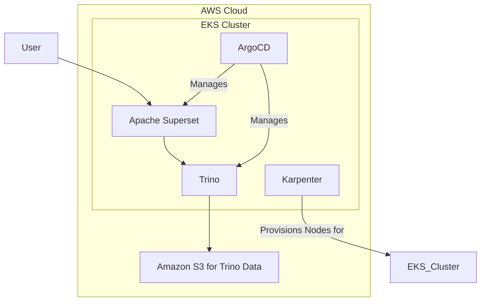

## Apache Superset on EKS

This guide describes how to deploy a scalable Apache Superset platform on Amazon EKS. The stack is provisioned with Terraform and includes Karpenter for node auto-scaling and ArgoCD for GitOps-style application management.

### Architecture

This stack provisions the following architecture:



- **Amazon EKS Cluster:** The core Kubernetes environment for running all applications.
- **Apache Superset:** The business intelligence and data visualization platform.
- **Trino:** A distributed SQL query engine used by Superset to query data in S3.
- **ArgoCD:** Manages the deployment of Superset and Trino in a GitOps fashion.
- **Karpenter:** Automatically provisions new EKS nodes when needed, allowing the cluster to scale efficiently.
- **Amazon RDS:** Hosts the metadata database for Superset.
- **Amazon S3:** Stores the data to be queried by Trino.


### Prerequisites

Before deploying, ensure you have the following tools installed:

- **AWS CLI** - [Install Guide](https://docs.aws.amazon.com/cli/latest/userguide/getting-started-install.html)
- **Terraform** (>= 1.0) - [Install Guide](https://developer.hashicorp.com/terraform/install)
- **kubectl** - [Install Guide](https://kubernetes.io/docs/tasks/tools/)
- **Helm** (>= 3.0) - [Install Guide](https://helm.sh/docs/intro/install/)
- **AWS credentials configured** - Run `aws configure` or use IAM roles

## Step 1: Clone Repository & Navigate

```bash
git clone https://github.com/awslabs/data-on-eks.git
cd data-on-eks/data-stacks/Superset-on-eks
```

## Step 2: Customize Stack
Edit the `terraform/data-stack.tfvars` file to customize settings if required. For example, you can open it with `vi`, `nano`, or any other text editor.

## Step 3: Deploy Infrastructure

Run the deployment script:

```bash
./deploy.sh
```

:::note

**If deployment fails:**
- Rerun the same command: `./deploy.sh`
- If it still fails, debug using kubectl commands or [raise an issue](https://github.com/awslabs/data-on-eks/issues)

:::

:::info

**Expected deployment time:** 15-20 minutes

:::

## Step 4: Verify Deployment

The deployment script automatically configures kubectl. Verify the cluster is ready:

```bash
# Set kubeconfig
export KUBECONFIG=kubeconfig.yaml

:::tip Kubeconfig Persistence
The `export` command only sets the `KUBECONFIG` for your current terminal session. If you open a new terminal, you will need to run this command again. To make it permanent, you can add the line to your shell's profile script (e.g., `~/.bashrc`, `~/.zshrc`) by running:

`echo "export KUBECONFIG=$(pwd)/kubeconfig.yaml" >> ~/.bashrc && source ~/.bashrc`

Replace `~/.bashrc` with your shell's specific profile file if you are not using bash.
:::


Use the following commands to verify that the core components of the stack are running correctly.

```bash
# 1. Verify that the EKS nodes are ready
kubectl get nodes
# Expected: At least 2-3 nodes should be in the 'Ready' state.

# 2. Verify that the Karpenter NodePools are configured
kubectl get nodepools
# Expected: You should see the nodepools defined for the cluster.

# 3. Verify that the ArgoCD applications are Synced and Healthy
kubectl get applications -n argocd
# Expected: All applications should have a SYNC STATUS of 'Synced' and HEALTH STATUS of 'Healthy'.
```

<details>
<summary><b>Expected Output Examples</b></summary>

**Nodes:**
```
NAME                                          STATUS   ROLES    AGE     VERSION
ip-100-64-112-7.us-west-2.compute.internal    Ready    <none>   6h16m   v1.33.5-eks-113cf36
ip-100-64-113-62.us-west-2.compute.internal   Ready    <none>   6h16m   v1.33.5-eks-113cf36
ip-100-64-12-166.us-west-2.compute.internal   Ready    <none>   6h10m   v1.33.5-eks-113cf36

```

**ArgoCD Applications:**
```
NAME                           SYNC STATUS   HEALTH STATUS
Superset                        Scyned        Healthy
argo-events                    Synced        Healthy
argo-workflows                 Synced        Healthy
aws-for-fluentbit              Synced        Healthy
...
```

**Karpenter NodePools:**
```
NAME                              TYPE          CAPACITY    ZONE         NODE                                          READY   AGE
general-purpose-d2mrg             m7g.4xlarge   spot        us-west-2a   ip-100-64-12-166.us-west-2.compute.internal   True    6h12m
general-purpose-d5mgm             m7g.4xlarge   spot        us-west-2a   ip-100-64-50-67.us-west-2.compute.internal    True    6h15m
memory-optimized-graviton-xkn5x   r8g.4xlarge   on-demand   us-west-2a   ip-100-64-59-123.us-west-2.compute.internal   True    6h14m
```

</details>

## Step 5: Access ArgoCD UI

The deployment script displays ArgoCD credentials at the end. Access the UI:

```bash
# Port forward ArgoCD server
kubectl port-forward svc/argocd-server -n argocd 8080:443
```

Open https://localhost:8080 in your browser:
- **Username:** `admin`
- **Password:** Displayed at end of `deploy.sh` output

:::info
It may take additional ~5 minutes for all applications to show **Synced** and **Healthy** status.
:::


## Troubleshooting

### Common Issues

**Pods stuck in Pending:**
```bash
# Check node capacity
kubectl describe nodes

# Check Karpenter logs
kubectl logs -n karpenter -l app.kubernetes.io/name=karpenter
```

**ArgoCD applications not syncing:**

```bash
# Check ArgoCD application status
kubectl get applications -n argocd

# Check specific application
kubectl describe application Superset-operator -n argocd
```

**Try refreshing and syncing the applications in ArgoCD**


## Next Steps

With infrastructure deployed, you can now run any Superset examples:

- [Spark Applications with Superset DAGs](/data-on-eks/docs/datastacks/orchestration/Superset-on-eks/Superset)


## Cleanup

To remove all resources, use the dedicated cleanup script:

```bash
# Navigate to stack directory
cd data-on-eks/data-stacks/Superset-on-eks

# Run cleanup script
./cleanup.sh
```

:::warning

This command will delete all resources and data. Make sure to backup any important data first.

:::


:::note

**If cleanup fails:**
- Rerun the same command: `./cleanup.sh`
- Keep rerunning until all resources are deleted
- Some AWS resources may have dependencies that require multiple cleanup attempts

:::

