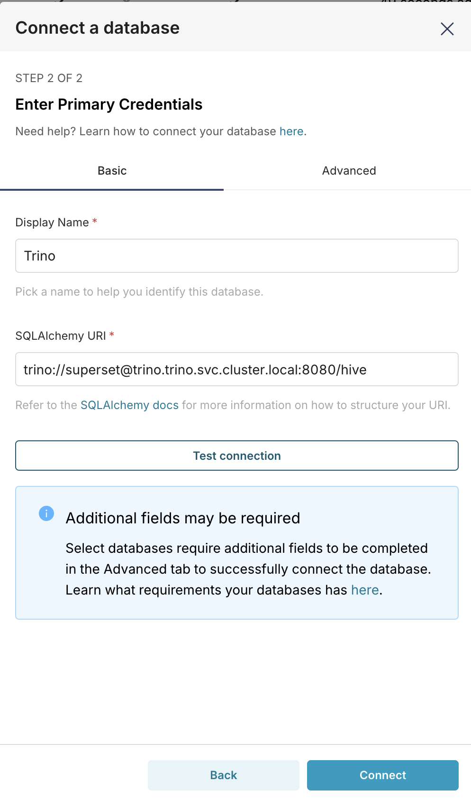
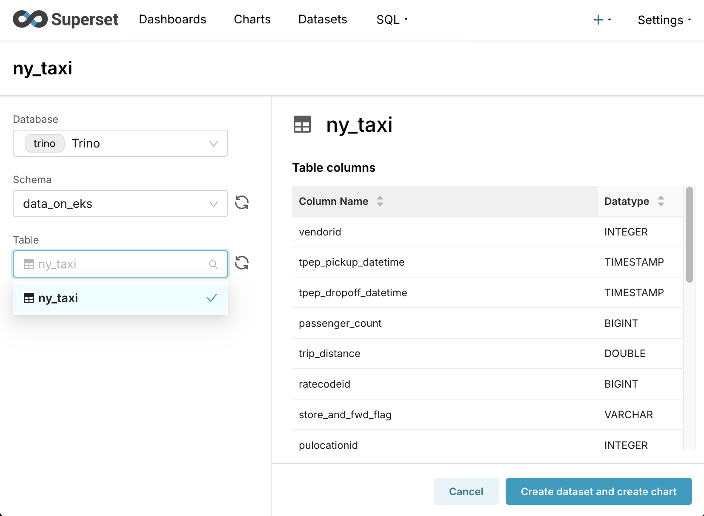

## Visualizing Data with Superset and Trino

## Introduction

This guide demonstrates how to use Apache Superset with Trino to query and visualize data stored in Amazon S3. In this walkthrough, you will connect Superset to a Trino database, create a new table from data in an S3 bucket, enrich the data with calculated columns, and build interactive charts and dashboards.

Superset is deployed in the same EKS cluster as Trino, and Trino is configured to use Pod Identity to securely access data in S3.

## Prerequisites

- Deploy Superset on EKS infrastructure: [Infrastructure Setup](./infra.md)
- The following tools are installed on your local machine:
  - `kubectl`
  - `aws-cli`
  - `wget`


## Obtain and upload example data

in this example, we use taxi data from nyc

setup env:

```bash
export SUPERSET_DIR=$(git rev-parse --show-toplevel)/data-stacks/superset-on-eks
export S3_BUCKET=$(terraform -chdir=$SUPERSET_DIR/terraform/_local output -raw s3_bucket_id_spark_history_server)
```

get data:

```bash
wget https://d37ci6vzurychx.cloudfront.net/trip-data/yellow_tripdata_2025-01.parquet
```

copy data:

```bash
aws s3 cp yellow_tripdata_2025-01.parquet s3://${S3_BUCKET}/example-data/
```

## Login to Superset Configuration 

### Login to the UI

```bash
kubectl port-forward svc/superset 8088:8088 -n superset
```

Log in with:
  -  username: `admin`
  -  password: `admin`


### Setup database connection

Apache Superset connects to data from any SQL-speaking datastore or data engine. For this guide, we will connect to Trino, a distributed SQL query engine designed to query large data sets distributed over one or more heterogeneous data sources.

First, let's establish the connection to the Trino database running in our EKS cluster.

1.  In the Superset UI, go to **Settings** -> **Database Connections**.
2.  Click the **+ Database** button in the top right.
3.  Select **Trino** from the dropdown menu of supported databases.
4.  Enter the following SQLAlchemy URI:

    ```
    trino://superset@trino.trino.svc.cluster.local:8080/hive
    ```

    

5.  Go to the **Advanced** tab.
6.  Check the box for **Allow DDL and DML**.
7.  Click **Finish**.

    

### Create the `ny_taxi` Table

Before creating our table, let's verify that Superset can connect to Trino and see the available schemas.

1.  In Superset, navigate to **SQL Lab** -> **SQL Editor**.
2.  Ensure your Trino database is selected.
3.  Run the following query to see available schemas:

    ```sql
    SHOW SCHEMAS FROM hive;
    ```

    This should return `data_on_eks` as one of the available schemas.

Now, let's create an external table in Trino that points to our S3 data.

1.  In the SQL Editor, execute the following `CREATE TABLE` statement.

    :::info
    Be sure to replace `${YOUR_BUCKET_NAME}` in the `external_location` parameter with the S3 bucket name you exported earlier. You can find it by running `echo $S3_BUCKET`.
    :::

    ```sql
    CREATE TABLE hive.data_on_eks.ny_taxi (
           VendorID INTEGER,
           tpep_pickup_datetime TIMESTAMP,
           tpep_dropoff_datetime TIMESTAMP,
           passenger_count BIGINT,
           trip_distance DOUBLE,
           RatecodeID BIGINT,
           store_and_fwd_flag VARCHAR,
           PULocationID INTEGER,
           DOLocationID INTEGER,
           payment_type BIGINT,
           fare_amount DOUBLE,
           extra DOUBLE,
           mta_tax DOUBLE,
           tip_amount DOUBLE,
           tolls_amount DOUBLE,
           improvement_surcharge DOUBLE,
           total_amount DOUBLE,
           congestion_surcharge DOUBLE,
           Airport_fee DOUBLE,
           cbd_congestion_fee DOUBLE
       )
       WITH (
           format = 'PARQUET',
           external_location = 's3://${YOUR_BUCKET_NAME}/example-data/'
       );
    ```

2.  Once the table is created, verify that you can read data from it by running:

    ```sql
    SELECT * FROM hive.data_on_eks.ny_taxi;
    ```


### Create a dataset

In Superset, a **dataset** is a virtual representation of a table or view that you can query. Datasets serve as the foundation for creating charts and dashboards. They allow you to define custom dimensions and metrics, which enriches the data without altering the underlying database table.

Let's create a dataset from our new `ny_taxi` table.

1.  Navigate to the **Datasets** tab and click **+ Dataset**.
2.  Select your Trino database (`trino`).
3.  Select the `data_on_eks` schema.
4.  Select the `ny_taxi` table.
5.  Click **Create dataset and create chart**.




To make our data easier to analyze, we can create custom **calculated columns** and **metrics**.

-   **Calculated Columns** let you create new columns by applying SQL functions to existing ones (e.g., extracting the day of the week from a timestamp).
-   **Metrics** are custom SQL aggregations (e.g., `AVG(total_amount)`) that you can use in your charts.

This allows you to enrich your dataset for visualization without needing to run `ALTER TABLE` commands in the database.

Let's add a metric for the average trip cost and calculated columns for the hour and day of the week.

1.  Go to the **Datasets** tab, find the `ny_taxi` dataset, and click the **Edit** icon.
2.  Select the **Metrics** tab and click **+ Add item**.
3.  Configure the new metric with the following details:
    *   **Metric:** `avg_total_amount`
    *   **SQL Expression:** `AVG(total_amount)`
    *   **Description:** `Average total fare amount per trip`
    *   **D3 Format:** `$,.2f`
4.  Now, select the **Calculated Columns** tab and click **+ Add item**.
5.  Create the `day_of_week` column:
    *   **Column Name:** `day_of_week`
    *   **SQL Expression:** `date_format(tpep_pickup_datetime, '%W')`
6.  Click **+ Add item** again to create the `hour_of_day` column:
    *   **Column Name:** `hour_of_day`
    *   **SQL Expression:** `hour(tpep_pickup_datetime)`
7.  Click **Save** to apply the changes to the dataset.


### Create charts

Now that our dataset is enriched, let's create a few charts to explore the taxi trip data.

#### Chart 1: Heatmap of Trips by Day of Week and Hour

This chart will help us answer the question: "What are the absolute busiest hours of the week for taxi rides?"

1.  Navigate to the **Charts** tab and click **+ Chart**.
2.  Select the `ny_taxi` dataset.
3.  Choose the **Heatmap** chart type.
4.  Set the **X-Axis** to `hour_of_day`.
5.  Set the **Y-Axis** to `day_of_week`.
6.  Set the **Metric** to `COUNT(*)`.
7.  Click **Create new chart**.
8.  Give your chart a name (e.g., "Heatmap of Trips by Day of Week and Hour") and save it.

#### Chart 2: Average Trip Fare by Hour of the Day

This chart can show if trips at certain times are more lucrative, helping to answer: "Are trips taken late at night more expensive on average than midday trips?"

1.  Create another new chart using the `ny_taxi` dataset.
2.  Choose the **Line Chart** or **Bar Chart** type.
3.  Set the **Dimension / X-Axis** to `hour_of_day`.
4.  Set the **Metric** to the `avg_total_amount` metric you created earlier.
5.  Click **Create new chart**.
6.  Give your chart a name (e.g., "Average Trip Fare by Hour") and save it.


### Create dashboard

Finally, let's combine our charts into a single dashboard.

1.  Navigate to the **Dashboards** tab and click **+ Dashboard**.
2.  Give your new dashboard a name, like "NYC Taxi Insights".
3.  You will be taken to the dashboard editor. Drag the two charts you created from the "Charts" panel on the right onto the dashboard canvas.
4.  Resize and arrange the charts as you see fit.
5.  Click **Save**.

You now have an interactive dashboard for exploring the taxi data. Feel free to create more charts and add them to your dashboard to continue your analysis.


## Clean up

To avoid unwanted charges to your AWS account, it is important to delete all the AWS resources created during this deployment.

The `cleanup.sh` script in the `data-stacks/superset-on-eks` directory will destroy all the resources that were created.

```bash
cd $(git rev-parse --show-toplevel)/data-stacks/superset-on-eks
./cleanup.sh
```

:::caution
This command will permanently delete the EKS cluster and all associated resources.
:::
