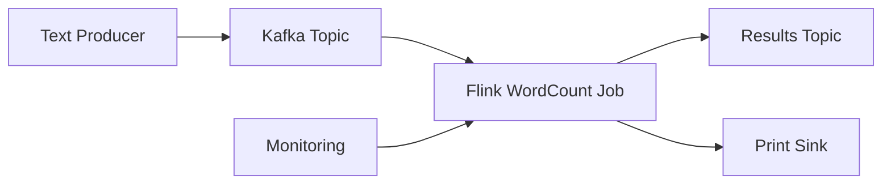

# Real-time WordCount Streaming

Classic streaming example with Kafka source and real-time word count aggregation using Apache Flink.

## Overview

This example demonstrates a complete real-time streaming pipeline:
- Reading text data from Kafka topics
- Processing and counting words in real-time
- Writing results to output sinks
- Monitoring streaming metrics and performance

## Prerequisites

- Flink on EKS infrastructure deployed
- Kafka cluster running
- Basic understanding of Flink streaming concepts

## Architecture



## Kafka Setup

### Create Input Topic

```bash
# Create topic for input text
kubectl exec -n kafka my-cluster-kafka-0 -- \
  bin/kafka-topics.sh --bootstrap-server localhost:9092 \
  --create --topic wordcount-input --partitions 4 --replication-factor 3

# Create topic for output results
kubectl exec -n kafka my-cluster-kafka-0 -- \
  bin/kafka-topics.sh --bootstrap-server localhost:9092 \
  --create --topic wordcount-output --partitions 4 --replication-factor 3
```

### Verify Topics

```bash
# List all topics
kubectl exec -n kafka my-cluster-kafka-0 -- \
  bin/kafka-topics.sh --bootstrap-server localhost:9092 --list
```

## Flink WordCount Job

### Job Configuration

```yaml
apiVersion: flink.apache.org/v1beta1
kind: FlinkDeployment
metadata:
  name: wordcount-streaming
  namespace: flink-operator
spec:
  image: flink:1.18-java11
  flinkVersion: v1_18

  flinkConfiguration:
    # Checkpointing configuration
    execution.checkpointing.interval: 30000
    execution.checkpointing.mode: EXACTLY_ONCE
    state.backend: rocksdb
    state.checkpoints.dir: s3://your-bucket/checkpoints/wordcount

    # Kafka configuration
    kafka.bootstrap.servers: my-cluster-kafka-bootstrap.kafka.svc.cluster.local:9092

  serviceAccount: flink-service-account

  jobManager:
    replicas: 1
    resource:
      memory: "2048m"
      cpu: 1

  taskManager:
    replicas: 2
    resource:
      memory: "2048m"
      cpu: 1

  job:
    jarURI: local:///opt/flink/examples/streaming/WordCount.jar
    entryClass: org.apache.flink.streaming.examples.wordcount.WordCount
    args:
      - "--input"
      - "kafka"
      - "--kafka.bootstrap.servers"
      - "my-cluster-kafka-bootstrap.kafka.svc.cluster.local:9092"
      - "--kafka.topic"
      - "wordcount-input"
      - "--output"
      - "kafka"
      - "--kafka.output.topic"
      - "wordcount-output"
```

### Custom WordCount Application

```java
// WordCountStreaming.java
public class WordCountStreaming {

    public static void main(String[] args) throws Exception {

        StreamExecutionEnvironment env = StreamExecutionEnvironment.getExecutionEnvironment();

        // Configure checkpointing
        env.enableCheckpointing(30000);
        env.getCheckpointConfig().setCheckpointingMode(CheckpointingMode.EXACTLY_ONCE);

        // Kafka source configuration
        KafkaSource<String> source = KafkaSource.<String>builder()
            .setBootstrapServers("my-cluster-kafka-bootstrap.kafka.svc.cluster.local:9092")
            .setTopics("wordcount-input")
            .setGroupId("wordcount-group")
            .setStartingOffsets(OffsetsInitializer.earliest())
            .setValueOnlyDeserializer(new SimpleStringSchema())
            .build();

        // Kafka sink configuration
        KafkaSink<String> sink = KafkaSink.<String>builder()
            .setBootstrapServers("my-cluster-kafka-bootstrap.kafka.svc.cluster.local:9092")
            .setRecordSerializer(KafkaRecordSerializationSchema.builder()
                .setTopic("wordcount-output")
                .setValueSerializationSchema(new SimpleStringSchema())
                .build())
            .build();

        // Processing pipeline
        env.fromSource(source, WatermarkStrategy.noWatermarks(), "Kafka Source")
            .flatMap(new LineSplitter())
            .keyBy(value -> value.f0)
            .window(TumblingProcessingTimeWindows.of(Time.seconds(10)))
            .sum(1)
            .map(tuple -> tuple.f0 + "," + tuple.f1)
            .sinkTo(sink);

        env.execute("WordCount Streaming");
    }

    public static final class LineSplitter implements FlatMapFunction<String, Tuple2<String, Integer>> {
        @Override
        public void flatMap(String line, Collector<Tuple2<String, Integer>> out) {
            for (String word : line.toLowerCase().split("\\W+")) {
                if (word.length() > 0) {
                    out.collect(new Tuple2<>(word, 1));
                }
            }
        }
    }
}
```

## Running the Example

### 1. Deploy the Flink Job

```bash
# Apply the Flink job configuration
kubectl apply -f wordcount-streaming-job.yaml

# Monitor job deployment
kubectl get flinkdeployment -n flink-operator -w
```

### 2. Start Data Producer

```bash
# Create a simple text producer
kubectl run kafka-producer --image=confluentinc/cp-kafka:latest --rm -it --restart=Never \
  -- bash -c "
echo 'hello world flink streaming example
apache flink is great for streaming
real time processing with flink
kafka and flink integration' | \
kafka-console-producer --bootstrap-server my-cluster-kafka-bootstrap.kafka.svc.cluster.local:9092 \
--topic wordcount-input"
```

### 3. Monitor Results

```bash
# Check output topic
kubectl run kafka-consumer --image=confluentinc/cp-kafka:latest --rm -it --restart=Never \
  -- kafka-console-consumer --bootstrap-server my-cluster-kafka-bootstrap.kafka.svc.cluster.local:9092 \
  --topic wordcount-output --from-beginning

# Expected output:
# hello,1
# world,1
# flink,3
# streaming,2
# apache,1
# is,1
# great,1
# for,1
# real,1
# time,1
# processing,1
# with,1
# kafka,1
# and,1
# integration,1
```

### 4. Access Flink UI

```bash
# Port forward to Flink JobManager UI
kubectl port-forward -n flink-operator svc/wordcount-streaming-rest 8081:8081

# Open http://localhost:8081 in browser
```

## Monitoring and Metrics

### Flink Job Metrics

```bash
# Check job status
kubectl get flinkdeployment wordcount-streaming -n flink-operator -o yaml

# View job logs
kubectl logs -n flink-operator deployment/wordcount-streaming-jobmanager

# Check TaskManager logs
kubectl logs -n flink-operator deployment/wordcount-streaming-taskmanager
```

### Kafka Metrics

```bash
# Check consumer group lag
kubectl exec -n kafka my-cluster-kafka-0 -- \
  bin/kafka-consumer-groups.sh --bootstrap-server localhost:9092 \
  --describe --group wordcount-group
```

### Prometheus Metrics

```bash
# Access Grafana dashboard
kubectl port-forward -n kube-prometheus-stack svc/kube-prometheus-stack-grafana 3000:80

# Navigate to Flink dashboards:
# - Flink Job Overview
# - Flink TaskManager Metrics
# - Kafka Consumer Metrics
```

## Performance Tuning

### Parallelism Configuration

```yaml
# Adjust parallelism based on throughput
flinkConfiguration:
  parallelism.default: 4
  taskmanager.numberOfTaskSlots: 2
```

### Memory Tuning

```yaml
# TaskManager memory configuration
taskManager:
  resource:
    memory: "4096m"
    cpu: 2
flinkConfiguration:
  taskmanager.memory.process.size: "4096m"
  taskmanager.memory.flink.size: "3200m"
```

### Checkpointing Optimization

```yaml
# Checkpoint tuning
flinkConfiguration:
  execution.checkpointing.interval: 60000
  execution.checkpointing.timeout: 300000
  state.checkpoints.num-retained: 3
```

## Troubleshooting

### Job Not Starting

```bash
# Check job logs
kubectl logs -n flink-operator deployment/wordcount-streaming-jobmanager

# Common issues:
# - Kafka connectivity
# - S3 permissions for checkpoints
# - Resource constraints
```

### High Latency

```bash
# Check backpressure
# In Flink UI: Job -> BackPressure tab

# Monitor Kafka consumer lag
kubectl exec -n kafka my-cluster-kafka-0 -- \
  bin/kafka-consumer-groups.sh --bootstrap-server localhost:9092 \
  --describe --group wordcount-group
```

### Checkpoint Failures

```bash
# Check S3 bucket permissions
aws s3 ls s3://your-bucket/checkpoints/wordcount/

# Verify service account has S3 access
kubectl describe serviceaccount flink-service-account -n flink-operator
```

## Scaling

### Horizontal Scaling

```bash
# Scale TaskManagers
kubectl patch flinkdeployment wordcount-streaming -n flink-operator --type='merge' \
  -p='{"spec":{"taskManager":{"replicas":4}}}'
```

### Auto-scaling with Karpenter

```yaml
# Karpenter NodePool for Flink workloads
apiVersion: karpenter.sh/v1beta1
kind: NodePool
metadata:
  name: flink-streaming
spec:
  template:
    metadata:
      labels:
        workload-type: flink-streaming
    spec:
      requirements:
        - key: node.kubernetes.io/instance-type
          operator: In
          values: ["c5.large", "c5.xlarge", "c5.2xlarge"]
```

## Best Practices

### Resource Management
- Size TaskManagers based on parallelism requirements
- Monitor memory usage and garbage collection
- Use appropriate checkpoint intervals
- Configure proper watermark strategies

### Error Handling
- Implement proper restart strategies
- Handle poison messages in Kafka
- Set up alerting for job failures
- Use savepoints for job updates

### State Management
- Monitor state size growth
- Use appropriate state TTL
- Clean up old checkpoints
- Test recovery procedures

## Cleanup

```bash
# Stop the streaming job
kubectl delete flinkdeployment wordcount-streaming -n flink-operator

# Clean up Kafka topics
kubectl exec -n kafka my-cluster-kafka-0 -- \
  bin/kafka-topics.sh --bootstrap-server localhost:9092 \
  --delete --topic wordcount-input

kubectl exec -n kafka my-cluster-kafka-0 -- \
  bin/kafka-topics.sh --bootstrap-server localhost:9092 \
  --delete --topic wordcount-output
```

## Related Examples

- [Infrastructure Deployment](./infra)
- [Back to Examples](/data-on-eks/docs/datastacks/flink-on-eks/)
