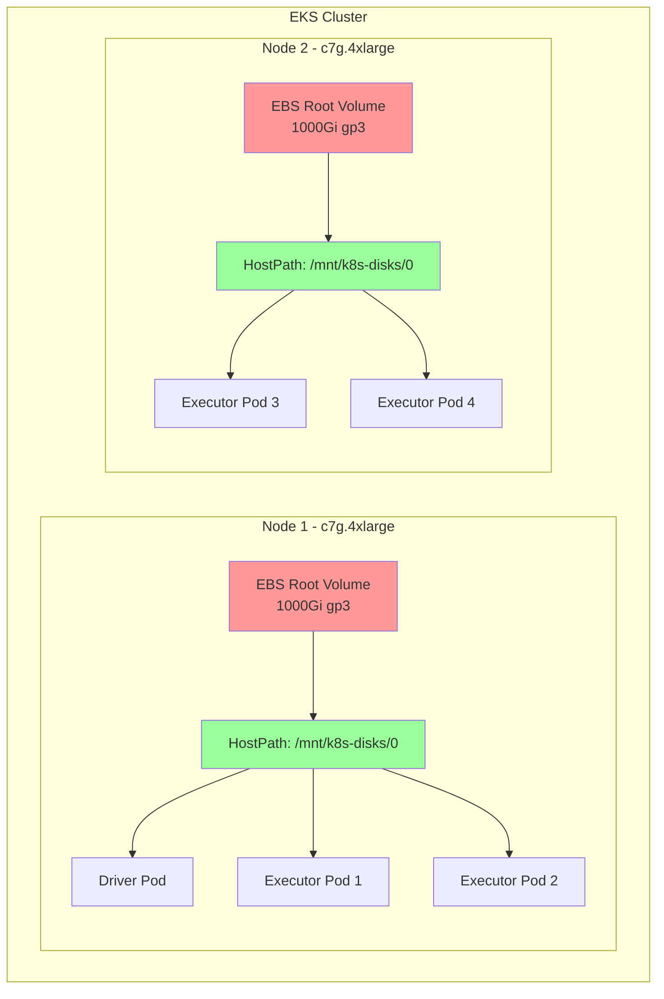

# EMR Spark with EBS Hostpath Storage

This example demonstrates running Spark jobs on EMR on EKS using EBS hostpath storage for shuffle data. This is the most cost-effective storage option as it uses the node's root EBS volume without provisioning additional storage.

## What You'll Learn

- How to configure Spark to use EBS hostpath storage for shuffle operations
- When to use hostpath storage vs. dynamic PVCs or NVMe SSDs
- How to submit EMR Spark jobs with custom pod templates
- How to monitor job execution and verify storage configuration

## When to Use This Example

**Best for:**
- ✅ Development and testing environments
- ✅ Cost-sensitive workloads where storage performance is not critical
- ✅ Small to medium shuffle operations (&lt;100GB per executor)
- ✅ Jobs that can tolerate moderate I/O latency (1-3ms)

**Not recommended for:**
- ❌ Production workloads requiring guaranteed IOPS
- ❌ Shuffle-intensive jobs with large data volumes
- ❌ Low-latency requirements (&lt;1ms)
- ❌ Workloads needing storage isolation between executors

## Architecture: Shared Node Storage



**Key Benefits:**
- 💰 **Cost Effective**: ~70% cost reduction vs per-pod PVCs
- 🚀 **Simple Setup**: No PVC provisioning or management
- ⚡ **Fast Access**: Direct hostpath mount, no CSI overhead
- 📊 **Shared Storage**: Multiple pods share the same node volume

**Trade-offs:**
- ⚠️ **Noisy Neighbors**: Pods on same node compete for I/O
- 🔄 **No Portability**: Data tied to specific node
- 🗑️ **Manual Cleanup**: Shuffle data persists after job completion

## Prerequisites

- Deploy EMR on EKS infrastructure: [Infrastructure Setup](./infra.md)
- **Karpenter** configured with large root EBS volumes (1000Gi recommended)

## What is Shuffle Storage in Spark?

**Shuffle storage** holds intermediate data during Spark operations like `groupBy`, `join`, and `reduceByKey`. When data is redistributed across executors, it's temporarily stored before being read by subsequent stages.

## Spark Shuffle Storage Comparison

| Storage Type | Performance | Cost | Isolation | Use Case |
|-------------|-------------|------|-----------|----------|
| **EBS Hostpath** | 📊 Medium | 💵 Low | ⚠️ Shared | **Cost-optimized workloads** |
| **EBS Dynamic PVC** | ⚡ High | 💰 Medium | ✅ Isolated | Production fault tolerance |
| **NVMe SSD** | 🔥 Very High | 💰 High | ✅ Isolated | Maximum performance |

### When to Use EBS Hostpath

- ✅ Cost-sensitive workloads
- ✅ Non-critical batch jobs
- ✅ Workloads with predictable I/O patterns
- ✅ Single-tenant nodes (one Spark job per node)

### When to Avoid

- ❌ Multi-tenant clusters with mixed workloads
- ❌ I/O-intensive shuffle operations
- ❌ Jobs requiring data persistence across node failures

## Example Configuration

### Pod Template

The executor pod template configures hostpath storage:

```yaml
# EMR on EKS Executor Pod Template - EBS Hostpath Storage (Graviton)
# Uses EBS root volume for Spark shuffle data
apiVersion: v1
kind: Pod
metadata:
  name: emr-executor
  namespace: emr-data-team-a
spec:
  volumes:
    - name: spark-local-dir-1
      hostPath:
        path: /mnt/k8s-disks/0  # EBS Hostpath on root volume
        type: DirectoryOrCreate

  nodeSelector:
    # Use compute-optimized Graviton nodepool
    NodeGroupType: SparkGravitonComputeOptimized
    node.kubernetes.io/arch: arm64

  affinity:
    nodeAffinity:
      requiredDuringSchedulingIgnoredDuringExecution:
        nodeSelectorTerms:
        - matchExpressions:
          # Only non-SSD instance families (c6g, c7g)
          - key: karpenter.k8s.aws/instance-family
            operator: In
            values: ["c6g", "c7g"]

  initContainers:
    - name: volume-permission
      image: public.ecr.aws/docker/library/busybox
      # Grant volume access to hadoop user (UID 999, GID 1000)
      command: ['sh', '-c', 'mkdir -p /data1; chown -R 999:1000 /data1']
      volumeMounts:
        - name: spark-local-dir-1
          mountPath: /data1

  containers:
    - name: spark-kubernetes-executor
      volumeMounts:
        - name: spark-local-dir-1
          mountPath: /data1
          readOnly: false
```

### Spark Configuration

Key Spark properties for hostpath storage:

```json
{
  "spark.local.dir": "/data1",
  "spark.driver.cores": "2",
  "spark.executor.cores": "4",
  "spark.driver.memory": "8g",
  "spark.executor.memory": "16g",
  "spark.dynamicAllocation.enabled": "true",
  "spark.dynamicAllocation.shuffleTracking.enabled": "true",
  "spark.dynamicAllocation.minExecutors": "2",
  "spark.dynamicAllocation.maxExecutors": "10"
}
```

## Running the Example

### 1. Configure kubectl Access

First, ensure you have kubectl access to your EMR on EKS cluster:

```bash
# Navigate to the terraform directory
cd data-stacks/emr-on-eks/terraform/_local

# Get the kubectl configuration command
terraform output configure_kubectl

# Run the output command (example):
aws eks --region us-west-2 update-kubeconfig --name emr-on-eks

# Verify access
kubectl get nodes
```

### 2. Navigate to Example Directory

```bash
cd ../../examples/ebs-hostpath
```

### 3. Review the Configuration

The example includes:
- `execute_emr_eks_job.sh` - Job submission script
- `driver-pod-template.yaml` - Driver pod configuration
- `executor-pod-template.yaml` - Executor pod configuration with hostpath volumes
- `pyspark-taxi-trip.py` - Sample PySpark application analyzing NYC taxi data

### 4. Submit the Spark Job

```bash
./execute_emr_eks_job.sh
```

This script will:
1. Read Terraform outputs for EMR virtual cluster details
2. Upload pod templates and PySpark script to S3
3. Download NYC taxi dataset (11 parquet files, ~500MB)
4. Submit EMR Spark job with hostpath storage configuration

Expected output:
```
Starting EMR on EKS job submission...
Virtual Cluster ID: hclg71zute4fm4fpm3m2cobv0
Job submitted successfully!
Job ID: 000000036udlljfol9o
```

### 5. Monitor the Job

```bash
# Watch pods in real-time
kubectl get pods -n emr-data-team-a -w

# In another terminal, check job status
aws emr-containers list-job-runs \
  --virtual-cluster-id $EMR_VIRTUAL_CLUSTER_ID_TEAM_A \
  --region us-west-2

# View job logs
kubectl logs -f <driver-pod-name> -n emr-data-team-a
```

### 6. Verify Storage Configuration

Check that executors are using hostpath storage:

```bash
# Describe an executor pod
kubectl describe pod taxidata-ebs-hostpath-exec-1 -n emr-data-team-a | grep -A5 "Volumes:"

# Expected output:
# Volumes:
#   spark-local-dir-1:
#     Type:          HostPath (bare host directory volume)
#     Path:          /mnt/k8s-disks/0
#     HostPathType:  DirectoryOrCreate
```

### 7. Check Shuffle Data on Node

Verify shuffle data is written to the hostpath:

```bash
# Get node name where executor is running
NODE=$(kubectl get pod taxidata-ebs-hostpath-exec-1 -n emr-data-team-a \
  -o jsonpath='{.spec.nodeName}')

# Check disk usage
kubectl debug node/$NODE -it --image=ubuntu -- \
  df -h /mnt/k8s-disks/0

# List shuffle files
kubectl debug node/$NODE -it --image=ubuntu -- \
  ls -lh /mnt/k8s-disks/0/spark-*
```

## Performance Characteristics

### Throughput

- **Sequential Read**: ~250 MB/s (gp3 baseline)
- **Sequential Write**: ~250 MB/s (gp3 baseline)
- **IOPS**: 3,000-16,000 (configurable with gp3)

### Latency

- **Average**: 1-3ms
- **P99**: 5-10ms

### Cost Analysis

Example for 10 executors running 1 hour:

| Storage Type | Volume Size | Cost/Hour | Total Cost |
|-------------|-------------|-----------|------------|
| **EBS Hostpath (2 nodes)** | 2 × 1000Gi | $0.16 | **$0.32** |
| **EBS PVC (10 volumes)** | 10 × 100Gi | $0.80 | **$0.80** |
| **Savings** | - | - | **60%** |

:::info Cost Calculation
Based on gp3 pricing: $0.08/GB-month in us-west-2. Actual savings depend on node consolidation and job duration.
:::

## Karpenter Configuration

Ensure your Karpenter EC2NodeClass has large root volumes:

```yaml
apiVersion: karpenter.k8s.aws/v1
kind: EC2NodeClass
metadata:
  name: ebs-gp3-1000gi-6000iops-1000tp
spec:
  amiFamily: AL2023
  blockDeviceMappings:
    - deviceName: /dev/xvda
      ebs:
        volumeSize: 1000Gi  # Large root volume for shuffle
        volumeType: gp3
        iops: 6000
        throughput: 1000
        encrypted: true
        deleteOnTermination: true
```

## Troubleshooting

### Pods Stuck in Pending

Check if nodes have sufficient disk space:

```bash
kubectl get nodeclaims
kubectl describe nodeclaim <nodeclaim-name>
```

### Permission Denied Errors

Verify the init container is setting correct permissions:

```bash
kubectl logs taxidata-ebs-hostpath-exec-1 -n emr-data-team-a -c volume-permission
```

### Disk Full Errors

Check disk usage on nodes:

```bash
kubectl top nodes
```

Clean up old shuffle data:

```bash
# SSH to node and clean up
kubectl debug node/$NODE -it --image=ubuntu -- \
  rm -rf /mnt/k8s-disks/0/spark-*
```

### Noisy Neighbor Issues

If experiencing I/O contention:

1. Reduce executors per node
2. Use node affinity to spread executors
3. Consider upgrading to EBS PVC or NVMe SSD storage

## Best Practices

### 1. Size Root Volumes Appropriately

```yaml
# Recommended: 1000Gi for shuffle-intensive workloads
volumeSize: 1000Gi
```

### 2. Enable Dynamic Allocation

```json
{
  "spark.dynamicAllocation.enabled": "true",
  "spark.dynamicAllocation.shuffleTracking.enabled": "true"
}
```

### 3. Monitor Disk Usage

Set up CloudWatch alarms for disk utilization:

```bash
aws cloudwatch put-metric-alarm \
  --alarm-name eks-node-disk-usage \
  --metric-name disk_used_percent \
  --threshold 80
```

### 4. Clean Up Shuffle Data

Add a cleanup job to remove old shuffle data:

```bash
# Cron job to clean up shuffle data older than 24 hours
kubectl create cronjob shuffle-cleanup \
  --image=ubuntu \
  --schedule="0 */6 * * *" \
  -- find /mnt/k8s-disks/0 -type d -name "spark-*" -mtime +1 -exec rm -rf {} +
```

## Comparison with Other Storage Options

### vs. EBS Dynamic PVC

| Feature | EBS Hostpath | EBS PVC |
|---------|-------------|---------|
| **Cost** | ✅ Lower | ❌ Higher |
| **Isolation** | ❌ Shared | ✅ Isolated |
| **Provisioning** | ✅ Instant | ⏱️ 30-60s |
| **Fault Tolerance** | ❌ Node-bound | ✅ Portable |

### vs. NVMe SSD

| Feature | EBS Hostpath | NVMe SSD |
|---------|-------------|----------|
| **Cost** | ✅ Lower | ❌ Higher |
| **Performance** | 📊 Medium | 🔥 Very High |
| **Availability** | ✅ All instances | ⚠️ SSD instances only |
| **Durability** | ✅ EBS-backed | ⚠️ Ephemeral |

## Next Steps

- [EBS PVC Storage](./ebs-pvc.md) - Isolated storage with dynamic provisioning
- [NVMe SSD Storage](./nvme-ssd.md) - Maximum I/O performance
- [Infrastructure Guide](./infra.md) - Customize your deployment

## Additional Resources

- [EMR on EKS Best Practices](https://docs.aws.amazon.com/emr/latest/EMR-on-EKS-DevelopmentGuide/best-practices.html)
- [Spark Configuration Guide](https://spark.apache.org/docs/latest/configuration.html)
- [Karpenter Node Templates](https://karpenter.sh/docs/concepts/nodepools/)
