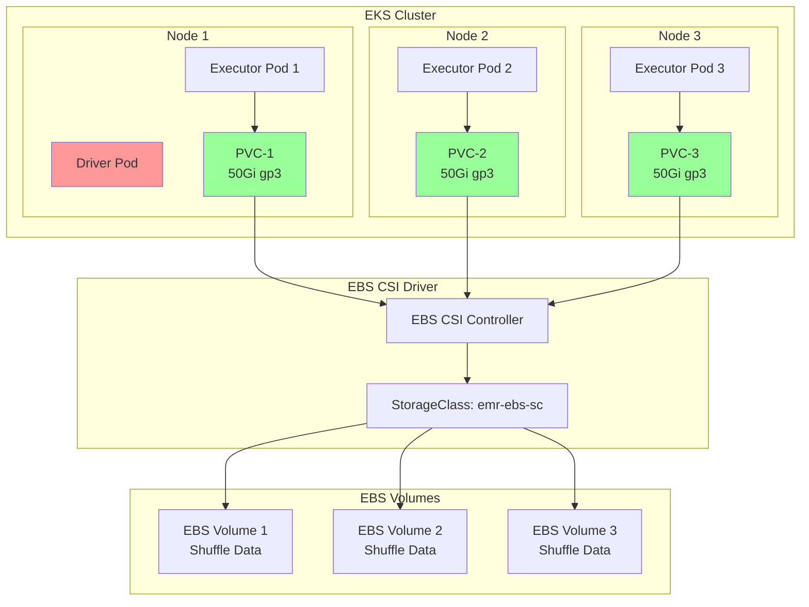

# EMR Spark with EBS Dynamic PVC Storage

This example demonstrates running Spark jobs on EMR on EKS using dynamically provisioned EBS volumes (PVCs) for shuffle storage. Each executor gets its own dedicated EBS volume, providing storage isolation and predictable performance.

## What You'll Learn

- How to configure Spark to use dynamic EBS PVCs for shuffle operations
- How the EBS CSI driver automatically provisions volumes per executor
- When to use PVC storage vs. hostpath or NVMe SSDs
- How to monitor PVC creation and cleanup

## When to Use This Example

**Best for:**
- ✅ Production workloads requiring storage isolation
- ✅ Multi-tenant environments where executors share nodes
- ✅ Jobs needing predictable I/O performance per executor
- ✅ Workloads with varying shuffle data sizes

**Not recommended for:**
- ❌ Cost-sensitive workloads (use hostpath instead)
- ❌ Ultra-low latency requirements (&lt;1ms) (use NVMe instead)
- ❌ Very short-lived jobs (volume provisioning overhead)
- ❌ Workloads hitting AWS EBS volume limits

## Architecture: Dynamic Volume Provisioning



**Key Benefits:**
- 🎯 **Isolated Storage**: Each executor gets its own dedicated EBS volume
- ⚡ **Dynamic Provisioning**: Volumes created automatically on-demand
- 🔒 **No Noisy Neighbors**: I/O performance isolated per executor
- 🗑️ **Auto Cleanup**: Volumes deleted when executors terminate

**Trade-offs:**
- 💰 **Higher Cost**: Separate volume per executor
- ⏱️ **Provisioning Delay**: 30-60s to create new volumes
- 📊 **Volume Limits**: AWS account limits on EBS volumes

## Prerequisites

- Deploy EMR on EKS infrastructure: [Infrastructure Setup](./infra.md)
- **EBS CSI Driver** installed and configured
- **StorageClass** for gp3 volumes

:::info EBS CSI Requirement
This example requires the EBS CSI driver to dynamically create volumes. The infrastructure deployment includes this by default.
:::

## What is Shuffle Storage in Spark?

**Shuffle storage** holds intermediate data during Spark operations like `groupBy`, `join`, and `reduceByKey`. When data is redistributed across executors, it's temporarily stored before being read by subsequent stages.

## Spark Shuffle Storage Comparison

| Storage Type | Performance | Cost | Isolation | Provisioning |
|-------------|-------------|------|-----------|--------------|
| **EBS Dynamic PVC** | ⚡ High | 💰 Medium | ✅ Isolated | ⏱️ 30-60s |
| **EBS Hostpath** | 📊 Medium | 💵 Low | ⚠️ Shared | ✅ Instant |
| **NVMe SSD** | 🔥 Very High | 💰 High | ✅ Isolated | ✅ Instant |

### When to Use EBS Dynamic PVC

- ✅ Production workloads requiring isolation
- ✅ Multi-tenant clusters
- ✅ I/O-intensive shuffle operations
- ✅ Workloads with variable executor counts

### When to Avoid

- ❌ Cost-sensitive batch jobs (use EBS Hostpath)
- ❌ Ultra-low latency requirements (use NVMe SSD)
- ❌ Very short-lived jobs (provisioning overhead)

## Example Configuration

### StorageClass

Define a StorageClass for dynamic EBS provisioning:

```yaml
# EBS StorageClass for EMR on EKS
apiVersion: storage.k8s.io/v1
kind: StorageClass
metadata:
  name: emr-ebs-sc
provisioner: ebs.csi.aws.com
volumeBindingMode: WaitForFirstConsumer
parameters:
  type: gp3
  fsType: ext4
  encrypted: "true"
```

### Pod Template

The executor pod template is minimal - volumes are configured via Spark properties:

```yaml
# EMR on EKS Executor Pod Template - EBS PVC Storage
apiVersion: v1
kind: Pod
metadata:
  name: emr-executor
  namespace: emr-data-team-a
spec:
  nodeSelector:
    # Use compute-optimized Graviton nodepool
    NodeGroupType: SparkGravitonComputeOptimized
    node.kubernetes.io/arch: arm64

  affinity:
    nodeAffinity:
      requiredDuringSchedulingIgnoredDuringExecution:
        nodeSelectorTerms:
        - matchExpressions:
          # Only non-SSD instance families (c6g, c7g)
          - key: karpenter.k8s.aws/instance-family
            operator: In
            values: ["c6g", "c7g"]

  containers:
    - name: spark-kubernetes-executor
      # Volumes configured via Spark properties
```

### Spark Configuration

Key Spark properties for dynamic PVC:

```json
{
  "spark.local.dir": "/data",
  "spark.driver.cores": "2",
  "spark.executor.cores": "4",
  "spark.driver.memory": "8g",
  "spark.executor.memory": "16g",

  "spark.kubernetes.executor.volumes.persistentVolumeClaim.spark-local-dir-1.options.claimName": "OnDemand",
  "spark.kubernetes.executor.volumes.persistentVolumeClaim.spark-local-dir-1.options.storageClass": "emr-ebs-sc",
  "spark.kubernetes.executor.volumes.persistentVolumeClaim.spark-local-dir-1.options.sizeLimit": "50Gi",
  "spark.kubernetes.executor.volumes.persistentVolumeClaim.spark-local-dir-1.mount.path": "/data",
  "spark.kubernetes.executor.volumes.persistentVolumeClaim.spark-local-dir-1.mount.readOnly": "false",

  "spark.dynamicAllocation.enabled": "true",
  "spark.dynamicAllocation.shuffleTracking.enabled": "true",
  "spark.dynamicAllocation.minExecutors": "2",
  "spark.dynamicAllocation.maxExecutors": "10"
}
```

:::tip OnDemand PVC
The `claimName: "OnDemand"` tells Spark to create a new PVC for each executor automatically.
:::

## Running the Example

### 1. Configure kubectl Access

First, ensure you have kubectl access to your EMR on EKS cluster:

```bash
# Navigate to the terraform directory
cd data-stacks/emr-on-eks/terraform/_local

# Get the kubectl configuration command
terraform output configure_kubectl

# Run the output command (example):
aws eks --region us-west-2 update-kubeconfig --name emr-on-eks

# Verify access
kubectl get nodes
```

### 2. Navigate to Example Directory

```bash
cd ../../examples/ebs-pvc
```

### 3. Review the Configuration

The example includes:
- `execute_emr_eks_job.sh` - Job submission script
- `ebs-storageclass-pvc.yaml` - StorageClass for gp3 volumes
- `driver-pod-template.yaml` - Driver pod configuration
- `executor-pod-template.yaml` - Executor pod configuration with PVC
- `pyspark-taxi-trip.py` - Sample PySpark application analyzing NYC taxi data

### 4. Deploy StorageClass

```bash
# Create StorageClass for dynamic provisioning
kubectl apply -f ebs-storageclass-pvc.yaml

# Verify StorageClass
kubectl get storageclass emr-ebs-sc
```

### 5. Submit the Spark Job

```bash
./execute_emr_eks_job.sh
```

This script will:
1. Read Terraform outputs for EMR virtual cluster details
2. Upload pod templates and PySpark script to S3
3. Download NYC taxi dataset (11 parquet files, ~500MB)
4. Submit EMR Spark job with dynamic PVC configuration

Expected output:
```
Starting EMR on EKS job submission...
Virtual Cluster ID: hclg71zute4fm4fpm3m2cobv0
Job submitted successfully!
Job ID: 000000036udmujb4df8
```

### 6. Monitor the Job and PVCs

```bash
# Watch pods in real-time
kubectl get pods -n emr-data-team-a -w

# In another terminal, watch PVCs being created dynamically
kubectl get pvc -n emr-data-team-a -w

# Check job status
aws emr-containers list-job-runs \
  --virtual-cluster-id $EMR_VIRTUAL_CLUSTER_ID_TEAM_A \
  --region us-west-2
```

### 7. Verify Dynamic PVC Creation

Check that PVCs are created automatically for each executor:

```bash
# List all PVCs
kubectl get pvc -n emr-data-team-a

# Expected output:
# NAME                                    STATUS   VOLUME                                     CAPACITY   STORAGECLASS
# pvc-spark-exec-1-spark-local-dir-1      Bound    pvc-abc123...                             50Gi       emr-ebs-sc
# pvc-spark-exec-2-spark-local-dir-1      Bound    pvc-def456...                             50Gi       emr-ebs-sc
# pvc-spark-exec-3-spark-local-dir-1      Bound    pvc-ghi789...                             50Gi       emr-ebs-sc

# Describe a PVC to see EBS volume details
kubectl describe pvc pvc-spark-exec-1-spark-local-dir-1 -n emr-data-team-a
```

### 7. Verify EBS Volumes

Check EBS volumes in AWS Console or CLI:

```bash
# List EBS volumes with PVC tags
aws ec2 describe-volumes \
  --filters "Name=tag:kubernetes.io/created-for/pvc/namespace,Values=emr-data-team-a" \
  --region us-west-2
```

## Performance Characteristics

### Throughput

- **Sequential Read**: ~250 MB/s (gp3 baseline)
- **Sequential Write**: ~250 MB/s (gp3 baseline)
- **Burst**: Up to 1,000 MB/s (with I/O credits)

### IOPS

- **Baseline**: 3,000 IOPS (gp3 default)
- **Configurable**: Up to 16,000 IOPS (gp3 max)

### Latency

- **Average**: 1-3ms
- **P99**: 5-10ms

### Cost Analysis

Example for 10 executors running 1 hour:

| Component | Volume Size | Cost/Hour | Total Cost |
|-----------|-------------|-----------|------------|
| **10 Executor PVCs** | 10 × 50Gi | $0.40 | **$0.40** |
| **1 Driver PVC** | 1 × 50Gi | $0.04 | **$0.04** |
| **Total** | 550Gi | - | **$0.44** |

:::info Cost Calculation
Based on gp3 pricing: $0.08/GB-month in us-west-2. Volumes are deleted after job completion.
:::

## Optimizing PVC Configuration

### 1. Right-Size Volumes

Adjust volume size based on shuffle data:

```json
{
  "spark.kubernetes.executor.volumes.persistentVolumeClaim.spark-local-dir-1.options.sizeLimit": "100Gi"
}
```

### 2. Increase IOPS for Better Performance

```yaml
apiVersion: storage.k8s.io/v1
kind: StorageClass
metadata:
  name: emr-ebs-sc-high-iops
provisioner: ebs.csi.aws.com
parameters:
  type: gp3
  iops: "16000"  # Maximum gp3 IOPS
  throughput: "1000"  # Maximum gp3 throughput (MB/s)
```

### 3. Use io2 for Ultra-High Performance

```yaml
apiVersion: storage.k8s.io/v1
kind: StorageClass
metadata:
  name: emr-ebs-sc-io2
provisioner: ebs.csi.aws.com
parameters:
  type: io2
  iops: "64000"  # io2 supports up to 64,000 IOPS
```

## Troubleshooting

### PVCs Stuck in Pending

Check EBS CSI driver logs:

```bash
kubectl logs -n kube-system -l app=ebs-csi-controller
```

Common issues:
- AWS account EBS volume limit reached
- Insufficient IAM permissions
- Availability zone mismatch

### Volume Provisioning Timeout

Increase timeout in Spark configuration:

```json
{
  "spark.kubernetes.allocation.batch.delay": "10s"
}
```

### PVCs Not Deleted After Job

Check if PVCs have `Delete` reclaim policy:

```bash
kubectl get pvc -n emr-data-team-a -o yaml | grep reclaimPolicy
```

Manually delete stuck PVCs:

```bash
kubectl delete pvc -n emr-data-team-a --all
```

### Insufficient Disk Space

If executors run out of disk space, increase PVC size:

```json
{
  "spark.kubernetes.executor.volumes.persistentVolumeClaim.spark-local-dir-1.options.sizeLimit": "100Gi"
}
```

## Best Practices

### 1. Use WaitForFirstConsumer Binding

```yaml
volumeBindingMode: WaitForFirstConsumer
```

This ensures volumes are created in the same AZ as the pod.

### 2. Enable Dynamic Allocation

```json
{
  "spark.dynamicAllocation.enabled": "true",
  "spark.dynamicAllocation.shuffleTracking.enabled": "true"
}
```

### 3. Monitor PVC Usage

Set up CloudWatch alarms for PVC usage:

```bash
kubectl top pvc -n emr-data-team-a
```

### 4. Clean Up Orphaned PVCs

Create a cleanup job:

```bash
# Delete PVCs older than 24 hours
kubectl delete pvc -n emr-data-team-a \
  --field-selector status.phase=Bound \
  --dry-run=client
```

### 5. Use Resource Quotas

Limit PVC creation per namespace:

```yaml
apiVersion: v1
kind: ResourceQuota
metadata:
  name: pvc-quota
  namespace: emr-data-team-a
spec:
  hard:
    persistentvolumeclaims: "50"
    requests.storage: "5Ti"
```

## Comparison with Other Storage Options

### vs. EBS Hostpath

| Feature | EBS PVC | EBS Hostpath |
|---------|---------|--------------|
| **Cost** | ❌ Higher | ✅ Lower |
| **Isolation** | ✅ Isolated | ❌ Shared |
| **Provisioning** | ⏱️ 30-60s | ✅ Instant |
| **Noisy Neighbors** | ✅ None | ⚠️ Possible |

### vs. NVMe SSD

| Feature | EBS PVC | NVMe SSD |
|---------|---------|----------|
| **Cost** | ✅ Lower | ❌ Higher |
| **Performance** | 📊 High | 🔥 Very High |
| **Availability** | ✅ All instances | ⚠️ SSD instances only |
| **Durability** | ✅ EBS-backed | ⚠️ Ephemeral |

## Next Steps

- [EBS Hostpath Storage](./ebs-hostpath.md) - Cost-effective shared storage
- [NVMe SSD Storage](./nvme-ssd.md) - Maximum I/O performance
- [Infrastructure Guide](./infra.md) - Customize your deployment

## Additional Resources

- [EBS CSI Driver Documentation](https://github.com/kubernetes-sigs/aws-ebs-csi-driver)
- [Spark Dynamic Allocation](https://spark.apache.org/docs/latest/configuration.html#dynamic-allocation)
- [EBS Volume Types](https://docs.aws.amazon.com/AWSEC2/latest/UserGuide/ebs-volume-types.html)
