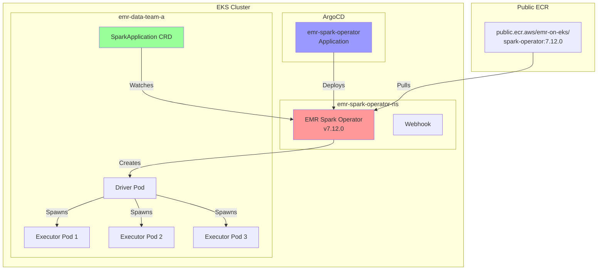

# EMR Spark Operator

This example demonstrates running Spark jobs on EMR on EKS using the AWS EMR Spark Operator for declarative job management. The operator provides a Kubernetes-native way to submit and manage Spark applications using custom resources.

## What You'll Learn

- How to enable and deploy EMR Spark Operator v7.12.0
- How to submit Spark jobs declaratively using SparkApplication CRDs
- How to monitor and manage Spark jobs through Kubernetes
- When to use EMR Spark Operator vs. EMR Virtual Clusters

## When to Use This Example

**Best for:**
- ✅ GitOps workflows with declarative job definitions
- ✅ Kubernetes-native Spark job management
- ✅ Teams familiar with Kubernetes operators
- ✅ CI/CD pipelines deploying Spark jobs as YAML manifests

**Not recommended for:**
- ❌ Simple one-off job submissions (use `start-job-run` instead)
- ❌ Teams unfamiliar with Kubernetes concepts
- ❌ Workflows requiring EMR Studio integration

## Architecture: EMR Spark Operator



**Key Benefits:**
- 🎯 **Declarative**: Define Spark jobs as Kubernetes resources
- 🔄 **GitOps Ready**: Version control your Spark job definitions
- 📊 **Native Monitoring**: Use kubectl to monitor job status
- 🚀 **EMR Optimized**: Uses EMR runtime with EMRFS and optimizations

**Trade-offs:**
- ⚠️ **Learning Curve**: Requires Kubernetes knowledge
- 🔧 **More Complex**: Additional operator to manage
- 📝 **YAML Heavy**: More verbose than simple job submission

## Prerequisites

### 1. Deploy EMR on EKS Infrastructure

First, ensure you have the EMR on EKS infrastructure deployed. See [Infrastructure Setup](./infra.md) for details.

### 2. Enable EMR Spark Operator

Edit your `data-stack.tfvars` file:

```hcl
# Enable EMR Spark Operator
enable_emr_spark_operator = true
```

### 3. Deploy the Stack

```bash
cd data-stacks/emr-on-eks
./deploy.sh
```

This will:
1. Deploy the EMR Spark Operator v7.12.0 via ArgoCD
2. Use the public image from `public.ecr.aws/emr-on-eks/spark-operator:7.12.0`
3. Create the operator namespace `emr-spark-operator-ns`
4. Configure webhooks for SparkApplication validation

Expected deployment time: ~2-3 minutes

### 4. Verify Operator Deployment

```bash
# Set kubeconfig
export KUBECONFIG=$(pwd)/kubeconfig.yaml

# Check ArgoCD application status
kubectl get application emr-spark-operator -n argocd

# Expected output:
# NAME                 SYNC STATUS   HEALTH STATUS
# emr-spark-operator   Synced        Healthy

# Check operator pods
kubectl get pods -n emr-spark-operator-ns

# Expected output:
# NAME                                    READY   STATUS      RESTARTS   AGE
# emr-spark-operator-c9ff4d9c7-xxxxx      1/1     Running     0          2m
# emr-spark-operator-webhook-init-xxxxx   0/1     Completed   0          2m
```

## EMR Spark Operator vs. Virtual Clusters

| Feature | EMR Spark Operator | EMR Virtual Clusters |
|---------|-------------------|---------------------|
| **Job Submission** | Kubernetes CRD | AWS CLI/SDK |
| **Management** | kubectl | AWS Console/CLI |
| **GitOps** | ✅ Native | ⚠️ Requires wrapper |
| **Monitoring** | kubectl/K8s tools | CloudWatch/EMR Console |
| **Learning Curve** | Kubernetes | AWS EMR |
| **EMR Studio** | ❌ Not supported | ✅ Supported |

## SparkApplication Custom Resource

The EMR Spark Operator uses the `SparkApplication` CRD to define Spark jobs:

```yaml
apiVersion: "sparkoperator.k8s.io/v1beta2"
kind: SparkApplication
metadata:
  name: spark-pi-operator
  namespace: emr-data-team-a
spec:
  type: Scala
  mode: cluster

  # EMR optimized runtime image
  image: "895885662937.dkr.ecr.us-west-2.amazonaws.com/spark/emr-7.12.0:latest"
  imagePullPolicy: Always

  # Main application
  mainClass: org.apache.spark.examples.SparkPi
  mainApplicationFile: local:///usr/lib/spark/examples/jars/spark-examples.jar

  arguments:
    - "1000"

  # Spark configuration
  sparkConf:
    spark.kubernetes.driver.pod.name: driver-spark-pi-operator

  sparkVersion: "3.3.1"

  restartPolicy:
    type: Never

  # Driver configuration
  driver:
    cores: 2
    memory: "8g"
    # Service account created by EMR virtual cluster module
    # Get actual name: kubectl get sa -n emr-data-team-a | grep driver
    serviceAccount: emr-containers-sa-spark-driver-<deployment-id>

    nodeSelector:
      NodeGroupType: "SparkGravitonComputeOptimized"

    labels:
      app: spark-pi-operator
      role: driver

  # Executor configuration
  executor:
    cores: 4
    instances: 3
    memory: "16g"
    # Service account created by EMR virtual cluster module
    # Get actual name: kubectl get sa -n emr-data-team-a | grep executor
    serviceAccount: emr-containers-sa-spark-executor-<deployment-id>

    nodeSelector:
      NodeGroupType: "SparkGravitonComputeOptimized"

    labels:
      app: spark-pi-operator
      role: executor
```

## Running the Example

### 1. Configure kubectl Access

```bash
# Navigate to the terraform directory
cd data-stacks/emr-on-eks/terraform/_local

# Get the kubectl configuration command
terraform output configure_kubectl

# Run the output command (example):
aws eks --region us-west-2 update-kubeconfig --name emr-on-eks

# Verify access
kubectl get nodes
```

### 2. Navigate to Example Directory

```bash
cd ../../examples/emr-spark-operator
```

### 3. Get Service Account Names

The EMR virtual cluster module creates service accounts with dynamic names based on your AWS account ID and deployment ID. You need to get the actual names:

```bash
# Set kubeconfig
export KUBECONFIG=../../kubeconfig.yaml

# Get driver service account name
DRIVER_SA=$(kubectl get sa -n emr-data-team-a | grep driver | awk '{print $1}')
echo "Driver SA: $DRIVER_SA"

# Get executor service account name
EXECUTOR_SA=$(kubectl get sa -n emr-data-team-a | grep executor | awk '{print $1}')
echo "Executor SA: $EXECUTOR_SA"

# Expected output:
# Driver SA: emr-containers-sa-spark-driver-123456789012-abcdefghijklmnopqrstuvwxyz1234567890abcd
# Executor SA: emr-containers-sa-spark-executor-123456789012-abcdefghijklmnopqrstuvwxyz1234567890abcd
```

### 4. Update the SparkApplication YAML

Update the service account names in the YAML file:

```bash
# Automatically update service account names
sed -i.bak "s/serviceAccount: emr-containers-sa-spark-driver-.*/serviceAccount: $DRIVER_SA/" taxi-trip-spark-operator.yaml
sed -i.bak "s/serviceAccount: emr-containers-sa-spark-executor-.*/serviceAccount: $EXECUTOR_SA/" taxi-trip-spark-operator.yaml
```

Or manually edit `taxi-trip-spark-operator.yaml` and replace the service account names.

### 5. Review the SparkApplication

The example includes:
- `taxi-trip-spark-operator.yaml` - SparkApplication manifest for Spark Pi calculation
- `README.md` - Quick reference guide

Key configuration:
- Uses EMR 7.12.0 runtime image
- Runs Spark Pi example (calculates π using Monte Carlo method)
- Configured for Graviton compute-optimized nodes
- Uses EMR service accounts with S3 access

### 6. Submit the Spark Job

```bash
# Apply the SparkApplication
kubectl apply -f taxi-trip-spark-operator.yaml

# Expected output:
# sparkapplication.sparkoperator.k8s.io/spark-pi-operator created
```

### 7. Monitor the Job

```bash
# Watch SparkApplication status
kubectl get sparkapplication spark-pi-operator -n emr-data-team-a -w

# Expected progression:
# NAME                STATUS      ATTEMPTS   START                  FINISH
# spark-pi-operator   SUBMITTED   1          2026-01-18T01:49:09Z   <no value>
# spark-pi-operator   RUNNING     1          2026-01-18T01:49:09Z   <no value>
# spark-pi-operator   COMPLETED   1          2026-01-18T01:49:09Z   2026-01-18T01:51:40Z

# Watch pods in real-time
kubectl get pods -n emr-data-team-a -l app=spark-pi-operator -w

# Expected output:
# NAME                               READY   STATUS    RESTARTS   AGE
# driver-spark-pi-operator           1/1     Running   0          30s
# spark-pi-c992669bcecb9646-exec-1   1/1     Running   0          20s
# spark-pi-c992669bcecb9646-exec-2   1/1     Running   0          20s
# spark-pi-c992669bcecb9646-exec-3   1/1     Running   0          20s
```

### 8. View Job Logs

```bash
# View driver logs
kubectl logs driver-spark-pi-operator -n emr-data-team-a

# View executor logs
kubectl logs spark-pi-c992669bcecb9646-exec-1 -n emr-data-team-a
```

### 9. Verify Results

```bash
# Check the calculated value of Pi
kubectl logs driver-spark-pi-operator -n emr-data-team-a | grep "Pi is roughly"

# Expected output:
# Pi is roughly 3.141532511415325
```

### 10. Check Job Details

```bash
# Get detailed SparkApplication status
kubectl describe sparkapplication spark-pi-operator -n emr-data-team-a

# View application events
kubectl get events -n emr-data-team-a --sort-by='.lastTimestamp' | grep spark-pi
```

## Job Lifecycle

### Status Progression

1. **SUBMITTED** - Job accepted by operator, driver pod being created
2. **RUNNING** - Driver pod running, executors being spawned
3. **COMPLETED** - Job finished successfully
4. **FAILED** - Job failed (check logs for errors)

### Automatic Cleanup

The operator automatically cleans up completed jobs based on the `restartPolicy`:

```yaml
restartPolicy:
  type: Never  # Don't restart on completion
```

For automatic cleanup after completion:

```yaml
spec:
  timeToLiveSeconds: 3600  # Delete after 1 hour
```

## Advanced Configuration

### 1. Dynamic Allocation

Enable Spark dynamic allocation:

```yaml
sparkConf:
  spark.dynamicAllocation.enabled: "true"
  spark.dynamicAllocation.shuffleTracking.enabled: "true"
  spark.dynamicAllocation.minExecutors: "2"
  spark.dynamicAllocation.maxExecutors: "10"
  spark.dynamicAllocation.initialExecutors: "3"
```

### 2. Event Logging to S3

Enable Spark History Server integration:

```yaml
sparkConf:
  spark.eventLog.enabled: "true"
  spark.eventLog.dir: "s3://your-bucket/spark-event-logs/"
```

### 3. Custom EMR Configuration

Use EMRFS and EMR optimizations:

```yaml
hadoopConf:
  fs.s3.customAWSCredentialsProvider: com.amazonaws.auth.WebIdentityTokenCredentialsProvider
  fs.s3.impl: com.amazon.ws.emr.hadoop.fs.EmrFileSystem
  fs.AbstractFileSystem.s3.impl: org.apache.hadoop.fs.s3.EMRFSDelegate

sparkConf:
  spark.sql.parquet.output.committer.class: com.amazon.emr.committer.EmrOptimizedSparkSqlParquetOutputCommitter
  spark.sql.parquet.fs.optimized.committer.optimization-enabled: "true"
  spark.sql.emr.internal.extensions: com.amazonaws.emr.spark.EmrSparkSessionExtensions
```

### 4. Monitoring and Observability

Add Prometheus metrics:

```yaml
sparkConf:
  spark.ui.prometheus.enabled: "true"
  spark.executor.processTreeMetrics.enabled: "true"
  spark.metrics.conf.*.sink.prometheusServlet.class: org.apache.spark.metrics.sink.PrometheusServlet
  spark.metrics.conf.*.sink.prometheusServlet.path: /metrics/prometheus
```

## Troubleshooting

### Job Stuck in SUBMITTED

Check operator logs:

```bash
kubectl logs -n emr-spark-operator-ns -l app.kubernetes.io/name=spark-operator
```

Common issues:
- Service account doesn't exist
- Image pull errors
- Insufficient resources

### Driver Pod Pending

Check pod events:

```bash
kubectl describe pod driver-spark-pi-operator -n emr-data-team-a
```

Common issues:
- No nodes matching nodeSelector
- Insufficient CPU/memory
- Image pull failures

### Permission Errors

Verify service accounts have correct IAM roles:

```bash
# Check driver service account
kubectl get sa emr-containers-sa-spark-driver-* -n emr-data-team-a -o yaml

# Verify IAM role annotation
kubectl get sa emr-containers-sa-spark-driver-* -n emr-data-team-a \
  -o jsonpath='{.metadata.annotations.eks\.amazonaws\.com/role-arn}'
```

### Job Failed

Check driver logs for errors:

```bash
kubectl logs driver-spark-pi-operator -n emr-data-team-a --tail=100
```

Common issues:
- S3 access denied
- Invalid Spark configuration
- Application code errors

## Best Practices

### 1. Use Version Control

Store SparkApplication manifests in Git:

```bash
git add taxi-trip-spark-operator.yaml
git commit -m "Add Spark Pi job"
git push
```

### 2. Parameterize with ConfigMaps

Use ConfigMaps for environment-specific values:

```yaml
apiVersion: v1
kind: ConfigMap
metadata:
  name: spark-config
  namespace: emr-data-team-a
data:
  s3_bucket: "my-spark-bucket"
  log_level: "INFO"
---
apiVersion: sparkoperator.k8s.io/v1beta2
kind: SparkApplication
spec:
  sparkConf:
    spark.eventLog.dir: "s3://$(S3_BUCKET)/logs/"
  driver:
    envFrom:
      - configMapRef:
          name: spark-config
```

### 3. Set Resource Limits

Prevent resource exhaustion:

```yaml
driver:
  cores: 2
  coreLimit: "2000m"
  memory: "8g"
  memoryOverhead: "1g"

executor:
  cores: 4
  coreLimit: "4000m"
  memory: "16g"
  memoryOverhead: "2g"
```

### 4. Enable Monitoring

Add labels for monitoring:

```yaml
metadata:
  labels:
    app: spark-jobs
    team: data-engineering
    environment: production
```

### 5. Clean Up Completed Jobs

Set TTL for automatic cleanup:

```yaml
spec:
  timeToLiveSeconds: 86400  # Delete after 24 hours
```

## Comparison with Other Submission Methods

### vs. EMR Virtual Clusters (start-job-run)

| Feature | Spark Operator | start-job-run |
|---------|---------------|---------------|
| **Submission** | kubectl apply | AWS CLI |
| **Monitoring** | kubectl get | AWS Console |
| **GitOps** | ✅ Native | ⚠️ Wrapper needed |
| **Complexity** | Higher | Lower |
| **EMR Studio** | ❌ | ✅ |

### vs. Spark Operator (Kubeflow)

| Feature | EMR Spark Operator | Kubeflow Spark Operator |
|---------|-------------------|------------------------|
| **Runtime** | EMR optimized | Open source Spark |
| **EMRFS** | ✅ Built-in | ❌ Not included |
| **Support** | AWS supported | Community |
| **Features** | EMR extensions | Standard Spark |

## Next Steps

- [NVMe SSD Storage](./nvme-ssd.md) - High-performance shuffle storage
- [EBS Hostpath Storage](./ebs-hostpath.md) - Cost-effective shared storage
- [Infrastructure Guide](./infra.md) - Customize your deployment

## Additional Resources

- [EMR Spark Operator Documentation](https://docs.aws.amazon.com/emr/latest/EMR-on-EKS-DevelopmentGuide/spark-operator-gs.html)
- [SparkApplication API Reference](https://github.com/kubeflow/spark-operator/blob/master/docs/api-docs.md)
- [EMR on EKS Best Practices](https://aws.github.io/aws-emr-containers-best-practices/)
