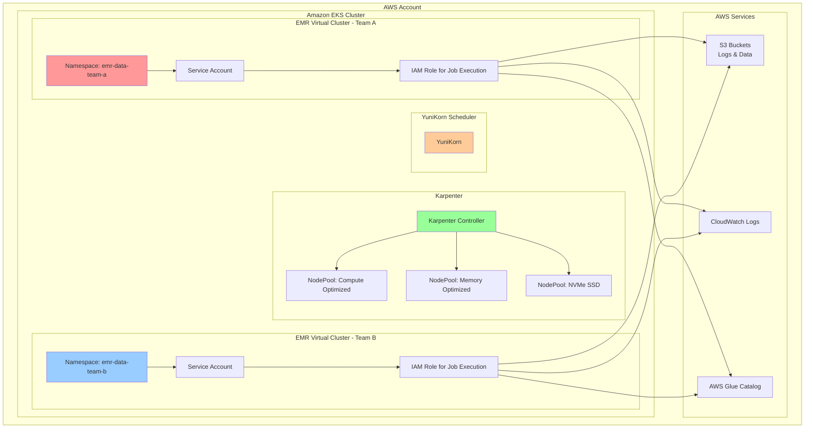

# EMR on EKS Infrastructure Deployment

Deploy a production-ready Amazon EMR on EKS cluster with virtual clusters, IAM roles, and Karpenter autoscaling.

## Architecture Overview



## Prerequisites

- AWS CLI configured with appropriate credentials
- kubectl installed
- Terraform >= 1.0
- jq (for parsing JSON outputs)

## Deployment Steps

### 1. Clone the Repository

```bash
git clone https://github.com/awslabs/data-on-eks.git
cd data-on-eks
```

### 2. Navigate to EMR on EKS Stack

```bash
cd data-stacks/emr-on-eks
```

### 3. Review Configuration

Edit `terraform/data-stack.tfvars` to customize your deployment:

```hcl
# EMR on EKS Data Stack Configuration
name                 = "emr-on-eks"
region               = "us-west-2"
deployment_id        = "your-unique-id"

# Enable EMR on EKS Virtual Clusters
enable_emr_on_eks    = true

# Optional: Enable additional addons
enable_ingress_nginx = true
enable_ipv6          = false
```

### 4. Deploy Infrastructure

```bash
./deploy.sh
```

This script will:
1. Initialize Terraform
2. Create VPC and networking (if not exists)
3. Deploy EKS cluster with managed node groups
4. Install Karpenter for autoscaling
5. Install YuniKorn scheduler
6. Create EMR virtual clusters for Team A and Team B
7. Configure IAM roles and service accounts
8. Set up S3 buckets for logs and data

:::info Deployment Time
Initial deployment takes approximately **30-40 minutes**. Subsequent updates are faster.
:::

### 5. View Terraform Outputs

After deployment completes, view the infrastructure details:

```bash
cd terraform/_local
terraform output
```

You should see output similar to:

```hcl
cluster_arn = "arn:aws:eks:us-west-2:123456789:cluster/emr-on-eks"
cluster_name = "emr-on-eks"
configure_kubectl = "aws eks --region us-west-2 update-kubeconfig --name emr-on-eks"
deployment_id = "abcdefg"
emr_on_eks = {
  "emr-data-team-a" = {
    "cloudwatch_log_group_name" = "/emr-on-eks-logs/emr-on-eks/emr-data-team-a"
    "job_execution_role_arn" = "arn:aws:iam::123456789:role/emr-on-eks-emr-data-team-a"
    "virtual_cluster_id" = "hclg71zute4fm4fpm3m2cobv0"
  }
  "emr-data-team-b" = {
    "cloudwatch_log_group_name" = "/emr-on-eks-logs/emr-on-eks/emr-data-team-b"
    "job_execution_role_arn" = "arn:aws:iam::123456789:role/emr-on-eks-emr-data-team-b"
    "virtual_cluster_id" = "cqt781jwn4vq1wh4jlqdhpj5h"
  }
}
emr_s3_bucket_name = "emr-on-eks-spark-logs-123456789"
region = "us-west-2"
```

### 6. Configure kubectl Access

Use the `configure_kubectl` output to authenticate with the cluster:

```bash
# Run the command from terraform output
aws eks --region us-west-2 update-kubeconfig --name emr-on-eks

# Verify cluster access
kubectl get nodes

# Check EMR namespaces
kubectl get namespaces | grep emr-data

# Expected output:
# emr-data-team-a   Active   5m
# emr-data-team-b   Active   5m
```

### 7. Verify Karpenter and YuniKorn

```bash
# Check Karpenter nodepools
kubectl get nodepool

# Check YuniKorn scheduler
kubectl get pods -n yunikorn-system

# Check Karpenter logs
kubectl logs -n karpenter -l app.kubernetes.io/name=karpenter --tail=20
```

## What Gets Deployed

### EKS Cluster Components

| Component | Description |
|-----------|-------------|
| **VPC** | Multi-AZ VPC with public and private subnets |
| **EKS Cluster** | Kubernetes 1.31+ with managed control plane |
| **Karpenter** | Node autoscaling with multiple node pools |
| **YuniKorn** | Advanced Kubernetes scheduler for batch workloads |
| **EBS CSI Driver** | For dynamic EBS volume provisioning |
| **AWS Load Balancer Controller** | For ingress and service load balancing |
| **Fluent Bit** | Log forwarding to CloudWatch |

### EMR on EKS Resources

| Resource | Description |
|----------|-------------|
| **Virtual Cluster (Team A)** | EMR virtual cluster in `emr-data-team-a` namespace |
| **Virtual Cluster (Team B)** | EMR virtual cluster in `emr-data-team-b` namespace |
| **IAM Roles** | Job execution roles with S3, Glue, and CloudWatch permissions |
| **Service Accounts** | Kubernetes service accounts with IRSA |
| **S3 Bucket** | For Spark logs, shuffle data, and results |
| **CloudWatch Log Groups** | For EMR job logs |

### Karpenter Node Pools

| Node Pool | Instance Types | Use Case |
|-----------|---------------|----------|
| **Compute Optimized (Graviton)** | c6g, c7g, c8g | General Spark workloads |
| **Memory Optimized (Graviton)** | r6g, r7g, r8g | Memory-intensive jobs |
| **NVMe SSD (Graviton)** | c6gd, c7gd, m6gd, r6gd | High I/O shuffle operations |

## Configuration Options

### Enable Additional Features

Edit `terraform/data-stack.tfvars` to enable optional features:

```hcl
# Enable Spark History Server
enable_spark_history_server = true

# Enable JupyterHub
enable_jupyterhub = true

# Enable Prometheus & Grafana
enable_kube_prometheus_stack = true

# Enable Argo Workflows
enable_argo_workflows = true
```

### Customize Node Pools

To modify Karpenter node pools, create an overlay file:

```bash
# Create custom node pool configuration
cp infra/terraform/manifests/karpenter/nodepool-compute-optimized-graviton.yaml \
   terraform/manifests/karpenter/nodepool-compute-optimized-graviton.yaml

# Edit the file to customize instance types, limits, etc.
```

### Customize EMR Virtual Clusters

To add more virtual clusters or modify existing ones, edit `terraform/emr-on-eks.tf`:

```hcl
# Add a new virtual cluster
module "emr_on_eks_team_c" {
  source = "../../infra/terraform/modules/emr-on-eks"

  cluster_name      = var.cluster_name
  namespace         = "emr-data-team-c"
  virtual_cluster_name = "emr-data-team-c"

  # Additional configuration...
}
```

## Accessing the Cluster

### Using kubectl

```bash
export KUBECONFIG=kubeconfig.yaml
kubectl get pods -n emr-data-team-a
```

### Using AWS CLI

```bash
# List EMR virtual clusters
aws emr-containers list-virtual-clusters --region us-west-2

# Describe a virtual cluster
aws emr-containers describe-virtual-cluster \
  --id $EMR_VIRTUAL_CLUSTER_ID_TEAM_A \
  --region us-west-2
```

## Monitoring and Observability

### CloudWatch Logs

EMR job logs are automatically forwarded to CloudWatch:

```bash
# View logs in CloudWatch
aws logs tail $CLOUDWATCH_LOG_GROUP_TEAM_A --follow
```

### Spark History Server

If enabled, access the Spark History Server:

```bash
# Get the Spark History Server URL
kubectl get ingress -n spark-history-server
```

### Prometheus & Grafana

If enabled, access Grafana dashboards:

```bash
# Port forward to Grafana
kubectl port-forward -n kube-prometheus-stack \
  svc/kube-prometheus-stack-grafana 3000:80

# Access at http://localhost:3000
# Default credentials: admin / prom-operator
```

## Troubleshooting

### Check Karpenter Logs

```bash
kubectl logs -n karpenter -l app.kubernetes.io/name=karpenter --tail=100
```

### Check YuniKorn Scheduler

```bash
kubectl logs -n yunikorn-system -l app=yunikorn --tail=100
```

### Verify IAM Roles

```bash
# Check service account annotations
kubectl describe sa emr-containers-sa-spark-driver-* -n emr-data-team-a
```

### Check Node Provisioning

```bash
# List node claims
kubectl get nodeclaims

# Describe a node claim
kubectl describe nodeclaim <nodeclaim-name>
```

## Cleanup

To destroy all resources:

```bash
./cleanup.sh
```

:::warning Cleanup Time
Cleanup takes approximately **20-30 minutes** to complete. Ensure all EMR jobs are terminated before cleanup.
:::

## Next Steps

- [EBS Hostpath Storage Example](./ebs-hostpath.md) - Cost-effective shared node storage
- [EBS PVC Storage Example](./ebs-pvc.md) - Dynamic volume provisioning
- [NVMe SSD Storage Example](./nvme-ssd.md) - Maximum I/O performance

## Additional Resources

- [EMR on EKS Documentation](https://docs.aws.amazon.com/emr/latest/EMR-on-EKS-DevelopmentGuide/emr-eks.html)
- [Karpenter Documentation](https://karpenter.sh/)
- [YuniKorn Documentation](https://yunikorn.apache.org/)
