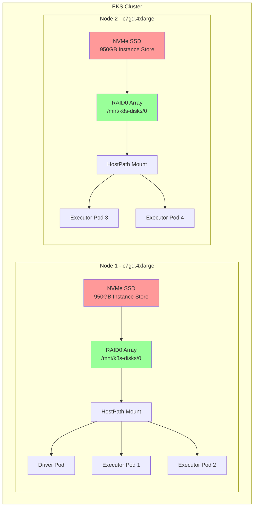

# EMR Spark with NVMe SSD Storage

This example demonstrates running Spark jobs on EMR on EKS using NVMe instance store SSDs for shuffle storage. This provides the highest I/O performance with sub-millisecond latency, ideal for shuffle-intensive workloads on Graviton instances.

## What You'll Learn

- How to configure Spark to use NVMe SSD instance stores for shuffle operations
- How Karpenter provisions nodes with NVMe SSDs and configures RAID0
- When to use NVMe storage vs. EBS hostpath or dynamic PVCs
- How to verify NVMe storage is mounted and being used

## When to Use This Example

**Best for:**
- ✅ Shuffle-intensive workloads (large joins, aggregations, sorts)
- ✅ Ultra-low latency requirements (&lt;1ms)
- ✅ High-throughput data processing (2.5 GB/s per drive)
- ✅ Cost-performance optimization with Graviton instances

**Not recommended for:**
- ❌ Workloads requiring data persistence (NVMe is ephemeral)
- ❌ Long-running jobs sensitive to node failures
- ❌ Regions without NVMe SSD instance availability
- ❌ Workloads with minimal shuffle operations

## Architecture: Local NVMe SSDs



**Key Benefits:**
- 🔥 **Ultra-High Performance**: Up to 2.5 GB/s throughput per drive
- ⚡ **Low Latency**: Sub-millisecond latency for I/O operations
- 💰 **Cost Effective**: Included with instance price, no additional storage cost
- 🚀 **Graviton Performance**: ARM64 processors with superior price-performance

**Trade-offs:**
- ⚠️ **Ephemeral Storage**: Data lost when instance terminates
- 🔄 **Limited Availability**: Only on SSD instance types (c6gd, c7gd, m6gd, r6gd, etc.)
- 📊 **Node-Bound**: Data tied to specific node

## Prerequisites

- Deploy EMR on EKS infrastructure: [Infrastructure Setup](./infra.md)
- **Karpenter** configured with NVMe SSD instance types
- **Graviton-compatible** EMR runtime (ARM64)

## What is Shuffle Storage in Spark?

**Shuffle storage** holds intermediate data during Spark operations like `groupBy`, `join`, and `reduceByKey`. When data is redistributed across executors, it's temporarily stored before being read by subsequent stages.

## Spark Shuffle Storage Comparison

| Storage Type | Performance | Cost | Latency | Use Case |
|-------------|-------------|------|---------|----------|
| **NVMe SSD** | 🔥 Very High | 💰 Medium | ⚡ &lt;1ms | **Maximum performance** |
| **EBS Dynamic PVC** | ⚡ High | 💰 Medium | 📊 1-3ms | Production isolation |
| **EBS Hostpath** | 📊 Medium | 💵 Low | 📊 1-3ms | Cost-optimized |

### When to Use NVMe SSD

- ✅ Shuffle-intensive workloads (joins, aggregations)
- ✅ Low-latency requirements
- ✅ High-throughput data processing
- ✅ Cost-performance optimization with Graviton

### When to Avoid

- ❌ Workloads requiring data persistence
- ❌ Long-running jobs with node failures
- ❌ Regions without SSD instance availability

## NVMe Instance Types

### Graviton (ARM64) - Recommended

| Instance Type | vCPUs | Memory | NVMe Storage | Throughput |
|--------------|-------|--------|--------------|------------|
| **c6gd.xlarge** | 4 | 8 GiB | 237 GB | 2.5 GB/s |
| **c6gd.2xlarge** | 8 | 16 GiB | 474 GB | 2.5 GB/s |
| **c6gd.4xlarge** | 16 | 32 GiB | 950 GB | 2.5 GB/s |
| **c7gd.4xlarge** | 16 | 32 GiB | 950 GB | 2.5 GB/s |
| **m6gd.4xlarge** | 16 | 64 GiB | 950 GB | 2.5 GB/s |
| **r6gd.4xlarge** | 16 | 128 GiB | 950 GB | 2.5 GB/s |

### x86 (Intel/AMD)

| Instance Type | vCPUs | Memory | NVMe Storage | Throughput |
|--------------|-------|--------|--------------|------------|
| **c5d.4xlarge** | 16 | 32 GiB | 400 GB | 2.0 GB/s |
| **c6id.4xlarge** | 16 | 32 GiB | 950 GB | 2.5 GB/s |
| **m5d.4xlarge** | 16 | 64 GiB | 600 GB | 2.0 GB/s |

:::tip Graviton Advantage
Graviton instances offer up to 40% better price-performance compared to x86 instances.
:::

## Example Configuration

### Pod Template

The executor pod template configures NVMe hostpath storage:

```yaml
# EMR on EKS Executor Pod Template - NVMe SSD Storage (Graviton)
# Uses Graviton instances WITH NVMe SSDs for high-performance shuffle
apiVersion: v1
kind: Pod
metadata:
  name: emr-executor
  namespace: emr-data-team-a
spec:
  volumes:
    # NVMe SSD storage - Karpenter configures RAID0 under /mnt/k8s-disks/0
    - name: spark-local-dir-1
      hostPath:
        path: /mnt/k8s-disks/0
        type: DirectoryOrCreate

  nodeSelector:
    # Use memory-optimized Graviton nodepool with SSD
    NodeGroupType: SparkGravitonMemoryOptimized
    node.kubernetes.io/arch: arm64

  affinity:
    nodeAffinity:
      requiredDuringSchedulingIgnoredDuringExecution:
        nodeSelectorTerms:
        - matchExpressions:
          # Only Graviton SSD instance families (with 'd' suffix)
          - key: karpenter.k8s.aws/instance-family
            operator: In
            values: ["c6gd", "c7gd", "c8gd", "m6gd", "m7gd", "m8gd", "r6gd", "r7gd", "r8gd"]

  tolerations:
    - key: spark-executor
      operator: Equal
      value: "true"
      effect: NoSchedule

  initContainers:
    - name: volume-permission
      image: public.ecr.aws/docker/library/busybox
      # Grant volume access to hadoop user
      command: ['sh', '-c', 'mkdir -p /data1; chown -R 999:1000 /data1']
      volumeMounts:
        - name: spark-local-dir-1
          mountPath: /data1

  containers:
    - name: spark-kubernetes-executor
      volumeMounts:
        - name: spark-local-dir-1
          mountPath: /data1
          readOnly: false
```

### Spark Configuration

Key Spark properties for NVMe storage:

```json
{
  "spark.local.dir": "/data1",
  "spark.driver.cores": "2",
  "spark.executor.cores": "4",
  "spark.driver.memory": "8g",
  "spark.executor.memory": "16g",
  "spark.dynamicAllocation.enabled": "true",
  "spark.dynamicAllocation.shuffleTracking.enabled": "true",
  "spark.dynamicAllocation.minExecutors": "2",
  "spark.dynamicAllocation.maxExecutors": "10",
  "spark.sql.adaptive.enabled": "true",
  "spark.sql.adaptive.coalescePartitions.enabled": "true",
  "spark.sql.adaptive.skewJoin.enabled": "true"
}
```

## Running the Example

### 1. Configure kubectl Access

First, ensure you have kubectl access to your EMR on EKS cluster:

```bash
# Navigate to the terraform directory
cd data-stacks/emr-on-eks/terraform/_local

# Get the kubectl configuration command
terraform output configure_kubectl

# Run the output command (example):
aws eks --region us-west-2 update-kubeconfig --name emr-on-eks

# Verify access
kubectl get nodes
```

### 2. Navigate to Example Directory

```bash
cd ../../examples/nvme-ssd
```

### 3. Review the Configuration

The example includes:
- `execute_emr_eks_job.sh` - Job submission script
- `driver-pod-template.yaml` - Driver pod configuration
- `executor-pod-template.yaml` - Executor pod configuration with NVMe affinity
- `pyspark-taxi-trip.py` - Sample PySpark application analyzing NYC taxi data

Key configuration in executor pod template:
- Node selector for Graviton instances with SSD
- Affinity rules for NVMe instance families (c6gd, c7gd, m6gd, r6gd, etc.)
- HostPath volume mount to `/mnt/k8s-disks/0` (Karpenter RAID0 array)

### 4. Submit the Spark Job

```bash
./execute_emr_eks_job.sh
```

This script will:
1. Read Terraform outputs for EMR virtual cluster details
2. Upload pod templates and PySpark script to S3
3. Download NYC taxi dataset (11 parquet files, ~500MB)
4. Submit EMR Spark job with NVMe SSD configuration

Expected output:
```
Starting EMR on EKS job submission...
Virtual Cluster ID: hclg71zute4fm4fpm3m2cobv0
Job submitted successfully!
Job ID: 000000036udo0ghs1mq
```

### 5. Monitor the Job

```bash
# Watch pods in real-time
kubectl get pods -n emr-data-team-a -w

# In another terminal, check job status
aws emr-containers list-job-runs \
  --virtual-cluster-id $EMR_VIRTUAL_CLUSTER_ID_TEAM_A \
  --region us-west-2

# View job logs
kubectl logs -f <driver-pod-name> -n emr-data-team-a
```

### 6. Verify NVMe Instance Provisioning

Check that Karpenter provisioned NVMe SSD instances:

```bash
# Describe an executor pod
kubectl describe pod taxidata-nvme-ssd-exec-1 -n emr-data-team-a | grep -A10 "Node-Selectors"

# Expected output:
# Node-Selectors: NodeGroupType=SparkGravitonMemoryOptimized
#                 node.kubernetes.io/arch=arm64
# Affinity:
#   karpenter.k8s.aws/instance-family In [c6gd c7gd c8gd m6gd m7gd m8gd r6gd r7gd r8gd]
```

### 7. Check Node Instance Type

Verify the node is using an NVMe SSD instance:

```bash
# Get node name where executor is running
NODE=$(kubectl get pod taxidata-nvme-ssd-exec-1 -n emr-data-team-a \
  -o jsonpath='{.spec.nodeName}')

# Check instance type (should have 'd' suffix for SSD)
kubectl get node $NODE -o jsonpath='{.metadata.labels.node\.kubernetes\.io/instance-type}'

# Expected output: c7gd.4xlarge, m6gd.4xlarge, r6gd.4xlarge, etc.
```

### 8. Verify NVMe RAID0 Mount

Check that Karpenter configured the NVMe storage as RAID0:

```bash
# Check RAID configuration
kubectl debug node/$NODE -it --image=ubuntu -- cat /proc/mdstat

# Expected output showing RAID0:
# md0 : active raid0 nvme1n1[1] nvme0n1[0]
#       1875385344 blocks super 1.2 512k chunks

# Verify mount point
kubectl debug node/$NODE -it --image=ubuntu -- df -h /mnt/k8s-disks/0

# Expected output:
# Filesystem      Size  Used Avail Use% Mounted on
# /dev/md0        900G   10G  890G   2% /mnt/k8s-disks/0
```

## Performance Characteristics

### Throughput

- **Sequential Read**: Up to 2.5 GB/s per drive
- **Sequential Write**: Up to 2.5 GB/s per drive
- **Random Read**: Up to 400,000 IOPS
- **Random Write**: Up to 400,000 IOPS

### Latency

- **Average**: &lt;1ms
- **P99**: &lt;2ms
- **P99.9**: &lt;5ms

### Cost Analysis

Example for 10 executors on c7gd.4xlarge running 1 hour:

| Component | Instance Type | Cost/Hour | Count | Total Cost |
|-----------|--------------|-----------|-------|------------|
| **Compute + NVMe** | c7gd.4xlarge | $0.69 | 3 nodes | **$2.07** |
| **EBS (for comparison)** | c7g.4xlarge + EBS | $0.58 + $0.40 | 3 nodes | **$2.94** |
| **Savings** | - | - | - | **30%** |

:::info Cost Calculation
NVMe storage is included in instance price. Savings come from avoiding separate EBS volumes and better performance.
:::

## Karpenter Configuration

### EC2NodeClass for NVMe

Karpenter automatically configures RAID0 for NVMe drives:

```yaml
apiVersion: karpenter.k8s.aws/v1
kind: EC2NodeClass
metadata:
  name: ephemeral-nvme-local-provisioner
spec:
  amiFamily: AL2023
  role: karpenter-node-role

  # RAID0 configuration for NVMe drives
  instanceStorePolicy: RAID0

  # User data creates symlinks for discovery
  userData: |
    #!/bin/bash
    cat <<EOF > /etc/udev/rules.d/90-kubernetes-discovery.rules
    # Discover Instance Storage disks
    KERNEL=="nvme[0-9]*n[0-9]*", ENV{DEVTYPE}=="disk", \
      ATTRS{model}=="Amazon EC2 NVMe Instance Storage", \
      ATTRS{serial}=="?*", \
      SYMLINK+="disk/kubernetes/nvme-\$attr{model}_\$attr{serial}"
    EOF
    udevadm control --reload && udevadm trigger
```

### NodePool for NVMe Instances

```yaml
apiVersion: karpenter.sh/v1
kind: NodePool
metadata:
  name: nvme-ssd-graviton
spec:
  template:
    spec:
      nodeClassRef:
        name: ephemeral-nvme-local-provisioner
      requirements:
        - key: karpenter.k8s.aws/instance-family
          operator: In
          values: ["c6gd", "c7gd", "m6gd", "r6gd"]
        - key: kubernetes.io/arch
          operator: In
          values: ["arm64"]
```

## Performance Tuning

### 1. Optimize Spark Shuffle

```json
{
  "spark.shuffle.file.buffer": "1m",
  "spark.shuffle.unsafe.file.output.buffer": "5m",
  "spark.io.compression.codec": "lz4",
  "spark.shuffle.compress": "true"
}
```

### 2. Increase Parallelism

```json
{
  "spark.sql.shuffle.partitions": "200",
  "spark.default.parallelism": "200"
}
```

### 3. Enable Adaptive Query Execution

```json
{
  "spark.sql.adaptive.enabled": "true",
  "spark.sql.adaptive.coalescePartitions.enabled": "true",
  "spark.sql.adaptive.skewJoin.enabled": "true"
}
```

## Troubleshooting

### Pods Stuck in Pending

Check if NVMe instance types are available:

```bash
kubectl get nodeclaims
kubectl describe nodeclaim <nodeclaim-name>
```

Common issues:
- No NVMe instances available in AZ
- Instance type not in Karpenter NodePool
- Insufficient capacity

### NVMe Not Mounted

Check Karpenter logs:

```bash
kubectl logs -n karpenter -l app.kubernetes.io/name=karpenter --tail=100
```

Verify RAID0 configuration:

```bash
kubectl debug node/$NODE -it --image=ubuntu -- \
  cat /proc/mdstat
```

### Permission Denied Errors

Verify init container permissions:

```bash
kubectl logs taxidata-nvme-ssd-exec-1 -n emr-data-team-a -c volume-permission
```

### Instance Type Not Supported

Update pod template to include more instance families:

```yaml
affinity:
  nodeAffinity:
    requiredDuringSchedulingIgnoredDuringExecution:
      nodeSelectorTerms:
      - matchExpressions:
        - key: karpenter.k8s.aws/instance-family
          operator: In
          values: ["c6gd", "c7gd", "c8gd", "m6gd", "m7gd", "r6gd", "r7gd"]
```

## Best Practices

### 1. Use Graviton Instances

Graviton instances offer better price-performance:

```yaml
nodeSelector:
  node.kubernetes.io/arch: arm64
```

### 2. Enable Dynamic Allocation

```json
{
  "spark.dynamicAllocation.enabled": "true",
  "spark.dynamicAllocation.shuffleTracking.enabled": "true"
}
```

### 3. Monitor NVMe Health

Set up CloudWatch alarms for disk metrics:

```bash
aws cloudwatch put-metric-alarm \
  --alarm-name nvme-disk-usage \
  --metric-name disk_used_percent \
  --threshold 80
```

### 4. Handle Node Failures Gracefully

Enable shuffle tracking for dynamic allocation:

```json
{
  "spark.dynamicAllocation.shuffleTracking.enabled": "true",
  "spark.dynamicAllocation.shuffleTracking.timeout": "60s"
}
```

### 5. Clean Up Shuffle Data

NVMe data is ephemeral, but clean up between jobs:

```bash
# Clean up shuffle data on node
kubectl debug node/$NODE -it --image=ubuntu -- \
  rm -rf /mnt/k8s-disks/0/spark-*
```

## Comparison with Other Storage Options

### vs. EBS Dynamic PVC

| Feature | NVMe SSD | EBS PVC |
|---------|----------|---------|
| **Performance** | 🔥 Very High | ⚡ High |
| **Latency** | ⚡ &lt;1ms | 📊 1-3ms |
| **Cost** | ✅ Included | 💰 Additional |
| **Durability** | ⚠️ Ephemeral | ✅ Persistent |

### vs. EBS Hostpath

| Feature | NVMe SSD | EBS Hostpath |
|---------|----------|--------------|
| **Performance** | 🔥 Very High | 📊 Medium |
| **Throughput** | 2.5 GB/s | 250 MB/s |
| **IOPS** | 400K | 3K-16K |
| **Availability** | ⚠️ SSD instances | ✅ All instances |

## Next Steps

- [EBS Hostpath Storage](./ebs-hostpath.md) - Cost-effective shared storage
- [EBS PVC Storage](./ebs-pvc.md) - Dynamic volume provisioning
- [Infrastructure Guide](./infra.md) - Customize your deployment

## Additional Resources

- [AWS Graviton Performance](https://aws.amazon.com/ec2/graviton/)
- [NVMe Instance Store](https://docs.aws.amazon.com/AWSEC2/latest/UserGuide/InstanceStorage.html)
- [Spark Performance Tuning](https://spark.apache.org/docs/latest/tuning.html)
