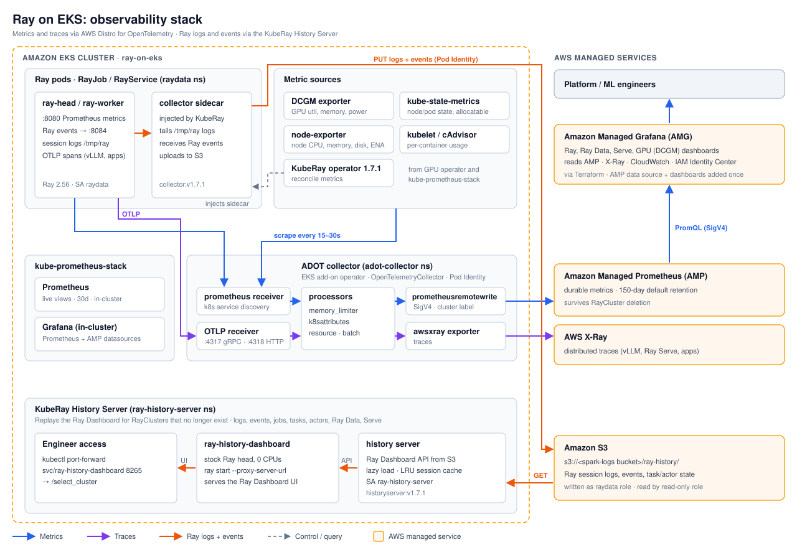

# Ray Observability on EKS

End-to-end observability for Ray on EKS: metrics, traces, and Ray logs and events that stay
available after an ephemeral RayCluster or RayJob is deleted.



## How It Works

| Signal | Path | Stored in | View with |
|---|---|---|---|
| **Metrics**: Ray, GPU (DCGM), node, pod, KubeRay | Exporters → ADOT collector (Prometheus receiver) → remote write (SigV4) | Amazon Managed Prometheus (AMP), 150-day default retention | Amazon Managed Grafana (AMG), or in-cluster Grafana |
| **Traces**: vLLM, Ray Serve, apps | OTLP → ADOT collector → awsxray exporter | AWS X-Ray | AMG X-Ray data source, CloudWatch console |
| **Ray logs and events**: jobs, tasks, actors, Ray Data, Serve | Ray → collector sidecar (injected by KubeRay) → S3 | `s3://<spark-logs bucket>/ray-history/` | KubeRay History Server + Ray Dashboard |
| **Live metrics** | kube-prometheus-stack Prometheus scrapes the same targets | In-cluster, 30 days | In-cluster Grafana |

:::info History server vs. metrics
The KubeRay History Server replays the Ray Dashboard (jobs, tasks, actors, logs). It does not
store Prometheus metrics. Metric charts for a deleted RayCluster come from AMP.
:::

### Components

| Component | Namespace | Deployed by | Terraform |
|---|---|---|---|
| ADOT operator | `opentelemetry-operator-system` | EKS add-on `adot` | `infra/terraform/eks-addons.tf` |
| ADOT collector (`OpenTelemetryCollector`) | `adot-collector` | Terraform manifest | `infra/terraform/adot.tf`, `manifests/adot/` |
| Amazon Managed Prometheus workspace | AWS | Terraform | `infra/terraform/amp.tf` |
| Amazon Managed Grafana workspace | AWS | Terraform | `infra/terraform/amg.tf` |
| KubeRay operator 1.7.1 (`RayClusterHistoryServer` feature gate) | `kuberay-operator` | ArgoCD | `infra/terraform/ray-operator.tf` |
| History server + `ray-history-dashboard` | `ray-history-server` | Terraform manifests | `infra/terraform/ray-history-server.tf` |
| DCGM exporter, kube-state-metrics, node-exporter, Prometheus, Grafana | `gpu-operator`, `monitoring` | ArgoCD | `nvidia-gpu-operator.tf`, `kube-prometheus-stack.tf` |

Dashboards, sample jobs and the trace test live in
[`data-stacks/ray-on-eks/examples/ray-observability`](https://github.com/awslabs/data-on-eks/tree/main/data-stacks/ray-on-eks/examples/ray-observability).

## Prerequisites

- Ray on EKS deployed following the [Infrastructure Deployment](./infra) guide
- **IAM Identity Center** enabled in the account (Amazon Managed Grafana sign-in), with a user or group to make workspace admin
- `kubectl`, AWS CLI v2, `jq` and `envsubst`

## Enable the Stack

The Ray on EKS stack enables these in `terraform/data-stack.tfvars`:

```hcl
enable_amazon_prometheus      = true   # AMP workspace
enable_amazon_managed_grafana = true   # AMG workspace (IAM Identity Center)
enable_adot                   = true   # ADOT add-on + collector (requires AMP)
enable_ray_history_server     = true   # KubeRay History Server (requires enable_raydata)
amg_admin_user_ids            = ["<identity-center-user-id>"]  # AMG admins (see Step 3)
```

Apply with `./deploy.sh` from `data-stacks/ray-on-eks`.

Set these variables for the steps below:

```bash
cd data-stacks/ray-on-eks
export KUBECONFIG=$(pwd)/kubeconfig.yaml
export AWS_REGION=us-west-2
export S3_BUCKET=$(terraform -chdir=terraform/_local output -raw s3_bucket_id_spark_history_server)
export COLLECTOR_IMAGE=$(terraform -chdir=terraform/_local output -json ray_observability | jq -r .history_server.collector_image)
terraform -chdir=terraform/_local output -json ray_observability | jq
```

## Step 1: Verify the Components

```bash
kubectl get pods -n adot-collector
kubectl get pods -n ray-history-server
kubectl get pods -n opentelemetry-operator-system
aws eks describe-addon --cluster-name ray-on-eks --addon-name adot --query addon.status
kubectl get deploy -n kuberay-operator kuberay-operator \
  -o jsonpath='{.spec.template.spec.containers[0].args}' | tr ',' '\n' | grep HistoryServer
```

All pods should be `Running`, the add-on `ACTIVE`, and the feature gate `RayClusterHistoryServer=true`.

Confirm the collector is exporting without errors:

```bash
kubectl logs -n adot-collector deploy/adot-collector --since=10m | grep -iE 'error|denied'
```

## Step 2: Query AMP from the In-Cluster Grafana

The in-cluster Grafana has an **Amazon Managed Prometheus** data source that signs requests with SigV4.

```bash
kubectl -n monitoring get secret grafana-admin-secret -o jsonpath='{.data.admin-password}' | base64 -d; echo
kubectl -n monitoring port-forward svc/monitoring-grafana 3000:80
```

Open http://localhost:3000 (user `admin`), go to **Explore**, choose **Amazon Managed Prometheus** and run:

```promql
count by (job) (up{cluster="ray-on-eks"})
```

Expected jobs: `node-exporter`, `cadvisor`, `kube-state-metrics`, `kuberay-operator`, plus `ray`
while Ray pods run and `dcgm-exporter` while GPU nodes exist.

## Step 3: Set Up Amazon Managed Grafana

Get the workspace URL:

```bash
terraform -chdir=terraform/_local output -json ray_observability | jq -r .amg_workspace_url
```

### Assign yourself as admin

Set your IAM Identity Center user ID (or a group ID with `amg_admin_group_ids`) in
`terraform/data-stack.tfvars` before running `./deploy.sh`:

```bash
IDENTITY_STORE=$(aws sso-admin list-instances --query 'Instances[0].IdentityStoreId' --output text)
aws identitystore list-users --identity-store-id $IDENTITY_STORE \
  --query 'Users[].[UserId,UserName,DisplayName]' --output table
```

```hcl
amg_admin_user_ids = ["<user-id>"]
```

Without it, the workspace shows **Pending user input** until you assign a user in the console:
**Amazon Managed Grafana → `ray-on-eks-amg` → Authentication → Assign new user or group**, then
**Action → Make admin**.

### Add the data sources

Sign in to the workspace URL, then in Grafana:

1. **Apps → AWS Data Sources → Amazon Managed Service for Prometheus**, select region `us-west-2`,
   tick `amp-ws-ray-on-eks` and click **Add data source**.
2. Repeat for **AWS X-Ray** to browse traces.

The workspace IAM role (created by Terraform) already has read access to AMP, X-Ray and CloudWatch.

### Import the dashboards

In **Dashboards → New → Import**, upload each JSON file from
[`examples/ray-observability/dashboards`](https://github.com/awslabs/data-on-eks/tree/main/data-stacks/ray-on-eks/examples/ray-observability/dashboards)
and select the AMP data source:

| File | Dashboard |
|---|---|
| `ray-default-dashboard.json` | Ray cluster: nodes, tasks, actors, object store, CPU/GPU |
| `ray-data-dashboard.json` | Ray Data pipelines: throughput, operators, backpressure |
| `ray-serve-dashboard.json`, `ray-serve-deployment-dashboard.json` | Ray Serve applications and deployments |
| `ray-serve-llm-dashboard.json`, `ray-data-llm-dashboard.json` | vLLM engine metrics for Ray Serve LLM and Ray Data LLM |
| `ray-train-dashboard.json` | Ray Train runs |
| `nvidia-dcgm-exporter-dashboard.json` | GPU utilization, memory, power, temperature ([NVIDIA dcgm-exporter](https://github.com/NVIDIA/dcgm-exporter), Apache-2.0) |

The Ray dashboards are generated by Ray 2.56 and filter on the `ray_io_cluster` label, which
the ADOT collector adds to every Ray pod metric.

## Step 4: Run a Ray Job with the History Server

The RayJob sets `rayClusterSpec.historyServerOptions.collectorOptions`, so KubeRay injects the
collector sidecar into every Ray pod. The cluster is deleted 90 seconds after the job finishes.

```bash
cd examples/ray-observability
envsubst < 01-rayjob-history-server.yaml | kubectl apply -f -

# Each Ray pod runs ray-head/ray-worker plus ray-history-collector
kubectl get pods -n raydata -l ray.io/cluster \
  -o jsonpath='{range .items[*]}{.metadata.name}{"  "}{.spec.containers[*].name}{"\n"}{end}'

kubectl wait -n raydata rayjob/rayjob-history-demo \
  --for=jsonpath='{.status.jobStatus}'=SUCCEEDED --timeout=15m
```

While the cluster runs, open **Ray Default Dashboard** in AMG and select the
`rayjob-history-demo-*` cluster. The metrics stay in AMP after the cluster is deleted.

## Step 5: Browse the Deleted Cluster in the History Server

Wait until the RayCluster is gone, then check the data in S3:

```bash
kubectl get raycluster -n raydata
aws s3 ls s3://$S3_BUCKET/ray-history/ --recursive --summarize | tail -2
```

Open the Ray Dashboard for dead clusters:

```bash
kubectl -n ray-history-server port-forward svc/ray-history-dashboard 8265:8265
```

Go to http://localhost:8265/select_cluster, pick `rayjob-history-demo-*` and click
**Open Dashboard**. The Jobs, Cluster, Actors and Logs tabs are replayed from S3.

The history server API can also be queried directly:

```bash
kubectl -n ray-history-server port-forward svc/ray-history-server 8080:8080 &
curl -s localhost:8080/clusters | jq
```

### Enable the history server for your workloads

Add this block under `rayClusterSpec` (RayJob, RayService) or `spec` (RayCluster), and run the
pods as the `raydata` service account, which can write to the bucket:

```yaml
historyServerOptions:
  collectorOptions:
    image: quay.io/kuberay/collector:v1.7.1
    env:
      - name: STORAGE_BACKEND
        value: s3
      - name: STORAGE_ROOT_DIR
        value: ray-history
      - name: S3_BUCKET
        value: <spark-logs bucket>
      - name: S3_REGION
        value: us-west-2
```

## Step 6: Send Traces to X-Ray

```bash
kubectl apply -f 02-otlp-trace-test.yaml
kubectl wait -n raydata job/otlp-trace-test --for=condition=complete --timeout=5m
aws xray get-trace-summaries --start-time $(( $(date +%s) - 900 )) --end-time $(date +%s) \
  --query 'TraceSummaries[].[Id,ServiceIds[0].Name]' --output text
```

The test's server spans appear as `telemetrygen-server`. Point real workloads at the same endpoint,
for example vLLM with `--otlp-traces-endpoint=http://adot-collector.adot-collector.svc.cluster.local:4317`,
or any OpenTelemetry SDK through `OTEL_EXPORTER_OTLP_ENDPOINT`.

## Step 7: GPU Metrics (optional)

DCGM metrics appear once a GPU node joins the cluster, for example while running the
[batch inference example](https://github.com/awslabs/data-on-eks/tree/main/data-stacks/ray-on-eks/examples/ray-batch-inference).
Query `DCGM_FI_DEV_GPU_UTIL` in AMP or open the **NVIDIA DCGM Exporter Dashboard**.

## Design Notes

- **No static credentials.** EKS Pod Identity for the ADOT collector (AMP remote write, X-Ray),
  in-cluster Grafana (AMP query) and the history server (read-only on `ray-history/`). The
  collector sidecar runs as the Ray pod's `raydata` service account.
- **Opt-in per workload.** Only Ray clusters that set `historyServerOptions` get the collector sidecar.
- **No public endpoints.** All in-cluster services are ClusterIP; use `kubectl port-forward`.
- **Shared bucket.** The history server's role can list key names bucket-wide because its startup
  HeadBucket call needs an unconditioned `s3:ListBucket`. Object reads are limited to `ray-history/`.

## Known Limitations (KubeRay 1.7.1, beta)

- In the replayed dashboard the job's status is empty, so the job shows a loading spinner.
  Its tasks, actors, nodes and logs are complete.
- The replayed dashboard's time-series charts are hidden. Use the Ray dashboards in AMG,
  filtered on the cluster.
- Ray pod stdout is not shipped to CloudWatch; Ray session logs reach S3 through the collector.

## Troubleshooting

| Symptom | Check |
|---|---|
| No series in AMP | `kubectl logs -n adot-collector deploy/adot-collector`; Pod Identity association for `adot-collector/adot-collector` |
| `NoCredentialProviders` in a pod | The pod started before its Pod Identity association propagated. Restart it: `kubectl rollout restart` |
| No `ray-history-collector` container in Ray pods | `historyServerOptions` missing, or feature gate off: check the KubeRay operator args |
| Cluster missing in `/select_cluster` | `kubectl logs -n raydata <ray-pod> -c ray-history-collector`; objects under `s3://$S3_BUCKET/ray-history/` |
| AMG login denied or "Pending user input" | No admin assigned: set `amg_admin_user_ids` and redeploy |

## Cleanup

`./cleanup.sh` removes the AMP and AMG workspaces and the S3 bucket, including the history data.
To remove only the sample workloads:

```bash
kubectl delete rayjob rayjob-history-demo -n raydata
kubectl delete configmap rayjob-history-demo-code -n raydata
kubectl delete job otlp-trace-test -n raydata
```
