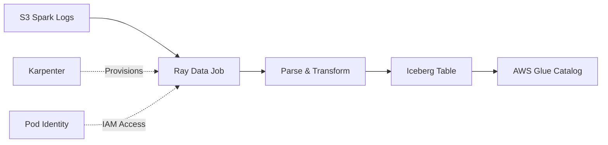

# Process Spark Logs with Ray Data and Iceberg

This guide demonstrates using Ray Data to process Apache Spark application logs from S3 and store them in Apache Iceberg format using AWS Glue catalog.

## Overview

This example shows a production-ready pattern for:
- Reading large volumes of Spark event logs from S3
- Processing logs in parallel with Ray Data
- Writing results to Apache Iceberg tables
- Using AWS Glue as the Iceberg catalog
- Leveraging Karpenter for automatic node scaling

## Architecture



## Prerequisites

### 1. Deploy Ray on EKS Infrastructure

First, deploy the Ray on EKS stack with KubeRay operator:

**Follow the [Infrastructure Deployment Guide](infra)** to:
- Provision EKS cluster with Karpenter autoscaling
- Deploy KubeRay operator (set `enable_raydata = true`)
- Configure Pod Identity for AWS access
- Set up monitoring with Prometheus and Grafana

**Verify deployment:**
```bash
kubectl get pods -n kuberay-operator
kubectl get pods -n raydata
```

### 2. Generate Spark Application Logs

Run Spark jobs to generate logs for processing. The Spark Operator is included in the Ray on EKS deployment.

:::info
Spark applications write structured JSON logs to S3 via Fluent Bit. Each log line is a JSON object containing log metadata and message content.
:::

### Generate Spark Logs

To create Spark application logs for processing, run sample Spark jobs:

**Option 1: Simple PVC Storage Example**

Navigate to the Spark on EKS examples and run a job with PVC storage:

```bash
cd data-stacks/spark-on-eks/examples/ebs-pvc-storage
```

Follow the [PVC Storage Example Guide](/data-on-eks/docs/datastacks/processing/spark-on-eks/ebs-pvc-storage) to:
1. Create persistent volumes for Spark data
2. Run a sample Spark job that generates event logs
3. Verify logs are written to S3

**Option 2: Other Spark Examples**

You can run any Spark example from the `data-stacks/spark-on-eks/examples/` directory:
- `taxi-trip` - NYC taxi data processing
- `benchmark` - TPC-DS benchmark
- `gluten-velox` - Performance optimized Spark

Each job automatically writes event logs to:
```
s3://<bucket-name>/<cluster-name>/spark-application-logs/spark-team-a/
```

**Verify Logs in S3**

After running Spark jobs, verify Fluent Bit has shipped logs to S3:

```bash
# Get bucket name from Terraform output
cd data-stacks/ray-on-eks/terraform/_local
BUCKET=$(terraform output -raw s3_bucket_id_spark_history_server)

# List Spark application logs (JSON format from Fluent Bit)
aws s3 ls s3://${BUCKET}/spark-on-eks/spark-application-logs/spark-team-a/ --recursive
```

**Expected Output** - JSON log files organized by spark-app-selector:
```
spark-on-eks/spark-application-logs/spark-team-a/spark-1b3b78e281664cefb74ca64a1ed5a2d9/taxi-trip-ebs-pvc/taxi-trip-ebs-pvc_230728_veVAzLFN.json
spark-on-eks/spark-application-logs/spark-team-a/spark-1b3b78e281664cefb74ca64a1ed5a2d9/taxi-trip-ebs-pvc-exec-1/taxi-trip-ebs-pvc-exec-1_230915_8kTnRfkj.json
spark-on-eks/spark-application-logs/spark-team-a/spark-1b3b78e281664cefb74ca64a1ed5a2d9/taxi-trip-ebs-pvc-exec-2/taxi-trip-ebs-pvc-exec-2_230916_j5NsRfkj.json
```

Each JSON file contains structured log entries from Spark pods (driver and executors).

## Example Files

All files are located in `data-stacks/ray-on-eks/examples/raydata-sparklogs-processing-job/`:

- `rayjob.yaml` - RayJob CRD definition
- `configmap.yaml` - Python processing code
- `execute-rayjob.sh` - Deployment script
- `verify-iceberg-data.sh` - Validation script
- `iceberg_verification.py` - Python verification

## Configuration

### Step 1: Get Infrastructure Values

Retrieve the S3 bucket name and configuration from your **Ray on EKS** deployment:

```bash
cd data-stacks/ray-on-eks/terraform/_local

# Get S3 bucket name
terraform output s3_bucket_id_spark_history_server

# Get cluster name
terraform output cluster_name

# Get region
terraform output region
```

**Example output:**
```
s3_bucket_id_spark_history_server = "ray-on-eks-logs-20241022xxxxx"
cluster_name = "ray-on-eks"
region = "us-west-2"
```

### Step 2: Update Ray Job Configuration

Navigate to the Ray Data example directory:

```bash
cd data-stacks/ray-on-eks/examples/raydata-sparklogs-processing-job
```

Edit `execute-rayjob.sh` and update these values:

```bash
# Your S3 bucket (from Terraform output above)
S3_BUCKET="<YOUR_S3_BUCKET_NAME>"

# S3 prefix for Spark logs (replace <CLUSTER_NAME> with your cluster)
S3_PREFIX="<CLUSTER_NAME>/spark-application-logs/spark-team-a"

# AWS region (from Terraform output)
AWS_REGION="us-west-2"

# Ray worker scaling (adjust based on log volume)
MIN_WORKERS="2"
MAX_WORKERS="10"
INITIAL_WORKERS="2"

# Processing batch size (tune for performance)
BATCH_SIZE="10000"
```

### Step 3: Understand the RayJob

The `rayjob.yaml` defines the Ray cluster configuration and Python dependencies.

**Runtime Dependencies:**
```yaml
runtimeEnvYAML: |
  pip:
    - boto3==1.34.131
    - pyiceberg[glue,s3fs]==0.10.0
    - ray[data]==2.47.1
    - pyarrow==21.0.0         # Native Pod Identity support
    - s3fs==2025.9.0
    - fsspec==2025.9.0
```

:::tip PyArrow 21.0.0 Pod Identity Support
PyArrow 21.0.0+ natively supports EKS Pod Identity via `AWS_CONTAINER_CREDENTIALS_FULL_URI`, eliminating the need for manual credential configuration. All Ray pods automatically use Pod Identity for S3 access.
:::

**Submitter Configuration:**
```yaml
submitterPodTemplate:
  spec:
    serviceAccountName: raydata  # Pod Identity for IAM
    containers:
      - name: rayjob-submitter
        image: rayproject/ray:2.47.1-py310
        env:
          - name: S3_BUCKET
            value: "$S3_BUCKET"
          - name: ICEBERG_DATABASE
            value: "raydata_spark_logs"
```

**Ray Cluster Spec:**
```yaml
headGroupSpec:
  rayStartParams:
    dashboard-host: "0.0.0.0"
    num-cpus: "2"
    object-store-memory: "1000000000"
  template:
    spec:
      serviceAccountName: raydata
      containers:
        - name: ray-head
          image: rayproject/ray:2.47.1-py310
          resources:
            requests:
              cpu: "2"
              memory: "4Gi"
            limits:
              cpu: "4"
              memory: "8Gi"
```

**Worker Configuration:**
```yaml
workerGroupSpecs:
  - groupName: log-processor-workers
    replicas: $INITIAL_WORKERS
    minReplicas: $MIN_WORKERS
    maxReplicas: $MAX_WORKERS
    template:
      spec:
        containers:
          - name: ray-worker
            resources:
              requests:
                cpu: "4"
                memory: "8Gi"
              limits:
                cpu: "8"
                memory: "16Gi"
```

## Deployment

### Deploy the Job

```bash
cd data-stacks/ray-on-eks/examples/raydata-sparklogs-processing-job/

# Make script executable
chmod +x execute-rayjob.sh

# Deploy the job
./execute-rayjob.sh deploy
```

The script will:
1. Validate prerequisites (namespace, service account, Pod Identity)
2. Validate configuration (S3 bucket, paths, credentials)
3. Apply the ConfigMap with processing code
4. Deploy the RayJob
5. Show deployment status and dashboard access

**Expected Output:**
```
==== Validating Prerequisites ====
[INFO] ✅ Prerequisites validated
[INFO] ✅ Terraform module infrastructure detected
[INFO] ✅ Ray service account found

==== Current Configuration ====
AWS Region: us-west-2
Namespace: raydata
Iceberg Database: raydata_spark_logs
Iceberg Table: spark_logs
Iceberg Warehouse: s3://bucket-name/iceberg-warehouse
S3 Logs Path: s3://bucket-name/spark-application-logs/spark-team-a
Workers: 2-10 (initial: 2)

==== Deploying Ray Job Components ====
[INFO] 1. Deploying ConfigMap...
[INFO] 2. Deploying RayJob...
[INFO] ✅ Ray job components deployed successfully
```

### Monitor Job Execution

**Quick Status Check:**
```bash
# Check job status
./execute-rayjob.sh status

# Watch job progress in real-time
./execute-rayjob.sh monitor
```

**Manual Monitoring:**
```bash
# Watch job status
kubectl get rayjobs -n raydata -w

# Expected output:
# NAME                       JOB STATUS   DEPLOYMENT STATUS   START TIME             END TIME
# spark-log-processing-job   RUNNING      Running             2025-10-22T23:47:12Z

# Get pod status
kubectl get pods -n raydata

# Expected output:
# NAME                                                              READY   STATUS
# spark-log-processing-job-2t8h9-head-2bgdd                         2/2     Running
# spark-log-processing-job-2t8h9-log-processor-worke-worker-vckb4   1/1     Running
# spark-log-processing-job-2t8h9-log-processor-worke-worker-z2hgd   1/1     Running
# spark-log-processing-job-cjgff                                    1/1     Running
```

### View Job Logs

**Using the Script:**
```bash
# Follow job logs
./execute-rayjob.sh logs
```

**Manual Log Viewing:**
```bash
# Get the submitter pod name
SUBMITTER_POD=$(kubectl get pods -n raydata --no-headers | grep spark-log-processing-job | grep -v head | grep -v worker | awk '{print $1}')

# Follow submitter logs
kubectl logs $SUBMITTER_POD -n raydata -f
```

**Expected Log Output:**
```
2025-10-22 16:48:08,808 - spark-log-processor - INFO - ✅ Using EKS Pod Identity credentials from http://169.254.170.23/v1/credentials
2025-10-22 16:48:08,808 - spark-log-processor - INFO - ✅ PyArrow 19.0.1+ will automatically use Pod Identity for S3 access
2025-10-22 16:48:15,003 - spark-log-processor - INFO - ✅ Iceberg catalog initialized: glue
2025-10-22 16:48:16,801 - spark-log-processor - INFO - ✅ Created new data table: raydata_spark_logs.spark_logs
2025-10-22 16:48:17,523 - spark-log-processor - INFO - ✅ Created new metadata table: raydata_spark_logs.spark_logs_processing_metadata
2025-10-22 16:48:18,676 - spark-log-processor - INFO - 🔍 Starting intelligent folder discovery with metadata tracking...
2025-10-22 16:48:19,142 - spark-log-processor - INFO - 🔄 Processing folder: spark-1b3b78e281664cefb74ca64a1ed5a2d9

Running Dataset: dataset_1_0. Active & requested resources: 2/10 CPU, 244.5KB/2.3GB object store
- ReadText->SplitBlocks(7): 33%|███▎ | 295/885 [00:08<00:03, 164 row/s]

2025-10-22 16:48:34,742 - spark-log-processor - INFO - 🎯 Processing Summary:
2025-10-22 16:48:34,742 - spark-log-processor - INFO -   📊 Total records processed: 647
2025-10-22 16:48:34,742 - spark-log-processor - INFO -   ✅ Successful folders: 1
2025-10-22 16:48:34,742 - spark-log-processor - INFO -   ❌ Failed folders: 0
2025-10-22 16:48:39,154 - SUCC - Job 'spark-log-processing-job' succeeded
```

### Access Ray Dashboard

**Using the Script:**
```bash
# Show dashboard access instructions
./execute-rayjob.sh dashboard
```

**Manual Setup:**
```bash
# Get the Ray head service name
RAY_HEAD_SVC=$(kubectl get svc -n raydata --no-headers | grep head-svc | awk '{print $1}')

# Port forward to Ray Dashboard
kubectl port-forward -n raydata service/$RAY_HEAD_SVC 8265:8265

# Open browser to http://localhost:8265
```

**Ray Dashboard Features:**
- Job execution timeline
- Resource utilization (CPU, memory, object store)
- Task breakdown and performance
- Worker node status
- Logs aggregation

### Watch Karpenter Provision Nodes

```bash
# View Karpenter logs
kubectl logs -n karpenter -l app.kubernetes.io/name=karpenter -f

# Watch nodes being created
kubectl get nodes -l karpenter.sh/initialized=true -w

# Check node capacity type (spot vs on-demand)
kubectl get nodes -L karpenter.sh/capacity-type
```

## Processing Logic

The job performs intelligent, metadata-driven incremental processing:

### 1. Discover Spark Applications

```python
# List all spark-app-selector folders in S3
folders = s3.list_folders(f"s3://{bucket}/{prefix}/")

# Query metadata table for already-processed folders
processed = catalog.load_table('spark_logs_processing_metadata').scan()

# Identify new folders to process
new_folders = [f for f in folders if f not in processed['spark_app_selector']]
```

### 2. Read JSON Logs with Ray Data

```python
import ray

# Initialize Ray (PyArrow 21.0.0+ uses Pod Identity automatically)
ray.init()

# Read JSON log files from Fluent Bit output
ds = ray.data.read_text(
    f"s3://{bucket}/{prefix}/{spark_app_selector}/**/*.json"
)
```

### 3. Parse and Enrich Logs

```python
def parse_log_line(line):
    """Parse Fluent Bit JSON log format"""
    log = json.loads(line)
    return {
        'timestamp': log.get('timestamp'),
        'log_level': log.get('log_level'),
        'message': log.get('message'),
        'pod_name': log.get('kubernetes', {}).get('pod_name'),
        'spark_app_selector': log.get('kubernetes', {}).get('labels', {}).get('spark-app-selector'),
        # ... additional Kubernetes metadata
    }

# Apply parsing
ds = ds.map(parse_log_line).filter(lambda x: x is not None)
```

### 4. Write to Iceberg with Metadata Tracking

```python
from pyiceberg.catalog import load_catalog

# Load AWS Glue catalog (uses Pod Identity)
catalog = load_catalog('glue', warehouse=f"s3://{bucket}/iceberg-warehouse/")

# Write log data to Iceberg table
table = catalog.load_table('raydata_spark_logs.spark_logs')
table.append(ds.to_arrow())

# Update metadata table for incremental processing
metadata_table = catalog.load_table('raydata_spark_logs.spark_logs_processing_metadata')
metadata_table.append({
    'spark_app_selector': spark_app_selector,
    'status': 'SUCCESS',
    'records_processed': ds.count(),
    'processing_end_time': datetime.now()
})
```

## IAM Permissions

The job uses Pod Identity (configured in `infra/terraform/ray-operator.tf`):

**S3 Permissions:**
```json
{
  "Effect": "Allow",
  "Action": [
    "s3:GetObject",
    "s3:PutObject",
    "s3:ListBucket"
  ],
  "Resource": [
    "arn:aws:s3:::bucket-name/spark-application-logs/*",
    "arn:aws:s3:::bucket-name/iceberg-warehouse/*"
  ]
}
```

**Glue Permissions:**
```json
{
  "Effect": "Allow",
  "Action": [
    "glue:GetDatabase",
    "glue:GetTable",
    "glue:CreateTable",
    "glue:UpdateTable",
    "glue:GetPartitions",
    "glue:BatchCreatePartition"
  ],
  "Resource": "*"
}
```

## Verify Results

### Check Job Completion

```bash
# Check final job status
kubectl get rayjob spark-log-processing-job -n raydata

# Expected output:
# NAME                       JOB STATUS   DEPLOYMENT STATUS   START TIME             END TIME               AGE
# spark-log-processing-job   SUCCEEDED    Complete            2025-10-22T23:47:12Z   2025-10-22T23:48:42Z   2m51s
```

### Verify Iceberg Table Creation

**Check AWS Glue Catalog:**
```bash
# Verify table exists in Glue
aws glue get-table \
  --database-name raydata_spark_logs \
  --name spark_logs \
  --region us-west-2 \
  --output json | jq '.Table | {Name, Location: .StorageDescriptor.Location, Columns: .StorageDescriptor.Columns | length}'

# Expected output:
# {
#   "Name": "spark_logs",
#   "Location": "s3://bucket-name/iceberg-warehouse/raydata_spark_logs.db/spark_logs",
#   "Columns": 14
# }
```

**Check S3 Data Files:**
```bash
# List Iceberg data and metadata files
aws s3 ls s3://your-bucket/iceberg-warehouse/raydata_spark_logs.db/spark_logs/ --recursive

# Expected output:
# iceberg-warehouse/raydata_spark_logs.db/spark_logs/data/00000-0-592550cf-a900-45c7-adf8-c5ab577236ad.parquet
# iceberg-warehouse/raydata_spark_logs.db/spark_logs/metadata/00001-ba180b06-2e59-4133-9ea9-a2af29bb393b.metadata.json
# iceberg-warehouse/raydata_spark_logs.db/spark_logs/metadata/592550cf-a900-45c7-adf8-c5ab577236ad-m0.avro
```

### Verify Data Processing

**Check Processing Summary:**
```bash
# Get the submitter pod logs
SUBMITTER_POD=$(kubectl get pods -n raydata --no-headers | grep spark-log-processing-job | grep -v head | grep -v worker | awk '{print $1}')

# View processing summary
kubectl logs $SUBMITTER_POD -n raydata | grep -A5 "Processing Summary"

# Expected output:
# 🎯 Processing Summary:
#   📊 Total records processed: 647
#   ✅ Successful folders: 1
#   ❌ Failed folders: 0
#   ✅ Successfully processed: ['spark-1b3b78e281664cefb74ca64a1ed5a2d9']
```

### Query the Iceberg Table

**Option 1: Using AWS Athena**

1. Open AWS Athena console
2. Select database: `raydata_spark_logs`
3. Run queries:

```sql
-- Check row count
SELECT COUNT(*) as total_records
FROM spark_logs;

-- View sample data
SELECT
    timestamp,
    log_level,
    pod_name,
    spark_app_selector,
    message
FROM spark_logs
LIMIT 10;

-- Analyze log levels
SELECT
    log_level,
    COUNT(*) as count
FROM spark_logs
WHERE log_level IS NOT NULL
GROUP BY log_level
ORDER BY count DESC;

-- View logs by Spark application
SELECT
    spark_app_selector,
    spark_app_name,
    COUNT(*) as log_count
FROM spark_logs
WHERE spark_app_selector IS NOT NULL
GROUP BY spark_app_selector, spark_app_name
ORDER BY log_count DESC;
```

**Expected Results:**
```
total_records: 647

log_level    | count
-------------|------
INFO         | 520
WARN         | 85
ERROR        | 42

spark_app_selector                       | spark_app_name        | log_count
-----------------------------------------|----------------------|----------
spark-1b3b78e281664cefb74ca64a1ed5a2d9   | taxi-trip-ebs-pvc    | 647
```

**Option 2: Using PyIceberg**

Create a verification script:

```python
#!/usr/bin/env python3
"""Verify Iceberg table data using PyIceberg."""

from pyiceberg.catalog import load_catalog
import pyarrow.compute as pc

# Load Glue catalog
catalog = load_catalog(
    'glue',
    **{
        'type': 'glue',
        'glue.region': 'us-west-2',
        'warehouse': 's3://your-bucket/iceberg-warehouse'
    }
)

# Load the table
table = catalog.load_table('raydata_spark_logs.spark_logs')

# Get table metadata
print(f"Table: {table.name()}")
print(f"Location: {table.location()}")
print(f"Schema: {table.schema()}")
print(f"Snapshots: {len(table.snapshots())}")

# Scan and convert to PyArrow
arrow_table = table.scan().to_arrow()

print(f"\n📊 Total Records: {len(arrow_table)}")
print(f"📋 Columns: {arrow_table.num_columns}")
print(f"💾 Size: {arrow_table.nbytes / 1024:.2f} KB")

# Show log level distribution
if 'log_level' in arrow_table.column_names:
    log_levels = pc.value_counts(arrow_table['log_level'])
    print(f"\n📈 Log Level Distribution:")
    for level in log_levels.to_pylist():
        print(f"  {level['values']}: {level['counts']}")

# Show sample data
print(f"\n📝 Sample Records (first 5):")
print(arrow_table.select(['timestamp', 'log_level', 'pod_name', 'message']).slice(0, 5).to_pandas())
```

Run the script:
```bash
python verify_iceberg_data.py
```

**Option 3: Using DuckDB**

```python
import duckdb
from pyiceberg.catalog import load_catalog

# Load catalog and table
catalog = load_catalog('glue', warehouse='s3://bucket/iceberg-warehouse/')
table = catalog.load_table('raydata_spark_logs.spark_logs')

# Convert to Arrow and query with DuckDB
con = duckdb.connect()
arrow_table = table.scan().to_arrow()

# Register as DuckDB table
con.register('spark_logs', arrow_table)

# Run SQL queries
result = con.execute("""
    SELECT
        log_level,
        COUNT(*) as count,
        COUNT(DISTINCT pod_name) as unique_pods
    FROM spark_logs
    WHERE log_level IS NOT NULL
    GROUP BY log_level
    ORDER BY count DESC
""").fetchdf()

print(result)
```

### Verify Pod Identity Usage

```bash
# Check that Pod Identity credentials were used
kubectl logs $SUBMITTER_POD -n raydata | grep "Pod Identity\|AWS credentials"

# Expected output:
# ✅ Using EKS Pod Identity credentials from http://169.254.170.23/v1/credentials
# ✅ PyArrow 19.0.1+ will automatically use Pod Identity for S3 access
```

### Verify Metadata Table

The job also creates a metadata table to track processing status:

```bash
# Query metadata table with Athena
SELECT
    spark_app_selector,
    status,
    records_processed,
    processing_start_time,
    processing_end_time,
    updated_at
FROM raydata_spark_logs.spark_logs_processing_metadata
ORDER BY updated_at DESC;

# Expected output:
# spark_app_selector                       | status    | records_processed | processing_start_time      | processing_end_time
# -----------------------------------------|-----------|-------------------|---------------------------|---------------------
# spark-1b3b78e281664cefb74ca64a1ed5a2d9   | SUCCESS   | 647               | 2025-10-22 16:48:19       | 2025-10-22 16:48:34
```

This metadata enables incremental processing - subsequent runs will skip already-processed folders.

## Performance Tuning

### Adjust Worker Count

```bash
# More workers for faster processing
MIN_WORKERS="5"
MAX_WORKERS="20"
INITIAL_WORKERS="5"
```

### Tune Batch Size

```bash
# Larger batches = better throughput, more memory
BATCH_SIZE="50000"

# Smaller batches = less memory, more overhead
BATCH_SIZE="5000"
```

### Resource Allocation

Modify `rayjob.yaml`:

```yaml
# For memory-intensive workloads
resources:
  requests:
    cpu: "8"
    memory: "32Gi"
  limits:
    cpu: "16"
    memory: "64Gi"
```

### Karpenter Instance Types

Create a NodePool for compute-optimized instances:

```yaml
apiVersion: karpenter.sh/v1beta1
kind: NodePool
metadata:
  name: ray-compute-optimized
spec:
  template:
    spec:
      requirements:
        - key: karpenter.sh/capacity-type
          operator: In
          values: ["spot"]
        - key: node.kubernetes.io/instance-type
          operator: In
          values: ["c5.4xlarge", "c6i.4xlarge", "c7i.4xlarge"]
```

## Troubleshooting

### Job Not Starting

```bash
# Check RayJob status
kubectl describe rayjob spark-log-processing-job -n raydata

# Check operator
kubectl logs -n kuberay-operator deployment/kuberay-operator
```

### Worker Pods Pending

```bash
# Check Karpenter
kubectl logs -n karpenter -l app.kubernetes.io/name=karpenter --tail=100

# Check node capacity
kubectl get nodes
kubectl describe node <node-name>
```

### S3 Access Errors

```bash
# Verify Pod Identity
kubectl describe sa raydata -n raydata

# Test S3 access from pod
kubectl run -it --rm debug --image=amazon/aws-cli --serviceaccount=raydata -n raydata -- \
  s3 ls s3://your-bucket/spark-application-logs/
```

### Iceberg Write Failures

Common issues:
- **Timestamp precision**: Already handled via `downcast-ns-timestamp-to-us-on-write`
- **Schema mismatch**: Ensure consistent schema across writes
- **Catalog lock**: Avoid concurrent writes to same table partition

## Cleanup

The job automatically cleans up after completion:

```yaml
shutdownAfterJobFinishes: true
ttlSecondsAfterFinished: 600
```

Manual cleanup:

```bash
# Delete RayJob
kubectl delete rayjob spark-log-processing-job -n raydata

# Delete ConfigMap
kubectl delete configmap spark-log-processor-code -n raydata
```

## Next Steps

- **Schedule Processing**: Use Kubernetes CronJobs for periodic runs
- **Add Monitoring**: Configure Prometheus alerts for failures
- **Optimize Partitioning**: Partition by date or app_id for better queries
- **Incremental Processing**: Track processed files to avoid reprocessing

## Additional Resources

- [Ray Data Documentation](https://docs.ray.io/en/latest/data/data.html)
- [Apache Iceberg](https://iceberg.apache.org/)
- [AWS Glue Catalog](https://docs.aws.amazon.com/glue/latest/dg/catalog-and-crawler.html)
- [Karpenter](https://karpenter.sh/)
