# Spark with EBS Dynamic PVC Storage

Learn to use EBS Dynamic PVC for Spark shuffle storage with automatic provisioning and data recovery.

## Architecture: PVC Reuse & Fault Tolerance

```mermaid
graph TB
    subgraph "EKS Cluster"
        subgraph "Node 1"
            D[Driver Pod<br/>Owns All PVCs]
            E1[Executor Pod 1]
            PVC1[PVC-1<br/>100Gi GP3]
        end

        subgraph "Node 2"
            E2[Executor Pod 2]
            PVC2[PVC-2<br/>100Gi GP3]
        end

        subgraph "Node 3"
            E3[Executor Pod 3]
            PVC3[PVC-3<br/>100Gi GP3]
        end
    end

    subgraph "EBS Volumes"
        EBS1[EBS Volume 1<br/>Shuffle Data]
        EBS2[EBS Volume 2<br/>Shuffle Data]
        EBS3[EBS Volume 3<br/>Shuffle Data]
    end

    subgraph "Failure Scenario"
        X[❌ Node 2 Fails]
        E2_NEW[New Executor Pod 2<br/>Node 1 or 3]
        REUSE[♻️ Reuses PVC-2<br/>Data Preserved]
    end

    D -.-> PVC1
    D -.-> PVC2
    D -.-> PVC3

    E1 --> PVC1
    E2 --> PVC2
    E3 --> PVC3

    PVC1 --> EBS1
    PVC2 --> EBS2
    PVC3 --> EBS3

    X --> E2_NEW
    E2_NEW --> REUSE
    REUSE -.-> PVC2

    style D fill:#ff9999
    style X fill:#ffcccc
    style REUSE fill:#99ff99
    style E2_NEW fill:#99ff99
```



**Key Benefits:**
- 🎯 **Driver Ownership**: Driver pod owns all PVCs for centralized management
- ♻️ **PVC Reuse**: Failed executors reuse existing PVCs with preserved shuffle data
- ⚡ **Faster Recovery**: No volume provisioning delay during executor restart
- 💰 **Cost Efficient**: Reuses EBS volumes instead of creating new ones

### PVC Reuse Flow

```mermaid
sequenceDiagram
    participant D as Driver Pod
    participant K as Kubernetes API
    participant E1 as Executor Pod 1
    participant E2 as Executor Pod 2
    participant EBS as EBS Volume
    participant E2_NEW as New Executor Pod 2

    Note over D,EBS: Initial Setup
    D->>K: Create PVC-1 (OnDemand)
    D->>K: Create PVC-2 (OnDemand)
    K->>EBS: Provision EBS Volumes
    D->>E1: Schedule with PVC-1
    D->>E2: Schedule with PVC-2
    E1->>EBS: Write shuffle data
    E2->>EBS: Write shuffle data

    Note over D,E2_NEW: Failure & Recovery
    E2->>X: ❌ Pod/Node Fails
    D->>K: Detect executor failure
    D->>K: Request new executor
    Note over D: PVC-2 remains owned by Driver
    D->>E2_NEW: Schedule with existing PVC-2
    E2_NEW->>EBS: ♻️ Reuse shuffle data

    Note over E2_NEW: ✅ Faster startup - no volume provisioning!
```



## Prerequisites

- Deploy Spark on EKS infrastructure: [Infrastructure Setup](./infra.md)
- **EBS CSI Controller** running with storage class `gp2` or `gp3` for dynamic volume creation

:::warning EBS CSI Requirement
This example requires the EBS CSI driver to dynamically create volumes for Spark jobs. Ensure your cluster has the EBS CSI controller deployed with appropriate storage classes.
:::

## What is Shuffle Storage in Spark?

**Shuffle storage** holds intermediate data during Spark operations like `groupBy`, `join`, and `reduceByKey`. When data is redistributed across executors, it's temporarily stored before being read by subsequent stages.

## Spark Shuffle Storage Options

| Storage Type | Performance | Cost | Use Case |
|-------------|-------------|------|----------|
| **NVMe SSD Instances** | 🔥 Very High | 💰 High | Maximum performance workloads |
| **EBS Dynamic PVC** | ⚡ High | 💰 Medium | **Featured - Production fault tolerance** |
| **EBS Node Storage** | 📊 Medium | 💵 Medium | Shared volume per node |
| **FSx for Lustre** | 📊 Medium | 💵 Low | Parallel filesystem for HPC |
| **S3 Express + Mountpoint** | 📊 Medium | 💵 Low | Very large datasets |
| **Remote Shuffle (Celeborn)** | ⚡ High | 💰 Medium | Resource disaggregation |

### Benefits: Performance & Cost

- **NVMe**: Fastest local SSD storage, highest cost per GB
- **EBS Dynamic PVC**: Balance of performance and cost with fault tolerance
- **EBS Node Storage**: Cost-effective shared volumes
- **FSx/S3 Express**: Cost-optimized for large-scale processing

## Example Code

View the complete configuration:

import CodeBlock from '@theme/CodeBlock';
import EBSConfig from '!!raw-loader!../../../../../data-stacks/spark-on-eks/examples/ebs-storage-dynamic-pvc.yaml';

<details>
<summary><strong>📄 Complete EBS Dynamic PVC Configuration</strong></summary>

<CodeBlock language="yaml" title="examples/ebs-storage-dynamic-pvc.yaml" showLineNumbers>
{EBSConfig}
</CodeBlock>

</details>

## EBS Dynamic PVC Configuration

**Key configuration for dynamic PVC provisioning:**

```yaml title="Essential Dynamic PVC Settings"
sparkConf:
  # Dynamic PVC creation - Driver
  "spark.kubernetes.driver.volumes.persistentVolumeClaim.spark-local-dir-1.options.claimName": "OnDemand"
  "spark.kubernetes.driver.volumes.persistentVolumeClaim.spark-local-dir-1.options.storageClass": "gp3"
  "spark.kubernetes.driver.volumes.persistentVolumeClaim.spark-local-dir-1.options.sizeLimit": "100Gi"
  "spark.kubernetes.driver.volumes.persistentVolumeClaim.spark-local-dir-1.mount.path": "/data1"

  # Dynamic PVC creation - Executor
  "spark.kubernetes.executor.volumes.persistentVolumeClaim.spark-local-dir-1.options.claimName": "OnDemand"
  "spark.kubernetes.executor.volumes.persistentVolumeClaim.spark-local-dir-1.options.storageClass": "gp3"
  "spark.kubernetes.executor.volumes.persistentVolumeClaim.spark-local-dir-1.options.sizeLimit": "100Gi"
  "spark.kubernetes.executor.volumes.persistentVolumeClaim.spark-local-dir-1.mount.path": "/data1"

  # PVC ownership and reuse for fault tolerance
  "spark.kubernetes.driver.ownPersistentVolumeClaim": "true"
  "spark.kubernetes.driver.reusePersistentVolumeClaim": "true"
```

**Features:**
- `OnDemand`: Automatically creates PVCs per pod
- `gp3`: EBS GP3 storage class (default, better price/performance than GP2)
- `100Gi`: Storage size per volume (optimized for example workload)
- Driver ownership enables PVC reuse for fault tolerance

## Create Test Data and Run Example

Process NYC taxi data to demonstrate EBS Dynamic PVC with shuffle operations.

### 1. Prepare Test Data

```bash
cd data-stacks/spark-on-eks/terraform/_local/

# Export S3 bucket and region from Terraform outputs
export S3_BUCKET=$(terraform output -raw s3_bucket_id_spark_history_server)
export REGION=$(terraform output -raw region)

# Navigate to scripts directory and create test data
cd ../../scripts/
./taxi-trip-execute.sh $S3_BUCKET $REGION
```

*Downloads NYC taxi data (1.1GB total) and uploads to S3*

### 2. Execute Spark Job

```bash
# Navigate to examples directory
cd ../examples/

# Submit the EBS Dynamic PVC job
envsubst < ebs-storage-dynamic-pvc.yaml | kubectl apply -f -

# Monitor job progress
kubectl get sparkapplications -n spark-team-a --watch
```

**Expected output:**
```bash
NAME       STATUS    ATTEMPTS   START                  FINISH                 AGE
taxi-trip  COMPLETED 1          2025-09-28T17:03:31Z   2025-09-28T17:08:15Z   4m44s
```

## Verify Data and Pods

### Monitor PVC Creation
```bash
# Watch PVC creation in real-time
kubectl get pvc -n spark-team-a --watch

# Expected PVCs
NAME                                      STATUS   VOLUME                                     CAPACITY   ACCESS MODES   STORAGECLASS   VOLUMEATTRIBUTESCLASS   AGE
taxi-trip-b64d669992344315-driver-pvc-0   Bound    pvc-e891b472-249f-44d9-a9ce-6ab4c3a9a488   100Gi      RWO            gp3            <unset>                 3m34s
taxi-trip-exec-1-pvc-0                    Bound    pvc-ae09b08b-8a5a-4892-a9ab-9d6ff2ceb6df   100Gi      RWO            gp3            <unset>                 114s
taxi-trip-exec-2-pvc-0                    Bound    pvc-7a2b4e76-5ab6-435e-989e-2978618a2877   100Gi      RWO            gp3            <unset>                 114s
```

### Check Pod Status and Storage
```bash
# Check driver and executor pods
kubectl get pods -n spark-team-a -l app=taxi-trip

# Check volume usage inside pods
kubectl exec -n spark-team-a taxi-trip-driver -- df -h /data1

# View Spark application logs
kubectl logs -n spark-team-a -l spark-role=driver --follow
```

### Verify Output Data
```bash
# Check processed output in S3
aws s3 ls s3://$S3_BUCKET/taxi-trip/output/

# Verify event logs
aws s3 ls s3://$S3_BUCKET/spark-event-logs/
```

## Cleanup

```bash
# Delete the Spark application
kubectl delete sparkapplication taxi-trip -n spark-team-a

# Check if PVCs are retained (they should be for reuse)
kubectl get pvc -n spark-team-a

# Optional: Delete PVCs if no longer needed
kubectl delete pvc -n spark-team-a --all
```

## Benefits

- **Automatic PVC Management**: No manual volume creation
- **Fault Tolerance**: Shuffle data survives executor restarts
- **Cost Optimization**: Dynamic sizing and reuse
- **Performance**: Faster startup with PVC reuse

## Storage Class Options

```yaml
# GP3 - Better price/performance
storageClass: "gp3"

# IO1 - High IOPS workloads
storageClass: "io1"
```

## Next Steps

- [NVMe Instance Storage](./nvme-storage) - High-performance local SSD
