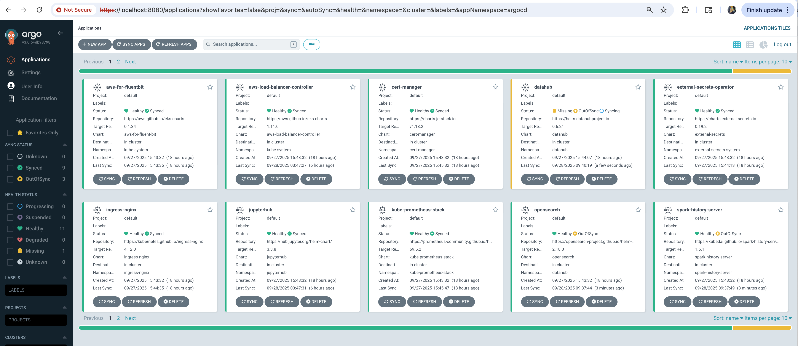

# Spark on EKS Infrastructure

Deploy a production-ready Apache Spark platform on Amazon EKS with GitOps, auto-scaling, and observability.

## Architecture

This stack deploys Spark Operator on EKS with Karpenter for elastic node provisioning and ArgoCD for GitOps-based application management.


## Prerequisites

Before deploying, ensure you have the following tools installed:

- **AWS CLI** - [Install Guide](https://docs.aws.amazon.com/cli/latest/userguide/getting-started-install.html)
- **Terraform** (>= 1.0) - [Install Guide](https://developer.hashicorp.com/terraform/install)
- **kubectl** - [Install Guide](https://kubernetes.io/docs/tasks/tools/)
- **Helm** (>= 3.0) - [Install Guide](https://helm.sh/docs/intro/install/)
- **AWS credentials configured** - Run `aws configure` or use IAM roles

## Step 1: Clone Repository & Navigate

```bash
git clone https://github.com/awslabs/data-on-eks.git
cd data-on-eks/data-stacks/spark-on-eks
```

## Step 2: Customize Stack

Edit the stack configuration file to customize addons and settings:

```bash
# Edit configuration file
vi terraform/data-stack.tfvars
```

## What Gets Deployed

This stack deploys a complete data platform with **30+ components** automatically via GitOps (ArgoCD).

### EKS Managed Addons

Deployed and managed by AWS EKS:

| Component | Purpose | Managed By |
|-----------|---------|------------|
| `coredns` | DNS resolution | EKS |
| `kube-proxy` | Network proxy | EKS |
| `vpc-cni` | Pod networking with prefix delegation | EKS |
| `eks-pod-identity-agent` | IAM roles for service accounts | EKS |
| `aws-ebs-csi-driver` | Persistent block storage | EKS |
| `aws-mountpoint-s3-csi-driver` | S3 as volumes | EKS |
| `metrics-server` | Resource metrics API | EKS |
| `eks-node-monitoring-agent` | Node-level monitoring | EKS |

### Core Platform Addons

Infrastructure components deployed via ArgoCD:

| Component | Purpose | Category |
|-----------|---------|----------|
| **Karpenter** | Node autoscaling and bin-packing | Compute |
| **ArgoCD** | GitOps application deployment | Platform |
| **cert-manager** | TLS certificate automation | Security |
| **external-secrets** | AWS Secrets Manager integration | Security |
| **ingress-nginx** | Ingress controller | Networking |
| **aws-load-balancer-controller** | ALB/NLB integration | Networking |
| **kube-prometheus-stack** | Prometheus + Grafana monitoring | Observability |
| **aws-for-fluentbit** | Log aggregation to CloudWatch | Observability |

### Data Platform Addons

Data processing and analytics tools:

| Component | Purpose | Use Case |
|-----------|---------|----------|
| **spark-operator** | Apache Spark on Kubernetes | Batch Processing |
| **spark-history-server** | Spark job history and metrics | Observability |
| **yunikorn** | Gang scheduling for batch jobs | Scheduling |
| **jupyterhub** | Interactive notebooks (Python/Scala) | Data Science |
| **flink-operator** | Stream processing framework | Real-time Analytics |
| **strimzi-kafka** | Event streaming platform | Event Streaming |
| **trino** | Distributed SQL query engine | Data Lakehouse |
| **argo-workflows** | Workflow orchestration (DAGs) | Orchestration |
| **argo-events** | Event-driven workflow triggers | Event Processing |
| **keda** | Event-driven pod autoscaling | Autoscaling |

### Optional Addons
Configure in `terraform/data-stack.tfvars`:

```hcl title="terraform/data-stack.tfvars"
name   = "spark-on-eks"
region = "us-west-2"

# Optional - disable if not needed
enable_ingress_nginx = true      # Ingress controller (default: true)
enable_jupyterhub    = true      # Notebooks (default: true)

# Optional - enable for specific use cases
enable_celeborn      = false     # Remote shuffle service
enable_datahub       = false     # Metadata management
enable_superset      = false     # Data visualization
enable_raydata       = false     # Distributed ML/AI
enable_amazon_prometheus = false # Managed Prometheus
```

:::info Customization
To see all available options, check [`infra/terraform/variables.tf`](https://github.com/awslabs/data-on-eks/blob/main/infra/terraform/variables.tf)
:::

## Step 3: Deploy Infrastructure

Run the deployment script:

```bash
./deploy.sh
```

:::note

**If deployment fails:**
- Rerun the same command: `./deploy.sh`
- If it still fails, debug using kubectl commands or [raise an issue](https://github.com/awslabs/data-on-eks/issues)

:::

:::info

**Expected deployment time:** 15-20 minutes

:::

## Step 4: Verify Deployment

The deployment script automatically configures kubectl. Verify the cluster is ready:

```bash
# Set kubeconfig (done automatically by deploy.sh)
export KUBECONFIG=kubeconfig.yaml

# Verify cluster nodes
kubectl get nodes

# Check all namespaces
kubectl get namespaces

# Verify ArgoCD applications
kubectl get applications -n argocd
```

:::tip Quick Verification

Run these commands to verify successful deployment:

```bash
# 1. Check nodes are ready
kubectl get nodes
# Expected: 4-5 nodes with STATUS=Ready

# 2. Verify Spark Operator is running
kubectl get pods -n spark-operator
# Expected: spark-operator-controller and webhook pods Running

# 3. Check ArgoCD applications are synced
kubectl get applications -n argocd
# Expected: All apps showing "Synced" and "Healthy"

# 4. Verify Spark CRDs installed
kubectl get crds | grep spark
# Expected: sparkapplications.sparkoperator.k8s.io

# 5. Check Karpenter NodePools ready
kubectl get nodepools
# Expected: 5 pools with READY=True
```

:::

<details>
<summary><b>Expected Output Examples</b></summary>

**Nodes:**
```
NAME                                           STATUS   ROLES    AGE     VERSION
ip-100-64-106-144.us-west-2.compute.internal   Ready    <none>   5m44s   v1.33.5-eks-113cf36
ip-100-64-37-76.us-west-2.compute.internal     Ready    <none>   5m43s   v1.33.5-eks-113cf36
...
```

**Spark Operator:**
```
NAME                                         READY   STATUS    RESTARTS   AGE
spark-operator-controller-6bc54d4658-hg2qd   1/1     Running   0          6m20s
spark-operator-webhook-5b5f58597d-hh6b2      1/1     Running   0          6m20s
```

**ArgoCD Applications:**
```
NAME                           SYNC STATUS   HEALTH STATUS
spark-operator                 Synced        Healthy
spark-history-server           Synced        Healthy
kube-prometheus-stack          Synced        Healthy
karpenter                      Synced        Healthy
cert-manager                   Synced        Healthy
...
```

**Karpenter NodePools:**
```
NAME                         NODECLASS   NODES   READY   AGE
general-purpose              default     0       True    13m
compute-optimized-x86        default     0       True    13m
compute-optimized-graviton   default     0       True    13m
memory-optimized-x86         default     0       True    13m
memory-optimized-graviton    default     0       True    13m
```

</details>

## Step 5: Access ArgoCD UI

The deployment script displays ArgoCD credentials at the end. Access the UI:

```bash
# Port forward ArgoCD server
kubectl port-forward svc/argocd-server -n argocd 8080:443
```

Open https://localhost:8080 in your browser:
- **Username:** `admin`
- **Password:** Displayed at end of `deploy.sh` output

:::info
All applications should show **Synced** and **Healthy** status.
:::




## Step 6: Run Test Spark Job

Validate the deployment with a sample PySpark job:

```bash
# Get S3 bucket for Spark logs
cd terraform/_local
export S3_BUCKET=$(terraform output -raw s3_bucket_id_spark_history_server)

# Submit test job
cd ../../examples
envsubst < pyspark-pi-job.yaml | kubectl apply -f -

# Watch job status
kubectl get sparkapplications -n spark-team-a -w
```

**What happens:**
1. **Karpenter provisions nodes** - Takes ~60s to launch compute-optimized instances
2. **Driver pod starts** - Coordinates the Spark job execution
3. **Executor pods run** - Perform the Pi calculation in parallel
4. **Job completes** - Result: `Pi is roughly 3.141640`
5. **Logs stored in S3** - Accessible via Spark History Server

**Expected output:**
```
NAME                   STATUS      ATTEMPTS   START                  FINISH                 DURATION
pyspark-pi-karpenter   COMPLETED   1          2025-10-21T20:08:52Z   2025-10-21T20:11:49Z   ~3 min
```

:::tip View Job Details
```bash
# Watch job status in real-time
kubectl get sparkapplications -n spark-team-a -w

# View driver logs (shows Pi calculation result)
kubectl logs -n spark-team-a pyspark-pi-karpenter-driver

# Check detailed job status
kubectl describe sparkapplication pyspark-pi-karpenter -n spark-team-a
```
:::


## Troubleshooting

### Common Issues

**Pods stuck in Pending:**
```bash
# Check node capacity
kubectl describe nodes

# Check Karpenter logs
kubectl logs -n karpenter -l app.kubernetes.io/name=karpenter
```

**ArgoCD applications not syncing:**
```bash
# Check ArgoCD application status
kubectl get applications -n argocd

# Check specific application
kubectl describe application spark-operator -n argocd
```

## Next Steps

With infrastructure deployed, you can now run any Spark examples:

- [EBS PVC Storage](/data-on-eks/docs/datastacks/processing/spark-on-eks/ebs-pvc-storage)
- [NVMe Storage](/data-on-eks/docs/datastacks/processing/spark-on-eks/nvme-storage)
- [Graviton NVMe Storage](/data-on-eks/docs/datastacks/processing/spark-on-eks/nvme-storage-graviton)
- [YuniKorn Gang Scheduling](/data-on-eks/docs/datastacks/processing/spark-on-eks/yunikorn-gang-scheduling)

## Cleanup

To remove all resources, use the dedicated cleanup script:

```bash
# Navigate to stack directory
cd data-on-eks/data-stacks/spark-on-eks

# Run cleanup script
./cleanup.sh
```

:::note

**If cleanup fails:**
- Rerun the same command: `./cleanup.sh`
- Keep rerunning until all resources are deleted
- Some AWS resources may have dependencies that require multiple cleanup attempts

:::

:::warning

This command will delete all resources and data. Make sure to backup any important data first.

:::
