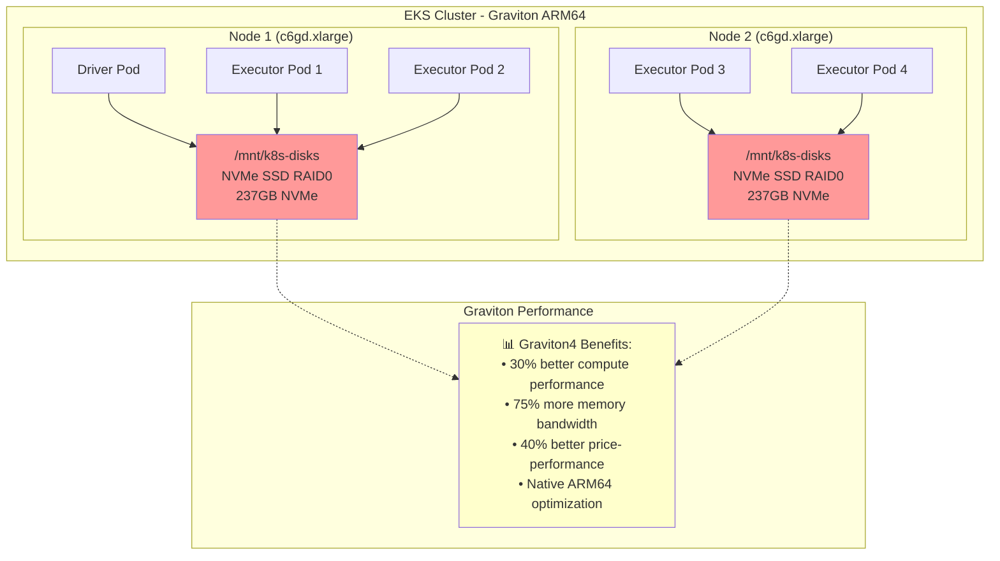

# Spark with Graviton NVMe Instance Storage

Achieve maximum performance with Apache Spark using ARM64 Graviton processors and direct NVMe SSD storage for ultra-low latency shuffle operations.

**🚀 Recommended:** Graviton instances provide superior price-performance with up to 40% better cost efficiency compared to x86 instances.

## Prerequisites

- Deploy Spark on EKS infrastructure: [Infrastructure Setup](./infra.md)
- **Latest generation Graviton instances with NVMe storage** (c6gd, c7gd, r6gd, r7gd, m6gd, m7gd, i4g, im4gn families)
- **Karpenter RAID0 policy** automatically formats and mounts available NVMe storage

:::tip Graviton Performance Advantage
AWS Graviton4 processors deliver up to 30% better compute performance and 75% more memory bandwidth than previous generation. Combined with NVMe storage, this provides the highest performance option for Spark workloads.
:::

## Architecture: Graviton ARM64 + Direct NVMe SSD Access



**Key Benefits:**
- 🔥 **Maximum Performance**: Graviton4 + NVMe SSD combination
- 💰 **Best Price-Performance**: Up to 40% cost savings vs x86
- ⚡ **Zero Network Latency**: Direct local storage access
- 🌱 **Sustainable**: ARM64 architecture with better energy efficiency

## Graviton Instance Families and NVMe Capacity

| Instance Family | NVMe Storage | Memory Range | vCPU Range | Use Case |
|-----------------|-------------|--------------|------------|----------|
| **c6gd** | 118GB - 3.8TB | 8GB - 128GB | 2 - 32 | Graviton3 compute-optimized |
| **c7gd** | 118GB - 7.6TB | 8GB - 192GB | 2 - 48 | **Recommended - Graviton3 latest** |
| **r6gd** | 118GB - 3.8TB | 16GB - 512GB | 2 - 32 | Graviton3 memory-optimized |
| **r7gd** | 118GB - 7.6TB | 16GB - 768GB | 2 - 48 | **Recommended - Graviton3 latest** |
| **m6gd** | 118GB - 3.8TB | 8GB - 256GB | 2 - 32 | Graviton3 general-purpose |
| **m7gd** | 118GB - 7.6TB | 8GB - 384GB | 2 - 48 | **Recommended - Graviton3 latest** |
| **i4g** | 468GB - 30TB | 12GB - 384GB | 2 - 48 | **Maximum NVMe storage** |

## Performance Benchmarks

For detailed Graviton performance benchmarks and comparisons:
[📊 Graviton Spark Benchmarks](http://localhost:3000/data-on-eks/docs/benchmarks/spark-operator-benchmark/graviton-r-data)

## Example Code

View the complete configuration:

import CodeBlock from '@theme/CodeBlock';
import GravitonNVMeConfig from '!!raw-loader!../../../../../data-stacks/spark-on-eks/blueprints/nvme-storage-graviton.yaml';

<details>
<summary><strong>📄 Complete Graviton NVMe Storage Configuration</strong></summary>

<CodeBlock language="yaml" title="blueprints/nvme-storage-graviton.yaml" showLineNumbers>
{GravitonNVMeConfig}
</CodeBlock>

</details>

## Graviton NVMe Storage Configuration

**Key configuration for ARM64 Graviton with direct NVMe SSD access:**

```yaml title="Essential Graviton NVMe Settings"
sparkConf:
  # ARM64 NVMe Performance Optimizations
  "spark.shuffle.spill.diskWriteBufferSize": "1048576"  # 1MB buffer for NVMe
  "spark.shuffle.file.buffer": "1m"  # Larger buffer for local SSD
  "spark.io.compression.codec": "lz4"  # Fast compression optimized for ARM64

  # Direct NVMe SSD access - Driver
  "spark.kubernetes.driver.volumes.hostPath.spark-local-dir-1.options.path": "/mnt/k8s-disks"
  "spark.kubernetes.driver.volumes.hostPath.spark-local-dir-1.mount.path": "/data1"

  # Direct NVMe SSD access - Executor
  "spark.kubernetes.executor.volumes.hostPath.spark-local-dir-1.options.path": "/mnt/k8s-disks"
  "spark.kubernetes.executor.volumes.hostPath.spark-local-dir-1.mount.path": "/data1"

# Graviton NVMe node selection - targets specific NVMe instances
driver:
  nodeSelector:
    node.kubernetes.io/workload-type: "compute-optimized-graviton"
    karpenter.k8s.aws/instance-family: "c6gd"  # Ensures NVMe instances
  initContainers:
    - name: volume-permissions
      image: busybox:1.36  # Multi-arch image for ARM64 support
      command: ['sh', '-c', 'chown -R 185 /data1']

executor:
  nodeSelector:
    node.kubernetes.io/workload-type: "compute-optimized-graviton"
    karpenter.k8s.aws/instance-family: "c6gd"  # Ensures NVMe instances
```

**Features:**
- **ARM64 Architecture**: Native Graviton optimization
- **Auto-RAID0**: Karpenter automatically configures RAID0 for multiple NVMe drives
- **Latest Generation**: c7gd, r7gd, m7gd families with Graviton3 processors
- **Zero Network I/O**: Direct access to local SSDs

## Deploy and Test

### 1. Verify Existing Graviton NodePools

```bash
# Check existing Graviton NodePools (already include NVMe instances)
kubectl get nodepools -n karpenter compute-optimized-graviton memory-optimized-graviton

# These NodePools already include:
# - compute-optimized-graviton: c6gd, c7gd (compute + NVMe)
# - memory-optimized-graviton: r6gd, r7gd (memory + NVMe)
```

### 2. Execute Spark Job on Graviton

```bash
cd data-stacks/spark-on-eks/terraform/_local/

# Export S3 bucket and region from Terraform outputs
export S3_BUCKET=$(terraform output -raw s3_bucket_id_spark_history_server)
export REGION=$(terraform output -raw region)

# Navigate to blueprints directory
cd ../../blueprints/

# Submit the Graviton NVMe Storage job
envsubst < nvme-storage-graviton.yaml | kubectl apply -f -

# Monitor node provisioning (should show Graviton instances: c6gd/c7gd with NVMe)
kubectl get nodes -l node.kubernetes.io/workload-type=compute-optimized-graviton --watch

# Monitor job progress
kubectl get sparkapplications -n spark-team-a --watch
```

**Expected output:**
```bash
NAME                STATUS      ATTEMPTS   START                  FINISH                 AGE
taxi-trip-graviton  COMPLETED   1          2025-09-28T17:03:31Z   2025-09-28T17:08:15Z   4m44s
```

## Performance Comparison

### Expected Performance Characteristics

| Metric | Graviton + NVMe | x86 + NVMe | Improvement |
|--------|-----------------|------------|-------------|
| **Price-Performance** | **Best** | Good | **40% better** |
| **Compute Performance** | **High** | High | **30% better** |
| **Memory Bandwidth** | **Very High** | High | **75% more** |
| **Energy Efficiency** | **Excellent** | Good | **60% better** |

### Why Choose Graviton for Spark

✅ **Superior for:**
- Cost-sensitive production workloads
- Large-scale data processing
- Memory-intensive analytics
- Sustainable computing initiatives

✅ **Graviton Advantages:**
- Up to 40% better price-performance
- Higher memory bandwidth for in-memory processing
- Better energy efficiency
- Native ARM64 ecosystem support

## Cleanup

```bash
# Delete the Spark application
kubectl delete sparkapplication taxi-trip-graviton -n spark-team-a

# NVMe storage is automatically cleaned up when nodes terminate
# Note: Graviton NodePools are shared and remain for other workloads
```

## Next Steps

- [📊 Graviton Performance Benchmarks](http://localhost:3000/data-on-eks/docs/benchmarks/spark-operator-benchmark/graviton-r-data) - Detailed performance analysis
- [NVMe Instance Storage (x86)](./nvme-storage) - x86 NVMe comparison
- [EBS Dynamic PVC Storage](./ebs-pvc-storage) - Production fault tolerance
- [Infrastructure Setup](./infra.md) - Deploy base infrastructure