# Spark with Apache YuniKorn Gang Scheduling

Enterprise-grade resource scheduling for Apache Spark workloads using YuniKorn's advanced gang scheduling capabilities to eliminate resource deadlocks and optimize cluster utilization.

## What is Apache YuniKorn?

**Apache YuniKorn** is a light-weight, universal resource scheduler for container orchestrator systems. It was originally developed by Cloudera and is now an Apache Software Foundation project designed to manage batch workloads and mixed workload types on Kubernetes.

### Why Not the Default Kubernetes Scheduler?

The default Kubernetes scheduler has fundamental limitations for big data workloads like Apache Spark:

| Challenge | Default K8s Scheduler | Apache YuniKorn |
|-----------|----------------------|-----------------|
| **Resource Deadlocks** | ❌ Common with multi-pod applications | ✅ **Gang scheduling prevents deadlocks** |
| **Resource Fragmentation** | ❌ Partial allocations waste resources | ✅ **Atomic allocation ensures efficiency** |
| **Multi-Tenancy** | ❌ Basic resource limits | ✅ **Hierarchical queues with fair sharing** |
| **Batch Workload Support** | ❌ Designed for long-running services | ✅ **Purpose-built for batch processing** |
| **Resource Preemption** | ❌ Limited preemption capabilities | ✅ **Advanced preemption with priorities** |

### Real-World Scenario: The Resource Deadlock Problem

**Problem**: Imagine you have a Spark job requiring 1 driver + 4 executors, but your cluster only has resources for 3 pods:

```mermaid
graph LR
    subgraph Problem["Default K8s Scheduler Problem"]
        A[Driver: ✅ Scheduled]
        B[Executor 1: ✅ Scheduled]
        C[Executor 2: ✅ Scheduled]
        D[Executor 3: ❌ Pending]
        E[Executor 4: ❌ Pending]
    end

    F[Job Stuck Forever]

    A --> F
    B --> F
    C --> F

    style F fill:#ffcccb
```



**YuniKorn Solution**: Gang scheduling ensures **all-or-nothing** allocation - either the entire Spark application gets resources or waits until sufficient resources are available.

## Apache YuniKorn Key Features for Data Teams

### 1. Gang Scheduling (Task Groups)
```yaml
# Define atomic scheduling units
yunikorn.apache.org/task-groups: |
  [{
    "name": "spark-driver",
    "minMember": 1,      # Must schedule 1 driver
    "minResource": {"cpu": "2000m", "memory": "8Gi"}
  }, {
    "name": "spark-executor",
    "minMember": 4,      # Must schedule 4 executors
    "minResource": {"cpu": "4000m", "memory": "16Gi"}
  }]
```

### 2. Hierarchical Queue Management
```
root
├── production (60% cluster resources)
│   ├── spark-team-a (30% of production)
│   └── spark-team-b (30% of production)
├── development (30% cluster resources)
│   └── experimentation (30% of development)
└── urgent (10% cluster resources, can preempt)
```

### 3. Resource Preemption & Priorities
- **High-priority jobs** can preempt lower-priority workloads
- **Queue-based borrowing** allows temporary resource sharing
- **Fair share scheduling** ensures equitable resource distribution

### 4. Advanced Placement Policies
- **Node affinity/anti-affinity** for performance optimization
- **Resource locality** for data-intensive workloads
- **Custom resource types** (GPUs, storage, network)

## YuniKorn Configuration & Management

### Initial Queue Configuration

After deploying YuniKorn, configure queues and resource policies:

```yaml title="yunikorn-defaults ConfigMap"
apiVersion: v1
kind: ConfigMap
metadata:
  name: yunikorn-defaults
  namespace: yunikorn-system
data:
  queues.yaml: |
    partitions:
      - name: default
        queues:
          - name: root
            submitacl: "*"
            queues:
              - name: spark
                resources:
                  guaranteed: {cpu: 10, memory: 20Gi}
                  max: {cpu: 50, memory: 100Gi}
                queues:
                  - name: spark-team-a
                    resources:
                      guaranteed: {cpu: 5, memory: 10Gi}
                      max: {cpu: 20, memory: 40Gi}
                  - name: spark-team-b
                    resources:
                      guaranteed: {cpu: 5, memory: 10Gi}
                      max: {cpu: 20, memory: 40Gi}
```

### Runtime Queue Management

```bash
# View current queue status
kubectl get applications -A

# Check queue resource allocation
kubectl describe configmap yunikorn-defaults -n yunikorn-system

# Monitor resource usage by queue
kubectl logs -n yunikorn-system deployment/yunikorn-scheduler | grep "queue"
```

## Accessing YuniKorn Web UI

### 1. Port Forward to YuniKorn Service

```bash
# Forward YuniKorn web UI port
kubectl port-forward -n yunikorn-system svc/yunikorn-service 9889:9889

# Access the UI in your browser
open http://localhost:9889
```


### 2. YuniKorn Web UI Features

**Dashboard Overview:**
- **Cluster Resources**: Total/used/available resources
- **Queue Status**: Resource allocation per queue
- **Applications**: Running/pending/completed jobs
- **Nodes**: Node capacity and utilization

**Key UI Sections:**
- **📊 Dashboard**: Cluster overview and metrics
- **📋 Applications**: Detailed application status and history
- **🔄 Queues**: Queue hierarchy and resource allocation
- **🖥️ Nodes**: Node-level resource utilization
- **⚙️ Configuration**: Current YuniKorn configuration

### 3. Monitoring Applications

```bash
# Check application status via CLI
kubectl get applications -n spark-team-a

# Detailed application info
kubectl describe application taxi-trip-yunikorn-gang -n spark-team-a

# YuniKorn scheduler logs
kubectl logs -n yunikorn-system deployment/yunikorn-scheduler --tail=100
```

## Prerequisites

- Deploy Spark on EKS infrastructure: [Infrastructure Setup](./infra.md)
- **Apache YuniKorn 1.7.0+** installed and configured
- **NVMe storage instances** (c6id, c7id, r6id, r7id families) for maximum performance
- **YuniKorn queue configuration** for your team/namespace

:::tip Why Gang Scheduling?
Gang scheduling eliminates resource deadlocks that plague Spark workloads on default Kubernetes. Instead of partial allocations that waste resources, YuniKorn ensures your entire Spark application (driver + all executors) gets scheduled atomically or waits until sufficient resources are available.
:::

## Gang Scheduling Architecture with YuniKorn


**Gang Scheduling Flow:**
1. **Application Submission**: Spark application submitted with task group annotations
2. **Gang Evaluation**: YuniKorn analyzes resource requirements for all task groups
3. **Resource Reservation**: Resources reserved for the entire gang (driver + all executors)
4. **Atomic Scheduling**: All pods scheduled simultaneously or none at all

## Production Benefits & Performance Impact

### Gang Scheduling vs Traditional Scheduling

| Metric | Gang Scheduling | Default K8s | Improvement |
|--------|-----------------|-------------|-------------|
| **Job Startup Time** | 45-60 seconds | 90-120 seconds | **50% faster** |
| **Resource Deadlocks** | **Zero** | Common | **100% elimination** |
| **Queue Efficiency** | **95%+ utilization** | 70-80% | **20% better** |
| **Multi-tenancy** | **Excellent** | Basic | **Advanced isolation** |
| **Resource Waste** | **Minimal** | High | **40% reduction** |

### When to Use Gang Scheduling

✅ **Ideal Scenarios:**
- **Production Spark workloads** with SLA requirements
- **Multi-tenant environments** with resource contention
- **Large batch jobs** requiring many executors (>10 executors)
- **Critical data pipelines** that cannot afford delays
- **Cost-sensitive environments** requiring optimal resource utilization

✅ **Business Benefits:**
- **Predictable performance** for production workloads
- **Reduced infrastructure costs** through better utilization
- **Improved SLA compliance** with faster job completion
- **Enhanced team productivity** with reliable scheduling

## YuniKorn Gang Scheduling Blueprint Deployment

### 1. Verify YuniKorn Installation

Before deploying gang-scheduled Spark jobs, ensure YuniKorn is properly installed:

```bash
# Check YuniKorn components are running
kubectl get pods -n yunikorn-system

# Expected output:
# NAME                                 READY   STATUS    RESTARTS   AGE
# yunikorn-admission-controller-xxx    1/1     Running   0          10m
# yunikorn-scheduler-xxx               2/2     Running   0          10m

# Verify YuniKorn version (should be 1.7.0+)
kubectl logs -n yunikorn-system deployment/yunikorn-scheduler | grep "version"

# Check queue configuration
kubectl get configmap yunikorn-defaults -n yunikorn-system -o yaml
```

### 2. Access YuniKorn Web UI

Monitor your gang-scheduled jobs through the YuniKorn web interface:

```bash
# Port forward to YuniKorn service
kubectl port-forward -n yunikorn-system svc/yunikorn-service 9889:9889

# Access the UI (runs in background)
open http://localhost:9889 &

# Alternative: Check if service is accessible
curl -s http://localhost:9889/ws/v1/version
```

**YuniKorn UI Navigation:**
- **📊 Dashboard**: Cluster resource overview and utilization
- **📋 Applications**: Gang-scheduled application status and history
- **🔄 Queues**: Queue hierarchy and resource allocation
- **🖥️ Nodes**: Node-level resource utilization and capacity
- **⚙️ Configuration**: Current YuniKorn scheduling configuration

### 3. Gang Scheduling Configuration

Here's how to configure Spark applications for gang scheduling:

```yaml title="Essential Gang Scheduling Configuration"
apiVersion: "sparkoperator.k8s.io/v1beta2"
kind: SparkApplication
metadata:
  name: "taxi-trip-yunikorn-gang"
  namespace: spark-team-a
spec:
  # Enable YuniKorn batch scheduler
  batchScheduler: yunikorn
  batchSchedulerOptions:
    queue: root.spark.spark-team-a

  driver:
    annotations:
      # Define task groups for gang scheduling
      yunikorn.apache.org/task-group-name: "spark-driver"
      yunikorn.apache.org/task-groups: |-
        [{
          "name": "spark-driver",
          "minMember": 1,
          "minResource": {
            "cpu": "2000m",
            "memory": "10Gi"
          }
        }, {
          "name": "spark-executor",
          "minMember": 2,
          "minResource": {
            "cpu": "4000m",
            "memory": "18Gi"
          }
        }]

  executor:
    annotations:
      # Executors join the executor task group
      yunikorn.apache.org/task-group-name: "spark-executor"
```

**Gang Scheduling Configuration:**
- Use `"spark-driver"` and `"spark-executor"` as task group names
- Resource requirements should use `"cpu"` and `"memory"` (Kubernetes standard format)
- minResource values should match actual pod resource requests

## Complete Gang Scheduling Blueprint

View the complete YuniKorn gang scheduling configuration:

import CodeBlock from '@theme/CodeBlock';
import YuniKornGangConfig from '!!raw-loader!../../../../../data-stacks/spark-on-eks/blueprints/yunikorn-gang-scheduling.yaml';

<details>
<summary><strong>📄 Complete YuniKorn Gang Scheduling Configuration</strong></summary>

<CodeBlock language="yaml" title="blueprints/yunikorn-gang-scheduling.yaml" showLineNumbers>
{YuniKornGangConfig}
</CodeBlock>

</details>

### 4. Deploy Gang Scheduled Spark Job

Now let's deploy and test the complete gang scheduling blueprint:

```bash
# Navigate to your Spark on EKS deployment
cd data-stacks/spark-on-eks/terraform/_local/

# Export required environment variables
export S3_BUCKET=$(terraform output -raw s3_bucket_id_spark_history_server)
export REGION=$(terraform output -raw region)

# Navigate to blueprints directory
cd ../../blueprints/

# Submit the gang scheduled Spark job with NVMe storage
envsubst < yunikorn-gang-scheduling.yaml | kubectl apply -f -

# Monitor gang scheduling in action - watch all pods appear together
kubectl get pods -n spark-team-a --watch
```

### 5. Observe Gang Scheduling Behavior

**Expected gang scheduling behavior:**
```bash
# All pods should appear simultaneously when resources are available
NAME                               READY   STATUS    RESTARTS   AGE
taxi-trip-yunikorn-gang-driver     1/1     Running   0          45s
taxi-trip-yunikorn-gang-exec-1     1/1     Running   0          45s
taxi-trip-yunikorn-gang-exec-2     1/1     Running   0          45s
```

**Key Observations:**
- ✅ **Atomic Scheduling**: All pods start at exactly the same time
- ✅ **No Partial Allocation**: Either all pods get resources or none do
- ✅ **Faster Startup**: No waiting for individual executors to become available

### 6. Monitor with YuniKorn UI

```bash
# Access YuniKorn UI (if not already running)
kubectl port-forward -n yunikorn-system svc/yunikorn-service 9889:9889

# Open in browser to monitor:
# http://localhost:9889
```

**In the YuniKorn UI, verify:**
- **Applications Tab**: Shows gang-scheduled application status
- **Queue Tab**: Displays queue resource allocation
- **Nodes Tab**: Shows node-level resource utilization

### 7. Verify Gang Scheduling via CLI

```bash
# Check YuniKorn application status
kubectl get applications -n spark-team-a

# Detailed application information
kubectl describe application taxi-trip-yunikorn-gang -n spark-team-a

# Check task group allocation events
kubectl get events -n spark-team-a --sort-by='.firstTimestamp' | grep -i "task-group"

# Monitor YuniKorn scheduler logs for gang scheduling
kubectl logs -n yunikorn-system deployment/yunikorn-scheduler --tail=50 | grep -i "gang"
```

## Gang Scheduling Best Practices

### 1. Right-sizing Task Groups

**Match resource requirements to actual Spark configuration:**

```yaml
# Ensure task group resources align with Spark pod requirements
driver:
  cores: 2
  memory: "8g"
  memoryOverhead: "2g"  # Total: 10GB

  # Task group should match total requirement
  annotations:
    yunikorn.apache.org/task-groups: |
      [{
        "name": "spark-driver",
        "minMember": 1,
        "minResource": {"cpu": "2000m", "memory": "10Gi"}
      }]

executor:
  cores: 4
  memory: "15g"
  memoryOverhead: "3g"  # Total: 18GB per executor
  instances: 2          # Total: 2 executors

  # Task group accounts for all executors
  annotations:
    yunikorn.apache.org/task-groups: |
      [{
        "name": "spark-executor",
        "minMember": 2,     # Must schedule all 2 executors
        "minResource": {"cpu": "4000m", "memory": "18Gi"}
      }]
```

### 2. Queue Strategy for Teams

**Use hierarchical queues for team isolation:**

```yaml
# Production queue setup
batchSchedulerOptions:
  queue: root.production.spark-team-a  # Dedicated team queue

# Development queue setup
batchSchedulerOptions:
  queue: root.development.experimentation  # Lower priority
```

### 3. Resource Anti-Affinity

**Spread executors across nodes for high availability:**

```yaml
executor:
  affinity:
    podAntiAffinity:
      preferredDuringSchedulingIgnoredDuringExecution:
      - weight: 100
        podAffinityTerm:
          labelSelector:
            matchLabels:
              spark-role: executor
          topologyKey: kubernetes.io/hostname
```

## Troubleshooting

### Common Gang Scheduling Issues

#### 1. Application Stuck in Pending
```bash
# Check if resources are available for entire gang
kubectl describe nodes | grep -A 5 "Allocatable:"

# Verify queue limits
kubectl get configmap yunikorn-defaults -n yunikorn-system -o yaml
```

#### 2. Task Group Configuration Errors
```bash
# Validate task group syntax
kubectl get events -n spark-team-a | grep -i "task-group"

# Check YuniKorn logs
kubectl logs -n yunikorn-system deployment/yunikorn-scheduler
```

#### 3. Resource Requirements Too High
```yaml
# Reduce minResource requirements
"minResource": {
  "cpu": "2000m",    # Reduce from 4000m
  "memory": "8Gi"    # Reduce from 18Gi
}
```

## Best Practices

### 1. Right-size Task Groups
```yaml
# Match actual Spark resource requirements
driver:
  cores: 2
  memory: "8g"
  # Task group should match or be slightly less
  minResource: {"cpu": "2000m", "memory": "10Gi"}

executor:
  cores: 4
  memory: "15g"
  # Account for total requirement (cores * instances)
  minResource: {"cpu": "4000m", "memory": "18Gi"}
```

### 2. Queue Management
```yaml
# Use dedicated queues for gang scheduled jobs
batchSchedulerOptions:
  queue: root.spark.critical-jobs  # High priority queue
```

### 3. Anti-Affinity Configuration
```yaml
# Spread executors across nodes for HA
affinity:
  podAntiAffinity:
    preferredDuringSchedulingIgnoredDuringExecution:
    - weight: 100
      podAffinityTerm:
        labelSelector:
          matchLabels:
            spark-role: executor
        topologyKey: kubernetes.io/hostname
```

## Cleanup

```bash
# Delete gang scheduled application
kubectl delete sparkapplication taxi-trip-yunikorn-gang -n spark-team-a

# YuniKorn automatically cleans up task groups and resource reservations
```

## Next Steps

- [NVMe Instance Storage](./nvme-storage) - High-performance local storage
- [Graviton NVMe Storage](./nvme-storage-graviton) - ARM64 cost optimization
- [Infrastructure Setup](./infra.md) - Deploy YuniKorn-enabled cluster
