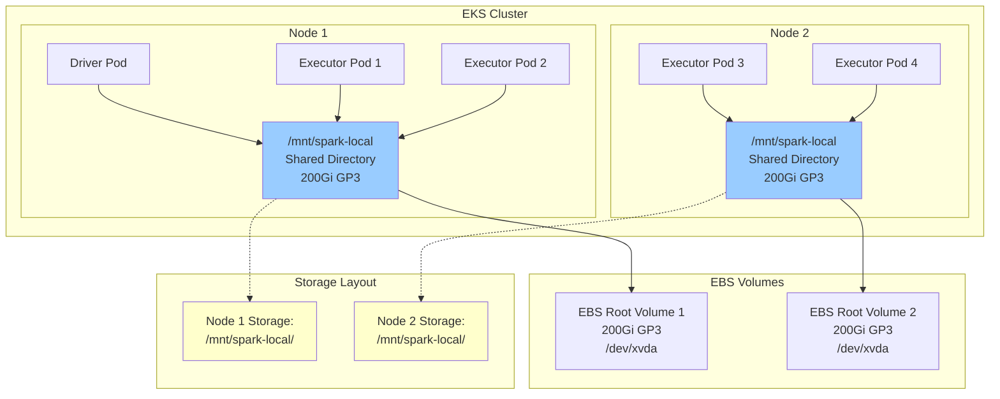

# Spark with EBS Node-Level Storage

Learn to use shared EBS volumes per node for Spark shuffle storage - a cost-effective alternative to per-pod PVCs.

## Prerequisites

- Deploy Spark on EKS infrastructure: [Infrastructure Setup](./infra.md)
- **Existing EBS volume** (200Gi GP3) used with dedicated Spark directory

:::warning Node Storage Considerations
This approach shares one EBS volume per node among all Spark pods. While cost-effective, it may have **noisy neighbor issues** when multiple workloads compete for the same storage.
:::

## Architecture: Shared EBS Volume per Node



**Key Benefits:**
- 💰 **Cost Effective**: One EBS volume per node vs per pod
- ⚡ **Higher Performance**: Direct node storage access
- 🔄 **Simplified Management**: No PVC lifecycle complexity
- ⚠️ **Trade-off**: Potential noisy neighbor issues

## What is Shuffle Storage in Spark?

**Shuffle storage** holds intermediate data during Spark operations like `groupBy`, `join`, and `reduceByKey`. When data is redistributed across executors, it's temporarily stored before being read by subsequent stages.

## Spark Shuffle Storage Options

| Storage Type | Performance | Cost | Use Case |
|-------------|-------------|------|----------|
| **NVMe SSD Instances** | 🔥 Very High | 💰 High | Maximum performance workloads |
| **EBS Node Storage** | ⚡ High | 💵 Medium | **Featured - Cost-effective shared storage** |
| **EBS Dynamic PVC** | 📊 Medium | 💰 Medium | Per-pod isolation and fault tolerance |
| **FSx for Lustre** | 📊 Medium | 💵 Low | Parallel filesystem for HPC |
| **S3 Express + Mountpoint** | 📊 Medium | 💵 Low | Very large datasets |
| **Remote Shuffle (Celeborn)** | ⚡ High | 💰 Medium | Resource disaggregation |

### Benefits: Performance & Cost

- **EBS Node Storage**: Balance of performance and cost with shared volumes
- **Higher throughput**: Direct access without Kubernetes volume overhead
- **Cost optimization**: Fewer EBS volumes than per-pod approach

## Example Code

View the complete configuration:

import CodeBlock from '@theme/CodeBlock';
import NodeStorageConfig from '!!raw-loader!../../../../data-stacks/spark-on-eks/blueprints/ebs-node-storage.yaml';

<details>
<summary><strong>📄 Complete EBS Node Storage Configuration</strong></summary>

<CodeBlock language="yaml" title="blueprints/ebs-node-storage.yaml" showLineNumbers>
{NodeStorageConfig}
</CodeBlock>

</details>

## EBS Node Storage Configuration

**Key configuration for shared node-level storage:**

```yaml title="Essential Node Storage Settings"
sparkConf:
  # Node-level EBS volume - Driver
  "spark.kubernetes.driver.volumes.hostPath.spark-local-dir-1.options.path": "/mnt/spark-local"
  "spark.kubernetes.driver.volumes.hostPath.spark-local-dir-1.options.type": "Directory"
  "spark.kubernetes.driver.volumes.hostPath.spark-local-dir-1.mount.path": "/data1"
  "spark.kubernetes.driver.volumes.hostPath.spark-local-dir-1.mount.readOnly": "false"

  # Node-level EBS volume - Executor
  "spark.kubernetes.executor.volumes.hostPath.spark-local-dir-1.options.path": "/mnt/spark-local"
  "spark.kubernetes.executor.volumes.hostPath.spark-local-dir-1.options.type": "Directory"
  "spark.kubernetes.executor.volumes.hostPath.spark-local-dir-1.mount.path": "/data1"
  "spark.kubernetes.executor.volumes.hostPath.spark-local-dir-1.mount.readOnly": "false"
```

**Features:**
- `hostPath`: Uses node-level directory on root volume
- `/mnt/spark-local`: Shared directory per node (200Gi GP3 root volume)
- `Directory`: Ensures directory exists on the node
- All pods on same node share the storage

## Create Test Data and Run Example

Process NYC taxi data to demonstrate EBS node-level storage with shared volumes.

### 1. Prepare Test Data

```bash
cd data-stacks/spark-on-eks/terraform/_local/

# Export S3 bucket and region from Terraform outputs
export S3_BUCKET=$(terraform output -raw s3_bucket_id_spark_history_server)
export REGION=$(terraform output -raw region)

# Navigate to scripts directory and create test data
cd ../../scripts/
./taxi-trip-execute.sh $S3_BUCKET $REGION
```

*Downloads NYC taxi data (1.1GB total) and uploads to S3*

### 2. Execute Spark Job

```bash
# Navigate to blueprints directory
cd ../blueprints/

# Submit the EBS Node Storage job
envsubst < ebs-node-storage.yaml | kubectl apply -f -

# Monitor job progress
kubectl get sparkapplications -n spark-team-a --watch
```

**Expected output:**
```bash
NAME       STATUS    ATTEMPTS   START                  FINISH                 AGE
taxi-trip  COMPLETED 1          2025-09-28T17:03:31Z   2025-09-28T17:08:15Z   4m44s
```

## Verify Data and Storage

### Monitor Node Storage Usage
```bash
# Check which nodes have Spark pods
kubectl get pods -n spark-team-a -o wide

# SSH to nodes and check storage usage (if needed)
kubectl debug node/<node-name> -it --image=busybox -- df -h /host/

# Check directory structure on nodes
kubectl debug node/<node-name> -it --image=busybox -- ls -la /host/mnt/spark-local/
```

### Check Pod Status and Storage
```bash
# Check driver and executor pods
kubectl get pods -n spark-team-a -l app=taxi-trip

# Verify node storage is mounted correctly (/dev/nvme0n1p1 at /data1)
kubectl exec -n spark-team-a taxi-trip-exec-1 -- df -h

# Expected output:
# /dev/nvme0n1p1  200G  7.9G  193G   4% /data1

# Check Spark shuffle data directories (multiple blockmgr per node)
kubectl exec -n spark-team-a taxi-trip-exec-1 -- ls -la /data1/

# Expected output shows shared storage with multiple block managers:
# drwxr-xr-x. 22 spark spark 16384 Sep 28 22:09 blockmgr-7c0ac908-26a3-4395-8a8f-2221b4d5d7c3
# drwxr-xr-x. 13 spark spark   116 Sep 28 22:09 blockmgr-9ed9c2fd-53e1-4337-8a68-9a48e1e63d5f
# drwxr-xr-x. 13 spark spark   116 Sep 28 22:09 blockmgr-ecc9fa35-a82e-4486-85fe-c8ef963d6eb7

# Verify shared storage between pods on same node
kubectl exec -n spark-team-a taxi-trip-driver -- ls -la /data1/

# View Spark application logs
kubectl logs -n spark-team-a -l spark-role=driver --follow
```

### Verify Output Data
```bash
# Check processed output in S3
aws s3 ls s3://$S3_BUCKET/taxi-trip/output/

# Verify event logs
aws s3 ls s3://$S3_BUCKET/spark-event-logs/
```

## Node Storage Considerations

### Advantages
- **Cost Savings**: ~70% cost reduction vs per-pod PVCs
- **Higher Performance**: Direct node storage access
- **Simplified Operations**: No PVC management overhead
- **Better Resource Utilization**: Shared storage pool per node

### Disadvantages & Mitigation
- **Noisy Neighbors**: Multiple pods compete for same storage I/O
  - *Mitigation*: Use compute-optimized instances with higher IOPS
- **No Isolation**: Pods can see each other's temporary data
  - *Mitigation*: Configure proper directory permissions
- **Storage Sizing**: Must pre-size for all workloads on node
  - *Mitigation*: Monitor usage and adjust volume size

### When to Use Node Storage
✅ **Good for:**
- Cost-sensitive workloads
- Predictable I/O patterns
- Trusted multi-tenant environments
- Development/testing environments

❌ **Avoid for:**
- Security-sensitive workloads requiring isolation
- Unpredictable I/O bursts
- Critical production workloads needing guarantees

## Storage Class Options

```yaml
# GP3 - Better price/performance (default)
volumeType: gp3

# IO1 - High IOPS workloads
volumeType: io1

# ST1 - Throughput-optimized
volumeType: st1
```

## Cleanup

```bash
# Delete the Spark application
kubectl delete sparkapplication taxi-trip -n spark-team-a

# Node storage persists until node termination
# Data is automatically cleaned up when nodes are replaced
```

## Next Steps

- [EBS Dynamic PVC Storage](./ebs-pvc-storage) - Per-pod storage isolation
- [NVMe Instance Storage](./nvme-storage) - High-performance local SSD
- [Infrastructure Setup](./infra.md) - Deploy base infrastructure