# Spark with NVMe Instance Storage

Achieve maximum performance with Apache Spark using direct NVMe SSD storage attached to instances for ultra-low latency shuffle operations.

Learn to use direct NVMe SSD storage for Spark shuffle storage - the highest performance option with no network I/O overhead.

## Prerequisites

- Deploy Spark on EKS infrastructure: [Infrastructure Setup](./infra.md)
- **Latest generation instances with NVMe storage** (c6id, c7id, r6id, r7id, m6id, m7id, i4i families)
- **Karpenter RAID0 policy** automatically formats and mounts available NVMe storage

:::tip Maximum Performance
NVMe instance storage provides the highest I/O performance for Spark workloads with direct access to local SSDs attached to the instance. No network overhead between compute and storage.
:::

## Architecture: Direct NVMe SSD Access

```mermaid
graph TB
    subgraph "EKS Cluster"
        subgraph "Node 1 (c5d.xlarge)"
            D[Driver Pod]
            E1[Executor Pod 1]
            E2[Executor Pod 2]
            VOL1["/mnt/k8s-disks<br/>NVMe SSD RAID0<br/>150GB NVMe"]
        end

        subgraph "Node 2 (c5d.xlarge)"
            E3[Executor Pod 3]
            E4[Executor Pod 4]
            VOL2["/mnt/k8s-disks<br/>NVMe SSD RAID0<br/>150GB NVMe"]
        end
    end

    subgraph "Instance Store NVMe"
        NVME1["NVMe SSD 1<br/>Local Instance Store<br/>Ultra-low latency<br/>No network I/O"]
        NVME2["NVMe SSD 2<br/>Local Instance Store<br/>Ultra-low latency<br/>No network I/O"]
    end

    subgraph "Performance Comparison"
        PERF["📊 I/O Performance:<br/>• NVMe SSD: ~500K IOPS<br/>• EBS gp3: ~16K IOPS<br/>• Network latency: 0ms vs 1-3ms"]
    end

    D --> VOL1
    E1 --> VOL1
    E2 --> VOL1
    E3 --> VOL2
    E4 --> VOL2

    VOL1 --> NVME1
    VOL2 --> NVME2

    VOL1 -.-> PERF
    VOL2 -.-> PERF

    style VOL1 fill:#ff9999
    style VOL2 fill:#ff9999
    style NVME1 fill:#99ff99
    style NVME2 fill:#99ff99
    style PERF fill:#ffffcc
```



**Key Benefits:**
- 🔥 **Maximum Performance**: 500K+ IOPS vs 16K IOPS (EBS gp3)
- ⚡ **Zero Network Latency**: Direct local storage access
- 💰 **Cost Included**: Storage cost included in instance price
- 🚀 **Auto-Configuration**: Karpenter RAID0 policy handles setup

## What is Shuffle Storage in Spark?

**Shuffle storage** holds intermediate data during Spark operations like `groupBy`, `join`, and `reduceByKey`. When data is redistributed across executors, it's temporarily stored before being read by subsequent stages.

## Spark Shuffle Storage Options

| Storage Type | Performance | Cost | Use Case |
|-------------|-------------|------|----------|
| **NVMe SSD Instances** | 🔥 Very High | 💰 High | **Featured - Maximum performance workloads** |
| **EBS Dynamic PVC** | ⚡ High | 💰 Medium | Production fault tolerance |
| **EBS Node Storage** | 📊 Medium | 💵 Medium | Cost-effective shared storage |
| **FSx for Lustre** | 📊 Medium | 💵 Low | Parallel filesystem for HPC |
| **S3 Express + Mountpoint** | 📊 Medium | 💵 Low | Very large datasets |
| **Remote Shuffle (Celeborn)** | ⚡ High | 💰 Medium | Resource disaggregation |

### Benefits: Performance & Cost

- **NVMe**: Fastest local SSD storage, highest IOPS, zero network latency
- **Direct Access**: No network overhead between compute and storage
- **Auto-Provisioning**: Karpenter automatically detects and configures NVMe

## Example Code

View the complete configuration:

import CodeBlock from '@theme/CodeBlock';
import NVMeConfig from '!!raw-loader!../../../../data-stacks/spark-on-eks/blueprints/nvme-storage.yaml';

<details>
<summary><strong>📄 Complete NVMe Storage Configuration</strong></summary>

<CodeBlock language="yaml" title="blueprints/nvme-storage.yaml" showLineNumbers>
{NVMeConfig}
</CodeBlock>

</details>

## NVMe Storage Configuration

**Key configuration for direct NVMe SSD access:**

```yaml title="Essential NVMe Storage Settings"
sparkConf:
  # Direct NVMe SSD access - Driver
  "spark.kubernetes.driver.volumes.hostPath.spark-local-dir-1.options.path": "/mnt/k8s-disks"
  "spark.kubernetes.driver.volumes.hostPath.spark-local-dir-1.options.type": "Directory"
  "spark.kubernetes.driver.volumes.hostPath.spark-local-dir-1.mount.path": "/data1"
  "spark.kubernetes.driver.volumes.hostPath.spark-local-dir-1.mount.readOnly": "false"

  # Direct NVMe SSD access - Executor
  "spark.kubernetes.executor.volumes.hostPath.spark-local-dir-1.options.path": "/mnt/k8s-disks"
  "spark.kubernetes.executor.volumes.hostPath.spark-local-dir-1.options.type": "Directory"
  "spark.kubernetes.executor.volumes.hostPath.spark-local-dir-1.mount.path": "/data1"
  "spark.kubernetes.executor.volumes.hostPath.spark-local-dir-1.mount.readOnly": "false"

# Node selection - uses existing NodePools
nodeSelector:
  node.kubernetes.io/workload-type: "compute-optimized-x86"  # For c6id, c7id instances
  # Alternative: "memory-optimized-x86" for r6id, r7id instances
```

**Features:**
- `hostPath`: Uses Karpenter-mounted NVMe storage at `/mnt/k8s-disks`
- **Auto-RAID0**: Karpenter automatically configures RAID0 for multiple NVMe drives
- **Latest Generation**: c6id, c7id, r6id, r7id, m6id, m7id, i4i families with high-performance NVMe
- **Zero Network I/O**: Direct access to local SSDs

## Create Test Data and Run Example

Process NYC taxi data to demonstrate NVMe storage performance with direct SSD access.

### 1. Verify Existing x86 NodePools

```bash
# Check existing x86 NodePools (already include NVMe instances)
kubectl get nodepools -n karpenter compute-optimized-x86 memory-optimized-x86

# These NodePools already include:
# - compute-optimized-x86: c6id, c7id (compute + NVMe)
# - memory-optimized-x86: r6id, r7id (memory + NVMe)
```

### 2. Prepare Test Data

```bash
cd data-stacks/spark-on-eks/terraform/_local/

# Export S3 bucket and region from Terraform outputs
export S3_BUCKET=$(terraform output -raw s3_bucket_id_spark_history_server)
export REGION=$(terraform output -raw region)

# Navigate to scripts directory and create test data
cd ../../scripts/
./taxi-trip-execute.sh $S3_BUCKET $REGION
```

*Downloads NYC taxi data (1.1GB total) and uploads to S3*

### 3. Execute Spark Job

```bash
# Navigate to blueprints directory
cd ../blueprints/

# Submit the NVMe Storage job
envsubst < nvme-storage.yaml | kubectl apply -f -

# Monitor node provisioning (should show x86 instances: c6id/c7id with NVMe)
kubectl get nodes -l node.kubernetes.io/workload-type=compute-optimized-x86 --watch

# Monitor job progress
kubectl get sparkapplications -n spark-team-a --watch
```

**Expected output:**
```bash
NAME       STATUS    ATTEMPTS   START                  FINISH                 AGE
taxi-trip  COMPLETED 1          2025-09-28T17:03:31Z   2025-09-28T17:08:15Z   4m44s
```

## Verify NVMe Storage Performance

### Monitor NVMe Storage Usage
```bash
# Check which nodes have Spark pods
kubectl get pods -n spark-team-a -o wide

# Check NVMe storage mounting and performance
kubectl exec -n spark-team-a taxi-trip-exec-1 -- df -h

# Expected output shows NVMe mounted at /data1:
# /dev/md0        150G  1.2G  141G   1% /data1

# Verify NVMe storage performance characteristics
kubectl exec -n spark-team-a taxi-trip-exec-1 -- lsblk

# Expected output shows RAID0 of NVMe devices:
# md0       9:0    0  149G  0 raid0 /data1
# ├─nvme1n1 259:1   0  75G  0 disk
# └─nvme2n1 259:2   0  75G  0 disk
```

### Check Spark Performance with NVMe
```bash
# Check Spark shuffle data on NVMe storage
kubectl exec -n spark-team-a taxi-trip-exec-1 -- ls -la /data1/

# Expected output shows high-performance shuffle operations:
# drwxr-xr-x. 22 spark spark 16384 Sep 28 22:09 blockmgr-7c0ac908-26a3-4395-8a8f-2221b4d5d7c3
# drwxr-xr-x. 13 spark spark   116 Sep 28 22:09 blockmgr-9ed9c2fd-53e1-4337-8a8f-2221b4d5d7c3

# Monitor I/O performance (should show very high IOPS)
kubectl exec -n spark-team-a taxi-trip-exec-1 -- iostat -x 1 3

# View Spark application logs for performance metrics
kubectl logs -n spark-team-a -l spark-role=driver --follow
```

### Verify Output Data
```bash
# Check processed output in S3
aws s3 ls s3://$S3_BUCKET/taxi-trip/output/

# Verify event logs
aws s3 ls s3://$S3_BUCKET/spark-event-logs/
```

## Performance Comparison

### Expected I/O Performance

| Storage Type | IOPS | Latency | Bandwidth |
|-------------|------|---------|-----------|
| **NVMe c5d.xlarge** | 500,000+ | &lt;100μs | 4+ GB/s |
| **EBS gp3** | 16,000 | 1-3ms | 1 GB/s |
| **EBS gp2** | 10,000 | 3-5ms | 250 MB/s |

### Latest Generation Instance Families and NVMe Capacity

| Instance Family | NVMe Storage | Memory Range | vCPU Range | Use Case |
|-----------------|-------------|--------------|------------|----------|
| **c6id** | 118GB - 7.6TB | 8GB - 256GB | 2 - 64 | Latest compute-optimized |
| **c7id** | 118GB - 14TB | 8GB - 384GB | 2 - 96 | **Recommended - newest compute** |
| **r6id** | 118GB - 7.6TB | 16GB - 1TB | 2 - 64 | Latest memory-optimized |
| **r7id** | 118GB - 14TB | 16GB - 1.5TB | 2 - 96 | **Recommended - newest memory** |
| **m6id** | 118GB - 7.6TB | 8GB - 512GB | 2 - 64 | Latest general-purpose |
| **m7id** | 118GB - 14TB | 8GB - 768GB | 2 - 96 | **Recommended - newest general** |
| **i4i** | 468GB - 30TB | 12GB - 768GB | 2 - 128 | **Maximum NVMe storage** |

## NVMe Storage Considerations

### Advantages
- **Maximum Performance**: 500K+ IOPS vs 16K (EBS gp3)
- **Zero Network Latency**: Direct local storage access
- **Cost Included**: Storage cost included in instance price
- **Auto-Configuration**: Karpenter handles RAID0 setup

### Disadvantages & Mitigation
- **Ephemeral Storage**: Data lost on instance termination
  - *Mitigation*: Use S3 for persistent data, NVMe for shuffle only
- **Fixed Size**: Cannot resize storage after launch
  - *Mitigation*: Choose appropriate instance type for workload
- **Higher Instance Cost**: NVMe instances cost 10-20% more
  - *Mitigation*: Performance gains often justify cost

### When to Use NVMe Storage
✅ **Good for:**
- Performance-critical Spark workloads
- Large shuffle operations
- Real-time analytics
- Machine learning training

❌ **Avoid for:**
- Small datasets that fit in memory
- Cost-sensitive development workloads
- Jobs requiring persistent storage

## Cleanup

```bash
# Delete the Spark application
kubectl delete sparkapplication taxi-trip -n spark-team-a

# NVMe storage is automatically cleaned up when nodes terminate
# Note: x86 NodePools are shared and remain for other workloads
```

## Next Steps

- [EBS Dynamic PVC Storage](./ebs-pvc-storage) - Production fault tolerance
- [EBS Node Storage](./ebs-node-storage) - Cost-effective alternative
- [Infrastructure Setup](./infra.md) - Deploy base infrastructure
