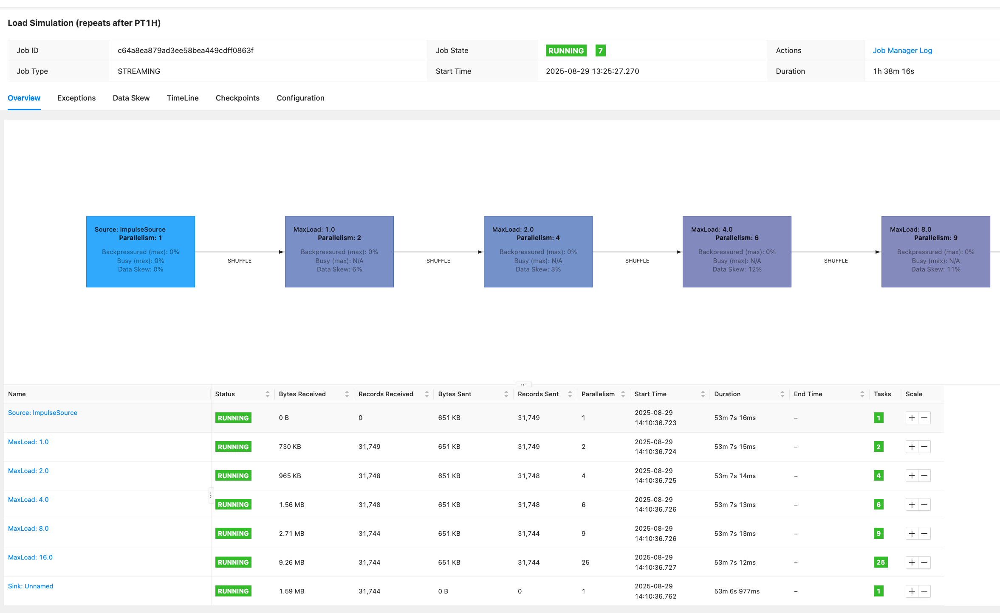

## Prerequisites

- ✅ [Infrastructure deployed](/data-on-eks/docs/datastacks/streaming/emr-eks-flink/infra)

## Autoscaler Example

Get the role arn linked to the job execution service account.
```bash
export FLINK_JOB_ROLE=$( terraform output -state=./terraform/_local/terraform.tfstate flink_job_execution_role_arn )
```
Get the S3 bucket name for checkpoint,savepoint,logs and job storage data.
```bash
export S3_BUCKET="${$( terraform output -state=./terraform/_local/terraform.tfstate flink_operator_bucket )//\"/}"
```

Navigate to example directory and submit the Flink job.

```bash
cd data-on-eks/data-stacks/emr-on-eks/examples/flink/karpenter
```

Modify the autoscaler-example.yaml by replacing the placeholders with values from the two env variables above.

```bash
envsubst < autoscaler-example.yaml > autoscaler-example1.yaml
```

The job example contains Autoscaler configuration:

```
...
flinkConfiguration:

    taskmanager.numberOfTaskSlots: "4"
    # Autotuning parameters
    kubernetes.operator.job.autoscaler.enabled: "true"
    kubernetes.operator.job.autoscaler.stabilization.interval: 1m
    kubernetes.operator.job.autoscaler.metrics.window: 1m
    kubernetes.operator.job.autoscaler.target.utilization: "0.5"
    kubernetes.operator.job.autoscaler.target.utilization.boundary: "0.2"
    kubernetes.operator.job.autoscaler.restart.time: 1m
    kubernetes.operator.job.autoscaler.catch-up.duration: 5m
    kubernetes.operator.job.autoscaler.vertex.exclude.ids: ""

...
```


It starts a [LoadSimulationPipeline](https://nightlies.apache.org/flink/flink-kubernetes-operator-docs-main/api/java/autoscaling/LoadSimulationPipeline.html) job that simulates flucating loads from zero to the max (1,2,4, and 8) loads:

```
job:
    # if you have your job jar in S3 bucket you can use that path as well
    jarURI: local:///opt/flink/examples/streaming/AutoscalingExample.jar
    entryClass: org.apache.flink.streaming.examples.autoscaling.LoadSimulationPipeline
    args:
      - "--maxLoadPerTask"
      - "1;2;4;8;16;"
      - "--repeatsAfterMinutes"
      - "60"
```

Deploy the job with the kubectl deploy command.

```bash
kubectl apply -f autoscaler-example1.yaml
```

Monitor the job status using the below command. You should see the new nodes triggered by the karpenter and the YuniKorn will schedule Job manager pods and two Taskmanager pods.  As the load increases, autoscaler changes the parallelism of the tasks and more task manager pods are added as needed:

```
NAME                                             READY   STATUS    RESTARTS   AGE
autoscaler-example-5cbd4c9864-bt2qj              2/2     Running   0          81m
autoscaler-example-5cbd4c9864-r4gbg              2/2     Running   0          81m
autoscaler-example-taskmanager-1-1               2/2     Running   0          80m
autoscaler-example-taskmanager-1-2               2/2     Running   0          80m
autoscaler-example-taskmanager-1-4               2/2     Running   0          78m
autoscaler-example-taskmanager-1-5               2/2     Running   0          78m
autoscaler-example-taskmanager-1-6               2/2     Running   0          38m
autoscaler-example-taskmanager-1-7               2/2     Running   0          38m
autoscaler-example-taskmanager-1-8               2/2     Running   0          38m
```

Access the Flink WebUI for the job by running this command:

```bash
kubectl port-forward svc/autoscaler-example-rest 8081 -n flink-team-a-ns
```

Then browse to http://localhost:8081:



Examine the `max_load` and `parallelism` of each task.
