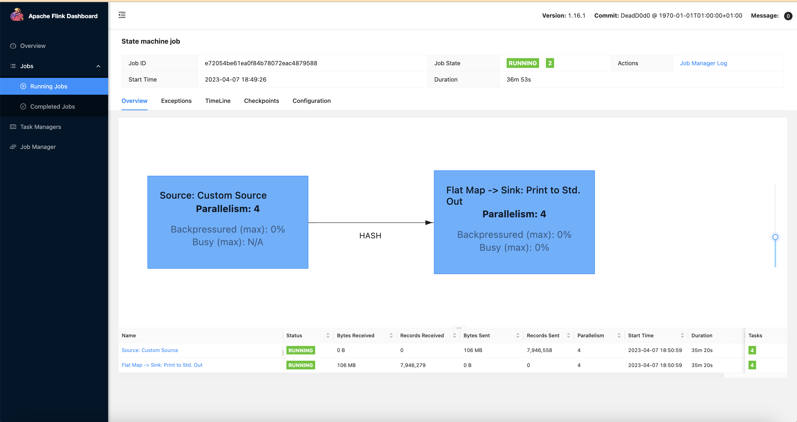

import Tabs from '@theme/Tabs';
import TabItem from '@theme/TabItem';


## Overview

This document provides an overview of Apache Flink and the Flink Kubernetes Operator. It covers the architecture, best practices, and includes a simple example to demonstrate how to submit a streaming job to your Flink on EKS cluster.

## Prerequisites

- Deploy Flink on EKS infrastructure: [Infrastructure Setup](./infra.md)


## Introduction to Apache Flink

[Apache Flink](https://flink.apache.org/) is an open-source, unified stream processing and batch processing framework that is designed to process large amounts of data. It provides fast, reliable, and scalable data processing with fault tolerance and exactly-once semantics.
Some of the key features of Flink are:
- **Distributed Processing**: Flink is designed to process large volumes of data in a distributed fashion, making it horizontally scalable and fault-tolerant.
- **Stream Processing and Batch Processing**: Flink provides APIs for both stream processing and batch processing. This means you can process data in real-time, as it's being generated, or process data in batches.
- **Fault Tolerance**: Flink has built-in mechanisms for handling node failures, network partitions, and other types of failures.
- **Exactly-once Semantics**: Flink supports exactly-once processing, which ensures that each record is processed exactly once, even in the presence of failures.
- **Low Latency**: Flink's streaming engine is optimized for low-latency processing, making it suitable for use cases that require real-time processing of data.
- **Extensibility**: Flink provides a rich set of APIs and libraries, making it easy to extend and customize to fit your specific use case.

## Architecture

Flink Architecture high level design with EKS.


## Flink Kubernetes Operator
[Flink Kubernetes Operator](https://nightlies.apache.org/flink/flink-kubernetes-operator-docs-main/) is a powerful tool for managing Flink clusters on Kubernetes. Flink Kubernetes Operator (Operator) acts as a control plane to manage the complete deployment lifecycle of Apache Flink applications. The Operator can be installed on a Kubernetes cluster using Helm. The core responsibility of the Flink operator is to manage the full production lifecycle of Flink applications.
1. Running, suspending and deleting applications
2. Stateful and stateless application upgrades
3. Triggering and managing savepoints
4. Handling errors, rolling-back broken upgrades

Flink Operator defines two types of Custom Resources(CR) which are the extensions of the Kubernetes API.

<Tabs>
<TabItem value="FlinkDeployment" label="FlinkDeployment">


**FlinkDeployment**
- FlinkDeployment CR defines **Flink Application** and **Session Cluster** deployments.
- Application deployments manage a single job deployment on a dedicated Flink cluster in Application mode.
- Session clusters allows you to run multiple Flink Jobs on an existing Session cluster.

    <details>
    <summary>FlinkDeployment for a Session Cluster</summary>

    ```yaml
    apiVersion: flink.apache.org/v1beta1
    kind: FlinkDeployment
    metadata:
      namespace: default
      name: basic-session-cluster
    spec:
      image: docker.io/library/flink:2.0.0-java17
      flinkVersion: v2_0
      flinkConfiguration:
        taskmanager.numberOfTaskSlots: "2"
      serviceAccount: flink
      jobManager:
        resource:
          memory: "2048m"
          cpu: 1
      taskManager:
        resource:
          memory: "2048m"
          cpu: 1
    ```
    </details>

</TabItem>

<TabItem value="FlinkSessionJob" label="FlinkSessionJob">

**FlinkSessionJob**
- The `FlinkSessionJob` CR defines the session job on the **Session cluster** and each Session cluster can run multiple `FlinkSessionJob`.
- Session deployments manage Flink Session clusters without providing any job management for it

    <details>
    <summary>FlinkSessionJob using an existing "basic-session-cluster" session cluster deployment</summary>

    ```yaml
    apiVersion: flink.apache.org/v1beta1
    kind: FlinkSessionJob
    metadata:
      name: basic-session-job-example
    spec:
      deploymentName: basic-session-cluster
    ```

    </details>

</TabItem>
</Tabs>

:::info
Session clusters use a similar spec to Application clusters with the only difference that `job` is not defined in the yaml spec.
:::

:::info
According to the Flink documentation, it is recommended to use FlinkDeployment in Application mode for production environments.
:::

On top of the deployment types the Flink Kubernetes Operator also supports two modes of deployments: `Native` and `Standalone`.

<Tabs>
<TabItem value="Native" label="Native">

**Native**

- Native cluster deployment is the default deployment mode and uses Flink’s built in integration with Kubernetes when deploying the cluster.
- Flink cluster communicates directly with Kubernetes and allows it to manage Kubernetes resources, e.g. dynamically allocate and de-allocate TaskManager pods.
- Flink Native can be useful for advanced users who want to build their own cluster management system or integrate with existing management systems.
- Flink Native allows for more flexibility in terms of job scheduling and execution.
- For standard Operator use, running your own Flink Jobs in Native mode is recommended.

```yaml
apiVersion: flink.apache.org/v1beta1
kind: FlinkDeployment
...
spec:
...
mode: native
```
</TabItem>

<TabItem value="Standalone" label="Standalone">

**Standalone**

- Standalone cluster deployment simply uses Kubernetes as an orchestration platform that the Flink cluster is running on.
- Flink is unaware that it is running on Kubernetes and therefore all Kubernetes resources need to be managed externally, by the Kubernetes Operator.

    ```yaml
    apiVersion: flink.apache.org/v1beta1
    kind: FlinkDeployment
    ...
    spec:
    ...
    mode: standalone
    ```

</TabItem>
</Tabs>

## Best Practices for Running Flink Jobs on Kubernetes
To get the most out of Flink on Kubernetes, here are some best practices to follow:

- **Use the Kubernetes Operator**: Install and use the Flink Kubernetes Operator to automate the deployment and management of Flink clusters on Kubernetes.
- **Deploy in dedicated namespaces**: Create a separate namespace for the Flink Kubernetes Operator and another one for Flink jobs/workloads. This ensures that the Flink jobs are isolated and have their own resources.
- **Use high-quality storage**: Store Flink checkpoints and savepoints in high-quality storage such as Amazon S3 or another durable external storage. These storage options are reliable, scalable, and offer durability for large volumes of data.
- **Optimize resource allocation**: Allocate sufficient resources to Flink jobs to ensure optimal performance. This can be done by setting resource requests and limits for Flink containers.
- **Proper network isolation**: Use Kubernetes Network Policies to isolate Flink jobs from other workloads running on the same Kubernetes cluster. This ensures that Flink jobs have the required network access without being impacted by other workloads.
- **Configure Flink optimally**: Tune Flink settings according to your use case. For example, adjust Flink's parallelism settings to ensure that Flink jobs are scaled appropriately based on the size of the input data.
- **Use checkpoints and savepoints**: Use checkpoints for periodic snapshots of Flink application state and savepoints for more advanced use cases such as upgrading or downgrading the application.
- **Store checkpoints and savepoints in the right places**: Store checkpoints in distributed file systems or key-value stores like Amazon S3 or another durable external storage. Store savepoints in a durable external storage like Amazon S3.

## Flink Upgrade
Flink Operator provides three upgrade modes for Flink jobs. Checkout the [Flink upgrade docs](https://nightlies.apache.org/flink/flink-kubernetes-operator-docs-main/docs/custom-resource/job-management/#stateful-and-stateless-application-upgrades) for up-to-date information.

1. **stateless**: Stateless application upgrades from empty state
2. **last-state**: Quick upgrades in any application state (even for failing jobs), does not require a healthy job as it always uses the latest checkpoint information. Manual recovery may be necessary if HA metadata is lost.
3. **savepoint**: Use savepoint for upgrade, providing maximal safety and possibility to serve as backup/fork point. The savepoint will be created during the upgrade process. Note that the Flink job needs to be running to allow the savepoint to get created. If the job is in an unhealthy state, the last checkpoint will be used (unless kubernetes.operator.job.upgrade.last-state-fallback.enabled is set to false). If the last checkpoint is not available, the job upgrade will fail.

:::info
`last-state` or `savepoint` are recommended modes for production
:::


### Example: Submitting a Streaming Job

This example will guide you through submitting a sample Flink streaming job to the EKS cluster. The job is defined in the `flink-sample-job.yaml` file, which uses S3 for checkpointing and savepoints.

First, set the following environment variables to configure your environment and identify the S3 bucket created by Terraform.

```bash
# Update kubeconfig to use the created cluster
aws eks update-kubeconfig --name  data-on-eks --alias data-on-eks

export FLINK_DIR=$(git rev-parse --show-toplevel)/data-stacks/flink-on-eks
export S3_BUCKET=$(terraform -chdir=$FLINK_DIR/terraform/_local output -raw s3_bucket_id_spark_history_server)
```

Next, review the `flink-sample-job.yaml` manifest. It defines a `FlinkDeployment` that runs a sample streaming job. Note the configurations for checkpointing, savepoints, and high availability, which all point to the S3 bucket.

Now, apply the manifest to deploy the Flink job. The `envsubst` command will substitute the `$S3_BUCKET` variable in the YAML file.

```bash
cat $FLINK_DIR/examples/flink-sample-job.yaml | envsubst | kubectl apply -f -
```

Let's take a moment to understand the key configurations within the `flink-sample-job.yaml` you just deployed.

<details>
<summary>Dissecting the FlinkDeployment manifest</summary>

The `FlinkDeployment` manifest has configurations that define how your Flink application runs on Kubernetes. Here are some of the key features demonstrated in this example:

- **Centralized State Management on S3**: All state-related information is configured to be stored in a shared S3 bucket. This includes:
  - `state.checkpoints.dir`: For durable checkpoint storage.
  - `high-availability.storageDir`: For metadata needed for JobManager failover.
  - `execution.checkpointing.savepoint-dir`: For manually or periodically triggered savepoints.

- **Kubernetes Native High Availability**: The job is configured with `high-availability.type: kubernetes`. This is the modern, recommended approach for enabling high availability, as it uses Kubernetes for leader election instead of relying on an external system like Zookeeper.

- **Automated Operator Features**: The manifest leverages the Flink Operator for powerful automation:
  - `kubernetes.operator.periodic.savepoint.interval: 1h`: Automatically creates a savepoint every hour, providing a consistent backup of the job's state.
  - `kubernetes.operator.deployment.rollback.enabled: "true"`: Enables automatic rollbacks to the last known stable state if an upgrade fails.

- **Pod Customization with `podTemplate`**: The `podTemplate` allows for fine-grained control over the Flink pods:
  - `nodeSelector`: Ensures that Flink's pods are scheduled onto nodes optimized for streaming workloads (`NodeGroupType: "StreamingOptimized"`).
  - `ENABLE_BUILT_IN_PLUGINS`: This environment variable is used to load the `flink-s3-fs-presto` plugin, which is essential for allowing Flink to communicate with S3.

</details>

You can monitor the status of the Flink deployment. A `JobManager` deployment and `TaskManager` pods will be created.

```bash
kubectl get deployments -n flink-team-a
NAME            READY   UP-TO-DATE   AVAILABLE   AGE
basic-example   1/1     1            1           5m9s

kubectl get pods -n flink-team-a
NAME                            READY   STATUS    RESTARTS   AGE
basic-example-bf467dff7-zwhgc   1/1     Running   0          102s
basic-example-taskmanager-1-1   1/1     Running   0          87s
basic-example-taskmanager-1-2   1/1     Running   0          87s

kubectl get services -n flink-team-a
NAME                 TYPE        CLUSTER-IP    EXTERNAL-IP   PORT(S)    AGE
basic-example-rest   ClusterIP   172.20.74.9   <none>        8081/TCP   3m43s
```

To access the Flink Web UI for the job, use `kubectl port-forward` to forward the UI port to your local machine.

```bash
kubectl port-forward svc/basic-example-rest 8081 -n flink-team-a
```




### Clean up

:::caution
To avoid unwanted charges to your AWS account, delete all the AWS resources created during this deployment
:::


```bash
cd $FLINK_DIR
./cleanup.sh
```
