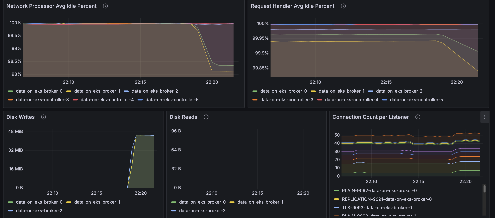

# Kafka on EKS - Infrastructure Deployment

This guide walks you through deploying a production-ready Apache Kafka cluster on Amazon EKS using Strimzi operator in KRaft mode (ZooKeeper-free).

## Architecture Overview

The deployment provisions a production-ready Apache Kafka cluster on EKS with KRaft mode, eliminating ZooKeeper dependencies while providing high availability, auto-scaling, and comprehensive monitoring.

### Components

| Layer | Components | Purpose |
|-------|------------|---------|
| **AWS Infrastructure** | VPC, EKS v1.31+, EBS gp3 (1000Gi per broker), KMS | Network isolation, managed Kubernetes, persistent storage, encryption |
| **Platform** | Karpenter, ArgoCD, Prometheus Stack, Grafana | Node autoscaling, GitOps deployment, metrics collection, visualization |
| **Kafka Core** | 3 Brokers, 3 Controllers (KRaft), Strimzi Operator v0.47.0 | Message storage, metadata management, Kubernetes-native orchestration |
| **Kafka Add-ons** | Cruise Control, Entity Operator, Kafka Exporter | Partition rebalancing, topic/user management, metrics export |

### Key Components Explained

<details>
<summary><strong>Kafka Brokers</strong></summary>

**Role**: Core data layer handling message storage, replication, and client requests

- Receive and store messages from producers across partitions
- Serve messages to consumers with configurable consistency (acks=all for durability)
- Replicate data across brokers for fault tolerance (replication factor: 3)
- Each broker manages 1000Gi of persistent EBS storage for high-throughput workloads

**Configuration**: 3 replicas, 58Gi memory, 6 vCPU per broker

</details>

<details>
<summary><strong>Kafka Controllers (KRaft)</strong></summary>

**Role**: Cluster metadata management without ZooKeeper

- Maintain cluster state, partition assignments, and topic configurations
- Handle leader election for partitions when brokers fail
- Provide faster metadata operations compared to ZooKeeper-based deployments
- Store metadata in a replicated log across all 3 controllers

**Benefits**: Simplified architecture, faster startup times, improved scalability for large clusters

</details>

<details>
<summary><strong>Strimzi Operator</strong></summary>

**Role**: Kubernetes-native Kafka lifecycle management

- Manages Kafka cluster creation, updates, and rolling restarts via Custom Resource Definitions (CRDs)
- Automates certificate management for TLS encryption
- Handles graceful pod replacements during node failures or upgrades
- Provides declarative configuration through `Kafka`, `KafkaTopic`, and `KafkaUser` resources

**Deployment**: Managed by ArgoCD for GitOps-based operations

</details>

<details>
<summary><strong>Cruise Control</strong></summary>

**Role**: Automated cluster rebalancing and optimization

- Monitors partition distribution across brokers
- Automatically rebalances partitions when brokers are added or removed
- Optimizes for disk usage, network throughput, and CPU utilization
- Provides REST API for on-demand rebalancing operations

**Use Case**: Essential for maintaining cluster balance as data and traffic grow

</details>

<details>
<summary><strong>Entity Operator</strong></summary>

**Role**: Kubernetes-native topic and user management

- **Topic Operator**: Watches `KafkaTopic` CRDs and synchronizes with Kafka cluster
- **User Operator**: Manages `KafkaUser` CRDs for SASL/SCRAM authentication
- Enables GitOps workflows where topics/users are version-controlled YAML files
- Automatically reconciles configuration drift

**Benefit**: Declarative topic management instead of imperative CLI commands

</details>

<details>
<summary><strong>Kafka Exporter</strong></summary>

**Role**: Metrics extraction for monitoring

- Exposes consumer lag, topic, and partition metrics to Prometheus
- Monitors broker health, partition leader status, and under-replicated partitions
- Provides data for alerting on consumer group lag or broker failures
- Integrates with Grafana for real-time dashboards

**Metrics Port**: 9404

</details>

## Prerequisites

- AWS CLI configured
- kubectl installed
- Sufficient AWS quotas for EKS, EC2, and EBS

## Deployment

### 1. Clone the Repository

```bash
git clone https://github.com/awslabs/data-on-eks.git
cd data-on-eks/data-stacks/kafka-on-eks
```

### 2. Review Configuration

The deployment uses minimal configuration in `terraform/data-stack.tfvars`:

```hcl
name = "kafka-on-eks"
region = "us-west-2"
enable_amazon_prometheus = true
```

**Key defaults:**
- **Cluster name**: `kafka-on-eks`
- **Kafka version**: 3.9.0
- **Strimzi version**: 0.47.0
- **Instance type**: r8g.4xlarge (Graviton3 memory-optimized)
- **Storage**: 1000Gi gp3 per broker
- **Replication factor**: 3

### 3. Deploy the Stack

```bash
./deploy.sh
```

This script will:
1. Create VPC and EKS cluster
2. Deploy Karpenter for node autoscaling
3. Install Strimzi operator via ArgoCD
4. Set up Amazon Managed Prometheus workspace
5. Configure kube-prometheus-stack for monitoring

**Deployment time**: ~20-25 minutes

### 4. Verify Deployment

```bash
# Update kubeconfig
aws eks update-kubeconfig --region us-west-2 --name kafka-on-eks

# Check ArgoCD applications
kubectl get applications -n argocd

# Verify Strimzi operator
kubectl get pods -n strimzi-system

# Check Kafka namespace
kubectl get all -n kafka
```

Expected output - all pods should be Running:
```
NAME                                           READY   STATUS
data-on-eks-broker-0                           1/1     Running
data-on-eks-broker-1                           1/1     Running
data-on-eks-broker-2                           1/1     Running
data-on-eks-controller-3                       1/1     Running
data-on-eks-controller-4                       1/1     Running
data-on-eks-controller-5                       1/1     Running
data-on-eks-cruise-control-xxx                 1/1     Running
data-on-eks-entity-operator-xxx                2/2     Running
data-on-eks-kafka-exporter-xxx                 1/1     Running
```

### 5. Verify Kafka Cluster

```bash
# Check Kafka cluster resource
kubectl get kafka -n kafka

# Describe Kafka cluster
kubectl describe kafka data-on-eks -n kafka

# Verify node pools
kubectl get kafkanodepool -n kafka
```

Expected output:
```
NAME         CLUSTER       PARTITIONS   REPLICATION FACTOR   READY
data-on-eks  data-on-eks   -            -                    True
```

## Node Configuration

### Karpenter Node Provisioning

Kafka pods run on **r8g.4xlarge** instances (memory-optimized Graviton3):

- **vCPUs**: 16
- **Memory**: 128 GiB
- **Network**: Up to 12.5 Gbps
- **EBS Bandwidth**: Up to 10 Gbps

Pods are scheduled using nodeAffinity:

```yaml
nodeSelector:
  karpenter.k8s.aws/instance-family: "r8g"
  karpenter.sh/capacity-type: on-demand
```

This allows Kafka to share the memory-optimized nodepool with other data workloads like Trino.

### Verify Node Placement

```bash
# Check Kafka pods and their nodes
kubectl get pods -n kafka -o wide

# Verify instance types
kubectl get nodes -l karpenter.k8s.aws/instance-family=r8g -o custom-columns=NAME:.metadata.name,INSTANCE_TYPE:.metadata.labels.node\\.kubernetes\\.io/instance-type
```

## Testing the Deployment

### 1. Create Kafka CLI Pod

```bash
./helper.sh create-kafka-cli-pod
```

This creates a pod with Kafka CLI tools for testing.

### 2. Create Topics

Apply the example topics:

```bash
kubectl apply -f examples/kafka-topics.yaml
```

Verify topics:

```bash
kubectl get kafkatopic -n kafka
```

Expected output:
```
NAME                CLUSTER       PARTITIONS   REPLICATION FACTOR   READY
my-topic            data-on-eks   12           3                    True
my-topic-reversed   data-on-eks   12           3                    True
```

### 3. Deploy Producer and Consumer

```bash
kubectl apply -f examples/kafka-producers-consumers.yaml
```

This deploys:
- **Producer**: Sends "Hello world" messages to `my-topic`
- **Kafka Streams**: Reverses the text
- **Consumer**: Reads reversed messages from `my-topic-reversed`

### 4. Verify Message Flow

```bash
# Check producer logs
kubectl logs -f deployment/java-kafka-producer -n kafka

# Check consumer logs
kubectl logs -f deployment/java-kafka-consumer -n kafka
```

You should see:
- Producer sending: `"Hello world - 1"`
- Consumer receiving: `"1 - dlrow olleH"`

### 5. Run Performance Tests

Create performance test topic:

```bash
./examples/load-test.sh create-perf-test-topic
```

Run producer performance test:

```bash
./examples/load-test.sh run-producer-perf-test
```

Expected results:
- **Throughput**: 300K-400K records/sec
- **Latency**: ~600-800ms avg

Run consumer performance test:

```bash
./examples/load-test.sh run-consumer-perf-test
```

Expected results:
- **Throughput**: 1M+ messages/sec
- **Fetch rate**: 140+ MB/sec

## Monitoring Setup

### Enable Prometheus Metrics

Apply PodMonitors to enable Prometheus scraping:

```bash
kubectl apply -f ../../data-stacks/kafka-on-eks/monitoring-manifests/
```

This creates:
- **kafka-resources-metrics**: Scrapes broker/controller JMX metrics
- **entity-operator-metrics**: Scrapes topic/user operator metrics
- **cluster-operator-metrics**: Scrapes Strimzi operator metrics

### Verify Metrics Collection

Port-forward to Prometheus:

```bash
kubectl port-forward -n kube-prometheus-stack prometheus-kube-prometheus-stack-prometheus-0 9090:9090
```

Open http://localhost:9090 and search for `kafka_` metrics.

### Access Grafana Dashboards

Port-forward to Grafana:

```bash
kubectl port-forward -n kube-prometheus-stack svc/kube-prometheus-stack-grafana 3000:80
```

Open http://localhost:3000 and navigate to:
- **Strimzi Kafka Dashboard**: Broker metrics, throughput, partition status
- **Strimzi Operators Dashboard**: Operator reconciliation activity
- **Strimzi Exporter Dashboard**: Consumer lag, topic metrics




### Amazon Managed Prometheus

Metrics are automatically forwarded to Amazon Managed Prometheus for long-term storage. Check the AMP workspace:

```bash
aws amp list-workspaces --region us-west-2
```

## Helper Commands

The `helper.sh` script provides convenient shortcuts:

```bash
# Kafka resources
./helper.sh get-kafka-pods              # List all Kafka pods
./helper.sh get-kafka-topics            # List topics (CRDs)
./helper.sh describe-kafka-cluster      # Describe cluster

# Topic management
./helper.sh list-topics-via-cli         # List topics via CLI
./helper.sh describe-topic my-topic     # Describe specific topic

# Monitoring
./helper.sh verify-kafka-producer       # Check producer logs
./helper.sh verify-kafka-consumer       # Check consumer logs
./helper.sh debug-kafka-connectivity    # Debug connection issues

# ArgoCD
./helper.sh get-argocd-apps            # List ArgoCD applications
```

## Configuration Details

### Kafka Cluster Configuration

Key settings in `kafka-cluster.yaml`:

```yaml
spec:
  kafka:
    version: 3.9.0
    replicas: 3
    config:
      offsets.topic.replication.factor: 3
      transaction.state.log.replication.factor: 3
      default.replication.factor: 3
      min.insync.replicas: 2
    resources:
      requests:
        memory: 58Gi
        cpu: "6"
      limits:
        memory: 64Gi
        cpu: "8"
```

### Storage Configuration

Each broker has:
- **Volume size**: 1000Gi
- **Storage class**: gp3
- **IOPS**: 3000 (default)
- **Throughput**: 125 MB/s (default)

<details>
<summary><h2>Storage Considerations When Self-Managing Kafka</h2></summary>

The most common resource bottlenecks for Kafka clusters are network throughput, storage throughput, and network throughput between brokers and the storage backend for brokers using network attached storage such as [Amazon Elastic Block Store (EBS)](https://aws.amazon.com/ebs/).

### Advantages to Using EBS as Persistent Storage Backend

1. **Improved flexibility and faster recovery**: Fault tolerance is commonly achieved via broker (server) replication within the cluster and/or maintaining cross-AZ or region replicas. Since the lifecycle of EBS volumes is independent of Kafka brokers, if a broker fails and needs to be replaced, the EBS volume attached to the failed broker can be reattached to a replacement broker. Most of the replicated data for the replacement broker is already available in the EBS volume, and does not need to be copied over the network from another broker. This avoids most of the replication traffic required to bring the replacement broker up to speed with current operations.

2. **Just in time scale up**: The characteristics of EBS volumes can be modified while they're in use. Broker storage can be automatically scaled over time rather than provisioning storage for peak or adding additional brokers.

3. **Optimized for frequently-accessed-throughput-intensive workloads**: Volume types such as st1 can be a good fit since these volumes are offered at a relatively low cost, support a large 1 MiB I/O block size, max IOPS of 500/volume, and includes the ability to burst up to 250 MB/s per TB, with a baseline throughput of 40 MB/s per TB, and a maximum throughput of 500 MB/s per volume.

### What EBS Volumes Should I Use When Self-Managing Kafka on AWS?

- General purpose SSD volume **gp3** with a balanced price and performance are widely used, and you can **independently** provision storage (up to 16TiB), IOPS (up to 16,000) and throughput (up to 1,000MiB/s)
- **st1** is a low-cost HDD option for frequently accessed and throughput intensive workloads with up to 500 IOPS and 500 MiB/s
- For critical applications, provisioned IOPS volumes (**io2 Block Express, io2**) provide higher durability

### What About NVMe SSD Instance Storage for Performance Reasons?

While EBS provides flexibility and ease of management, some high-performance use cases may benefit from using local NVMe SSD instance storage. This approach can offer significant performance improvements but comes with trade-offs in terms of data persistence and operational complexity.

#### Considerations and Challenges with NVMe SSD Instance Storage

1. **Data Persistence**: Local storage is ephemeral. If an instance fails or is terminated, the data on that storage is lost. This requires careful consideration of your replication strategy and disaster recovery plans, especially if the cluster is big (hundreds of TBs of data).

2. **Cluster Upgrades**: Upgrading Kafka or EKS becomes more complex, as you need to ensure data is properly migrated or replicated before making changes to nodes with local storage.

3. **Scaling Complexity**: Scaling the cluster may require data rebalancing, which can be more time-consuming and resource-intensive compared to using network-attached storage.

4. **Instance Type Lock-in**: Your choice of instance types becomes more limited, as you need to select instances with appropriate local storage options.

#### When Should You Consider Using Local Storage?

1. For extremely high-performance requirements where every millisecond of latency matters
2. When your use case can tolerate potential data loss on individual node failures, relying on Kafka's replication for data durability

While local storage can offer performance benefits, it's important to carefully weigh these against the operational challenges, especially in a dynamic environment like EKS. For most use cases, we recommend starting with EBS storage for its flexibility and easier management, and only considering local storage for specific high-performance scenarios where the trade-offs are justified.

</details>

## Troubleshooting

### Pods Not Scheduling

If Kafka pods are stuck in Pending:

```bash
# Check pod events
kubectl describe pod data-on-eks-broker-0 -n kafka

# Verify Karpenter provisioned nodes
kubectl get nodes -l karpenter.k8s.aws/instance-family=r8g
```

### Broker Connection Issues

```bash
# Test connectivity from kafka-cli pod
./helper.sh debug-kafka-connectivity
```

### ArgoCD Application Issues

```bash
# Check application status
kubectl get application strimzi-kafka-operator -n argocd

# View application details
kubectl describe application strimzi-kafka-operator -n argocd
```

## Cleanup

To delete all resources:

```bash
./cleanup.sh
```

This will:
1. Delete Kafka resources
2. Remove EKS cluster
3. Clean up VPC and networking
4. Delete AMP workspace

**Warning**: This is irreversible and will delete all data.

## Additional Resources

- [Strimzi Documentation](https://strimzi.io/documentation/)
- [Apache Kafka Documentation](https://kafka.apache.org/documentation/)
