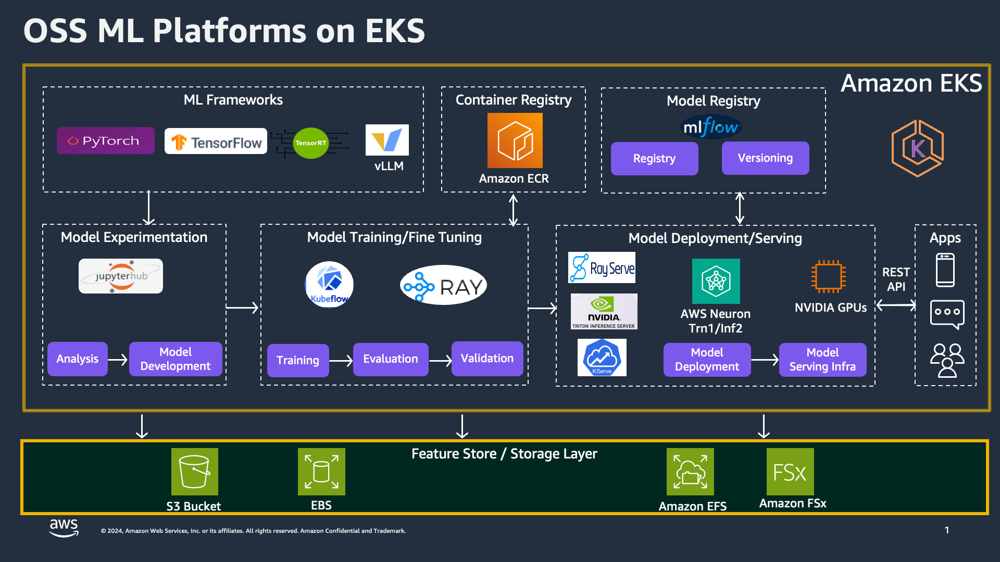

# Generative AI on EKS

:::caution

The **AI on EKS** content **is being migrated** to a new repository.
🔗 👉 [Read the full migration announcement »](https://awslabs.github.io/data-on-eks/docs/migration/migration-announcement)

:::

Welcome to generative AI on [Amazon Elastic Kubernetes Service (EKS)](https://aws.amazon.com/eks/), your gateway to harnessing the power of Large Language Models (LLMs) for a wide range of applications. This introduction page serves as your starting point to explore our offerings for Training, Fine-tuning, and Inference using various LLMs, including BERT-Large, Llama2, Stable Diffusion, and more.

Our platform provides multiple patterns for users to scale their generative AI workloads on EKS using a comprehensive suite of open-source ML tools/frameworks.

Below is the architecture diagram that illustrates the integration of these tools within EKS:

## [Training](https://awslabs.github.io/data-on-eks/docs/category/training-on-eks)
Training in the generative AI world involves teaching a model to understand and generate human-like text by learning from vast amounts of data. This process is crucial as it forms the foundation upon which models like BERT-Large and Llama2 are built, enabling them to perform a wide range of tasks such as text summarization, translation, and more. Effective training ensures that the model can understand complex patterns and generate coherent, contextually appropriate responses.

Our platform supports various ML frameworks including PyTorch, TensorFlow, TensorRT, and vLLM. You can use JupyterHub for interactive and collaborative model development, where you can perform data analysis, build models, and run experiments. The training phase also integrates with Kubeflow and Ray, providing robust solutions for managing complex machine learning workflows, from data preprocessing to training and evaluation.

Are you ready to dive into the world of LLMs and train models for your specific needs? Discover our comprehensive Training resources to get started.

## [Inference](https://awslabs.github.io/data-on-eks/docs/category/inference-on-eks)
Inference is the process of using a trained model to make predictions or generate outputs based on new input data. In the context of generative AI, inference enables models to perform tasks such as text generation, translation, and summarization in real-time. Building a scalable inference platform is essential to handle the high demand and ensure low latency, which is critical for applications requiring real-time responses.

Unlock the potential of LLMs for powerful inference tasks. Our Inference resources will guide you through deploying LLMs effectively. Utilize deployment tools such as RayServe, NVIDIA Triton Inference Server, and KServe to ensure high-performance model serving. We also offer optimization techniques with AWS Neuron for Inferentia and NVIDIA GPUs to accelerate inference. This section includes step-by-step instructions on setting up inference endpoints, scaling deployments to handle varying loads, and monitoring performance to maintain reliability and efficiency.

## Storage and Data Management
Efficient data storage and management are fundamental to successful AI/ML operations. Our platform integrates with AWS storage solutions such as S3, EBS, EFS, and FSx to ensure scalable and reliable data handling. Utilize MLflow for model registry and versioning, and manage container images with Amazon ECR. This ensures a seamless workflow from model development to deployment, with robust data management practices to support your ML lifecycle.

Whether you're an experienced practitioner or new to the field, our generative AI on EKS capabilities empower you to harness the latest advancements in language modeling. Dive into each section to begin your journey, and explore how you can leverage these tools and frameworks to build, fine-tune, and deploy powerful AI models on Amazon EKS.
