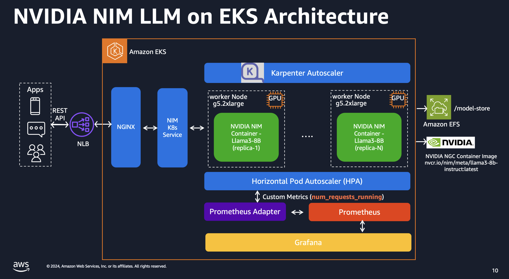
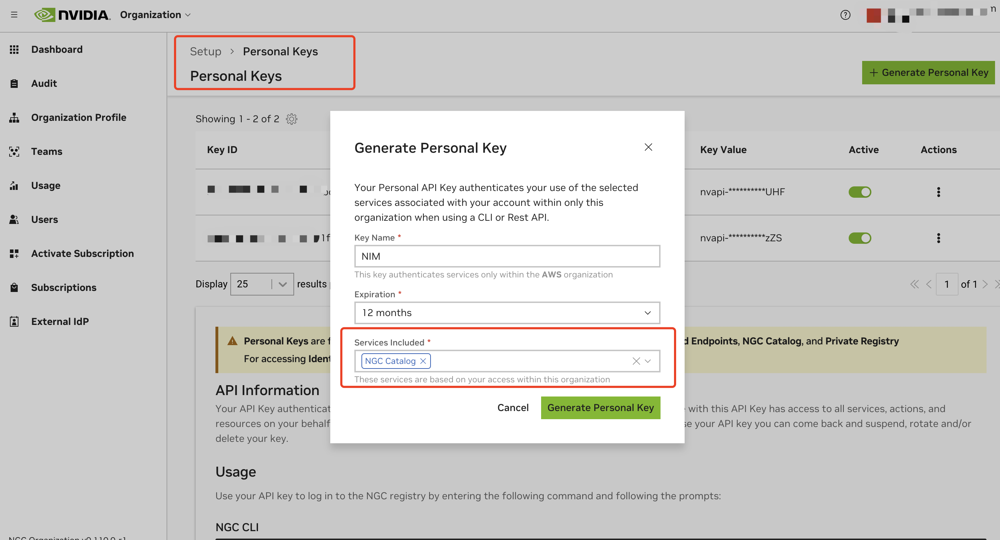
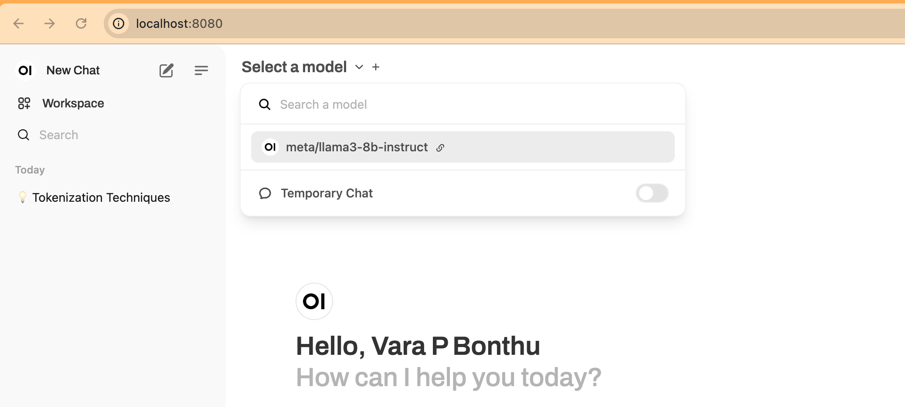
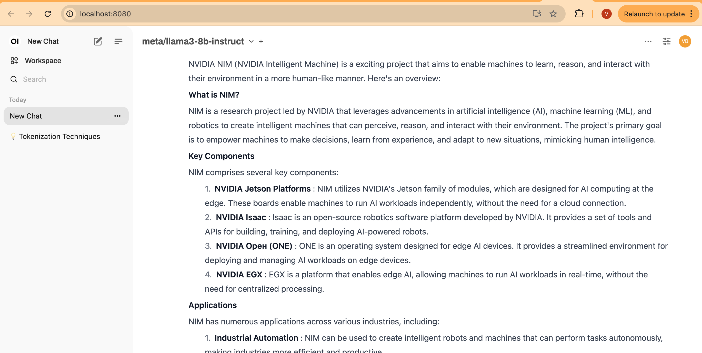
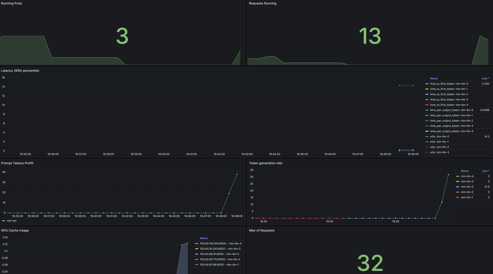
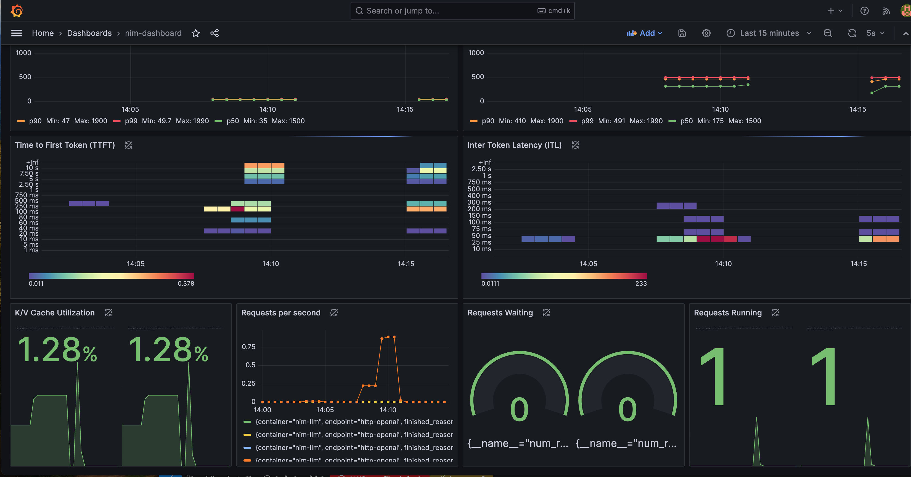

import CollapsibleContent from '../../../../src/components/CollapsibleContent';

:::caution

The **AI on EKS** content **is being migrated** to a new repository.
🔗 👉 [Read the full migration announcement »](https://awslabs.github.io/data-on-eks/docs/migration/migration-announcement)

:::

:::warning
Deployment of ML models on EKS requires access to GPUs or Neuron instances. If your deployment isn't working, it’s often due to missing access to these resources. Also, some deployment patterns rely on Karpenter autoscaling and static node groups; if nodes aren't initializing, check the logs for Karpenter or Node groups to resolve the issue.
:::

:::warning

Note: Before implementing NVIDIA NIM, please be aware it is part of [NVIDIA AI Enterprise](https://www.nvidia.com/en-us/data-center/products/ai-enterprise/), which may introduce potential cost and licensing for production use.

For evaluation, NVIDIA also offers a free evaluation license to try NVIDIA AI Enterprise for 90 days, and you can [register](https://enterpriseproductregistration.nvidia.com/?LicType=EVAL&ProductFamily=NVAIEnterprise) it with your corporate email.
:::

:::info

We are actively enhancing this blueprint to incorporate improvements in observability, logging, and scalability aspects.
:::

# NVIDIA NIM LLM Deployment on Amazon EKS

## What is NVIDIA NIM?

NVIDIA NIM makes it easy for IT and DevOps teams to self-host large language models (LLMs) in their own managed environments while still providing developers with industry standard APIs that allow them to build powerful copilots, chatbots, and AI assistants that can transform their business. Leveraging NVIDIA’s cutting-edge GPU acceleration and scalable deployment, NIM offers the fastest path to inference with unparalleled performance.

## Why NIM?

NIM abstracts away model inference internals such as execution engine and runtime operations. They are also the most performant option available whether it be with TRT-LLM, vLLM or others.

NIMs are packaged as container images on a per model/model family basis. Each NIM container is with a model, such as `meta/llama3-8b-instruct`. These containers include a runtime that runs on any NVIDIA GPU with sufficient GPU memory, but some model/GPU combinations are optimized. NIM automatically downloads the model from NVIDIA NGC Catalog, leveraging a local filesystem cache if available.

## Overview of this deployment pattern on Amazon EKS

This pattern combines the capabilities of NVIDIA NIM, Amazon Elastic Kubernetes Service (EKS), and various AWS services to deliver a high-performance and cost-optimized model serving infrastructure.

1. NVIDIA NIM Container Images: NVIDIA NIM provides a streamlined approach to hosting LLM models like Llama3 within containerized environments. This allows customers to leverage their private models while ensuring seamless integration with existing infrastructure. We will bring detailed setup steps to NIM deployments.

2. Karpenter for Instance-Level Scaling: Karpenter, an open-source node provisioning project, enables rapid and efficient scaling of Amazon EKS clusters at the instance level. This ensures that the model serving infrastructure can adapt to dynamic workload demands, optimizing resource utilization and cost-effectiveness.

3. Spot instances: Considering LLMs are stateless, customers can leverage spot instances to significantly reduce costs.

4. Amazon Elastic File System (EFS): Amazon EFS provides scalable, elastic file storage for use with Amazon EKS. It allows multiple pods to access the same file system concurrently, making it ideal for storing and sharing model artifacts, datasets, and other persistent data across the cluster. EFS automatically grows and shrinks as you add and remove files, eliminating the need for capacity planning and management.

5. Terraform with EKS Blueprints: To streamline the deployment and management of this solution, we leverage Terraform and EKS Blueprints. This infrastructure-as-code approach enables automated provisioning of the entire stack, ensuring consistency, reproducibility, and efficient resource management.

By combining these components, our proposed solution delivers a powerful and cost-effective model serving infrastructure tailored for large language models. With NVIDIA NIM's seamless integration, Amazon EKS's scalability with Karpenter, customers can achieve high performance while minimizing infrastructure costs.



## Deploying the Solution

### Prerequisites

Before getting started with NVIDIA NIM, ensure you have the following:

<details>
<summary>Click to expand the NVIDIA NIM account setup details</summary>

**NVIDIA AI Enterprise Account**

- Register for an NVIDIA AI Enterprise account. If you don't have one, you can sign up for a trial account using this [link](https://enterpriseproductregistration.nvidia.com/?LicType=EVAL&ProductFamily=NVAIEnterprise).

**NGC API Key**

1. Log in to your NVIDIA AI Enterprise account
2. Navigate to the NGC (NVIDIA GPU Cloud) [portal](https://org.ngc.nvidia.com/)
3. Generate a personal API key:
    - Go to your account settings or navigate directly to: https://org.ngc.nvidia.com/setup/personal-keys
    - Click on "Generate Personal Key"
    - Ensure that at least "NGC Catalog" is selected from the "Services Included" dropdown
    - Copy and securely store your API key, the key should have a prefix with `nvapi-`

    

**Validate NGC API Key and Test Image Pull**

To ensure your API key is valid and working correctly:
1. Set up your NGC API key as an environment variable:
```bash
export NGC_API_KEY=<your_api_key_here>
```

2. Authenticate Docker with the NVIDIA Container Registry:

```bash
echo "$NGC_API_KEY" | docker login nvcr.io --username '$oauthtoken' --password-stdin
```

3. Test pulling an image from NGC:
```bash
docker pull nvcr.io/nim/meta/llama3-8b-instruct:latest
```
You do not have to wait for it to complete, just to make sure the API key is valid to pull the image.
</details>

The following are required to run this tutorial
- An active AWS account with admin equivalent permissions
- [aws cli](https://docs.aws.amazon.com/cli/latest/userguide/install-cliv2.html)
- [kubectl](https://Kubernetes.io/docs/tasks/tools/)
- [Terraform](https://developer.hashicorp.com/terraform/tutorials/aws-get-started/install-cli)

### Deploy

Clone the repository

```bash
git clone https://github.com/awslabs/data-on-eks.git
```

**1. Configure the NGC API Key**

Retrieve your NGC API key from [NVIDIA](https://docs.nvidia.com/ai-enterprise/deployment-guide-spark-rapids-accelerator/0.1.0/appendix-ngc.html) and set it as an environment variable:

```bash
export TF_VAR_ngc_api_key=<replace-with-your-NGC-API-KEY>
```

**2. Installation**

Important Note: Ensure that you update the region in the variables.tf file before deploying the blueprint. Additionally, confirm that your local region setting matches the specified region to prevent any discrepancies. For example, set your `export AWS_DEFAULT_REGION="<REGION>"` to the desired region:

Run the installation script:

:::info


This pattern deploys a model called `nvcr.io/nim/meta/llama3-8b-instruct`. You can modify the `nim_models` variable in the `variables.tf` file to add more models. Multiple models can be deployed simultaneously using this pattern.
:::

:::caution

Ensure you have specified enough GPUs for each model before enabling additional models through these variables. Also, verify that your AWS account has access to sufficient GPUs.
This pattern uses Karpenter to scale GPU nodes, restricted to G5 instances by default. You can modify the Karpenter node pool to include other instances like p4 and p5 if needed.

:::


```bash
cd data-on-eks/ai-ml/nvidia-triton-server
export TF_VAR_enable_nvidia_nim=true
export TF_VAR_enable_nvidia_triton_server=false
./install.sh
```

This process will take approximately 20 minutes to complete.

**3. Verify the Installation**

Once the installation finishes, you may find the configure_kubectl command from the output. Run the following to configure EKS cluster access

```bash
# Creates k8s config file to authenticate with EKS
aws eks --region us-west-2 update-kubeconfig --name nvidia-triton-server
```

Check the status of your pods deployed

```bash
kubectl get all -n nim
```

You should see output similar to the following:
<details>
<summary>Click to expand the deployment details</summary>

```text
NAME                               READY   STATUS    RESTARTS   AGE
pod/nim-llm-llama3-8b-instruct-0   1/1     Running   0          4h2m

NAME                                     TYPE        CLUSTER-IP     EXTERNAL-IP   PORT(S)    AGE
service/nim-llm-llama3-8b-instruct       ClusterIP   172.20.5.230   <none>        8000/TCP   4h2m
service/nim-llm-llama3-8b-instruct-sts   ClusterIP   None           <none>        8000/TCP   4h2m

NAME                                          READY   AGE
statefulset.apps/nim-llm-llama3-8b-instruct   1/1     4h2m

NAME                                                             REFERENCE                                TARGETS   MINPODS   MAXPODS   REPLICAS   AGE
horizontalpodautoscaler.autoscaling/nim-llm-llama3-8b-instruct   StatefulSet/nim-llm-llama3-8b-instruct   2/5       1         5         1          4h2m
```
</details>

The `llama3-8b-instruct` model is deployed with a StatefulSet in `nim` namespace. As it is running, Karpenter provisioned a GPU
Check the Karpenter provisioned node.

```bash
kubectl get node -l type=karpenter -L node.kubernetes.io/instance-type
```

```text
NAME                                         STATUS   ROLES    AGE     VERSION               INSTANCE-TYPE
ip-100-64-77-39.us-west-2.compute.internal   Ready    <none>   4m46s   v1.30.0-eks-036c24b   g5.2xlarge
```

**4. Verify the deployed model**

Once all pods in `nim` namespace is ready with `1/1` status, use below command to verify it's ready to serve the traffic. To verify, expose the model serving service with port-forward using kubectl.

```bash
kubectl port-forward -n nim service/nim-llm-llama3-8b-instruct 8000
```

Then you can invoke the deployed model with a simple HTTP request with curl command.

```bash
curl -X 'POST' \
  "http://localhost:8000/v1/completions" \
  -H 'accept: application/json' \
  -H 'Content-Type: application/json' \
  -d '{
      "model": "meta/llama3-8b-instruct",
      "prompt": "Once upon a time",
      "max_tokens": 64
      }'
```

you will see similar output like the following

```json
{
  "id": "cmpl-63a0b66aeda1440c8b6ca1ce3583b173",
  "object": "text_completion",
  "created": 1719742336,
  "model": "meta/llama3-8b-instruct",
  "choices": [
    {
      "index": 0,
      "text": ", there was a young man named Jack who lived in a small village at the foot of a vast and ancient forest. Jack was a curious and adventurous soul, always eager to explore the world beyond his village. One day, he decided to venture into the forest, hoping to discover its secrets.\nAs he wandered deeper into",
      "logprobs": null,
      "finish_reason": "length",
      "stop_reason": null
    }
  ],
  "usage": {
    "prompt_tokens": 5,
    "total_tokens": 69,
    "completion_tokens": 64
  }
}
```

### Testing the Llama3 model deployed with NIM
It's time to test the Llama3 just deployed. First setup a simple environment for the testing.

```bash
cd data-on-eks/gen-ai/inference/nvidia-nim/nim-client
python3 -m venv .venv
source .venv/bin/activate
pip install openai
```

We have prepared some prompts in prompts.txt , it contains 20 prompts. You can run following commands with the prompts to verify the generated outputs.

```bash
python3 client.py --input-prompts prompts.txt --results-file results.txt
```

You will see an output something like below:

```text
Loading inputs from `prompts.txt`...
Model meta/llama3-8b-instruct - Request 14: 4.68s (4678.46ms)
Model meta/llama3-8b-instruct - Request 10: 6.43s (6434.32ms)
Model meta/llama3-8b-instruct - Request 3: 7.82s (7824.33ms)
Model meta/llama3-8b-instruct - Request 1: 8.54s (8540.69ms)
Model meta/llama3-8b-instruct - Request 5: 8.81s (8807.52ms)
Model meta/llama3-8b-instruct - Request 12: 8.95s (8945.85ms)
Model meta/llama3-8b-instruct - Request 18: 9.77s (9774.75ms)
Model meta/llama3-8b-instruct - Request 16: 9.99s (9994.51ms)
Model meta/llama3-8b-instruct - Request 6: 10.26s (10263.60ms)
Model meta/llama3-8b-instruct - Request 0: 10.27s (10274.35ms)
Model meta/llama3-8b-instruct - Request 4: 10.65s (10654.39ms)
Model meta/llama3-8b-instruct - Request 17: 10.75s (10746.08ms)
Model meta/llama3-8b-instruct - Request 11: 10.86s (10859.91ms)
Model meta/llama3-8b-instruct - Request 15: 10.86s (10857.15ms)
Model meta/llama3-8b-instruct - Request 8: 11.07s (11068.78ms)
Model meta/llama3-8b-instruct - Request 2: 12.11s (12105.07ms)
Model meta/llama3-8b-instruct - Request 19: 12.64s (12636.42ms)
Model meta/llama3-8b-instruct - Request 9: 13.37s (13370.75ms)
Model meta/llama3-8b-instruct - Request 13: 13.57s (13571.28ms)
Model meta/llama3-8b-instruct - Request 7: 14.90s (14901.51ms)
Storing results into `results.txt`...
Accumulated time for all requests: 206.31 seconds (206309.73 milliseconds)
PASS: NVIDIA NIM example
Actual execution time used with concurrency 20 is: 14.92 seconds (14.92 milliseconds)
```

Output for `results.txt` should look like the following

<details>
<summary>Click to expand the partial output</summary>

```text
The key differences between traditional machine learning models and very large language models (vLLM) are:

1. **Scale**: vLLMs are massive, with billions of parameters, whereas traditional models typically have millions.
2. **Training data**: vLLMs are trained on vast amounts of text data, often sourced from the internet, whereas traditional models are trained on smaller, curated datasets.
3. **Architecture**: vLLMs often use transformer architectures, which are designed for sequential data like text, whereas traditional models may use feedforward networks or recurrent neural networks.
4. **Training objectives**: vLLMs are often trained using masked language modeling or next sentence prediction tasks, whereas traditional models may use classification, regression, or clustering objectives.
5. **Evaluation metrics**: vLLMs are typically evaluated using metrics like perplexity, accuracy, or fluency, whereas traditional models may use metrics like accuracy, precision, or recall.
6. **Interpretability**: vLLMs are often less interpretable due to their massive size and complex architecture, whereas traditional models may be more interpretable due to their smaller size and simpler architecture.

These differences enable vLLMs to excel in tasks like language translation, text generation, and conversational AI, whereas traditional models are better suited for tasks like image classification or regression.

=========

TensorRT (Triton Runtime) optimizes LLM (Large Language Model) inference on NVIDIA hardware by:

1. **Model Pruning**: Removing unnecessary weights and connections to reduce model size and computational requirements.
2. **Quantization**: Converting floating-point models to lower-precision integer formats (e.g., INT8) to reduce memory bandwidth and improve performance.
3. **Kernel Fusion**: Combining multiple kernel launches into a single launch to reduce overhead and improve parallelism.
4. **Optimized Tensor Cores**: Utilizing NVIDIA's Tensor Cores for matrix multiplication, which provides significant performance boosts.
5. **Batching**: Processing multiple input batches concurrently to improve throughput.
6. **Mixed Precision**: Using a combination of floating-point and integer precision to balance accuracy and performance.
7. **Graph Optimization**: Reordering and reorganizing the computation graph to minimize memory access and optimize data transfer.

By applying these optimizations, TensorRT can significantly accelerate LLM inference on NVIDIA hardware, achieving faster inference times and improved performance.

=========
```
</details>

## Open WebUI Deployment

:::info

[Open WebUI](https://github.com/open-webui/open-webui) is compatible only with models that work with the OpenAI API server and Ollama.

:::

**1. Deploy the WebUI**

Deploy the [Open WebUI](https://github.com/open-webui/open-webui) by running the following command:

```sh
kubectl apply -f data-on-eks/gen-ai/inference/nvidia-nim/openai-webui-deployment.yaml
```

**2. Port Forward to Access WebUI**

Use kubectl port-forward to access the WebUI locally:

```sh
kubectl port-forward svc/open-webui 8081:80 -n openai-webui
```

**3. Access the WebUI**

Open your browser and go to http://localhost:8081

**4. Sign Up**

Sign up using your name, email, and a dummy password.

**5. Start a New Chat**

Click on New Chat and select the model from the dropdown menu, as shown in the screenshot below:



**6. Enter Test Prompt**

Enter your prompt, and you will see the streaming results, as shown below:



## Performance Testing with NVIDIA GenAI-Perf Tool

[GenAI-Perf](https://docs.nvidia.com/deeplearning/triton-inference-server/user-guide/docs/client/src/c%2B%2B/perf_analyzer/genai-perf/README.html) is a command line tool for measuring the throughput and latency of generative AI models as served through an inference server.

GenAI-Perf can be used as standard tool to benchmark with other models deployed with inference server. But this tool requires a GPU. To make it easier, we provide you a pre-configured manifest `genaiperf-deploy.yaml` to run the tool.

```bash
cd data-on-eks/gen-ai/inference/nvidia-nim
kubectl apply -f genaiperf-deploy.yaml
```

Once the pod is ready with running status `1/1`, can execute into the pod.

```bash
export POD_NAME=$(kubectl get po -l app=tritonserver -ojsonpath='{.items[0].metadata.name}')
kubectl exec -it $POD_NAME -- bash
```

Run the testing to the deployed NIM Llama3 model

```bash
genai-perf \
  -m meta/llama3-8b-instruct \
  --service-kind openai \
  --endpoint v1/completions \
  --endpoint-type completions \
  --num-prompts 100 \
  --random-seed 123 \
  --synthetic-input-tokens-mean 200 \
  --synthetic-input-tokens-stddev 0 \
  --output-tokens-mean 100 \
  --output-tokens-stddev 0 \
  --tokenizer hf-internal-testing/llama-tokenizer \
  --concurrency 10 \
  --measurement-interval 4000 \
  --profile-export-file my_profile_export.json \
  --url nim-llm-llama3-8b-instruct.nim:8000
```

You should see similar output like the following

```bash
2024-07-11 03:32 [INFO] genai_perf.parser:166 - Model name 'meta/llama3-8b-instruct' cannot be used to create artifact directory. Instead, 'meta_llama3-8b-instruct' will be used.
2024-07-11 03:32 [INFO] genai_perf.wrapper:137 - Running Perf Analyzer : 'perf_analyzer -m meta/llama3-8b-instruct --async --input-data artifacts/meta_llama3-8b-instruct-openai-completions-concurrency10/llm_inputs.json --endpoint v1/completions --service-kind openai -u nim-llm.nim:8000 --measurement-interval 4000 --stability-percentage 999 --profile-export-file artifacts/meta_llama3-8b-instruct-openai-completions-concurrency10/my_profile_export.json -i http --concurrency-range 10'
                                                      LLM Metrics
┏━━━━━━━━━━━━━━━━━━━━━━┳━━━━━━━━━━━━━━━┳━━━━━━━━━━━━━━━┳━━━━━━━━━━━━━━━┳━━━━━━━━━━━━━━━┳━━━━━━━━━━━━━━━┳━━━━━━━━━━━━━━━┓
┃            Statistic ┃           avg ┃           min ┃           max ┃           p99 ┃           p90 ┃           p75 ┃
┡━━━━━━━━━━━━━━━━━━━━━━╇━━━━━━━━━━━━━━━╇━━━━━━━━━━━━━━━╇━━━━━━━━━━━━━━━╇━━━━━━━━━━━━━━━╇━━━━━━━━━━━━━━━╇━━━━━━━━━━━━━━━┩
│ Request latency (ns) │ 3,934,624,446 │ 3,897,758,114 │ 3,936,987,882 │ 3,936,860,185 │ 3,936,429,317 │ 3,936,333,682 │
│     Num output token │           112 │           105 │           119 │           119 │           117 │           115 │
│      Num input token │           200 │           200 │           200 │           200 │           200 │           200 │
└──────────────────────┴───────────────┴───────────────┴───────────────┴───────────────┴───────────────┴───────────────┘
Output token throughput (per sec): 284.64
Request throughput (per sec): 2.54
```
You should be able to see the [metrics](https://docs.nvidia.com/deeplearning/triton-inference-server/user-guide/docs/client/src/c%2B%2B/perf_analyzer/genai-perf/README.html#metrics) that genai-perf collects, including Request latency, Out token throughput, Request throughput.

To understand the command line options, please refer to [this documentation](https://docs.nvidia.com/deeplearning/triton-inference-server/user-guide/docs/client/src/c%2B%2B/perf_analyzer/genai-perf/README.html#command-line-options).

## Observability

As part of this blueprint, we have also deployed the Kube Prometheus stack, which provides Prometheus server and Grafana deployments for monitoring and observability.

First, let's verify the services deployed by the Kube Prometheus stack:

```bash
kubectl get svc -n monitoring
```

You should see output similar to this:

```text
NAME                                             TYPE        CLUSTER-IP       EXTERNAL-IP   PORT(S)             AGE
kube-prometheus-stack-grafana                    ClusterIP   172.20.225.77    <none>        80/TCP              10m
kube-prometheus-stack-kube-state-metrics         ClusterIP   172.20.237.248   <none>        8080/TCP            10m
kube-prometheus-stack-operator                   ClusterIP   172.20.118.163   <none>        443/TCP             10m
kube-prometheus-stack-prometheus                 ClusterIP   172.20.132.214   <none>        9090/TCP,8080/TCP   10m
kube-prometheus-stack-prometheus-node-exporter   ClusterIP   172.20.213.178   <none>        9100/TCP            10m
prometheus-adapter                               ClusterIP   172.20.171.163   <none>        443/TCP             10m
prometheus-operated                              ClusterIP   None             <none>        9090/TCP            10m
```

The NVIDIA NIM LLM service expose metrics via `/metrics` endpoint from `nim-llm-llama3-8b-instruct` service at port `8000`. Verify it by running

```bash
kubectl get svc -n nim
kubectl port-forward -n nim svc/nim-llm-llama3-8b-instruct 8000

curl localhost:8000/metrics # run this in another terminal
```

### Grafana Dashboard

We provides a pre-configured Grafana dashboard to better visualize NIM status. In the Grafana dashboard below, it contains several important metrics:

- **Time to First Token (TTFT)**: The latency between the initial inference request to the model and the return of the first token.
- **Inter-Token Latency (ITL)**: The latency between each token after the first.
- **Total Throughput**: The total number of tokens generated per second by the NIM.

You can find more metrics description from this [document](https://docs.nvidia.com/nim/large-language-models/latest/observability.html).



You can monitor metrics such as Time-to-First-Token, Inter-Token-Latency, KV Cache Utilization metrics.



To view the Grafana dashboard to monitor these metrics, follow the steps below:

<details>
<summary>Click to expand details</summary>

**1. Retrieve the Grafana password.**

The password is saved in the AWS Secret Manager. Below Terraform command will show you the secret name.

```bash
terraform output grafana_secret_name
```

Then use the output secret name to run below command,

```bash
aws secretsmanager get-secret-value --secret-id <grafana_secret_name_output> --region $AWS_REGION --query "SecretString" --output text
```

**2. Expose the Grafana Service**

Use port-forward to expose the Grafana service.

```bash
kubectl port-forward svc/kube-prometheus-stack-grafana 3000:80 -n monitoring
```

**3. Login to Grafana:**

- Open your web browser and navigate to [http://localhost:3000](http://localhost:3000).
- Login with the username `admin` and the password retrieved from AWS Secrets Manager.

**4. Open the NIM Monitoring Dashboard:**

- Once logged in, click "Dashboards" on the left sidebar and search "nim"
- You can find the Dashboard `NVIDIA NIM Monitoring` from the list
- Click and entering to the dashboard.

You should now see the metrics displayed on the Grafana dashboard, allowing you to monitor the performance your NVIDIA NIM service deployment.
</details>

:::info
As of writing this guide, NVIDIA also provides an example Grafana dashboard. You can check it from [here](https://docs.nvidia.com/nim/large-language-models/latest/observability.html#grafana).
:::

## Cleanup

To remove all resources created by this deployment, run:

```bash
./cleanup.sh
```
