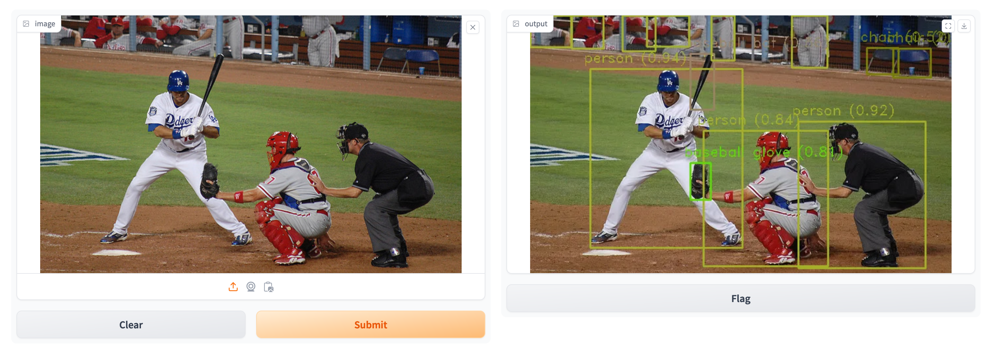
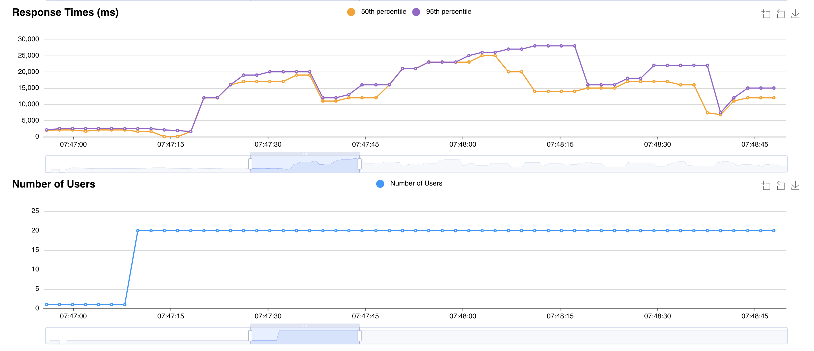
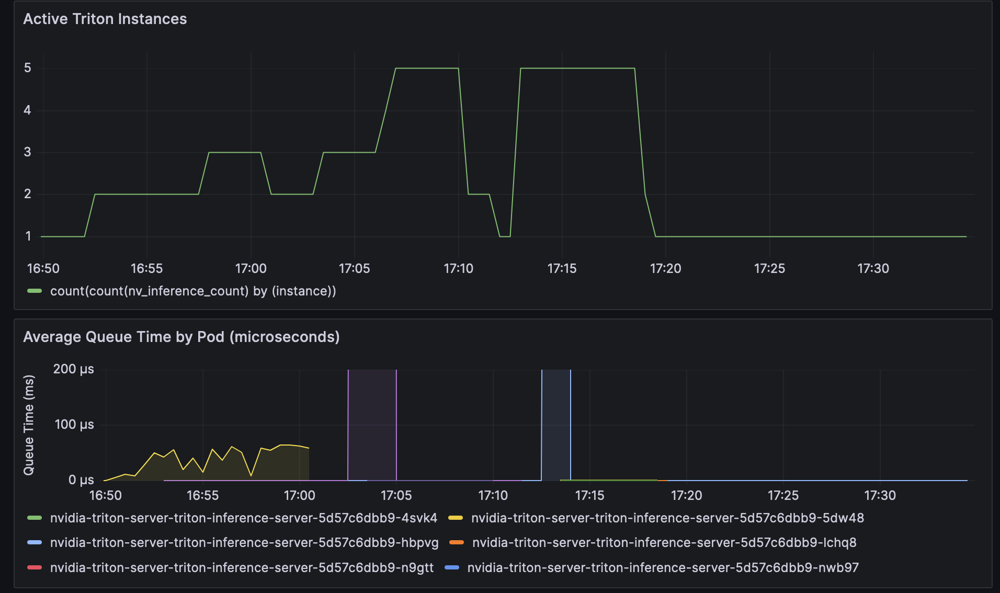
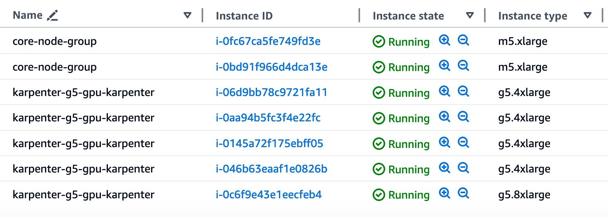

import CollapsibleContent from '../../../../src/components/CollapsibleContent';

# Deploying YOLOv8 with NVIDIA Triton Inference Server 
This pattern demonstrates how to deploy [YOLO](https://github.com/ultralytics/ultralytics) on Amazon EKS, using [NVIDIA Triton Inference Server](https://developer.nvidia.com/triton-inference-server).

YOLO (You Only Look Once), is an object detection and image segmentation model. It is capable of for object detection and tracking, instance segmentation, image classification and pose estimation. Please see [Ultralytics' official website](https://docs.ultralytics.com) for further details, history and licensing.

NVIDIA Triton Inference Server is an open source inference serving software that streamlines AI inferencing. Triton enables teams to deploy any AI model from multiple deep learning and machine learning frameworks, such as TensorRT, TensorFlow, and PyTorch to name a few. Triton supports inference on NVIDIA GPUs, x86 and ARM CPU, or AWS Inferentia. It delivers optimized performance for many query types, including real time, batched, ensembles and audio/video streaming.

<CollapsibleContent header={<h2><span>Prerequisites</span></h2>}>
Before we begin, ensure you have all the prerequisites in place. Ensure that you have installed the following tools on your machine:

1. [aws cli](https://docs.aws.amazon.com/cli/latest/userguide/install-cliv2.html)
2. [kubectl](https://Kubernetes.io/docs/tasks/tools/)
3. [terraform](https://learn.hashicorp.com/tutorials/terraform/install-cli)

First of all, clone the repository:

```bash
git clone https://github.com/awslabs/data-on-eks.git
```

Before deploying the model on Triton, it must be exported to the ONNX format. ONNX (Open Neural Network Exchange) is a format that allows models to be transferred between different deep learning frameworks.

Open a shell window and run the following commands (if not installed on your machine yet, please first run `pip install virtualenv`):

```shell
cd data-on-eks/gen-ai/inference/nvidia-triton-server-gpu/yolo/model_repository/yolo/1
export YOLO_MODEL_DIR=${PWD}
mkdir -p /tmp/yolo_model
cd /tmp/yolo_model
python3 -m venv .venv
source .venv/bin/activate
pip install ultralytics
python3 <<EOF
from ultralytics import YOLO
model = YOLO("yolov8n.pt")
onnx_file = model.export(format="onnx", dynamic=True)
EOF
deactivate
mv yolov8n.onnx $YOLO_MODEL_DIR/model.onnx
cd $YOLO_MODEL_DIR
rm -rf /tmp/yolo_model
```

</CollapsibleContent>

## Deploy

Update the region in the `variables.tf` file and confirm that your local region setting matches the specified region to prevent any discrepancies.
For example, set your `export AWS_DEFAULT_REGION="<REGION>"` and `export AWS_REGION="<REGION>"` to the desired region.

In the same file, set `nvidia_triton_server`'s default value to:

```json
default = {
    enable = true
    repository: "nvcr.io/nvidia/tritonserver"
    tag: "23.09-py3"
    model_repository_path = "../../gen-ai/inference/nvidia-triton-server-gpu/yolo/model_repository"
    triton_model = "triton-yolo"
    enable_huggingface_token = false
}
```

We are now ready to deploy the pattern:

```bash
cd data-on-eks/ai-ml/nvidia-triton-server && chmod +x install.sh
./install.sh
```

## Verify

To verify that the Triton Inference Server has been deployed successfully, run the following command:

```bash
kubectl get all -n triton-yolo
```

Expected output:

```bash
NAME                                                               READY   STATUS    RESTARTS   AGE
pod/nvidia-triton-server-triton-inference-server-d646c8846-g6dw8   1/1     Running   0          7m34s

NAME                                                           TYPE        CLUSTER-IP      EXTERNAL-IP   PORT(S)                      AGE
service/nvidia-triton-server-triton-inference-server           ClusterIP   172.20.116.75   <none>        8000/TCP,8001/TCP,8002/TCP   7m36s
service/nvidia-triton-server-triton-inference-server-metrics   ClusterIP   172.20.166.52   <none>        8080/TCP                     7m36s

NAME                                                           READY   UP-TO-DATE   AVAILABLE   AGE
deployment.apps/nvidia-triton-server-triton-inference-server   1/1     1            1           7m35s

NAME                                                                     DESIRED   CURRENT   READY   AGE
replicaset.apps/nvidia-triton-server-triton-inference-server-d646c8846   1         1         1       7m35s

NAME                                                                               REFERENCE                                                 TARGETS   MINPODS   MAXPODS   REPLICAS   AGE
horizontalpodautoscaler.autoscaling/nvidia-triton-server-triton-inference-server   Deployment/nvidia-triton-server-triton-inference-server   0/10      1         5         1          7m36s
```

## Test

First, download a set of images to your preferred location, e.g. from the [COCO (Common Objects in Context) dataset](https://cocodataset.org/#download).

Then, port-forward the NVIDIA Triton inference service to your local machine:

```shell
kubectl -n triton-yolo port-forward svc/nvidia-triton-server-triton-inference-server 8000:8000
```

Then we can run the client script, to submit your downloaded pictures (remember to replace `<<YOUR DOWNLOADED IMAGES FOLDER>>` with the actual location):

```shell
cd data-on-eks/gen-ai/inference/nvidia-triton-server-gpu/yolo/triton-client
python3 -m venv .venv
source .venv/bin/activate
python3 -m pip install -r requirements.txt
python3 triton-client.py <<YOUR DOWNLOADED IMAGES FOLDER>>
```

From the log, you will be able to see a series of statistics, similar to the following (please refer to [NVIDIA Triton's Statistics Extension documentation](https://github.com/triton-inference-server/server/blob/main/docs/protocol/extension_statistics.md#statistics-response-json-object) for detailed description):

```shell
inference time: 2745.272 ms
{
   "model_stats":[
      {
         "name":"yolo",
         "version":"1",
         "last_inference":1725372527505,
         "inference_count":34,
         "execution_count":34,
         "inference_stats":{
            "success":{
               "count":34,
               "ns":3567555957
            },
            "fail":{
               "count":0,
               "ns":0
            },
            "queue":{
               "count":34,
               "ns":5060840
            },
            "compute_input":{
               "count":34,
               "ns":18735127
            },
            "compute_infer":{
               "count":34,
               "ns":3527724998
            },
            "compute_output":{
               "count":34,
               "ns":13853960
            },
            "cache_hit":{
               "count":0,
               "ns":0
            },
            "cache_miss":{
               "count":0,
               "ns":0
            }
         },
         "batch_stats":[
            {
               "batch_size":1,
               "compute_input":{
                  "count":34,
                  "ns":18735127
               },
               "compute_infer":{
                  "count":34,
                  "ns":3527724998
               },
               "compute_output":{
                  "count":34,
                  "ns":13853960
               }
            }
         ],
         "memory_usage":[
            
         ]
      }
   ]
}
```

Images with inferred detections are saved into the same folder, under the newly created subfolder named `results`.

You can also try inference with the [Gradio](https://www.gradio.app/) client:

```shell
python3 gradio_ui.py
```

You can navigate to `http://127.0.0.1:7860`, submit an image via the UI, and inspect the result:



## Observability

This pattern also deploys the Kube Prometheus stack, which includes Prometheus a Grafana services.

Let's verify the services in place:

```bash
kubectl get svc -n monitoring
```

Expected output:

```bash
NAME                                             TYPE        CLUSTER-IP       EXTERNAL-IP   PORT(S)             AGE
kube-prometheus-stack-grafana                    ClusterIP   172.20.91.157    <none>        80/TCP              4h
kube-prometheus-stack-kube-state-metrics         ClusterIP   172.20.191.248   <none>        8080/TCP            4h
kube-prometheus-stack-operator                   ClusterIP   172.20.129.71    <none>        443/TCP             4h
kube-prometheus-stack-prometheus                 ClusterIP   172.20.3.2       <none>        9090/TCP,8080/TCP   4h
kube-prometheus-stack-prometheus-node-exporter   ClusterIP   172.20.170.232   <none>        9100/TCP            4h
prometheus-adapter                               ClusterIP   172.20.152.7     <none>        443/TCP             4h
prometheus-operated                              ClusterIP   None             <none>        9090/TCP            4h
```

To expose Grafana locally, we need to run:

```bash
kubectl port-forward svc/kube-prometheus-stack-grafana 8080:80 -n monitoring 
```

To access it, use the `admin` user name, and the output of the following command, as password:

```bash
aws secretsmanager get-secret-value --secret-id $(terraform output grafana_secret_name | tr -d \") --region $AWS_REGION --query "SecretString" --output text
```

You can learn about the metrics exposed by the NVIDIA Triton Inference Server on the [Metrics](https://docs.nvidia.com/deeplearning/triton-inference-server/user-guide/docs/user_guide/metrics.html) section of the documentation.

Particularly interesting for model performance evaluation are the [Latencies](https://docs.nvidia.com/deeplearning/triton-inference-server/user-guide/docs/user_guide/metrics.html#latencies) metrics, which you can explore e.g. by importing the `data-on-eks/gen-ai/inference/nvidia-triton-server-gpu/yolo/observability/triton_latency.json` dashboard into your Grafana instance. An example of the output is:


## Scaling

This blueprint implements scaling with [HorizontalPodAutoscaler](https://kubernetes.io/docs/tasks/run-application/horizontal-pod-autoscale/)(HPA) for the horizontal scaling of the pod replicas, and uses [Karpenter](https://karpenter.sh/) for compute scalability.

[Prometheus Adapter for Kubernetes Metrics APIs](https://github.com/kubernetes-sigs/prometheus-adapter) is configured to expose the metric `nv_inference_queue_duration_ms`, which is derived from [`nv_inference_queue_duration_us`](https://docs.nvidia.com/deeplearning/triton-inference-server/user-guide/docs/user_guide/metrics.html#counters), exposed by Triton. Such metric represents the _Cumulative time requests spend waiting in the scheduling queue (includes cached requests)_. HPA consumes `nv_inference_queue_duration_ms`, as follows (see `nvidia_triton_server_helm_config` parameter, in the `triton_server` module, set in `data-on-eks/ai-ml/nvidia-triton-server/nvidia-triton-server.tf`):

```yaml
      hpa:
        minReplicas: 1
        maxReplicas: 5
        metrics:
          - type: Pods
            pods:
              metric:
                name: nv_inference_queue_duration_ms
              target:
                type: AverageValue
                averageValue: 10
```

To see how the number of Triton Server instances grows and shrinks, depending on the value of `nv_inference_queue_duration_ms`, you can edit the above YAML from `averageValue: 10` to e.g. `averageValue: 0.03` and re-run `./install.sh`. The change will cause HPA to increase the number of Pods if `nv_inference_queue_duration_ms` increases beyond 30 µs.

You can perform load testing with [Locust](https://locust.io/). Launch the web interface (please remember to replace `<<YOUR DOWNLOADED IMAGES FOLDER>>` with the actual value):

```bash
env IMAGES_PATH="<<YOUR DOWNLOADED IMAGES FOLDER>>" locust
```

You can access the web interface at `http://0.0.0.0:8089` and launch the test by setting the number of users e.g. to 20 (the host is already set to the local port-forward initiated in the previous steps: `http://127.0.0.1:8000`).



And on Grafana, `Triton Inference Server` dashboard, you can see the active Triton instances and average queue time changes, similar to:



You can also confirm the behavior by inspecting the HPA events:

```bash
kubectl describe hpa nvidia-triton-server-triton-inference-server -n triton-yolo
```

Your output should look similar to the following:

```bash
Events:
    Type     Reason                        Age                    From                       Message
    ----     ------                        ----                   ----                       -------
    ...
    Normal   SuccessfulRescale             27m (x4 over 23h)      horizontal-pod-autoscaler  New size: 2; reason: pods metric nv_inference_queue_duration_ms above target
    Normal   SuccessfulRescale             17m (x8 over 2d6h)     horizontal-pod-autoscaler  New size: 5; reason: pods metric nv_inference_queue_duration_ms above target
    Normal   SuccessfulRescale             10m (x2 over 24h)      horizontal-pod-autoscaler  New size: 2; reason: All metrics below target
    Normal   SuccessfulRescale             8m27s (x9 over 2d6h)   horizontal-pod-autoscaler  New size: 4; reason: pods metric nv_inference_queue_duration_ms above target
    Normal   SuccessfulRescale             2m12s (x11 over 2d6h)  horizontal-pod-autoscaler  New size: 1; reason: All metrics below target
    ...
```

From a compute perspective, Karpeneter reacts when the current capacity cannot accommodate further Pods, causing some of them to stay in _Pending_ state. Karpenter at that point requests further Amazon EC2 instances

Please be conscious of the vCPU limits that you might incur on your account, which might prevent Amazon EC2 instances to be created. If that happens, you can trail Karpenter logs with e.g. [Stern](https://pkg.go.dev/github.com/planetscale/stern#section-readme), to confirm:

```bash
{
   "level":"ERROR",
   "time":"2024-08-20T09:59:06.590Z",
   "logger":"controller",
   "message":"failed launching nodeclaim",
   "commit":"490ef94",
   "controller":"nodeclaim.lifecycle",
   "controllerGroup":"karpenter.sh",
   "controllerKind":"NodeClaim",
   "NodeClaim":{
      "name":"g5-gpu-karpenter-hmqzq"
   },
   "namespace":"",
   "name":"g5-gpu-karpenter-hmqzq",
   "reconcileID":"4a779644-e7cf-40d3-9023-ef27fd61d457",
   "error":"creating instance, insufficient capacity, with fleet error(s), VcpuLimitExceeded: You have requested more vCPU capacity than your current vCPU limit of 64 allows for the instance bucket that the specified instance type belongs to. Please visit http://aws.amazon.com/contact-us/ec2-request to request an adjustment to this limit."
}
```

On the AWS Management Console, you can see the Amazon EC2 instances Karpenter launched, such as:



## Cleanup

Finally, we'll provide instructions for cleaning up and deprovisioning the resources when they are no longer needed.

**Cleanup the EKS Cluster:**
This script will cleanup the environment using `-target` option to ensure all the resources are deleted in correct order.

```bash
cd data-on-eks/ai-ml/nvidia-triton-server/ && chmod +x cleanup.sh
./cleanup.sh
```

