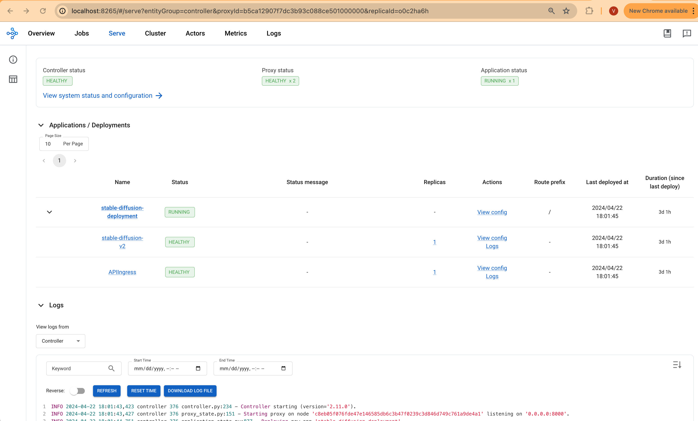
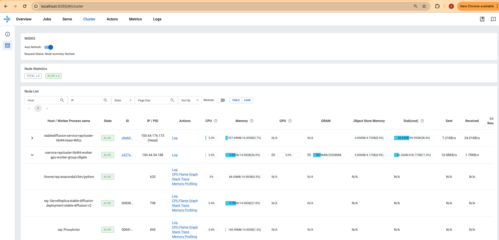
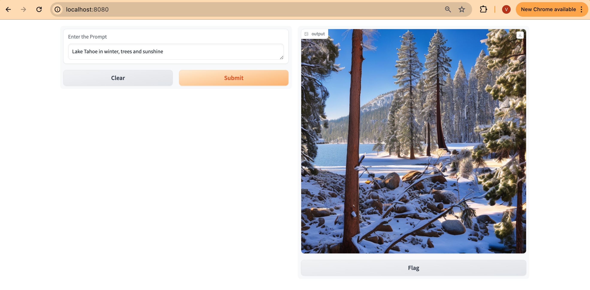

import CollapsibleContent from '../../../../src/components/CollapsibleContent';

:::caution

The **AI on EKS** content **is being migrated** to a new repository.
🔗 👉 [Read the full migration announcement »](https://awslabs.github.io/data-on-eks/docs/migration/migration-announcement)

:::

:::warning
Deployment of ML models on EKS requires access to GPUs or Neuron instances. If your deployment isn't working, it’s often due to missing access to these resources. Also, some deployment patterns rely on Karpenter autoscaling and static node groups; if nodes aren't initializing, check the logs for Karpenter or Node groups to resolve the issue.
:::

:::info

We are actively enhancing this blueprint to incorporate improvements in observability and logging.

:::


# Deploying Stable Diffusion v2 with GPUs, Ray Serve and Gradio
This pattern demonstrates how to deploy the [Stable Diffusion V2](https://huggingface.co/stabilityai/stable-diffusion-2-1) model on Amazon EKS, using [GPUs](https://aws.amazon.com/ec2/instance-types/g4/) for accelerated image generation. [Ray Serve](https://docs.ray.io/en/latest/serve/index.html) provides efficient scaling across multiple GPU nodes, while [Karpenter](https://karpenter.sh/) dynamically manages node provisioning.

Through this pattern, you will accomplish the following:

- Create an Amazon EKS cluster with a Karpenter managed GPU nodepool for dynamic scaling of Nodes.
- Install KubeRay Operator and other core EKS add-ons using the [jark-stack](https://github.com/awslabs/data-on-eks/tree/main/ai-ml/jark-stack/terraform) Terraform blueprint.
- Deploy the Stable Diffusion model using RayServe for efficient scaling across your GPU resources

### What is Stable Diffusion?
Stable Diffusion is a cutting-edge text-to-image model that generates stunning, detailed images from text descriptions. It's a powerful tool for artists, designers, and anyone who wants to unleash their imagination through image generation. This model stands out by offering a high degree of creative control and flexibility in the image generation process.

## Deploying the Solution
Let's get Stable Diffusion v2-1 up and running on Amazon EKS! In this section, we'll cover:

- **Prerequisites**: Ensuring you have everything in place.
- **Infrastructure Setup**: Creating your EKS cluster and preparing it for deployment.
- **Deploying the Ray Cluster**: The core of your image generation pipeline, providing scalability and efficiency.
- **Building the Gradio Web UI**: A user-friendly interface for interacting with Stable Diffusion.

<CollapsibleContent header={<h2><span>Prerequisites</span></h2>}>
Before we begin, ensure you have all the prerequisites in place to make the deployment process smooth and hassle-free.
Ensure that you have installed the following tools on your machine.

1. [aws cli](https://docs.aws.amazon.com/cli/latest/userguide/install-cliv2.html)
2. [kubectl](https://Kubernetes.io/docs/tasks/tools/)
3. [terraform](https://learn.hashicorp.com/tutorials/terraform/install-cli)

### (Optional) Reduce Cold Start Time by Preloading Container Images in Bottlerocket OS

To accelerate the deployment of image retrieval on Ray workers, refer to [Preload container images into Bottlerocket data volumes with Karpenter with EBS Snapshots](../../bestpractices/preload-container-images)

Define the `TF_VAR_bottlerocket_data_disk_snpashot_id` to enable Karpenter to provision Bottlerocket worker nodes with EBS Snapshots, to reduce cold start for container startup. This will likely to save 10 mins (depending on the image size) for downloading and extracting container images from Amazon ECR.

```
export TF_VAR_bottlerocket_data_disk_snpashot_id=snap-0c6d965cf431785ed
```
### Deploy

Clone the repository

```bash
git clone https://github.com/awslabs/data-on-eks.git
```


```
cd data-on-eks/ai-ml/jark-stack/ && chmod +x install.sh
./install.sh
```

Navigate into one of the example directories and run `install.sh` script

**Important Note:** Ensure that you update the region in the `variables.tf` file before deploying the blueprint.
Additionally, confirm that your local region setting matches the specified region to prevent any discrepancies.
For example, set your `export AWS_DEFAULT_REGION="<REGION>"` to the desired region:

```bash
cd data-on-eks/ai-ml/jark-stack/ && chmod +x install.sh
./install.sh
```

### Verify the resources

Verify the Amazon EKS Cluster

```bash
aws eks --region us-west-2 describe-cluster --name jark-stack
```

```bash
# Creates k8s config file to authenticate with EKS
aws eks --region us-west-2 update-kubeconfig --name jark-stack

# Output shows the EKS Managed Node group nodes
kubectl get nodes
```

</CollapsibleContent>

## Deploying the Ray Cluster with Stable Diffusion Model

Once the `jark-stack` cluster is deployed, you can proceed to use `kubectl` to deploy the `ray-service-stablediffusion.yaml` from `/data-on-eks/gen-ai/inference/stable-diffusion-rayserve-gpu/` path.

In this step, we will deploy the Ray Serve cluster, which comprises one `Head Pod` on `x86 CPU` instances using Karpenter autoscaling, as well as `Ray workers` on `g5.2xlarge` instances, autoscaled by [Karpenter](https://karpenter.sh/).

Let's take a closer look at the key files used in this deployment and understand their functionalities before proceeding with the deployment:
- **ray_serve_sd.py:**
  This script sets up a FastAPI application with two main components deployed using Ray Serve, which enables scalable model serving on GPU-equipped infrastructure:
  - **StableDiffusionV2 Deployment**: This class initializes the Stable Diffusion V2 model using a scheduler and moves it to a GPU for processing. It includes functionality to generate images based on textual prompts, with the image size customizable via the input parameter.
  - **APIIngress**: This FastAPI endpoint acts as an interface to the Stable Diffusion model. It exposes a GET method on the `/imagine` path that takes a text prompt and an optional image size. It generates an image using the Stable Diffusion model and returns it as a PNG file.

- **ray-service-stablediffusion.yaml:**
  This RayServe deployment pattern sets up a scalable service for hosting the Stable Diffusion model on Amazon EKS with GPU support. It creates a dedicated namespace and configures a RayService with autoscaling capabilities to efficiently manage resource utilization based on incoming traffic. The deployment ensures that the model, served under the RayService umbrella, can automatically adjust between 1 and 4 replicas, depending on demand, with each replica requiring a GPU. This pattern makes use of custom container images designed to maximize performance and minimizes startup delays by ensuring that heavy dependencies are preloaded.

### Deploy the Stable Diffusion V2 Model

Ensure the cluster is configured locally

```bash
aws eks --region us-west-2 update-kubeconfig --name jark-stack
```

**Deploy RayServe Cluster**

```bash
cd data-on-eks/gen-ai/inference/stable-diffusion-rayserve-gpu
kubectl apply -f ray-service-stablediffusion.yaml
```

Verify the deployment by running the following commands

:::info

If you did not preload container images into the data volume, the deployment process may take up to 10 to 12 minutes. The Head Pod is expected to be ready within 2 to 3 minutes, while the Ray Serve worker pod may take up to 10 minutes for image retrieval and Model deployment from Huggingface.

:::

This deployment establishes a Ray head pod running on an x86 instance and a worker pod on a GPU G5 instance as shown below.

```bash
kubectl get pods -n stablediffusion

NAME                                                      READY   STATUS
rservice-raycluster-hb4l4-worker-gpu-worker-group-z8gdw   1/1     Running
stablediffusion-service-raycluster-hb4l4-head-4kfzz       2/2     Running
```

If you have preload container images into the data volume, you can find the message showing `Container image "public.ecr.aws/data-on-eks/ray2.11.0-py310-gpu-stablediffusion:latest" already present on machine` in the output of `kubectl describe pod -n stablediffusion`.


```
kubectl describe pod -n stablediffusion

...
Events:
  Type     Reason            Age                From               Message
  ----     ------            ----               ----               -------
  Warning  FailedScheduling  41m                default-scheduler  0/8 nodes are available: 1 Insufficient cpu, 3 Insufficient memory, 8 Insufficient nvidia.com/gpu. preemption: 0/8 nodes are available: 8 No preemption victims found for incoming pod.
  Normal   Nominated         41m                karpenter          Pod should schedule on: nodeclaim/gpu-ljvhl
  Normal   Scheduled         40m                default-scheduler  Successfully assigned stablediffusion/stablediffusion-raycluster-ms6pl-worker-gpu-85d22 to ip-100-64-136-72.us-west-2.compute.internal
  Normal   Pulled            40m                kubelet            Container image "public.ecr.aws/data-on-eks/ray2.11.0-py310-gpu-stablediffusion:latest" already present on machine
  Normal   Created           40m                kubelet            Created container wait-gcs-ready
  Normal   Started           40m                kubelet            Started container wait-gcs-ready
  Normal   Pulled            39m                kubelet            Container image "public.ecr.aws/data-on-eks/ray2.11.0-py310-gpu-stablediffusion:latest" already present on machine
  Normal   Created           39m                kubelet            Created container worker
  Normal   Started           38m                kubelet            Started container worker
  ```

This deployment also sets up a stablediffusion service with multiple ports configured; port `8265` is designated for the Ray dashboard and port `8000` for the Stable Diffusion model endpoint.

```bash
kubectl get svc -n stablediffusion
NAME                                TYPE       CLUSTER-IP       EXTERNAL-IP   PORT(S)
stablediffusion-service             NodePort   172.20.223.142   <none>        8080:30213/TCP,6379:30386/TCP,8265:30857/TCP,10001:30666/TCP,8000:31194/TCP
stablediffusion-service-head-svc    NodePort   172.20.215.100   <none>        8265:30170/TCP,10001:31246/TCP,8000:30376/TCP,8080:32646/TCP,6379:31846/TCP
stablediffusion-service-serve-svc   NodePort   172.20.153.125   <none>        8000:31459/TCP
```

For the Ray dashboard, you can port-forward these ports individually to access the web UI locally using localhost.

```bash
kubectl port-forward svc/stablediffusion-service 8266:8265 -n stablediffusion
```

Access the web UI via `http://localhost:8265` . This interface displays the deployment of jobs and actors within the Ray ecosystem.



The screenshots provided will show the Serve deployment and the Ray Cluster deployment, offering a visual overview of the setup and operational status.



## Deploying the Gradio WebUI App
Discover how to create a user-friendly chat interface using [Gradio](https://www.gradio.app/) that integrates seamlessly with deployed models.

Let's move forward with setting up the Gradio app as a Docker container running on localhost. This setup will enable interaction with the Stable Diffusion XL model, which is deployed using RayServe.

### Build the Gradio app docker container

First, lets build the docker container for the client app.

```bash
cd data-on-eks/gen-ai/inference/gradio-ui
docker build --platform=linux/amd64 \
    -t gradio-app:sd \
    --build-arg GRADIO_APP="gradio-app-stable-diffusion.py" \
    .
```

### Deploy the Gradio container

Deploy the Gradio app as a container on localhost using docker:

```bash
docker run --rm -it -p 7860:7860 -p 8000:8000 gradio-app:sd
```

:::info
If you are not running Docker Desktop on your machine and using something like [finch](https://runfinch.com/) instead then you will need to additional flags for a custom host-to-IP mapping inside the container.

```
docker run --rm -it \
    --add-host ray-service:<workstation-ip> \
    -e "SERVICE_NAME=http://ray-service:8000" \
    -p 7860:7860 gradio-app:sd
```
:::

#### Invoke the WebUI

Open your web browser and access the Gradio WebUI by navigating to the following URL:

Running on local URL:  http://localhost:7860

You should now be able to interact with the Gradio application from your local machine.



### Ray Autoscaling
The Ray Autoscaling configuration detailed in the `ray-serve-stablediffusion.yaml` file leverages the capabilities of Ray on Kubernetes to dynamically scale applications based on computational needs.

1. **Incoming Traffic**: Incoming requests to your stable-diffusion deployment trigger Ray Serve to monitor the load on existing replicas.
2. **Metrics-Based Scaling**: Ray Serve tracks the average number of ongoing requests per replica.  This configuration has `target_num_ongoing_requests_per_replica` set to 1. If this metric exceeds the threshold, it signals the need for more replicas.
3. **Replica Creation (Within Node)**: If a node has sufficient GPU capacity, Ray Serve will attempt to add a new replica within the existing node. Your deployment requests 1 GPU per replica (`ray_actor_options: num_gpus: 1`).
4. **Node Scaling (Karpenter)**:  If a node cannot accommodate an additional replica (e.g., only one GPU per node), Ray will signal to Kubernetes that it needs more resources. Karpenter observes pending pod requests from Kubernetes and provisions a new g5 GPU node to fulfill the resource need.
5. **Replica Creation (Across Nodes)**: Once the new node is ready, Ray Serve schedules an additional replica on the newly provisioned node.

**To simulate autoscaling:**
1. **Generate Load**: Create a script or use a load testing tool to send a burst of image generation requests to your stable diffusion service.
2. **Observe (Ray Dashboard)**: Access the Ray Dashboard (via port-forwarding or public NLB if configured) at http://your-cluster/dashboard. Observe how these metrics change:
        The number of replicas for your deployment.
        The number of nodes in your Ray cluster.
3. **Observe (Kubernetes)**: Use `kubectl get pods -n stablediffusion` to see the creation of new pods. Use `kubectl get nodes` to observe new nodes provisioned by Karpenter.

## Cleanup
Finally, we'll provide instructions for cleaning up and deprovisioning the resources when they are no longer needed.

**Step1:** Delete Gradio Container

`Ctrl-c` on the localhost terminal window where `docker run` is running to kill the container running the Gradio app. Optionally clean up the docker image

```bash
docker rmi gradio-app:sd
```
**Step2:** Delete Ray Cluster

```bash
cd data-on-eks/gen-ai/inference/stable-diffusion-rayserve-gpu
kubectl delete -f ray-service-stablediffusion.yaml
```

**Step3:** Cleanup the EKS Cluster
This script will cleanup the environment using `-target` option to ensure all the resources are deleted in correct order.

```bash
cd data-on-eks/ai-ml/jark-stack/
./cleanup.sh
```
