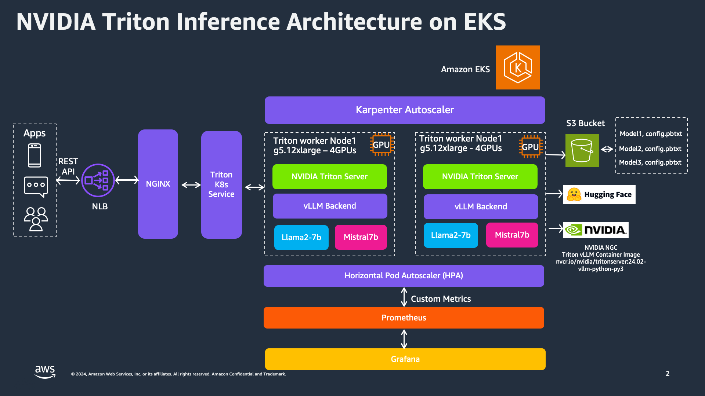
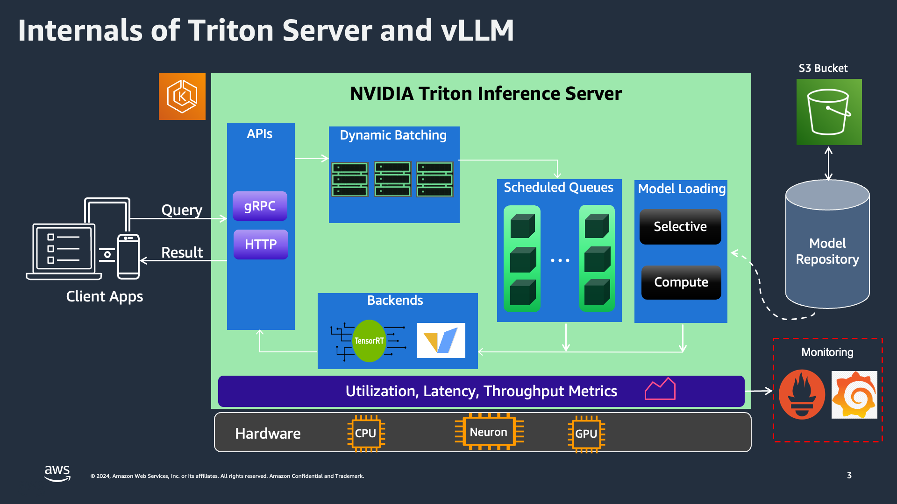
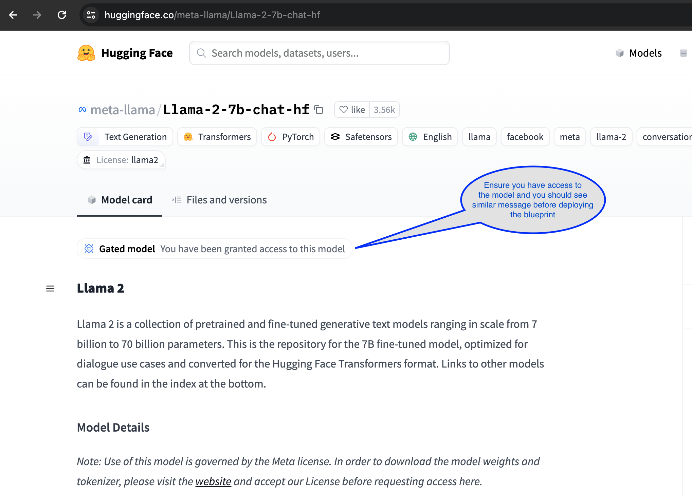
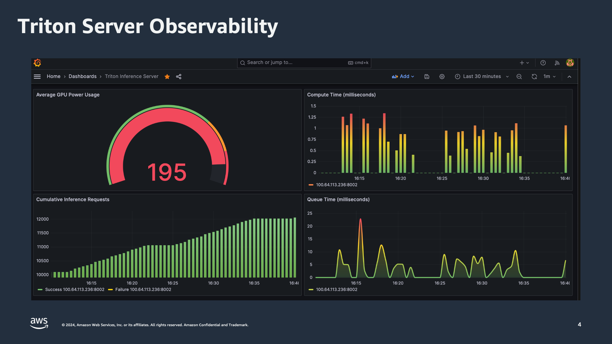
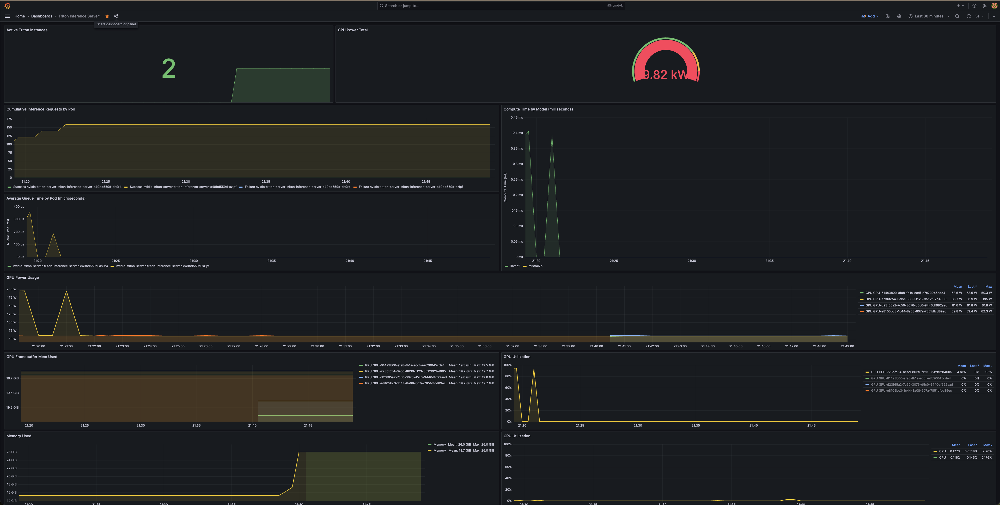

import CollapsibleContent from '../../../../src/components/CollapsibleContent';

:::caution

The **AI on EKS** content **is being migrated** to a new repository.
🔗 👉 [Read the full migration announcement »](https://awslabs.github.io/data-on-eks/docs/migration/migration-announcement)

:::

:::warning
Deployment of ML models on EKS requires access to GPUs or Neuron instances. If your deployment isn't working, it’s often due to missing access to these resources. Also, some deployment patterns rely on Karpenter autoscaling and static node groups; if nodes aren't initializing, check the logs for Karpenter or Node groups to resolve the issue.
:::

:::caution

The use of [Meta-llama/Llama-2-7b-chat-hf](https://huggingface.co/meta-llama/Meta-Llama-3-8B) and [Mistralai/Mistral-7B-Instruct-v0.2](https://huggingface.co/mistralai/Mistral-7B-Instruct-v0.2) models requires access through a Hugging Face account.

:::

# Deploying Multiple Large Language Models with NVIDIA Triton Server and vLLM
In this pattern, we'll explore how to deploy multiple large language models (LLMs) using the [Triton Inference Server](https://github.com/triton-inference-server/server) and the [vLLM](https://github.com/vllm-project/vllm) backend/engine. We'll demonstrate this process with two specific models: `mistralai/Mistral-7B-Instruct-v0.2` and `meta-llama/Llama-2-7b-chat-hf`. These models will be hosted on a **g5.24xlarge** multi-GPU instance, equipped with **4 GPUs**, with each model utilizing up to one GPU.

NVIDIA Triton Inference Server, when combined with the vLLM backend, offers a robust framework for deploying multiple large language models (LLMs). User applications interact with the inference service via REST API or gRPC, which is managed by NGINX and a Network Load Balancer (NLB) to efficiently distribute incoming requests to the Triton K8s Service. The Triton K8s Service is the core of our deployment, where the Triton Server processes inference requests. For this deployment, we use g5.24xlarge instances, each equipped with 4 GPUs, to run multiple models like Llama2-7b and Mistral7b. The Horizontal Pod Autoscaler (HPA) monitors custom metrics and dynamically scales Triton pods based on demand, ensuring efficient handling of varying loads. Prometheus and Grafana are used to collect and visualize metrics, providing insights into performance and aiding in autoscaling decisions.



## What to Expect

When you deploy everything as described, you can expect quick response times for your inference requests. Below is an example output from running the `triton-client.py` script with the `Llama-2-7b-chat-hf` and `Mistral-7B-Instruct-v0.2` models:


<details>
<summary>Click to expand comparison results</summary>

| **Run 1: Llama2** | **Run 2: Mistral7b** |
|-------------------|----------------------|
| python3 triton-client.py --model-name llama2 --input-prompts prompts.txt --results-file llama2_results.txt | python3 triton-client.py --model-name mistral7b --input-prompts prompts.txt --results-file mistral_results.txt |
| Loading inputs from `prompts.txt`... | Loading inputs from `prompts.txt`... |
| Model llama2 - Request 11: 0.00 ms | Model mistral7b - Request 3: 0.00 ms |
| Model llama2 - Request 15: 0.02 ms | Model mistral7b - Request 14: 0.00 ms |
| Model llama2 - Request 3: 0.00 ms | Model mistral7b - Request 11: 0.00 ms |
| Model llama2 - Request 8: 0.01 ms | Model mistral7b - Request 15: 0.00 ms |
| Model llama2 - Request 0: 0.01 ms | Model mistral7b - Request 5: 0.00 ms |
| Model llama2 - Request 9: 0.01 ms | Model mistral7b - Request 0: 0.01 ms |
| Model llama2 - Request 14: 0.01 ms | Model mistral7b - Request 7: 0.01 ms |
| Model llama2 - Request 16: 0.00 ms | Model mistral7b - Request 13: 0.00 ms |
| Model llama2 - Request 19: 0.02 ms | Model mistral7b - Request 9: 0.00 ms |
| Model llama2 - Request 4: 0.02 ms | Model mistral7b - Request 16: 0.01 ms |
| Model llama2 - Request 10: 0.02 ms | Model mistral7b - Request 18: 0.01 ms |
| Model llama2 - Request 6: 0.01 ms | Model mistral7b - Request 4: 0.01 ms |
| Model llama2 - Request 1: 0.02 ms | Model mistral7b - Request 8: 0.01 ms |
| Model llama2 - Request 7: 0.02 ms | Model mistral7b - Request 1: 0.01 ms |
| Model llama2 - Request 18: 0.01 ms | Model mistral7b - Request 6: 0.00 ms |
| Model llama2 - Request 12: 0.01 ms | Model mistral7b - Request 12: 0.00 ms |
| Model llama2 - Request 2: 0.01 ms | Model mistral7b - Request 17: 0.00 ms |
| Model llama2 - Request 17: 0.02 ms | Model mistral7b - Request 2: 0.01 ms |
| Model llama2 - Request 13: 0.01 ms | Model mistral7b - Request 19: 0.01 ms |
| Model llama2 - Request 5: 0.02 ms | Model mistral7b - Request 10: 0.02 ms |
| Storing results into `llama2_results.txt`... | Storing results into `mistral_results.txt`... |
| Total time for all requests: 0.00 seconds (0.18 milliseconds) | Total time for all requests: 0.00 seconds (0.11 milliseconds) |
| PASS: vLLM example | PASS: vLLM example |


</details>

# Triton Server Internals and Backend Integration

NVIDIA Triton Inference Server is engineered for high-performance inference across a wide range of model types and deployment scenarios. The core strength of Triton lies in its support for various backends, which provide the flexibility and power needed to handle different types of models and workloads effectively.

Once a request reaches the Triton K8s Service, it is processed by the Triton Server. The server supports dynamic batching, allowing multiple inference requests to be grouped together to optimize processing. This is particularly useful in scenarios with high throughput requirements, as it helps reduce latency and improve overall performance.

Requests are then managed by scheduled queues, ensuring that each model's inference requests are processed in an orderly manner. The Triton Server supports selective and compute model loading, which means it can dynamically load models based on the current workload and resource availability. This feature is crucial for efficiently managing the resources in a multi-model deployment.

The backbone of Triton’s inference capabilities are its various backends, including TensorRT-LLM and vLLM:

**[TensorRT-LLM](https://github.com/NVIDIA/TensorRT-LLM)**: TensorRT-LLM backend optimizes large language model (LLM) inference on NVIDIA GPUs. Leveraging TensorRT's high-performance capabilities, it accelerates inference, providing low-latency and high-throughput performance. TensorRT is particularly well-suited for deep learning models that require intensive computational resources, making it ideal for real-time AI applications.

**[vLLM](https://github.com/vllm-project/vllm)**: vLLM backend is specifically designed to handle various LLM workloads. It offers efficient memory management and execution pipelines tailored for large models. This backend ensures that memory resources are used optimally, allowing for the deployment of very large models without running into memory bottlenecks. vLLM is crucial for applications that need to serve multiple large models simultaneously, providing a robust and scalable solution.




### Mistralai/Mistral-7B-Instruct-v0.2
Mistralai/Mistral-7B-Instruct-v0.2 is a state-of-the-art large language model designed to provide high-quality, instructive responses. Trained on a diverse dataset, it excels in understanding and generating human-like text across a variety of topics. Its capabilities make it suitable for applications requiring detailed explanations, complex queries, and natural language understanding.

### Meta-llama/Llama-2-7b-chat-hf
Meta-llama/Llama-2-7b-chat-hf is an advanced conversational AI model developed by Meta. It is optimized for chat applications, delivering coherent and contextually relevant responses. With its robust training on extensive dialogue datasets, this model excels in maintaining engaging and dynamic conversations, making it ideal for customer service bots, interactive agents, and other chat-based applications.

## Deploying the Solution
To get started with deploying both `mistralai/Mistral-7B-Instruct-v0.2` and `meta-llama/Llama-2-7b-chat-hf` on [Amazon EKS](https://aws.amazon.com/eks/), we will cover the necessary prerequisites and guide you through the deployment process step by step. This process includes setting up the infrastructure, deploying the NVIDIA Triton Inference Server, and creating the Triton client Python application that sends gRPC requests to the Triton server for inferencing.

:::danger

Important: Deploying on `g5.24xlarge` instances, which are equipped with multiple GPUs, can be expensive. Ensure you carefully monitor and manage your usage to avoid unexpected costs. Consider setting budget alerts and usage limits to keep track of your expenditures.

:::


<CollapsibleContent header={<h2><span>Prerequisites</span></h2>}>
Before we begin, ensure you have all the necessary prerequisites in place to make the deployment process smooth. Make sure you have installed the following tools on your machine:

1. [aws cli](https://docs.aws.amazon.com/cli/latest/userguide/install-cliv2.html)
2. [kubectl](https://Kubernetes.io/docs/tasks/tools/)
3. [terraform](https://learn.hashicorp.com/tutorials/terraform/install-cli)

### Deploy

Clone the repository

```bash
git clone https://github.com/awslabs/data-on-eks.git
```

Navigate into one of the example directories and run `install.sh` script

**Important Note:**

**Step1**: Ensure that you update the region in the `variables.tf` file before deploying the blueprint.
Additionally, confirm that your local region setting matches the specified region to prevent any discrepancies.

For example, set your `export AWS_DEFAULT_REGION="<REGION>"` to the desired region:

**Step2**: To proceed, ensure you have access to both models using your Huggingface account:




**Step3**: Next, set the environment variable TF_VAR_huggingface_token with your Huggingface account token:
  `export TF_VAR_huggingface_token=<your Huggingface token>`.

**Step4**: Run the installation script.

```bash
cd data-on-eks/ai-ml/nvidia-triton-server/ && chmod +x install.sh
./install.sh
```

### Verify the resources

**Step5**: Once the installation finishes, verify the Amazon EKS Cluster

```bash
# Creates k8s config file to authenticate with EKS
aws eks --region us-west-2 update-kubeconfig --name nvidia-triton-server

kubectl get nodes # Output shows the EKS worker nodes
```

You should see three nodes deployed by this installation: two `m5.xlarge` and one `g5.24xlarge`.

```text
ip-100-64-190-174.us-west-2.compute.internal   Ready    <none>   11d     v1.29.3-eks-ae9a62a
ip-100-64-59-224.us-west-2.compute.internal    Ready    <none>   8m26s   v1.29.3-eks-ae9a62a
ip-100-64-59-227.us-west-2.compute.internal    Ready    <none>   11d     v1.29.3-eks-ae9a62a
```

</CollapsibleContent>


### NVIDIA Triton Server with vLLM Backend

This blueprint uses [Triton helm chart](https://github.com/aws-ia/terraform-aws-eks-data-addons/tree/main/helm-charts/nvidia-triton-server) to install and configure the Triton server on Amazon EKS. The deployment is configured using the following Terraform code in the blueprint.

<details>
<summary>Click to expand the deployment code</summary>
```hcl
module "triton_server_vllm" {
  depends_on = [module.eks_blueprints_addons.kube_prometheus_stack]
  source     = "aws-ia/eks-data-addons/aws"
  version    = "~> 1.32.0" # ensure to update this to the latest/desired version

  oidc_provider_arn = module.eks.oidc_provider_arn

  enable_nvidia_triton_server = false

  nvidia_triton_server_helm_config = {
    version   = "1.0.0"
    timeout   = 120
    wait      = false
    namespace = kubernetes_namespace_v1.triton.metadata[0].name
    values = [
      <<-EOT
      replicaCount: 1
      image:
        repository: nvcr.io/nvidia/tritonserver
        tag: "24.06-vllm-python-py3"
      serviceAccount:
        create: false
        name: ${kubernetes_service_account_v1.triton.metadata[0].name}
      modelRepositoryPath: s3://${module.s3_bucket.s3_bucket_id}/model_repository
      environment:
        - name: model_name
          value: ${local.default_model_name}
        - name: "LD_PRELOAD"
          value: ""
        - name: "TRANSFORMERS_CACHE"
          value: "/home/triton-server/.cache"
        - name: "shm-size"
          value: "5g"
        - name: "NCCL_IGNORE_DISABLED_P2P"
          value: "1"
        - name: tensor_parallel_size
          value: "1"
        - name: gpu_memory_utilization
          value: "0.9"
        - name: dtype
          value: "auto"
      secretEnvironment:
        - name: "HUGGING_FACE_TOKEN"
          secretName: ${kubernetes_secret_v1.huggingface_token.metadata[0].name}
          key: "HF_TOKEN"
      resources:
        limits:
          cpu: 6
          memory: 25Gi
          nvidia.com/gpu: 4
        requests:
          cpu: 6
          memory: 25Gi
          nvidia.com/gpu: 4
      nodeSelector:
        NodeGroupType: g5-gpu-karpenter
        type: karpenter

      tolerations:
        - key: "nvidia.com/gpu"
          operator: "Exists"
          effect: "NoSchedule"
      EOT
    ]
  }
}

```
</details>


**Note:** The container image that's being used for Triton server is `nvcr.io/nvidia/tritonserver:24.02-vllm-python-py3` and is vLLM backend enabled. You can choose appropriate tags in the [NGC Catalog](https://catalog.ngc.nvidia.com/orgs/nvidia/containers/tritonserver/tags).

**Model Repository**:
The Triton Inference Server serves models from one or more model repositories specified at server startup. Triton can access models from locally accessible file paths and cloud storage locations like Amazon S3.

The directories and files that compose a model repository must follow a required layout. The repository layout should be structured as follows:

<details>
<summary>Click to expand the model directory hierarchy</summary>
```text
<model-repository-path>/
  <model-name>/
    [config.pbtxt]
    [<output-labels-file> ...]
    <version>/
      <model-definition-file>
    <version>/
      <model-definition-file>

  <model-name>/
    [config.pbtxt]
    [<output-labels-file> ...]
    <version>/
      <model-definition-file>
    <version>/
      <model-definition-file>
    ...


-------------
Example:
-------------
model-repository/
  mistral-7b/
    config.pbtxt
    1/
      model.py
  llama-2/
    config.pbtxt
    1/
      model.py
```
</details>


For vLLM enabled Triton model, the model_repository can be found at `gen-ai/inference/vllm-nvidia-triton-server-gpu/model_repository` location. During the deployment, the blueprint creates an S3 bucket and syncs the local `model_repository` contents to the S3 bucket.

**model.py**: This script uses vLLM library as Triton backend framework and initializes a `TritonPythonModel` class by loading the model configuration and configuring vLLM engine. The `huggingface_hub` library's login function is used to establish access to the hugging face repository for model access. It then starts an asyncio event loop to process the received requests asynchronously. The script has several functions that processes the inference requests, issues the requests to vLLM backend and return the response.

**config.pbtxt**: This is a model configuration file that specifies parameters such as

- Name - The name of the model must match the `name` of the model repository directory containing the model.
- max_batch_size - The `max_batch_size` value indicates the maximum batch size that the model supports for the type of batching that can be exploited by Triton
- Inputs and Outputs - Each model input and output must specify a name, datatype, and shape. An input shape indicates the shape of an input tensor expected by the model and by Triton in inference requests. An output shape indicates the shape of an output tensor produced by the model and returned by Triton in response to an inference request. Input and output shapes are specified by a combination of `max_batch_size` and the dimensions specified by `input dims` or `output dims`.

### Verify Deployment

To verify that the Triton Inference Server has been deployed successfully, run the following command:

```bash
kubectl get all -n triton-vllm
```

Output below shows that there is one pod running the Triton server, which is hosting two models.
There is one service to interact with the models, and one ReplicaSet for Triton servers.
Deployment will be horizontally scaled based on custom metrics and the HPA object.

```text
NAME                                                               READY   STATUS    RESTARTS   AGE
pod/nvidia-triton-server-triton-inference-server-c49bd559d-szlpf   1/1     Running   0          13m

NAME                                                           TYPE        CLUSTER-IP      EXTERNAL-IP   PORT(S)                      AGE
service/nvidia-triton-server-triton-inference-server           ClusterIP   172.20.193.97   <none>        8000/TCP,8001/TCP,8002/TCP   13m
service/nvidia-triton-server-triton-inference-server-metrics   ClusterIP   172.20.5.247    <none>        8080/TCP                     13m

NAME                                                           READY   UP-TO-DATE   AVAILABLE   AGE
deployment.apps/nvidia-triton-server-triton-inference-server   1/1     1            1           13m

NAME                                                                     DESIRED   CURRENT   READY   AGE
replicaset.apps/nvidia-triton-server-triton-inference-server-c49bd559d   1         1         1       13m

NAME                                                                               REFERENCE                                                 TARGETS                        MINPODS   MAXPODS   REPLICAS   AGE
horizontalpodautoscaler.autoscaling/nvidia-triton-server-triton-inference-server   Deployment/nvidia-triton-server-triton-inference-server   <unknown>/80%, <unknown>/80%   1         5         1          13m

```

This output indicates that the Triton server pods are running, the services are correctly set up, and the deployment is functioning as expected. The Horizontal Pod Autoscaler is also active, ensuring that the number of pods scales based on the specified metrics.

### Testing Llama-2-7b Chat and Mistral-7b Chat Models
It's time to test both the Llama-2-7b chat and Mistral-7b chat models. We will run the following commands with the same prompts to verify the outputs generated by both models.

First, execute a port forward to the Triton-inference-server Service using kubectl:

```bash
kubectl -n triton-vllm port-forward svc/nvidia-triton-server-triton-inference-server 8001:8001
```

Next, run the Triton client for each model using the same prompts:

```bash
cd data-on-eks/gen-ai/inference/vllm-nvidia-triton-server-gpu/triton-client
python3 -m venv .venv
source .venv/bin/activate
pip install tritonclient[all]
python3 triton-client.py --model-name mistral7b --input-prompts prompts.txt --results-file mistral_results.txt
```

You will see an output something like below:

```text
python3 triton-client.py --model-name mistral7b --input-prompts prompts.txt --results-file mistral_results.txt
Loading inputs from `prompts.txt`...
Model mistral7b - Request 3: 0.00 ms
Model mistral7b - Request 14: 0.00 ms
Model mistral7b - Request 11: 0.00 ms
Model mistral7b - Request 15: 0.00 ms
Model mistral7b - Request 5: 0.00 ms
Model mistral7b - Request 0: 0.01 ms
Model mistral7b - Request 7: 0.01 ms
Model mistral7b - Request 13: 0.00 ms
Model mistral7b - Request 9: 0.00 ms
Model mistral7b - Request 16: 0.01 ms
Model mistral7b - Request 18: 0.01 ms
Model mistral7b - Request 4: 0.01 ms
Model mistral7b - Request 8: 0.01 ms
Model mistral7b - Request 1: 0.01 ms
Model mistral7b - Request 6: 0.00 ms
Model mistral7b - Request 12: 0.00 ms
Model mistral7b - Request 17: 0.00 ms
Model mistral7b - Request 2: 0.01 ms
Model mistral7b - Request 19: 0.01 ms
Model mistral7b - Request 10: 0.02 ms
Storing results into `mistral_results.txt`...
Total time for all requests: 0.00 seconds (0.11 milliseconds)
PASS: vLLM example
```

Output for `mistral_results.txt` should like below:

<details>
<summary>Click to expand Mistral results partial output</summary>
```text
<s>[INST]<<SYS>>
Keep short answers of no more than 100 sentences.
<</SYS>>

What are the key differences between traditional machine learning models and very large language models (vLLM)?
[/INST] Traditional machine learning models (MLMs) are trained on specific datasets and features to learn patterns and make predictions based on that data. They require labeled data for training and are limited by the size and diversity of the training data. MLMs can be effective for solving structured problems, such as image recognition or speech recognition.

Very Large Language Models (vLLMs), on the other hand, are trained on vast amounts of text data using deep learning techniques. They learn to generate human-like text based on the input they receive. vLLMs can understand and generate text in a more contextually aware and nuanced way than MLMs. They can also perform a wider range of tasks, such as text summarization, translation, and question answering. However, vLLMs can be more computationally expensive and require large amounts of data and power to train. They also have the potential to generate inaccurate or biased responses if not properly managed.

=========

<s>[INST]<<SYS>>
Keep short answers of no more than 100 sentences.
<</SYS>>

Can you explain how TensorRT optimizes LLM inference on NVIDIA hardware?
[/INST] TensorRT is a deep learning inference optimization tool from NVIDIA. It utilizes dynamic and static analysis to optimize deep learning models for inference on NVIDIA GPUs. For Maximum Likelihood Modeling (LLM) inference, TensorRT applies the following optimizations:

1. Model Optimization: TensorRT converts the LLM model into an optimized format, such as INT8 or FP16, which reduces memory usage and increases inference speed.

2. Engine Generation: TensorRT generates a custom engine for the optimized model, which includes kernel optimizations for specific NVIDIA GPUs.

3. Memory Optimization: TensorRT minimizes memory usage by using data layout optimizations, memory pooling, and other techniques.

4. Execution Optimization: TensorRT optimizes the execution of the engine on the GPU by scheduling and managing thread execution, reducing latency and increasing throughput.

5. I/O Optimization: TensorRT optimizes input and output data transfer between the host and the GPU, reducing the time spent on data transfer and increasing overall inference speed.

6. Dynamic Batching: TensorRT dynamically batches input data to maximize GPU utilization and reduce latency.

7. Multi-Streaming: TensorRT supports multi-streaming, allowing multiple inference requests to be processed concurrently, increasing overall throughput.

8. Profiling and Monitoring: TensorRT provides profiling and monitoring tools to help developers identify performance bottlenecks and optimize their models further.

Overall, TensorRT optimizes LLM inference on NVIDIA hardware by applying a combination of model, engine, memory, execution, I/O, dynamic batching, multi-streaming, and profiling optimizations.
```
</details>


Now, try to run the inference on the Llama-2-7b-chat model with the same prompts and observe the output under a new file called `llama2_results.txt`.

```bash
python3 triton-client.py --model-name llama2 --input-prompts prompts.txt --results-file llama2_results.txt
```

Output should look like:

```text
python3 triton-client.py --model-name llama2 --input-prompts prompts.txt --results-file llama2_results.txt
Loading inputs from `prompts.txt`...
Model llama2 - Request 11: 0.00 ms
Model llama2 - Request 15: 0.02 ms
Model llama2 - Request 3: 0.00 ms
Model llama2 - Request 8: 0.03 ms
Model llama2 - Request 5: 0.02 ms
Model llama2 - Request 0: 0.00 ms
Model llama2 - Request 14: 0.00 ms
Model llama2 - Request 16: 0.01 ms
Model llama2 - Request 19: 0.02 ms
Model llama2 - Request 4: 0.01 ms
Model llama2 - Request 1: 0.01 ms
Model llama2 - Request 10: 0.01 ms
Model llama2 - Request 9: 0.01 ms
Model llama2 - Request 7: 0.01 ms
Model llama2 - Request 18: 0.01 ms
Model llama2 - Request 12: 0.00 ms
Model llama2 - Request 2: 0.00 ms
Model llama2 - Request 6: 0.00 ms
Model llama2 - Request 17: 0.01 ms
Model llama2 - Request 13: 0.01 ms
Storing results into `llama2_results.txt`...
Total time for all requests: 0.00 seconds (0.18 milliseconds)
PASS: vLLM example
```

## Observability

### Observability with AWS CloudWatch and Neuron Monitor

This blueprint deploys the CloudWatch Observability Agent as a managed add-on, providing comprehensive monitoring for containerized workloads. It includes container insights for tracking key performance metrics such as CPU and memory utilization. Additionally, the blueprint integrates GPU metrics using NVIDIA's DCGM plugin, which is essential for monitoring high-performance GPU workloads. For machine learning models running on AWS Inferentia or Trainium, the [Neuron Monitor plugin](https://awsdocs-neuron.readthedocs-hosted.com/en/latest/tools/neuron-sys-tools/neuron-monitor-user-guide.html#neuron-monitor-user-guide) is added to capture and report Neuron-specific metrics.

All metrics, including container insights, GPU performance, and Neuron metrics, are sent to Amazon CloudWatch, where you can monitor and analyze them in real-time. After the deployment is complete, you should be able to access these metrics directly from the CloudWatch console, allowing you to manage and optimize your workloads effectively.

In addition to deploying CloudWatch EKS addon, we have also deployed the Kube Prometheus stack, which provides Prometheus server and Grafana deployments for monitoring and observability.

First, let's verify the services deployed by the Kube Prometheus stack:

```bash
kubectl get svc -n monitoring
```

You should see output similar to this:

```text
kubectl get svc -n monitoring
NAME                                             TYPE        CLUSTER-IP       EXTERNAL-IP   PORT(S)             AGE
kube-prometheus-stack-grafana                    ClusterIP   172.20.252.10    <none>        80/TCP              11d
kube-prometheus-stack-kube-state-metrics         ClusterIP   172.20.34.181    <none>        8080/TCP            11d
kube-prometheus-stack-operator                   ClusterIP   172.20.186.93    <none>        443/TCP             11d
kube-prometheus-stack-prometheus                 ClusterIP   172.20.147.64    <none>        9090/TCP,8080/TCP   11d
kube-prometheus-stack-prometheus-node-exporter   ClusterIP   172.20.171.165   <none>        9100/TCP            11d
prometheus-operated                              ClusterIP   None             <none>        9090/TCP            11d
```

To expose the NVIDIA Triton server metrics, we have deployed a metrics service(`nvidia-triton-server-triton-inference-server-metrics`) on port `8080`. Verify it by running

```bash
kubectl get svc -n triton-vllm
```

The output should be:

```text
kubectl get svc -n triton-vllm
NAME                                                   TYPE        CLUSTER-IP      EXTERNAL-IP   PORT(S)                      AGE
nvidia-triton-server-triton-inference-server           ClusterIP   172.20.193.97   <none>        8000/TCP,8001/TCP,8002/TCP   34m
nvidia-triton-server-triton-inference-server-metrics   ClusterIP   172.20.5.247    <none>        8080/TCP                     34m
```

This confirms that the NVIDIA Triton server metrics are being scraped by the Prometheus server. You can visualize these metrics using the Grafana dashboard.

In the Grafana dashboard below, you can see several important metrics:

- **Average GPU Power Usage**: This gauge shows the current power usage of the GPU, which is crucial for monitoring the efficiency and performance of your inference tasks.
- **Compute Time (milliseconds)**: This bar graph displays the time taken to compute inference requests, helping identify any latency issues.
- **Cumulative Inference Requests**: This graph shows the total number of inference requests processed over time, providing insights into the workload and performance trends.
- **Queue Time (milliseconds)**: This line graph indicates the time requests spend in the queue before being processed, highlighting potential bottlenecks in the system.



To create a new Grafana dashboard to monitor these metrics, follow the steps below:

```bash
- Port-forward Grafana service:
kubectl port-forward svc/kube-prometheus-stack-grafana 8080:80 -n monitoring

- Grafana Admin user
admin

- Get secret name from Terraform output
terraform output grafana_secret_name

- Get admin user password
aws secretsmanager get-secret-value --secret-id <grafana_secret_name_output> --region $AWS_REGION --query "SecretString" --output text
```

**Login to Grafana:**

- Open your web browser and navigate to [http://localhost:8080](http://localhost:8080).
- Login with the username `admin` and the password retrieved from AWS Secrets Manager.

**Import an Open Source Grafana Dashboard:**
- Once logged in, click on the "+" icon on the left sidebar and select "Import".
- Enter the following URL to import the dashboard JSON: [Triton Server Grafana Dashboard](https://github.com/triton-inference-server/server/blob/main/deploy/k8s-onprem/dashboard.json)
- Follow the prompts to complete the import process.

You should now see the metrics displayed on your new Grafana dashboard, allowing you to monitor the performance and health of your NVIDIA Triton Inference Server deployment.




## Conclusion
Deploying and managing multiple large language models on Amazon EKS with NVIDIA Triton Inference Server and vLLM backend offers a powerful and scalable solution for modern AI applications. By following this blueprint, you have set up the necessary infrastructure, deployed the Triton server, and configured robust observability using the Kube Prometheus stack and Grafana.

## Cleanup

Finally, we'll provide instructions for cleaning up and deprovisioning the resources when they are no longer needed.

**Cleanup the EKS Cluster:**
This script will cleanup the environment using `-target` option to ensure all the resources are deleted in correct order.

```bash
export AWS_DEAFULT_REGION="DEPLOYED_EKS_CLUSTER_REGION>"
cd data-on-eks/ai-ml/nvidia-triton-server/ && chmod +x cleanup.sh
./cleanup.sh
```
