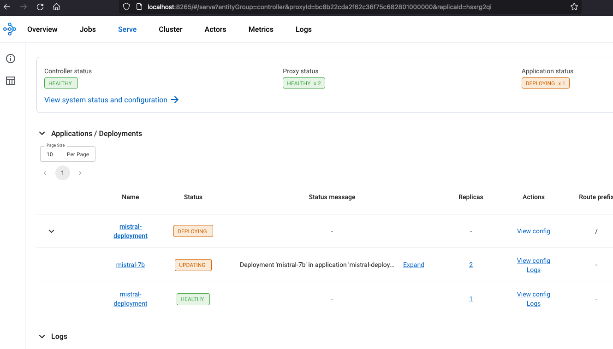
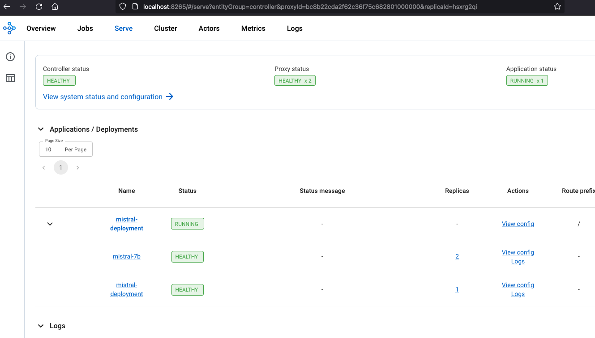
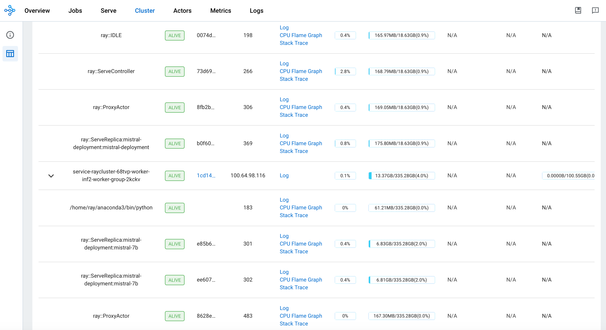
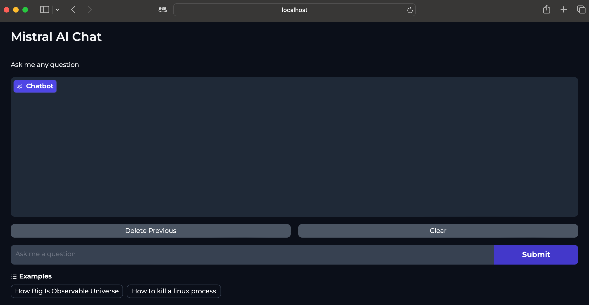
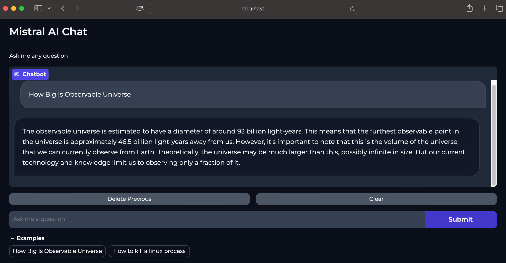
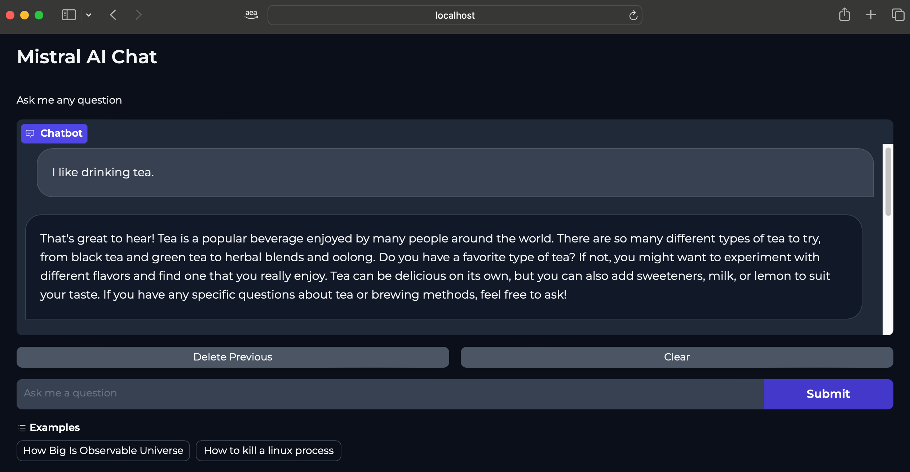
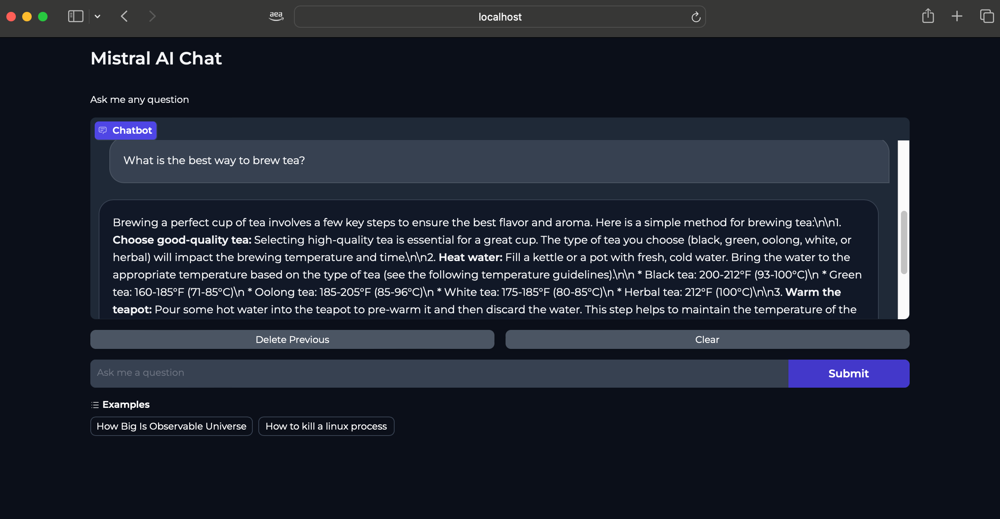

import CollapsibleContent from '../../../../src/components/CollapsibleContent';

:::caution

The **AI on EKS** content **is being migrated** to a new repository.
🔗 👉 [Read the full migration announcement »](https://awslabs.github.io/data-on-eks/docs/migration/migration-announcement)

:::

:::warning
Deployment of ML models on EKS requires access to GPUs or Neuron instances. If your deployment isn't working, it’s often due to missing access to these resources. Also, some deployment patterns rely on Karpenter autoscaling and static node groups; if nodes aren't initializing, check the logs for Karpenter or Node groups to resolve the issue.
:::

:::danger

Note: Mistral-7B-Instruct-v0.2 is a gated model in [Huggingface](https://huggingface.co/mistralai/Mistral-7B-Instruct-v0.2) repository. In order to use this model, one needs to use a HuggingFace Token.
To generate a token in HuggingFace, log in using your HuggingFace account and click on `Access Tokens` menu item on the [Settings](https://huggingface.co/settings/tokens) page.

:::

# Serving Mistral-7B-Instruct-v0.2 using Inferentia2, Ray Serve, Gradio
This pattern outlines the deployment of the [Mistral-7B-Instruct-v0.2](https://huggingface.co/mistralai/Mistral-7B-Instruct-v0.2) model on Amazon EKS, utilizing [AWS Inferentia2](https://aws.amazon.com/ec2/instance-types/inf2/) for enhanced text generation performance. [Ray Serve](https://docs.ray.io/en/latest/serve/index.html) ensures efficient scaling of Ray Worker nodes, while [Karpenter](https://karpenter.sh/) dynamically manages the provisioning of AWS Inferentia2 nodes. This setup optimizes for high-performance and cost-effective text generation applications in a scalable cloud environment.

Through this pattern, you will accomplish the following:

- Create an [Amazon EKS](https://aws.amazon.com/eks/) cluster with a Karpenter managed AWS Inferentia2 nodepool for dynamic provisioning of Nodes.
- Install [KubeRay Operator](https://github.com/ray-project/kuberay) and other core EKS add-ons using the [trainium-inferentia](https://github.com/awslabs/data-on-eks/tree/main/ai-ml/trainium-inferentia) Terraform blueprint.
- Deploy the `Mistral-7B-Instruct-v0.2` model with RayServe for efficient scaling.

### What is Mistral-7B-Instruct-v0.2 Model?

The `mistralai/Mistral-7B-Instruct-v0.2` is an instruction-tuned version of the `Mistral-7B-v0.2 base model`, which has been fine-tuned using publicly available conversation datasets. It is designed to follow instructions and complete tasks, making it suitable for applications such as chatbots, virtual assistants, and task-oriented dialogue systems. It is built on top of the `Mistral-7B-v0.2` base model, which has 7.3 billion parameters and employs a state-of-the-art architecture including Grouped-Query Attention (GQA) for faster inference and a Byte-fallback BPE tokenizer for improved robustness.

Please refer to the [Model Card](https://replicate.com/mistralai/mistral-7b-instruct-v0.2/readme) for more detail.

## Deploying the Solution
Let's get `Mistral-7B-Instruct-v0.2` model up and running on Amazon EKS! In this section, we'll cover:

- **Prerequisites**: Ensuring all necessary tools are installed before you begin.
- **Infrastructure Setup**: Creating your your EKS cluster and setting the stage for deployment.
- **Deploying the Ray Cluster**: The core of your image generation pipeline, providing scalability and efficiency.
- **Building the Gradio Web UI**: Creating a user-friendly interface for seamless interaction with the Mistral 7B model.

<CollapsibleContent header={<h2><span>Prerequisites</span></h2>}>
Before we begin, ensure you have all the prerequisites in place to make the deployment process smooth and hassle-free.
Ensure that you have installed the following tools on your machine.

1. [aws cli](https://docs.aws.amazon.com/cli/latest/userguide/install-cliv2.html)
2. [kubectl](https://Kubernetes.io/docs/tasks/tools/)
3. [terraform](https://learn.hashicorp.com/tutorials/terraform/install-cli)
4. [envsubst](https://pypi.org/project/envsubst/)

### Deploy

Clone the repository

```bash
git clone https://github.com/awslabs/data-on-eks.git
```

Navigate into one of the example directories and run `install.sh` script

**Important Note:** Ensure that you update the region in the `variables.tf` file before deploying the blueprint.
Additionally, confirm that your local region setting matches the specified region to prevent any discrepancies.
For example, set your `export AWS_DEFAULT_REGION="<REGION>"` to the desired region:

```bash
cd data-on-eks/ai-ml/trainium-inferentia/
./install.sh
```

### Verify the resources

Verify the Amazon EKS Cluster

```bash
aws eks --region us-west-2 describe-cluster --name trainium-inferentia
```

```bash
# Creates k8s config file to authenticate with EKS
aws eks --region us-west-2 update-kubeconfig --name trainium-inferentia

# Output shows the EKS Managed Node group nodes
kubectl get nodes
```

</CollapsibleContent>

## Deploying the Ray Cluster with Mistral 7B Model

Once the `trainium-inferentia` EKS cluster is deployed, you can proceed to use `kubectl` to deploy the `ray-service-mistral.yaml` from `/data-on-eks/gen-ai/inference/mistral-7b-rayserve-inf2/` path.

In this step, we will deploy the Ray Serve cluster, which comprises one `Head Pod` on `x86 CPU` instances using Karpenter autoscaling, as well as `Ray workers` on `inf2.24xlarge` instances, autoscaled by [Karpenter](https://karpenter.sh/).

Let's take a closer look at the key files used in this deployment and understand their functionalities before proceeding with the deployment:
- **ray_serve_mistral.py:**
  This script sets up a FastAPI application with two main components deployed using Ray Serve, which enables scalable model serving on AWS Neuron infrastructure(Inf2):
  - **mistral-7b Deployment**: This class initializes the Mistral 7B model using a scheduler and moves it to an Inf2 node for processing. The script leverages Transformers Neuron support for grouped-query attention (GQA) models for this Mistral model. The `mistral-7b-instruct-v0.2` is a chat based model. The script also adds the required prefix for instructions by adding `[INST]` and `[/INST]` tokens surrounding the actual prompt.
  - **APIIngress**: This FastAPI endpoint acts as an interface to the Mistral 7B model. It exposes a GET method on the `/infer` path that takes a text prompt. It responds to the prompt by replying with a text.

- **ray-service-mistral.yaml:**
  This RayServe deployment pattern sets up a scalable service for hosting the Mistral-7B-Instruct-v0.2 Model model on Amazon EKS with AWS Inferentia2 support. It creates a dedicated namespace and configures a RayService with autoscaling capabilities to efficiently manage resource utilization based on incoming traffic. The deployment ensures that the model, served under the RayService umbrella, can automatically adjust replicas, depending on demand, with each replica requiring 2 neuron cores. This pattern makes use of custom container images designed to maximize performance and minimizes startup delays by ensuring that heavy dependencies are preloaded.

### Deploy the Mistral-7B-Instruct-v0.2 Model

Ensure the cluster is configured locally

```bash
aws eks --region us-west-2 update-kubeconfig --name trainium-inferentia
```

**Deploy RayServe Cluster**

:::info

To deploy the Mistral-7B-Instruct-v0.2 model, it's essential to configure your Hugging Face Hub token as an environment variable. This token is required for authentication and accessing the model. For guidance on how to create and manage your Hugging Face tokens, please visit [Hugging Face Token Management](https://huggingface.co/docs/hub/security-tokens).

:::


```bash
# set the Hugging Face Hub Token as an environment variable. This variable will be substituted when applying the ray-service-mistral.yaml file

export HUGGING_FACE_HUB_TOKEN=$(echo -n "Your-Hugging-Face-Hub-Token-Value" | base64)

cd data-on-eks/gen-ai/inference/mistral-7b-rayserve-inf2
envsubst < ray-service-mistral.yaml| kubectl apply -f -
```

Verify the deployment by running the following commands

:::info

The deployment process may take up to 10 minutes. The Head Pod is expected to be ready within 2 to 3 minutes, while the Ray Serve worker pod may take up to 10 minutes for image retrieval and Model deployment from Huggingface.

:::

This deployment establishes a Ray head pod running on an `x86` instance and a worker pod on `inf2.24xl` instance as shown below.

```bash
kubectl get pods -n mistral

NAME                                                      READY   STATUS
service-raycluster-68tvp-worker-inf2-worker-group-2kckv   1/1     Running
mistral-service-raycluster-68tvp-head-dmfz5               2/2     Running
```

This deployment also sets up a mistral service with multiple ports configured; port `8265` is designated for the Ray dashboard and port `8000` for the Mistral model endpoint.

```bash
kubectl get svc -n mistral

NAME                        TYPE       CLUSTER-IP       EXTERNAL-IP   PORT(S)
mistral-service             NodePort   172.20.118.238   <none>        10001:30998/TCP,8000:32437/TCP,52365:31487/TCP,8080:30351/TCP,6379:30392/TCP,8265:30904/TCP
mistral-service-head-svc    NodePort   172.20.245.131   <none>        6379:31478/TCP,8265:31393/TCP,10001:32627/TCP,8000:31251/TCP,52365:31492/TCP,8080:31471/TCP
mistral-service-serve-svc   NodePort   172.20.109.223   <none>        8000:31679/TCP
```

For the Ray dashboard, you can port-forward these ports individually to access the web UI locally using localhost.


```bash
kubectl -n mistral port-forward svc/mistral-service 8265:8265
```

Access the web UI via `http://localhost:8265` . This interface displays the deployment of jobs and actors within the Ray ecosystem.



Once the deployment is complete, the Controller and Proxy status should be `HEALTHY` and Application status should be `RUNNING`




You can monitor Serve deployment and the Ray Cluster deployment including resource utilization using the Ray Dashboard.



## Deploying the Gradio WebUI App

[Gradio](https://www.gradio.app/) Web UI is used to interact with the Mistral7b inference service deployed on EKS Clusters using inf2 instances.
The Gradio UI communicates internally with the mistral service(`mistral-serve-svc.mistral.svc.cluster.local:8000`), which is exposed on port `8000`, using its service name and port.

We have created a base Docker(`gen-ai/inference/gradio-ui/Dockerfile-gradio-base`) image for the Gradio app, which can be used with any model inference.
This image is published on [Public ECR](https://gallery.ecr.aws/data-on-eks/gradio-web-app-base).

#### Steps to Deploy a Gradio App:

The following YAML script (`gen-ai/inference/mistral-7b-rayserve-inf2/gradio-ui.yaml`) creates a dedicated namespace, deployment, service, and a ConfigMap where your model client script goes.

To deploy this, execute:

```bash
cd data-on-eks/gen-ai/inference/mistral-7b-rayserve-inf2/
kubectl apply -f gradio-ui.yaml
```

**Verification Steps:**
Run the following commands to verify the deployment, service, and ConfigMap:

```bash
kubectl get deployments -n gradio-mistral7b-inf2

kubectl get services -n gradio-mistral7b-inf2

kubectl get configmaps -n gradio-mistral7b-inf2
```

**Port-Forward the Service:**

Run the port-forward command so that you can access the Web UI locally:

```bash
kubectl port-forward service/gradio-service 7860:7860 -n gradio-mistral7b-inf2
```

#### Invoke the WebUI

Open your web browser and access the Gradio WebUI by navigating to the following URL:

Running on local URL:  http://localhost:7860

You should now be able to interact with the Gradio application from your local machine.



#### Interaction With Mistral Model

`Mistral-7B-Instruct-v0.2` Model can be used for purposes such as chat applications (Q&A, conversation), text generation, knowledge retrieval and others.

Below screenshots provide some examples of the model response based on different text prompts.







## Cleanup

Finally, we'll provide instructions for cleaning up and deprovisioning the resources when they are no longer needed.

**Step1:** Delete Gradio App and mistral Inference deployment

```bash
cd data-on-eks/gen-ai/inference/mistral-7b-rayserve-inf2
kubectl delete -f gradio-ui.yaml
kubectl delete -f ray-service-mistral.yaml
```

**Step2:** Cleanup the EKS Cluster
This script will cleanup the environment using `-target` option to ensure all the resources are deleted in correct order.

```bash
cd data-on-eks/ai-ml/trainium-inferentia/
./cleanup.sh
```
