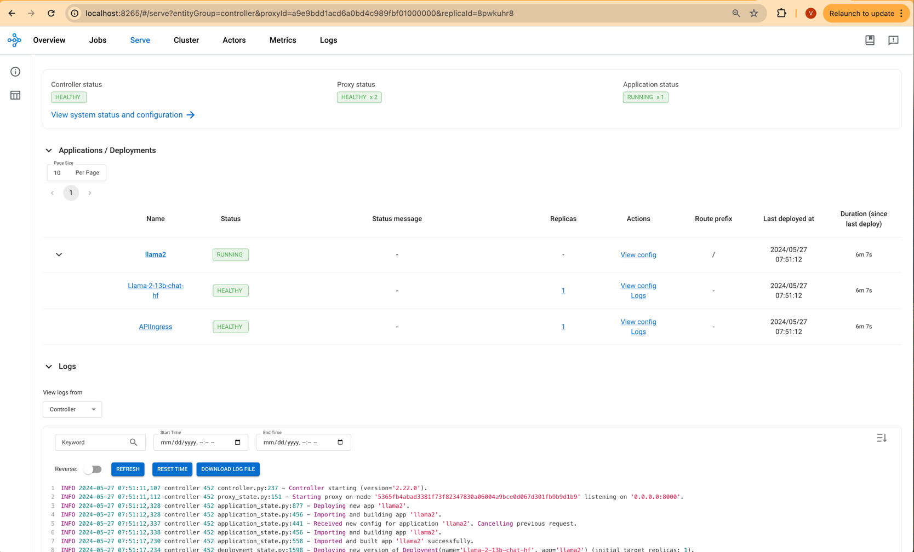
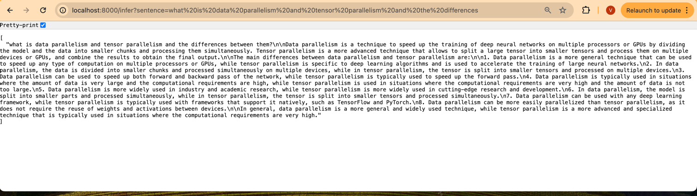
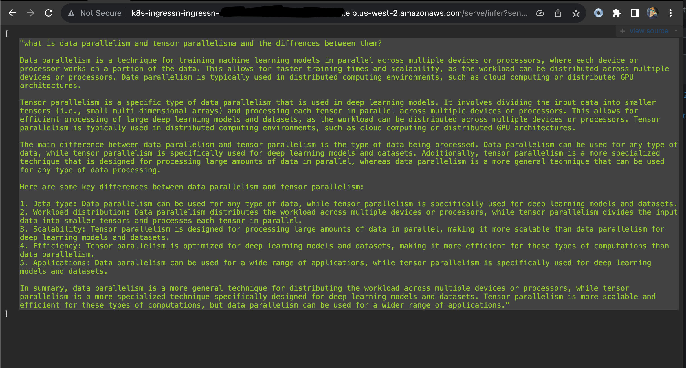
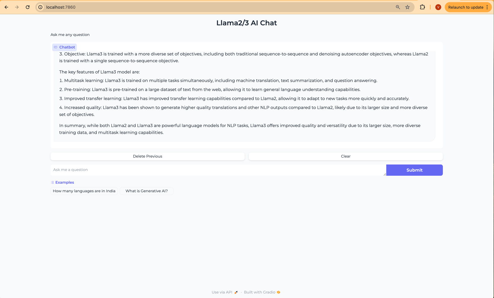

import CollapsibleContent from '../../../../src/components/CollapsibleContent';

:::caution

The **AI on EKS** content **is being migrated** to a new repository.
🔗 👉 [Read the full migration announcement »](https://awslabs.github.io/data-on-eks/docs/migration/migration-announcement)

:::

:::warning
Deployment of ML models on EKS requires access to GPUs or Neuron instances. If your deployment isn't working, it’s often due to missing access to these resources. Also, some deployment patterns rely on Karpenter autoscaling and static node groups; if nodes aren't initializing, check the logs for Karpenter or Node groups to resolve the issue.
:::

:::danger

Note: Use of this Llama-2 model is governed by the Meta license.
In order to download the model weights and tokenizer, please visit the [website](https://ai.meta.com/) and accept the license before requesting access.

:::

:::info

We are actively enhancing this blueprint to incorporate improvements in observability, logging, and scalability aspects.

:::


# Serving Llama-2-13b Chat Model with Inferentia, Ray Serve and Gradio
Welcome to the comprehensive guide on deploying the [Meta Llama-2-13b chat](https://ai.meta.com/llama/#inside-the-model) model on Amazon Elastic Kubernetes Service (EKS) using [Ray Serve](https://docs.ray.io/en/latest/serve/index.html).
In this tutorial, you will not only learn how to harness the power of Llama-2, but also gain insights into the intricacies of deploying large language models (LLMs) efficiently, particularly on [trn1/inf2](https://aws.amazon.com/machine-learning/neuron/) (powered by AWS Trainium and Inferentia) instances, such as `inf2.24xlarge` and `inf2.48xlarge`,
which are optimized for deploying and scaling large language models.

### What is Llama-2?
Llama-2 is a pretrained large language model (LLM) trained on 2 trillion tokens of text and code. It is one of the largest and most powerful LLMs available today. Llama-2 can be used for a variety of tasks, including natural language processing, text generation, and translation.

#### Llama-2-chat
Llama-2 is a remarkable language model that has undergone a rigorous training process. It starts with pretraining using publicly available online data. An initial version of Llama-2-chat is then created through supervised fine-tuning.
Following that, `Llama-2-chat` undergoes iterative refinement using Reinforcement Learning from Human Feedback (`RLHF`), which includes techniques like rejection sampling and proximal policy optimization (`PPO`).
This process results in a highly capable and fine-tuned language model that we will guide you to deploy and utilize effectively on **Amazon EKS** with **Ray Serve**.

Llama-2 is available in three different model sizes:

- **Llama-2-70b:** This is the largest Llama-2 model, with 70 billion parameters. It is the most powerful Llama-2 model and can be used for the most demanding tasks.
- **Llama-2-13b:** This is a medium-sized Llama-2 model, with 13 billion parameters. It is a good balance between performance and efficiency, and can be used for a variety of tasks.
- **Llama-2-7b:** This is the smallest Llama-2 model, with 7 billion parameters. It is the most efficient Llama-2 model and can be used for tasks that do not require the highest level of performance.

### **Which Llama-2 model size should I use?**
The best Llama-2 model size for you will depend on your specific needs. and it may not always be the largest model for achieving the highest performance. It's advisable to evaluate your needs and consider factors such as computational resources, response time, and cost-efficiency when selecting the appropriate Llama-2 model size. The decision should be based on a comprehensive assessment of your application's goals and constraints.

## Inference on Trn1/Inf2 Instances: Unlocking the Full Potential of Llama-2
**Llama-2** can be deployed on a variety of hardware platforms, each with its own set of advantages. However, when it comes to maximizing the efficiency, scalability, and cost-effectiveness of Llama-2, [AWS Trn1/Inf2 instances](https://aws.amazon.com/ec2/instance-types/inf2/) shine as the optimal choice.

**Scalability and Availability**
One of the key challenges in deploying large language models (`LLMs`) like Llama-2 is the scalability and availability of suitable hardware. Traditional `GPU` instances often face scarcity due to high demand, making it challenging to provision and scale resources effectively.
In contrast, `Trn1/Inf2` instances, such as `trn1.32xlarge`, `trn1n.32xlarge`, `inf2.24xlarge` and `inf2.48xlarge`, are purpose built for high-performance deep learning (DL) training and inference of generative AI models, including LLMs. They offer both scalability and availability, ensuring that you can deploy and scale your `Llama-2` models as needed, without resource bottlenecks or delays.

**Cost Optimization:**
Running LLMs on traditional GPU instances can be cost-prohibitive, especially given the scarcity of GPUs and their competitive pricing.
**Trn1/Inf2** instances provide a cost-effective alternative. By offering dedicated hardware optimized for AI and machine learning tasks, Trn1/Inf2 instances allow you to achieve top-notch performance at a fraction of the cost.
This cost optimization enables you to allocate your budget efficiently, making LLM deployment accessible and sustainable.

**Performance Boost**
While Llama-2 can achieve high-performance inference on GPUs, Neuron accelerators take performance to the next level. Neuron accelerators are purpose-built for machine learning workloads, providing hardware acceleration that significantly enhances Llama-2's inference speeds. This translates to faster response times and improved user experiences when deploying Llama-2 on Trn1/Inf2 instances.

### Model Specification
The table provides information about the different sizes of Llama-2 models, their weights, and the hardware requirements for deploying them. This information can be used to design the infrastructure required to deploy any size of Llama-2 model. For example, if you want to deploy the `Llama-2-13b-chat` model, you will need to use an instance type with at least `26 GB` of total accelerator memory.

| Model           | Weights | Bytes | Parameter Size (Billions) | Total Accelerator Memory (GB) | Accelerator Memory Size for NeuronCore (GB) | Required Neuron Cores | Required Neuron Accelerators | Instance Type   | tp_degree |
|-----------------|---------|-------|-----------------------------|------------------------------|---------------------------------------------|-----------------------|-----------------------------|-----------------|-----------|
| Meta/Llama-2-70b | float16 | 2     | 70                          | 140                          | 16                                          | 9                     | 5                           | inf2.48x        | 24        |
| Meta/Llama-2-13b | float16 | 2     | 13                          | 26                           | 16                                          | 2                     | 1                           | inf2.24x        | 12        |
| Meta/Llama-2-7b | float16 | 2     | 7                           | 14                           | 16                                          | 1                     | 1                           | inf2.24x        | 12        |

### Example usecase
A company wants to deploy a Llama-2 chatbot to provide customer support. The company has a large customer base and expects to receive a high volume of chat requests at peak times. The company needs to design an infrastructure that can handle the high volume of requests and provide a fast response time.

The company can use Inferentia2 instances to scale its Llama-2 chatbot efficiently. Inferentia2 instances are specialized hardware accelerators for machine learning tasks. They can provide up to 20x better performance and up to 7x lower cost than GPUs for machine learning workloads.

The company can also use Ray Serve to horizontally scale its Llama-2 chatbot. Ray Serve is a distributed framework for serving machine learning models. It can automatically scale your models up or down based on demand.

To scale its Llama-2 chatbot, the company can deploy multiple Inferentia2 instances and use Ray Serve to distribute the traffic across the instances. This will allow the company to handle a high volume of requests and provide a fast response time.

## Solution Architecture
In this section, we will delve into the architecture of our solution, which combines Llama-2 model, [Ray Serve](https://docs.ray.io/en/latest/serve/index.html) and [Inferentia2](https://aws.amazon.com/ec2/instance-types/inf2/) on Amazon EKS.


## Deploying the Solution
To get started with deploying `Llama-2-13b chat` on [Amazon EKS](https://aws.amazon.com/eks/), we will cover the necessary prerequisites and guide you through the deployment process step by step.
This includes setting up the infrastructure, deploying the **Ray cluster**, and creating the [Gradio](https://www.gradio.app/) WebUI app.

<CollapsibleContent header={<h2><span>Prerequisites</span></h2>}>
Before we begin, ensure you have all the prerequisites in place to make the deployment process smooth and hassle-free.
nsure that you have installed the following tools on your machine.

1. [aws cli](https://docs.aws.amazon.com/cli/latest/userguide/install-cliv2.html)
2. [kubectl](https://Kubernetes.io/docs/tasks/tools/)
3. [terraform](https://learn.hashicorp.com/tutorials/terraform/install-cli)

### Deploy

Clone the repository

```bash
git clone https://github.com/awslabs/data-on-eks.git
```

Navigate into one of the example directories and run `install.sh` script

**Important Note:** Ensure that you update the region in the `variables.tf` file before deploying the blueprint.
Additionally, confirm that your local region setting matches the specified region to prevent any discrepancies.
For example, set your `export AWS_DEFAULT_REGION="<REGION>"` to the desired region:

```bash
cd data-on-eks/ai-ml/trainium-inferentia/ && chmod +x install.sh
./install.sh
```

### Verify the resources

Verify the Amazon EKS Cluster

```bash
aws eks --region us-west-2 describe-cluster --name trainium-inferentia
```

```bash
# Creates k8s config file to authenticate with EKS
aws eks --region us-west-2 update-kubeconfig --name trainium-inferentia

kubectl get nodes # Output shows the EKS Managed Node group nodes
```

</CollapsibleContent>

## Deploying the Ray Cluster with Llama-2-Chat Model
Once the `Trainium on EKS` Cluster is deployed, you can proceed to use `kubectl` to deploy the `ray-service-Llama-2.yaml`.

In this step, we will deploy the Ray Serve cluster, which comprises one `Head Pod` on `x86 CPU` instances using Karpenter autoscaling, as well as `Ray workers` on `Inf2.48xlarge` instances, autoscaled by [Karpenter](https://karpenter.sh/).

Let's take a closer look at the key files used in this deployment and understand their functionalities before proceeding with the deployment:

- **ray_serve_Llama-2.py:**
This script uses FastAPI, Ray Serve, and PyTorch-based Hugging Face Transformers to create an efficient API for text generation using the [NousResearch/Llama-2-13b-chat-hf](https://huggingface.co/NousResearch/Llama-2-13b-chat-hf) language model.
Alternatively, users have the flexibility to switch to the [meta-llama/Llama-2-13b-chat-hf](https://huggingface.co/meta-llama/Llama-2-13b-chat-hf) model. The script establishes an endpoint that accepts input sentences and efficiently generates text outputs, benefiting from Neuron acceleration for enhanced performance. With its high configurability, users can fine-tune model parameters to suit a wide range of natural language processing applications, including chatbots and text generation tasks.

- **ray-service-Llama-2.yaml:**
This Ray Serve YAML file serves as a Kubernetes configuration for deploying the Ray Serve service, facilitating efficient text generation using the `Llama-2-13b-chat` model.
It defines a Kubernetes namespace named `Llama-2` to isolate resources. Within the configuration, the `RayService` specification, named `Llama-2-service`, is created and hosted within the `Llama-2` namespace. The `RayService` specification leverages the Python script `ray_serve_Llama-2.py` (copied into the Dockerfile located within the same folder) to create the Ray Serve service.
The Docker image used in this example is publicly available on Amazon Elastic Container Registry (ECR) for ease of deployment.
Users can also modify the Dockerfile to suit their specific requirements and push it to their own ECR repository, referencing it in the YAML file.

### Step1: Deploy the Llama-2-Chat Model

**Ensure the cluster is configured locally**
```bash
aws eks --region us-west-2 update-kubeconfig --name trainium-inferentia
```

**Deploy RayServe Cluster**

```bash
cd data-on-eks/gen-ai/inference/llama2-13b-chat-rayserve-inf2
kubectl apply -f ray-service-llama2.yaml
```

Verify the deployment by running the following commands

:::info

The deployment process may take up to 10 minutes. The Head Pod is expected to be ready within 2 to 3 minutes, while the Ray Serve worker pod may take up to 10 minutes for image retrieval and Model deployment from Huggingface.

:::

```bash
kubectl get all -n llama2
```

**Output:**

```text
NAME                                            READY   STATUS    RESTARTS   AGE
pod/llama2-raycluster-fcmtr-head-bf58d          1/1     Running   0          67m
pod/llama2-raycluster-fcmtr-worker-inf2-lgnb2   1/1     Running   0          5m30s

NAME                       TYPE        CLUSTER-IP       EXTERNAL-IP   PORT(S)                                         AGE
service/llama2             ClusterIP   172.20.118.243   <none>        10001/TCP,8000/TCP,8080/TCP,6379/TCP,8265/TCP   67m
service/llama2-head-svc    ClusterIP   172.20.168.94    <none>        8080/TCP,6379/TCP,8265/TCP,10001/TCP,8000/TCP   57m
service/llama2-serve-svc   ClusterIP   172.20.61.167    <none>        8000/TCP                                        57m

NAME                                        DESIRED WORKERS   AVAILABLE WORKERS   CPUS   MEMORY        GPUS   STATUS   AGE
raycluster.ray.io/llama2-raycluster-fcmtr   1                 1                   184    704565270Ki   0      ready    67m

NAME                       SERVICE STATUS   NUM SERVE ENDPOINTS
rayservice.ray.io/llama2   Running          2

```

```bash
kubectl get ingress -n llama2
```

**Output:**

```text
NAME     CLASS   HOSTS   ADDRESS                                                                         PORTS   AGE
llama2   nginx   *       k8s-ingressn-ingressn-aca7f16a80-1223456666.elb.us-west-2.amazonaws.com   80      69m
```

:::caution

This blueprint deploys an internal load balancer for security reasons, so you may not be able to access it from the browser unless you are in the same vpc.
You can modify the blueprint to make the NLB public by following the instructions [here](https://github.com/awslabs/data-on-eks/blob/5a2d1dfb39c89f3fd961beb350d6f1df07c2b31c/ai-ml/trainium-inferentia/helm-values/ingress-nginx-values.yaml#L8).

Alternatively, you can use port-forwarding to test the service without using a load balancer.

:::

Now, you can access the Ray Dashboard using the Load Balancer URL below by replacing `<NLB_DNS_NAME>` with your NLB endpoint:

```text
http://\<NLB_DNS_NAME\>/dashboard/#/serve
```

If you don't have access to a public Load Balancer, you can use port-forwarding and browse the Ray Dashboard using localhost with the following command:

```bash
kubectl port-forward service/llama2 8265:8265 -n llama2
```

**Open the link in the browser**: http://localhost:8265/

From this webpage, you will be able to monitor the progress of Model deployment, as shown in the image below:



### Step2: To Test the Llama-2-Chat Model
Once you see the status of the model deployment is in `running` state then you can start using Llama-2-chat.

**Using Port-Forwarding**

First, use port-forwarding to access the service locally:

```bash
kubectl port-forward service/llama2-serve-svc 8000:8000 -n llama2
```

Then, you can test the model using the following URL with a query added at the end of the URL:

```bash
http://localhost:8000/infer?sentence=what is data parallelism and tensor parallelism and the differences
```

You will see an output like this in your browser.



**Using the NLB**:

If you prefer to use a Network Load Balancer (NLB), you can modify the blueprint to make the NLB public by following the instructions [here](https://github.com/awslabs/data-on-eks/blob/5a2d1dfb39c89f3fd961beb350d6f1df07c2b31c/ai-ml/trainium-inferentia/helm-values/ingress-nginx-values.yaml#L8).

Then, you can use the following URL with a query added at the end of the URL:

```text
http://\<NLB_DNS_NAME\>/serve/infer?sentence=what is data parallelism and tensor parallelisma and the differences
```

You will see an output like this in your browser:



### Step3: Deploying the Gradio WebUI App

[Gradio](https://www.gradio.app/) Web UI is used to interact with the Llama2 inference service deployed on EKS Clusters using inf2 instances.
The Gradio UI communicates internally with the Llama2 service(`llama2-serve-svc.llama2.svc.cluster.local:8000`), which is exposed on port `8000`, using its service name and port.

We have created a base Docker(`gen-ai/inference/gradio-ui/Dockerfile-gradio-base`) image for the Gradio app, which can be used with any model inference.
This image is published on [Public ECR](https://gallery.ecr.aws/data-on-eks/gradio-web-app-base).

#### Steps to Deploy a Gradio App:

The following YAML script (`gen-ai/inference/llama2-13b-chat-rayserve-inf2/gradio-ui.yaml`) creates a dedicated namespace, deployment, service, and a ConfigMap where your model client script goes.

To deploy this, execute:

```bash
cd data-on-eks/gen-ai/inference/llama2-13b-chat-rayserve-inf2/
kubectl apply -f gradio-ui.yaml
```

**Verification Steps:**
Run the following commands to verify the deployment, service, and ConfigMap:

```bash
kubectl get deployments -n gradio-llama2-inf2

kubectl get services -n gradio-llama2-inf2

kubectl get configmaps -n gradio-llama2-inf2
```

**Port-Forward the Service:**

Run the port-forward command so that you can access the Web UI locally:

```bash
kubectl port-forward service/gradio-service 7860:7860 -n gradio-llama2-inf2
```

#### Invoke the WebUI

Open your web browser and access the Gradio WebUI by navigating to the following URL:

Running on local URL:  http://localhost:7860

You should now be able to interact with the Gradio application from your local machine.



## Conclusion
In conclusion, you will have successfully deployed the **Llama-2-13b chat** model on EKS with Ray Serve and created a chatGPT-style chat web UI using Gradio.
This opens up exciting possibilities for natural language processing and chatbot development.

In summary, when it comes to deploying and scaling Llama-2, AWS Trn1/Inf2 instances offer a compelling advantage.
They provide the scalability, cost optimization, and performance boost needed to make running large language models efficient and accessible, all while overcoming the challenges associated with the scarcity of GPUs.
Whether you're building chatbots, natural language processing applications, or any other LLM-driven solution, Trn1/Inf2 instances empower you to harness the full potential of Llama-2 on the AWS cloud.

## Cleanup

Finally, we'll provide instructions for cleaning up and deprovisioning the resources when they are no longer needed.

**Step1:** Delete Gradio App and Llama2 Inference deployment

```bash
cd data-on-eks/gen-ai/inference/llama2-13b-chat-rayserve-inf2
kubectl delete -f gradio-ui.yaml
kubectl delete -f ray-service-llama2.yaml
```

**Step2:** Cleanup the EKS Cluster
This script will cleanup the environment using `-target` option to ensure all the resources are deleted in correct order.

```bash
cd data-on-eks/ai-ml/trainium-inferentia
./cleanup.sh
```
