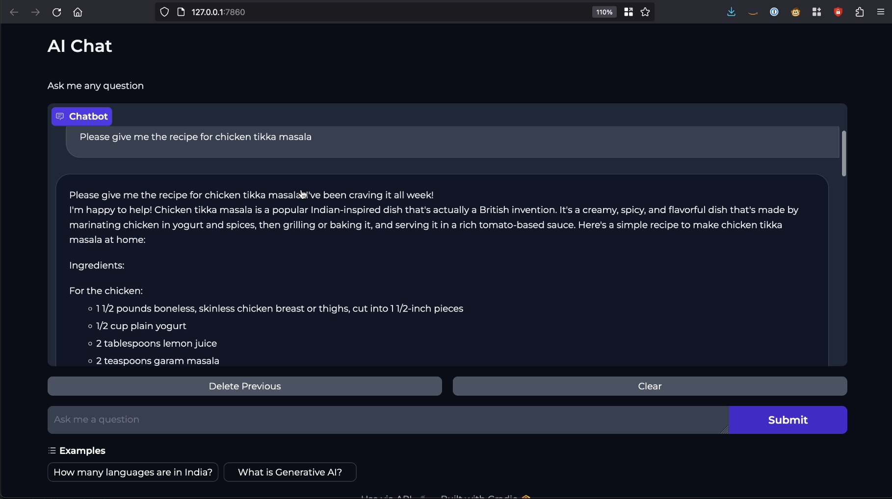

import CollapsibleContent from '../../../../src/components/CollapsibleContent';

:::caution

The **AI on EKS** content **is being migrated** to a new repository.
🔗 👉 [Read the full migration announcement »](https://awslabs.github.io/data-on-eks/docs/migration/migration-announcement)

:::

:::warning
Deployment of ML models on EKS requires access to GPUs or Neuron instances. If your deployment isn't working, it’s often due to missing access to these resources. Also, some deployment patterns rely on Karpenter autoscaling and static node groups; if nodes aren't initializing, check the logs for Karpenter or Node groups to resolve the issue.
:::


:::danger

Note: Use of this Llama-3 Instruct model is governed by the Meta license.
In order to download the model weights and tokenizer, please visit the [website](https://huggingface.co/meta-llama/Meta-Llama-3-8B) and accept the license before requesting access.

:::

:::info

We are actively enhancing this blueprint to incorporate improvements in observability, logging, and scalability aspects.
:::


# Serving Llama-3-8B Instruct Model with Inferentia, Ray Serve and Gradio

Welcome to the comprehensive guide on deploying the [Meta Llama-3-8B Instruct](https://ai.meta.com/llama/#inside-the-model) model on Amazon Elastic Kubernetes Service (EKS) using [Ray Serve](https://docs.ray.io/en/latest/serve/index.html).

In this tutorial, you will not only learn how to harness the power of Llama-3, but also gain insights into the intricacies of deploying large language models (LLMs) efficiently, particularly on [trn1/inf2](https://aws.amazon.com/machine-learning/neuron/) (powered by AWS Trainium and Inferentia) instances, such as `inf2.24xlarge` and `inf2.48xlarge`, which are optimized for deploying and scaling large language models.

### What is Llama-3-8B Instruct?

Meta developed and released the Meta Llama 3 family of large language models (LLMs), a collection of pretrained and instruction tuned generative text models in 8 and 70B sizes. The Llama 3 instruction tuned models are optimized for dialogue use cases and outperform many of the available open source chat models on common industry benchmarks. Further, in developing these models, we took great care to optimize helpfulness and safety.

More information on Llama3 sizes and model architecture can be found [here](https://huggingface.co/meta-llama/Meta-Llama-3-8B-Instruct).

**Scalability and Availability**

One of the key challenges in deploying large language models (`LLMs`) like Llama-3 is the scalability and availability of suitable hardware. Traditional `GPU` instances often face scarcity due to high demand, making it challenging to provision and scale resources effectively.

In contrast, `Trn1/Inf2` instances, such as `trn1.32xlarge`, `trn1n.32xlarge`, `inf2.24xlarge` and `inf2.48xlarge`, are purpose built for high-performance deep learning (DL) training and inference of generative AI models, including LLMs. They offer both scalability and availability, ensuring that you can deploy and scale your `Llama-3` models as needed, without resource bottlenecks or delays.

**Cost Optimization**

Running LLMs on traditional GPU instances can be cost-prohibitive, especially given the scarcity of GPUs and their competitive pricing. **Trn1/Inf2** instances provide a cost-effective alternative. By offering dedicated hardware optimized for AI and machine learning tasks, Trn1/Inf2 instances allow you to achieve top-notch performance at a fraction of the cost. This cost optimization enables you to allocate your budget efficiently, making LLM deployment accessible and sustainable.

**Performance Boost**

While Llama-3 can achieve high-performance inference on GPUs, Neuron accelerators take performance to the next level. Neuron accelerators are purpose-built for machine learning workloads, providing hardware acceleration that significantly enhances Llama-3's inference speeds. This translates to faster response times and improved user experiences when deploying Llama-3 on Trn1/Inf2 instances.


### Example usecase

A company wants to deploy a Llama-3 chatbot to provide customer support. The company has a large customer base and expects to receive a high volume of chat requests at peak times. The company needs to design an infrastructure that can handle the high volume of requests and provide a fast response time.

The company can use Inferentia2 instances to scale its Llama-3 chatbot efficiently. Inferentia2 instances are specialized hardware accelerators for machine learning tasks. They can provide up to 20x better performance and up to 7x lower cost than GPUs for machine learning workloads.

The company can also use Ray Serve to horizontally scale its Llama-3 chatbot. Ray Serve is a distributed framework for serving machine learning models. It can automatically scale your models up or down based on demand.

To scale its Llama-3 chatbot, the company can deploy multiple Inferentia2 instances and use Ray Serve to distribute the traffic across the instances. This will allow the company to handle a high volume of requests and provide a fast response time.

## Solution Architecture

In this section, we will delve into the architecture of our solution, which combines Llama-3 model, [Ray Serve](https://docs.ray.io/en/latest/serve/index.html) and [Inferentia2](https://aws.amazon.com/ec2/instance-types/inf2/) on Amazon EKS.



## Deploying the Solution

To get started with deploying `Llama-4-8b-instruct` on [Amazon EKS](https://aws.amazon.com/eks/), we will cover the necessary prerequisites and guide you through the deployment process step by step.

This includes setting up the infrastructure, deploying the **Ray cluster**, and creating the [Gradio](https://www.gradio.app/) WebUI app.

<CollapsibleContent header={<h2><span>Prerequisites</span></h2>}>
Before we begin, ensure you have all the prerequisites in place to make the deployment process smooth and hassle-free.
nsure that you have installed the following tools on your machine.

1. [aws cli](https://docs.aws.amazon.com/cli/latest/userguide/install-cliv2.html)
2. [kubectl](https://Kubernetes.io/docs/tasks/tools/)
3. [terraform](https://learn.hashicorp.com/tutorials/terraform/install-cli)

### Deploy

Clone the repository

```bash
git clone https://github.com/awslabs/data-on-eks.git
```

Navigate into one of the example directories and run `install.sh` script

**Important Note:** Ensure that you update the region in the `variables.tf` file before deploying the blueprint.
Additionally, confirm that your local region setting matches the specified region to prevent any discrepancies.
For example, set your `export AWS_DEFAULT_REGION="<REGION>"` to the desired region:

```bash
cd data-on-eks/ai-ml/trainium-inferentia/
./install.sh
```

### Verify the resources

Verify the Amazon EKS Cluster

```bash
aws eks --region us-west-2 describe-cluster --name trainium-inferentia
```

```bash
# Creates k8s config file to authenticate with EKS
aws eks --region us-west-2 update-kubeconfig --name trainium-inferentia

kubectl get nodes # Output shows the EKS Managed Node group nodes
```

</CollapsibleContent>

## Deploying the Ray Cluster with Llama3 Model
Once the `Trainium on EKS` Cluster is deployed, you can proceed to use `kubectl` to deploy the `ray-service-Llama-3.yaml`.

In this step, we will deploy the Ray Serve cluster, which comprises one `Head Pod` on `x86 CPU` instances using Karpenter autoscaling, as well as `Ray workers` on `Inf2.48xlarge` instances, autoscaled by [Karpenter](https://karpenter.sh/).

Let's take a closer look at the key files used in this deployment and understand their functionalities before proceeding with the deployment:

- **ray_serve_Llama-3.py:**

This script uses FastAPI, Ray Serve, and PyTorch-based Hugging Face Transformers to create an efficient API for text generation using the [meta-llama/Meta-Llama-3-8B-Instruct](https://huggingface.co/meta-llama/Meta-Llama-3-8B-Instruct) language model.

The script establishes an endpoint that accepts input sentences and efficiently generates text outputs, benefiting from Neuron acceleration for enhanced performance. With its high configurability, users can fine-tune model parameters to suit a wide range of natural language processing applications, including chatbots and text generation tasks.

- **ray-service-Llama-3.yaml:**

This Ray Serve YAML file serves as a Kubernetes configuration for deploying the Ray Serve service, facilitating efficient text generation using the `llama-3-8B-Instruct` model.

It defines a Kubernetes namespace named `llama3` to isolate resources. Within the configuration, the `RayService` specification, named `llama-3`, is created and hosted within the `llama3` namespace. The `RayService` specification leverages the Python script `ray_serve_llama3.py` (copied into the Dockerfile located within the same folder) to create the Ray Serve service.

The Docker image used in this example is publicly available on Amazon Elastic Container Registry (ECR) for ease of deployment.
Users can also modify the Dockerfile to suit their specific requirements and push it to their own ECR repository, referencing it in the YAML file.

### Deploy the Llama-3-Instruct Model

**Ensure the cluster is configured locally**
```bash
aws eks --region us-west-2 update-kubeconfig --name trainium-inferentia
```

**Deploy RayServe Cluster**

:::info

To deploy the llama3-8B-Instruct model, it's essential to configure your Hugging Face Hub token as an environment variable. This token is required for authentication and accessing the model. For guidance on how to create and manage your Hugging Face tokens, please visit [Hugging Face Token Management](https://huggingface.co/docs/hub/security-tokens).
:::


```bash
# set the Hugging Face Hub Token as an environment variable. This variable will be substituted when applying the ray-service-mistral.yaml file

export  HUGGING_FACE_HUB_TOKEN=<Your-Hugging-Face-Hub-Token-Value>

cd data-on-eks/gen-ai/inference/llama3-8b-rayserve-inf2
envsubst < ray-service-llama3.yaml| kubectl apply -f -
```

Verify the deployment by running the following commands

:::info

The deployment process may take up to 10 minutes. The Head Pod is expected to be ready within 2 to 3 minutes, while the Ray Serve worker pod may take up to 10 minutes for image retrieval and Model deployment from Huggingface.

:::

```text
$ kubectl get all -n llama3

NAME                                                          READY   STATUS              RESTARTS   AGE
pod/llama3-raycluster-smqrl-head-4wlbb                        0/1     Running             0          77s
pod/service-raycluster-smqrl-worker-inf2-wjxqq                0/1     Running             0          77s

NAME                     TYPE       CLUSTER-IP      EXTERNAL-IP   PORT(S)                                                                                       AGE
service/llama3           ClusterIP   172.20.246.48   <none>       8000:32138/TCP,52365:32653/TCP,8080:32604/TCP,6379:32739/TCP,8265:32288/TCP,10001:32419/TCP   78s

$ kubectl get ingress -n llama3

NAME             CLASS   HOSTS   ADDRESS                                                                         PORTS   AGE
llama3           nginx   *       k8s-ingressn-ingressn-randomid-randomid.elb.us-west-2.amazonaws.com             80      2m4s

```

Now, you can access the Ray Dashboard from the Load balancer URL below.

    http://\<NLB_DNS_NAME\>/dashboard/#/serve

If you don't have access to a public Load Balancer, you can use port-forwarding and browse the Ray Dashboard using localhost with the following command:

```bash
kubectl port-forward svc/llama3 8265:8265 -n llama3

# Open the link in the browser
http://localhost:8265/

```

From this webpage, you will be able to monitor the progress of Model deployment, as shown in the image below:


### To Test the Llama3 Model
Once you see the status of the model deployment is in `running` state then you can start using Llama-3-instruct.

You can use the following URL with a query added at the end of the URL.

    http://\<NLB_DNS_NAME\>/serve/infer?sentence=what is data parallelism and tensor parallelisma and the differences

You will see an output like this in your browser:


## Deploying the Gradio WebUI App
Discover how to create a user-friendly chat interface using [Gradio](https://www.gradio.app/) that integrates seamlessly with deployed models.

Let's deploy Gradio app locally on your machine to interact with the LLama-3-Instruct model deployed using RayServe.

:::info

The Gradio app interacts with the locally exposed service created solely for the demonstration. Alternatively, you can deploy the Gradio app on EKS as a Pod with Ingress and Load Balancer for wider accessibility.

:::

### Execute Port Forward to the llama3 Ray Service
First, execute a port forward to the Llama-3 Ray Service using kubectl:

```bash
kubectl port-forward svc/llama2-service 8000:8000 -n llama3
```

## Deploying the Gradio WebUI App
Discover how to create a user-friendly chat interface using [Gradio](https://www.gradio.app/) that integrates seamlessly with deployed models.

Let's move forward with setting up the Gradio app as a Docker container running on localhost. This setup will enable interaction with the Stable Diffusion XL model, which is deployed using RayServe.

### Build the Gradio app docker container

First, lets build the docker container for the client app.

```bash
cd data-on-eks/gen-ai/inference/gradio-ui
docker build --platform=linux/amd64 \
    -t gradio-app:llama \
    --build-arg GRADIO_APP="gradio-app-llama.py" \
    .
```

### Deploy the Gradio container

Deploy the Gradio app as a container on localhost using docker:

```bash
docker run --rm -it -p 7860:7860 -p 8000:8000 gradio-app:llama
```
:::info
If you are not running Docker Desktop on your machine and using something like [finch](https://runfinch.com/) instead then you will need to additional flags for a custom host-to-IP mapping inside the container.

```
docker run --rm -it \
    --add-host ray-service:<workstation-ip> \
    -e "SERVICE_NAME=http://ray-service:8000" \
    -p 7860:7860 gradio-app:llama
```
:::

#### Invoke the WebUI

Open your web browser and access the Gradio WebUI by navigating to the following URL:

Running on local URL:  http://localhost:7860

You should now be able to interact with the Gradio application from your local machine.


## Conclusion

In summary, when it comes to deploying and scaling Llama-3, AWS Trn1/Inf2 instances offer a compelling advantage.
They provide the scalability, cost optimization, and performance boost needed to make running large language models efficient and accessible, all while overcoming the challenges associated with the scarcity of GPUs. Whether you're building chatbots, natural language processing applications, or any other LLM-driven solution, Trn1/Inf2 instances empower you to harness the full potential of Llama-3 on the AWS cloud.

## Cleanup

Finally, we'll provide instructions for cleaning up and deprovisioning the resources when they are no longer needed.

**Step1:** Delete Gradio Container

`Ctrl-c` on the localhost terminal window where `docker run` is running to kill the container running the Gradio app. Optionally clean up the docker image

```bash
docker rmi gradio-app:llama
```
**Step2:** Delete Ray Cluster

```bash
cd data-on-eks/gen-ai/inference/llama3-8b-instruct-rayserve-inf2
kubectl delete -f ray-service-llama3.yaml
```

**Step3:** Cleanup the EKS Cluster
This script will cleanup the environment using `-target` option to ensure all the resources are deleted in correct order.

```bash
cd data-on-eks/ai-ml/trainium-inferentia/
./cleanup.sh
```
