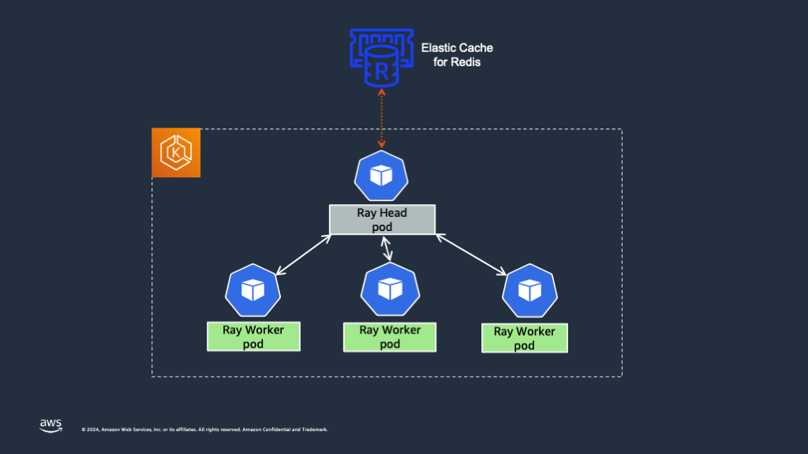
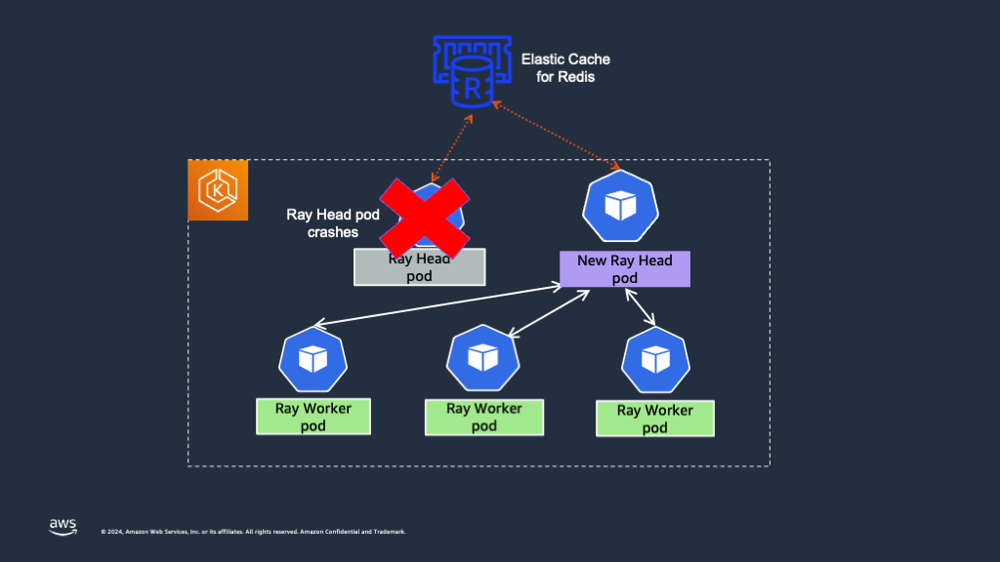
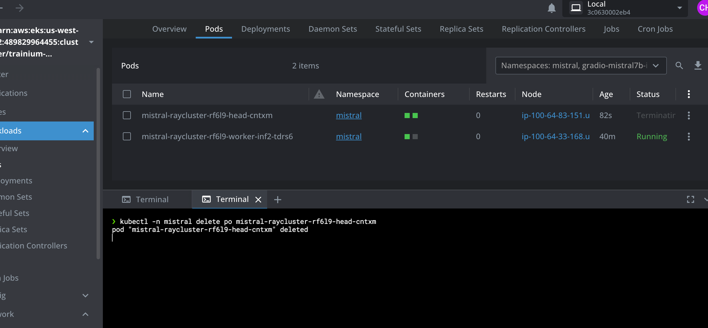
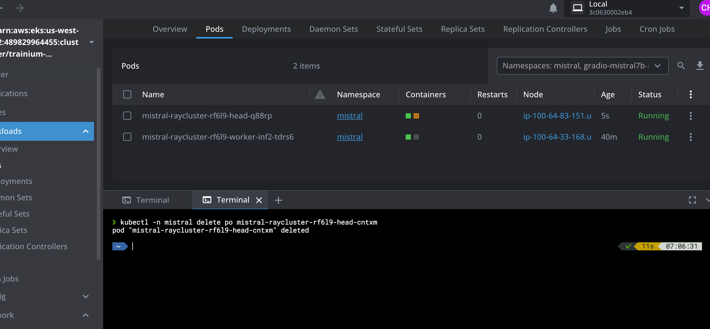
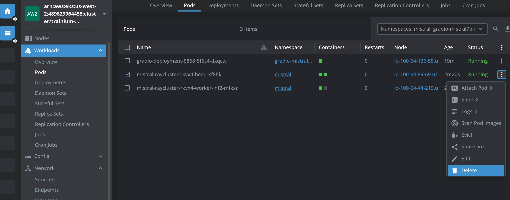
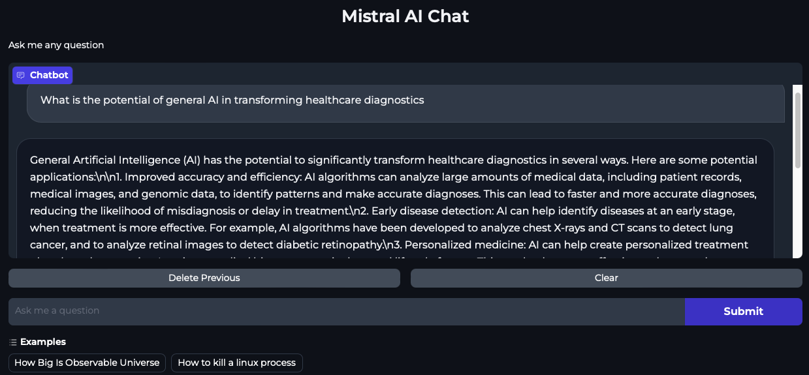
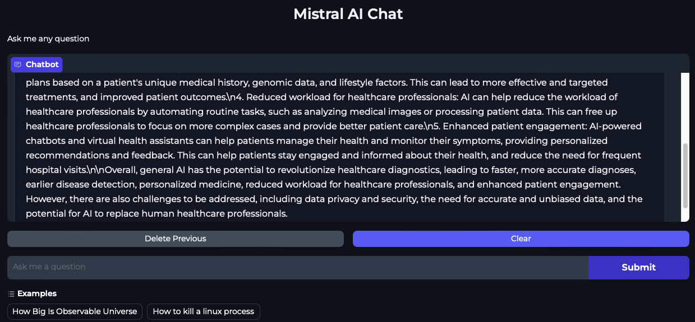

import CollapsibleContent from '../../../../src/components/CollapsibleContent';

:::caution

The **AI on EKS** content **is being migrated** to a new repository.
🔗 👉 [Read the full migration announcement »](https://awslabs.github.io/data-on-eks/docs/migration/migration-announcement)

:::

:::warning
Deployment of ML models on EKS requires access to GPUs or Neuron instances. If your deployment isn't working, it’s often due to missing access to these resources. Also, some deployment patterns rely on Karpenter autoscaling and static node groups; if nodes aren't initializing, check the logs for Karpenter or Node groups to resolve the issue.
:::

:::danger

Note: Mistral-7B-Instruct-v0.2 is a gated model in [Huggingface](https://huggingface.co/mistralai/Mistral-7B-Instruct-v0.2) repository. In order to use this model, one needs to use a HuggingFace Token.
To generate a token in HuggingFace, log in using your HuggingFace account and click on `Access Tokens` menu item on the [Settings](https://huggingface.co/settings/tokens) page.

:::

## Ray Head Node High Availability With Elastic Cache for Redis

A critical component of a Ray cluster is the head node, which orchestrates the entire cluster by managing task scheduling, state synchronization, and node coordination. However, by default, the Ray head Pod represents a single point of failure; if it fails, the entire cluster including the Ray worker Pods need to be restarted.

To address this, High Availability (HA) for the Ray head node is essential. Global Control Service (GCS) manages cluster-level metadata in a RayCluster. By default, the GCS lacks fault tolerance as it stores all data in-memory, and a failure can cause the entire Ray cluster to fail. To avoid this, one must add fault tolerance to Ray’s Global Control Store (GCS), which allows the Ray Serve application to serve traffic even when the head node crashes. In the event of a GCS restart, it retrieves all the data from the Redis instance and resumes its regular functions.





Following sections provide the steps on how to enable GCS fault tolerance and ensure high availability for the Ray head Pod. We're using the `Mistral-7B-Instruct-v0.2` model to demonstrate the Ray head high availability.

### Add an External Redis Server

GCS fault tolerance requires an external Redis database. You can choose to host your own Redis database, or you can use one through a third-party vendor.

For development and testing purposes, you can also host a containerized Redis database on the same EKS cluster as your Ray cluster. However, for production setups, it's recommended to use a highly available external Redis cluster. In this pattern, we've used [Amazon ElasticCache for Redis](https://aws.amazon.com/elasticache/redis/) to create an external Redis cluster. You can also choose to use [Amazon memoryDB](https://aws.amazon.com/memorydb/) for setting up a Redis cluster.

As part of the current blueprint, we've added a terraform module named `elasticache` that creates an Elastic Cache Redis cluster in AWS. This uses The Redis cluster has cluster mode disabled and contain one node. This cluster node's endpoint can be used for both reads and writes.

Key things to note in this module are -

- The Redis Cluster is in the same VPC as the EKS cluster. If the Redis cluster is created in a separate VPC, then VPC peering needs to be set up between the EKS cluster VPC and the Elastic Cache Redis cluster VPC to enable network connectivity.
- A cache subnet group needs to be created at the time of creating the Redis cluster. A subnet group is a collection of subnets that you may want to designate for your caches in a VPC. ElastiCache uses that cache subnet group to assign IP addresses within that subnet to each cache node in the cache. The blueprint automatically adds all the subnets used by the EKS cluster in the subnet group for the Elastic cache Redis cluster.
- Security Group - The Security Group assigned to the Redis cache needs to have an inbound rule that allows TCP traffic from EKS Cluster's worker node security group to the Redis cluster security group over port 6379. This is because the Ray head Pod needs to establish a connection to the Elastic cache Redis cluster over port 6379. The blueprint automatically sets up the security group with the inbound rule.

To create the Redis cluster using Amazon Elastic Cache, please follow the below steps.

:::info

This Mistral7b deployment is using Ray Serve with High availability. If you have already deployed mistral7b in the previous steps, then you can delete the deployment and run the below steps.

:::

**Prerequisites**:

1. [aws cli](https://docs.aws.amazon.com/cli/latest/userguide/install-cliv2.html)
2. [kubectl](https://Kubernetes.io/docs/tasks/tools/)
3. [terraform](https://learn.hashicorp.com/tutorials/terraform/install-cli)
4. [envsubst](https://pypi.org/project/envsubst/)
5. [jq](https://jqlang.github.io/jq/download/)

First, enable the creation of the Redis cluster by setting the `enable_rayserve_ha_elastic_cache_redis` variable to `true` by running the below command. By default it's set to `false`.

```bash
export TF_VAR_enable_rayserve_ha_elastic_cache_redis=true
```

Then, run the `install.sh` script to install the EKS cluster with KubeRay operator and other add-ons.

```bash
cd data-on-eks/ai-ml/trainimum-inferentia
./install.sh
```

In addition to the EKS cluster, this blueprint creates an AWS Elastic Cache Redis Cluster. Sample output looks like below

```text
Apply complete! Resources: 8 added, 1 changed, 0 destroyed.

Outputs:

configure_kubectl = "aws eks --region us-west-2 update-kubeconfig --name trainium-inferentia"
elastic_cache_redis_cluster_arn = "arn:aws:elasticache:us-west-2:11111111111:cluster:trainium-inferentia"
```

### Add External Redis Information to RayService

Once the elastic cache Redis cluster is created, we need to modify the `RayService` configuration for `mistral-7b` model inference.

First we need to obtain the Elastic Cache Redis Cluster endpoint by using AWS CLI and jq like below.

```bash
export EXT_REDIS_ENDPOINT=$(aws elasticache describe-cache-clusters \
    --cache-cluster-id "trainium-inferentia" \
    --show-cache-node-info | jq -r '.CacheClusters[0].CacheNodes[0].Endpoint.Address')
```

Now, add the annotation `ray.io/ft-enabled: "true"` under `RayService` CRD. The annotation `ray.io/ft-enabled` enables GCS fault tolerance when set to `true`.

```yaml
apiVersion: ray.io/v1
kind: RayService
metadata:
  name: mistral
  namespace: mistral
  annotations:
    ray.io/ft-enabled: "true"
```

Add the external Redis cluster information in the `headGroupSpec` as `RAY_REDIS_ADDRESS` environment variable.

```yaml
headGroupSpec:
  headService:
    metadata:
      name: mistral
      namespace: mistral
  rayStartParams:
    dashboard-host: '0.0.0.0'
    num-cpus: "0"
  template:
    spec:
      containers:
      - name: head
        ....
        env:
          - name: RAY_REDIS_ADDRESS
            value: $EXT_REDIS_ENDPOINT:6379
```

`RAY_REDIS_ADDRESS`’s value should be your Redis database’s address. It should contain the Redis cluster endpoint and the port.

You can find the full `RayService` configuration with GCS fault tolerance enabled in `gen-ai/inference/mistral-7b-rayserve-inf2/ray-service-mistral-ft.yaml` file.

With the above `RayService` configuration, we have enabled GCS fault tolerance for the Ray head Pod and the Ray cluster can recover from head Pod crashes without restarting all the Ray workers.

Let's apply the above `RayService` configuration and check the behavior.

```bash
cd data-on-eks/gen-ai/inference/
envsubst < mistral-7b-rayserve-inf2/ray-service-mistral-ft.yaml| kubectl apply -f -
```

The output should look like below

```text
namespace/mistral created
secret/hf-token created
rayservice.ray.io/mistral created
ingress.networking.k8s.io/mistral created
```

Check the status of the Ray Pods in the cluster.

```bash
kubectl get po -n mistral
```

The Ray head and worker Pods should be in `Running` state as below.

```text
NAME                                         READY   STATUS    RESTARTS   AGE
mistral-raycluster-rf6l9-head-hc8ch          2/2     Running   0          31m
mistral-raycluster-rf6l9-worker-inf2-tdrs6   1/1     Running   0          31m
```

### Simulate Ray Head Pod Crash

Simulate Ray head Pod crashing by deleting the Pod

```bash
kubectl -n mistral delete po mistral-raycluster-rf6l9-head-xxxxx
pod "mistral-raycluster-rf6l9-head-xxxxx" deleted
```

We can see that the Ray worker Pod is still running when the Ray head Pod is terminated and auto-restarted. Please see the below screenshots from Lens IDE.





#### Test the Mistral AI Gradio App

Let's also test our Gradio UI App to see whether it's able to answer questions while the Ray head Pod is deleted.

Open the Gradio Mistral AI Chat application by pointing your browser to localhost:7860.

Now repeat the Ray head Pod crash simulation by deleting the Ray head Pod as shown in the above steps.

While the Ray head Pod is terminated and is recovering, submit questions into the Mistral AI Chat interface. We can see from below screenshots that the chat application is indeed able to serve traffic while the Ray head Pod is deleted and is recovering. This is because the RayServe service points to the Ray worker Pod which in this case is never restarted because of the GCS fault tolerance.







For a complete guide on enabling end-to-end fault tolerance to your RayServe application, please refer to [Ray Guide](https://docs.ray.io/en/latest/serve/production-guide/fault-tolerance.html#add-end-to-end-fault-tolerance).

## Cleanup

Finally, we'll provide instructions for cleaning up and deprovisioning the resources when they are no longer needed.

**Step1:** Delete Gradio App and mistral Inference deployment

```bash
cd data-on-eks/gen-ai/inference/mistral-7b-rayserve-inf2
kubectl delete -f gradio-ui.yaml
kubectl delete -f ray-service-mistral-ft.yaml
```

**Step2:** Cleanup the EKS Cluster
This script will cleanup the environment using `-target` option to ensure all the resources are deleted in correct order.

```bash
cd data-on-eks/ai-ml/trainium-inferentia/
./cleanup.sh
```
