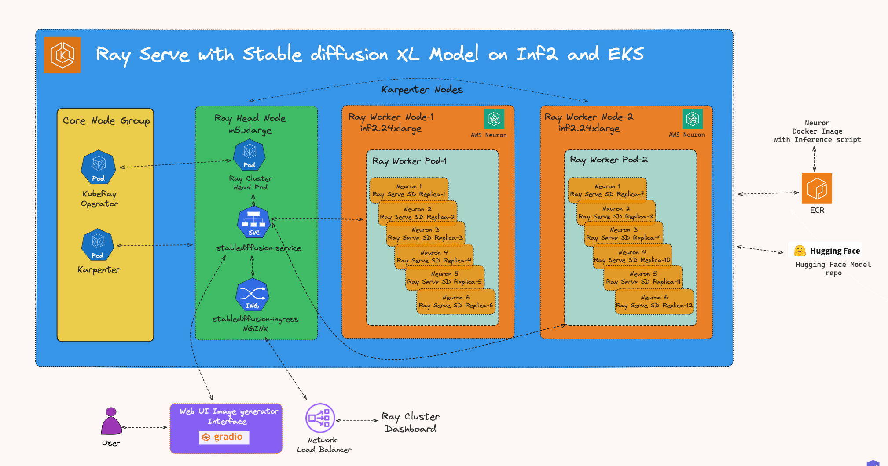

import CollapsibleContent from '../../../../src/components/CollapsibleContent';

:::caution

The **AI on EKS** content **is being migrated** to a new repository.
🔗 👉 [Read the full migration announcement »](https://awslabs.github.io/data-on-eks/docs/migration/migration-announcement)

:::

:::warning
Deployment of ML models on EKS requires access to GPUs or Neuron instances. If your deployment isn't working, it’s often due to missing access to these resources. Also, some deployment patterns rely on Karpenter autoscaling and static node groups; if nodes aren't initializing, check the logs for Karpenter or Node groups to resolve the issue.
:::

:::info

This example blueprint deploys a `stable-diffusion-xl-base-1-0` model on Inferentia2 instance running as a worker node in an EKS cluster. The model is served using `RayServe`.

:::

# Serving Stable Diffusion XL Base  Model with Inferentia, Ray Serve and Gradio
Welcome to the comprehensive guide on deploying the [Stable Diffusion XL Base](https://huggingface.co/stabilityai/stable-diffusion-xl-base-1.0) model on Amazon Elastic Kubernetes Service (EKS) using [Ray Serve](https://docs.ray.io/en/latest/serve/index.html).
In this tutorial, you will not only learn how to harness the power of Stable Diffusion models, but also gain insights into the intricacies of deploying large language models (LLMs) efficiently, particularly on [trn1/inf2](https://aws.amazon.com/machine-learning/neuron/) (powered by AWS Trainium and Inferentia) instances, such as `inf2.24xlarge` and `inf2.48xlarge`,
which are optimized for deploying and scaling large language models.

### What is Stable Diffusion?
Stable Diffusion is a text-to-image model for creating stunning art within seconds. It is one of the largest and most powerful LLMs available today. It is primarily used to generate detailed images conditioned on text descriptions, though it can also be applied to other tasks such as inpainting, outpainting, and generating image-to-image translations guided by a text prompt.

#### Stable Diffusion XL(SDXL)
SDXL is a latent diffusion model for text-to-image synthesis. Compared to previous versions of Stable Diffusion, SDXL  uses pipelines for latent diffusion and noise reduction. SDXL also improves the quality of generated images compared to prior Stable Diffusion models by using a times larger UNet. The increase of model parameters is mainly due to more attention blocks and a larger cross-attention context as SDXL uses a second text encoder.

SDXL has been designed with multiple novel conditioning schemes and trained on multiple aspect ratios. It also uses a refinement model which is used to improve the visual fidelity of samples generated by SDXL using a post-hoc image-to-image technique.

This process results in a highly capable and fine-tuned language model that we will guide you to deploy and utilize effectively on **Amazon EKS** with **Ray Serve**.

## Inference on Trn1/Inf2 Instances: Unlocking the Full Potential of Stable Diffusion LLMs
**Stable Diffusion XL** can be deployed on a variety of hardware platforms, each with its own set of advantages. However, when it comes to maximizing the efficiency, scalability, and cost-effectiveness of Stable Diffusion models, [AWS Trn1/Inf2 instances](https://aws.amazon.com/ec2/instance-types/inf2/) shine as the optimal choice.

**Scalability and Availability**
One of the key challenges in deploying large language models (`LLMs`) like StableDiffusion XL is the scalability and availability of suitable hardware. Traditional `GPU` instances often face scarcity due to high demand, making it challenging to provision and scale resources effectively.
In contrast, `Trn1/Inf2` instances, such as `trn1.32xlarge`, `trn1n.32xlarge`, `inf2.24xlarge` and `inf2.48xlarge`, are purpose built for high-performance deep learning (DL) training and inference of generative AI models, including LLMs. They offer both scalability and availability, ensuring that you can deploy and scale your `Stable-diffusion-xl` models as needed, without resource bottlenecks or delays.

**Cost Optimization:**
Running LLMs on traditional GPU instances can be cost-prohibitive, especially given the scarcity of GPUs and their competitive pricing.
**Trn1/Inf2** instances provide a cost-effective alternative. By offering dedicated hardware optimized for AI and machine learning tasks, Trn1/Inf2 instances allow you to achieve top-notch performance at a fraction of the cost.
This cost optimization enables you to allocate your budget efficiently, making LLM deployment accessible and sustainable.

**Performance Boost**
While Stable-Diffusion-xl can achieve high-performance inference on GPUs, Neuron accelerators take performance to the next level. Neuron accelerators are purpose-built for machine learning workloads, providing hardware acceleration that significantly enhances Stable-diffusion's inference speeds. This translates to faster response times and improved user experiences when deploying Stable-Diffusion-xl on Trn1/Inf2 instances.

### Example usecase
A digital art company wants to deploy Stable-diffusion-xl powered image generator to help generate possible art based on prompts. Using a selection of textual prompts, users can create artwork, graphics and logos in a wide variety of styles. The image generator can be used to predict or fine-tune the art and can result in significant time saving in product iteration cycle. Company has a large customer base and wants the model to be scalable at high load. The company needs to design an infrastructure that can handle the high volume of requests and provide a fast response time.

The company can use Inferentia2 instances to scale its Stable diffusion image generator efficiently. Inferentia2 instances are specialized hardware accelerators for machine learning tasks. They can provide up to 20x better performance and up to 7x lower cost than GPUs for machine learning workloads.

The company can also use Ray Serve to horizontally scale its Stable diffusion image generator. Ray Serve is a distributed framework for serving machine learning models. It can automatically scale your models up or down based on demand.

To scale its Stable diffusion image generator, the company can deploy multiple Inferentia2 instances and use Ray Serve to distribute the traffic across the instances. This will allow the company to handle a high volume of requests and provide a fast response time.

## Solution Architecture
In this section, we will delve into the architecture of our solution, which combines Stable diffusion xl model, [Ray Serve](https://docs.ray.io/en/latest/serve/index.html) and [Inferentia2](https://aws.amazon.com/ec2/instance-types/inf2/) on Amazon EKS.



## Deploying the Solution
To get started with deploying `stable-diffusion-xl-base-1-0` on [Amazon EKS](https://aws.amazon.com/eks/), we will cover the necessary prerequisites and guide you through the deployment process step by step.
This includes setting up the infrastructure, deploying the **Ray cluster**, and creating the [Gradio](https://www.gradio.app/) WebUI app.

<CollapsibleContent header={<h2><span>Prerequisites</span></h2>}>
Before we begin, ensure you have all the prerequisites in place to make the deployment process smooth and hassle-free.
nsure that you have installed the following tools on your machine.

1. [aws cli](https://docs.aws.amazon.com/cli/latest/userguide/install-cliv2.html)
2. [kubectl](https://Kubernetes.io/docs/tasks/tools/)
3. [terraform](https://learn.hashicorp.com/tutorials/terraform/install-cli)

### Deploy

Clone the repository

```bash
git clone https://github.com/awslabs/data-on-eks.git
```

Navigate into one of the example directories and run `install.sh` script

**Important Note:** Ensure that you update the region in the `variables.tf` file before deploying the blueprint.
Additionally, confirm that your local region setting matches the specified region to prevent any discrepancies.
For example, set your `export AWS_DEFAULT_REGION="<REGION>"` to the desired region:

```bash
cd data-on-eks/ai-ml/trainium-inferentia/
./install.sh
```

### Verify the resources

Verify the Amazon EKS Cluster

```bash
aws eks --region us-west-2 describe-cluster --name trainium-inferentia
```

```bash
# Creates k8s config file to authenticate with EKS
aws eks --region us-west-2 update-kubeconfig --name trainium-inferentia

kubectl get nodes # Output shows the EKS Managed Node group nodes
```

</CollapsibleContent>

## Deploying the Ray Cluster with Stable Diffusion XL Model

Once the `Trainium on EKS` Cluster is deployed, you can proceed to use `kubectl` to deploy the `ray-service-stablediffusion.yaml`.

In this step, we will deploy the Ray Serve cluster, which comprises one `Head Pod` on `x86 CPU` instances using Karpenter autoscaling, as well as `Ray workers` on `Inf2.48xlarge` instances, autoscaled by [Karpenter](https://karpenter.sh/).

Let's take a closer look at the key files used in this deployment and understand their functionalities before proceeding with the deployment:

- **ray_serve_stablediffusion.py:**
This script uses FastAPI, Ray Serve, and [Hugging Face Optimum Neuron](https://github.com/huggingface/optimum-neuron) library of tools to create an efficient text to image generator using the [Neuronx model for stable-diffusion-xl-base-1.0](https://huggingface.co/aws-neuron/stable-diffusion-xl-base-1-0-1024x1024) language model.

For this example blueprint, we are using a precompiled model that's been compiled to run on AWS Neuron. You can use any stable diffusion model of your choice and compile it to run on AWS Neuron before driving inference on it.

- **ray-service-stablediffusion.yaml:**
This Ray Serve YAML file serves as a Kubernetes configuration for deploying the Ray Serve service, facilitating efficient text generation using the `stable-diffusion-xl-base-1.0` model.
It defines a Kubernetes namespace named `stablediffusion` to isolate resources. Within the configuration, the `RayService` specification, named `stablediffusion-service`, is created and hosted within the `stablediffusion` namespace. The `RayService` specification leverages the Python script `ray_serve_stablediffusion.py` (copied into the Dockerfile located within the same folder) to create the Ray Serve service.
The Docker image used in this example is publicly available on Amazon Elastic Container Registry (ECR) for ease of deployment.
Users can also modify the Dockerfile to suit their specific requirements and push it to their own ECR repository, referencing it in the YAML file.

### Deploy the Stable-Diffusion-xl-base-1-0 Model

**Ensure the cluster is configured locally**
```bash
aws eks --region us-west-2 update-kubeconfig --name trainium-inferentia
```

**Deploy RayServe Cluster**

```bash
cd data-on-eks/gen-ai/inference/stable-diffusion-xl-base-rayserve-inf2
kubectl apply -f ray-service-stablediffusion.yaml
```

Verify the deployment by running the following commands

:::info

The deployment process may take up to 10 minutes. The Head Pod is expected to be ready within 2 to 3 minutes, while the Ray Serve worker pod may take up to 10 minutes for image retrieval and Model deployment from Huggingface.

:::

```text
$ kubectl get po -n stablediffusion -w

NAME                                                      READY   STATUS     RESTARTS   AGE
service-raycluster-gc7gb-worker-inf2-worker-group-k2kf2   0/1     Init:0/1   0          7s
stablediffusion-service-raycluster-gc7gb-head-6fqvv       1/1     Running    0          7s

service-raycluster-gc7gb-worker-inf2-worker-group-k2kf2   0/1     PodInitializing   0          9s
service-raycluster-gc7gb-worker-inf2-worker-group-k2kf2   1/1     Running           0          10s
stablediffusion-service-raycluster-gc7gb-head-6fqvv       1/1     Running           0          53s
service-raycluster-gc7gb-worker-inf2-worker-group-k2kf2   1/1     Running           0          53s
```

Also check the service and ingress resources that got created

```text
kubectl get svc -n stablediffusion

NAME                                TYPE       CLUSTER-IP       EXTERNAL-IP   PORT(S)                                                                                       AGE
stablediffusion-service             NodePort   172.20.175.61    <none>        6379:32190/TCP,8265:32375/TCP,10001:32117/TCP,8000:30770/TCP,52365:30334/TCP,8080:30094/TCP   16h
stablediffusion-service-head-svc    NodePort   172.20.193.225   <none>        6379:32228/TCP,8265:30215/TCP,10001:30767/TCP,8000:31482/TCP,52365:30170/TCP,8080:31584/TCP   16h
stablediffusion-service-serve-svc   NodePort   172.20.15.224    <none>        8000:30982/TCP                                                                                16h


$ kubectl get ingress -n stablediffusion

NAME                      CLASS   HOSTS   ADDRESS                                                                         PORTS   AGE
stablediffusion-ingress   nginx   *       k8s-ingressn-ingressn-7f3f4b475b-1b8966c0b8f4d3da.elb.us-west-2.amazonaws.com   80      16h
```

Now, you can access the Ray Dashboard from the Load balancer URL below.

    http://\<NLB_DNS_NAME\>/dashboard/#/serve

If you don't have access to a public Load Balancer, you can use port-forwarding and browse the Ray Dashboard using localhost with the following command:

```bash
kubectl port-forward svc/stablediffusion-service 8265:8265 -n stablediffusion

# Open the link in the browser
http://localhost:8265/

```

From this webpage, you will be able to monitor the progress of Model deployment, as shown in the image below:


### To Test the Stable Diffusion XL Model

Once you've verified that the Stable Diffusion model deployment status has switched to a `running` state in Ray Dashboard , you're all set to start leveraging the model. This change in status signifies that the Stable Diffusion model is now fully functional and prepared to handle your image generation requests based on textual descriptions."

You can use the following URL with a query added at the end of the URL.

    http://\<NLB_DNS_NAME\>/serve/imagine?prompt=an astronaut is dancing on green grass, sunlit

You will see an output like this in your browser:


## Deploying the Gradio WebUI App
Discover how to create a user-friendly chat interface using [Gradio](https://www.gradio.app/) that integrates seamlessly with deployed models.

Let's move forward with setting up the Gradio app as a Docker container running on localhost. This setup will enable interaction with the Stable Diffusion XL model, which is deployed using RayServe.

### Build the Gradio app docker container

First, lets build the docker container for the client app.

```bash
cd data-on-eks/gen-ai/inference/gradio-ui
docker build --platform=linux/amd64 \
    -t gradio-app:sd \
    --build-arg GRADIO_APP="gradio-app-stable-diffusion.py" \
    .
```

### Deploy the Gradio container

Deploy the Gradio app as a container on localhost using docker:

```bash
docker run --rm -it -p 7860:7860 -p 8000:8000 gradio-app:sd
```

:::info
If you are not running Docker Desktop on your machine and using something like [finch](https://runfinch.com/) instead then you will need to additional flags for a custom host-to-IP mapping inside the container.

```
docker run --rm -it \
    --add-host ray-service:<workstation-ip> \
    -e "SERVICE_NAME=http://ray-service:8000" \
    -p 7860:7860 gradio-app:sd
```
:::


#### Invoke the WebUI

Open your web browser and access the Gradio WebUI by navigating to the following URL:

Running on local URL:  http://localhost:7860

You should now be able to interact with the Gradio application from your local machine.


## Conclusion

In conclusion, you will have successfully deployed the **Stable-diffusion-xl-base** model on EKS with Ray Serve and created a prompt based web UI using Gradio.
This opens up exciting possibilities for natural language processing and prompt based image generator and image predictor development.

In summary, when it comes to deploying and scaling Stable diffusion models, AWS Trn1/Inf2 instances offer a compelling advantage.
They provide the scalability, cost optimization, and performance boost needed to make running large language models efficient and accessible, all while overcoming the challenges associated with the scarcity of GPUs.
Whether you're building text-to-image generators, image-to-image generators or any other LLM-driven solution, Trn1/Inf2 instances empower you to harness the full potential of Stable Diffusion LLMs on the AWS cloud.

## Cleanup
Finally, we'll provide instructions for cleaning up and deprovisioning the resources when they are no longer needed.

**Step1:** Delete Gradio Container

`Ctrl-c` on the localhost terminal window where `docker run` is running to kill the container running the Gradio app. Optionally clean up the docker image

```bash
docker rmi gradio-app:sd
```
**Step2:** Delete Ray Cluster

```bash
cd data-on-eks/gen-ai/inference/stable-diffusion-xl-base-rayserve-inf2
kubectl delete -f ray-service-stablediffusion.yaml
```

**Step3:** Cleanup the EKS Cluster
This script will cleanup the environment using `-target` option to ensure all the resources are deleted in correct order.

```bash
cd data-on-eks/ai-ml/trainium-inferentia/
./cleanup.sh
```
