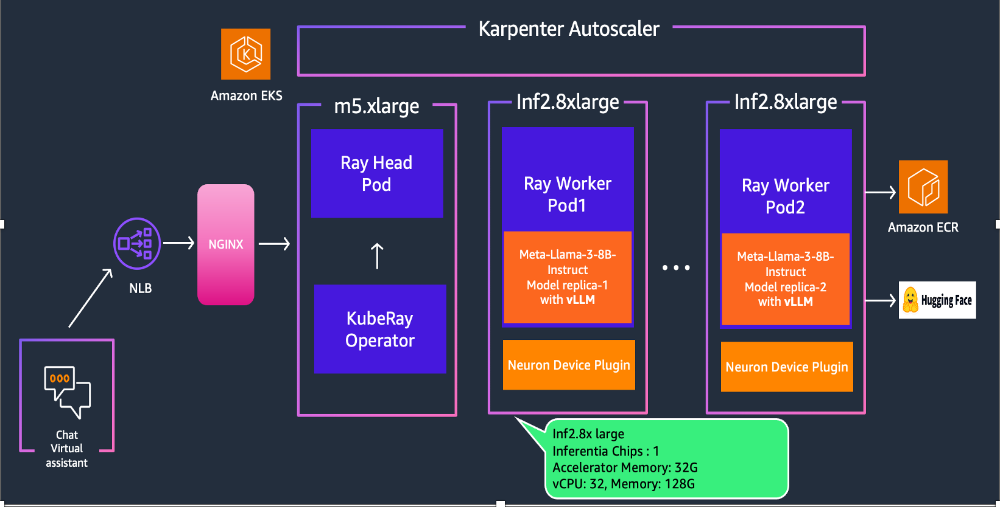
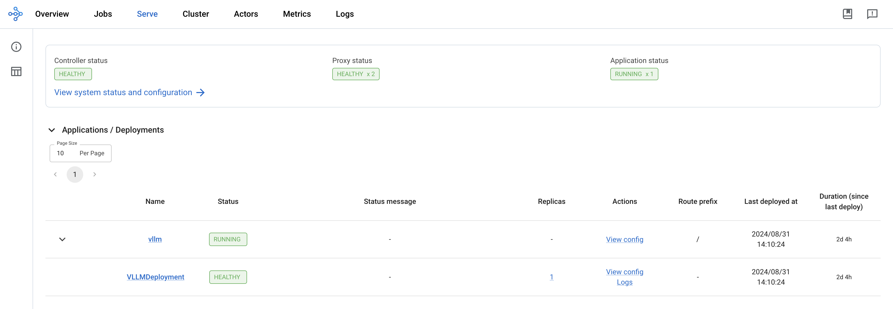
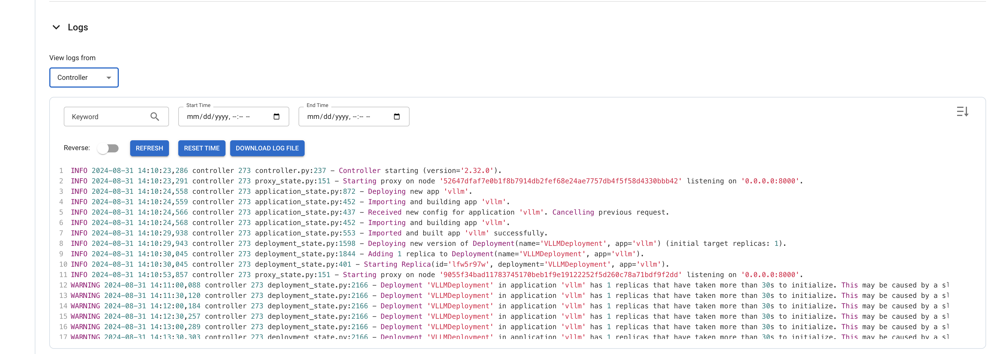
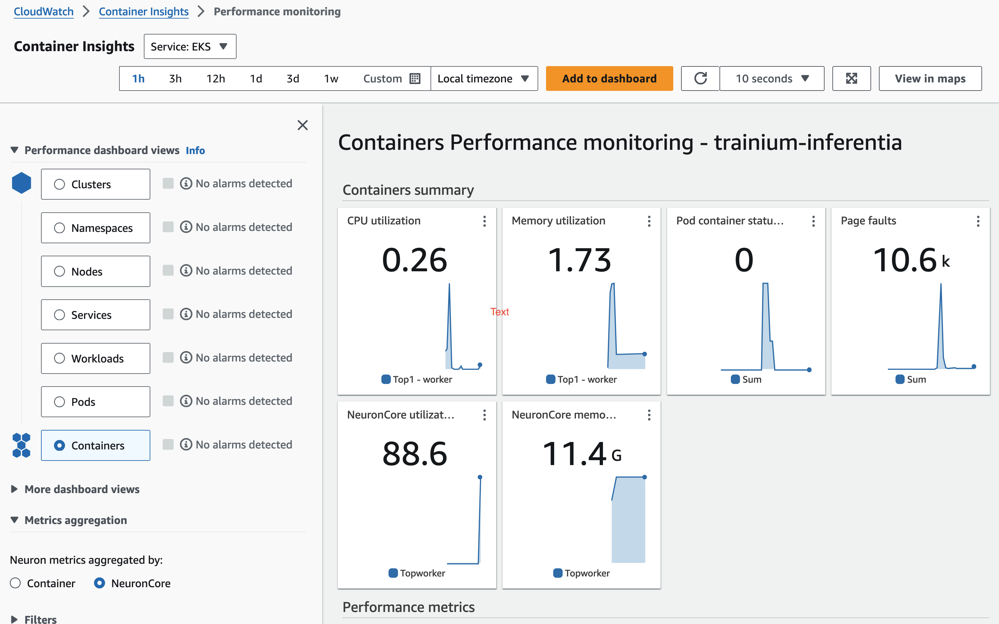
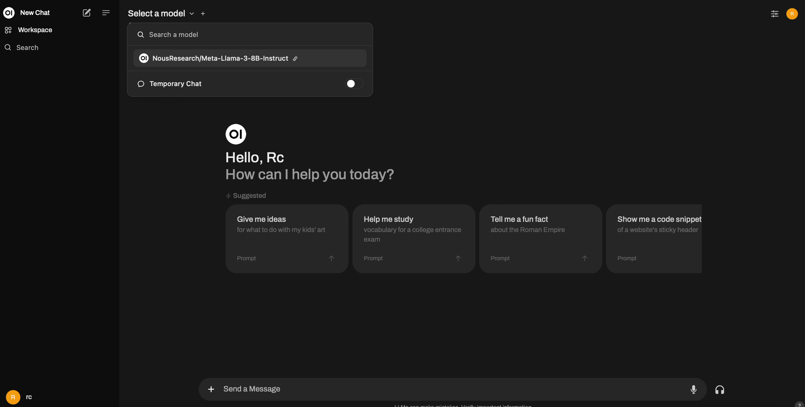
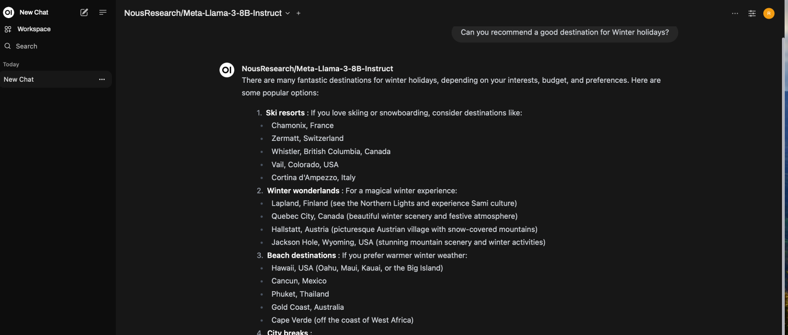

import CollapsibleContent from '../../../../src/components/CollapsibleContent';

:::caution

The **AI on EKS** content **is being migrated** to a new repository.
🔗 👉 [Read the full migration announcement »](https://awslabs.github.io/data-on-eks/docs/migration/migration-announcement)

:::

:::warning
Deployment of ML models on EKS requires access to GPUs or Neuron instances. If your deployment isn't working, it’s often due to missing access to these resources. Also, some deployment patterns rely on Karpenter autoscaling and static node groups; if nodes aren't initializing, check the logs for Karpenter or Node groups to resolve the issue.
:::


:::danger

Note: Use of this Llama-3 Instruct model is governed by the Meta license.
In order to download the model weights and tokenizer, please visit the [website](https://huggingface.co/meta-llama/Meta-Llama-3-8B) and accept the license before requesting access.

:::

:::info

We are actively enhancing this blueprint to incorporate improvements in observability, logging, and scalability aspects.
:::


# Serving LLMs with RayServe and vLLM on AWS Neuron

Welcome to the comprehensive guide on deploying LLMs on Amazon Elastic Kubernetes Service (EKS) using [Ray Serve](https://docs.ray.io/en/latest/serve/index.html) and AWS Neuron.

### What is AWS Neuron?

In this tutorial, you'll leverage [AWS Neuron](https://aws.amazon.com/machine-learning/neuron/), a powerful SDK that optimizes deep learning performance on AWS Inferentia and Trainium accelerators. Neuron seamlessly integrates with frameworks like PyTorch and TensorFlow, providing a comprehensive toolkit for developing, profiling, and deploying high-performance machine learning models on specialized EC2 instances such as Inf1, Inf2, Trn1, and Trn1n.

### What is vLLM?

[vLLM](https://docs.vllm.ai/en/latest/) is a high-performance library for LLM inference and serving, designed to maximize throughput and minimize latency. At its core, vLLM utilizes [PagedAttention](https://docs.vllm.ai/en/latest/dev/kernel/paged_attention.html), an innovative attention algorithm that dramatically improves memory efficiency, allowing for optimal utilization of GPU resources. This open-source solution offers seamless integration through its Python API and OpenAI-compatible server, enabling developers to deploy and scale large language models like Llama 3 with unprecedented efficiency in production environments.

### What is RayServe?

Ray Serve is a scalable model serving library built on top of Ray, designed for deploying machine learning models and AI applications with features like framework-agnostic deployment, model composition, and built-in scaling. You will also encounter RayService, which is a Kubernetes custom resource that's part of the KubeRay project, used to deploy and manage Ray Serve applications on Kubernetes clusters.

### What is Llama-3-8B Instruct?

Meta developed and released the Meta Llama 3 family of large language models (LLMs), a collection of pretrained and instruction tuned generative text models in 8 and 70B sizes. The Llama 3 instruction tuned models are optimized for dialogue use cases and outperform many of the available open source chat models on common industry benchmarks. Further, in developing these models, we took great care to optimize helpfulness and safety.

More information on Llama3 sizes and model architecture can be found [here](https://huggingface.co/meta-llama/Meta-Llama-3-8B-Instruct).

### Why AWS Accelerators?

**Scalability and Availability**

One of the key challenges in deploying large language models (`LLMs`) like Llama-3 is the scalability and availability of suitable hardware. Traditional `GPU` instances often face scarcity due to high demand, making it challenging to provision and scale resources effectively.

In contrast, `Trn1/Inf2` instances, such as `trn1.32xlarge`, `trn1n.32xlarge`, `inf2.24xlarge` and `inf2.48xlarge`, are purpose built for high-performance deep learning (DL) training and inference of generative AI models, including LLMs. They offer both scalability and availability, ensuring that you can deploy and scale your `Llama-3` models as needed, without resource bottlenecks or delays.

**Cost Optimization**

Running LLMs on traditional GPU instances can be cost-prohibitive, especially given the scarcity of GPUs and their competitive pricing. **Trn1/Inf2** instances provide a cost-effective alternative. By offering dedicated hardware optimized for AI and machine learning tasks, Trn1/Inf2 instances allow you to achieve top-notch performance at a fraction of the cost. This cost optimization enables you to allocate your budget efficiently, making LLM deployment accessible and sustainable.

**Performance Boost**

While Llama-3 can achieve high-performance inference on GPUs, Neuron accelerators take performance to the next level. Neuron accelerators are purpose-built for machine learning workloads, providing hardware acceleration that significantly enhances Llama-3's inference speeds. This translates to faster response times and improved user experiences when deploying Llama-3 on Trn1/Inf2 instances.

## Solution Architecture

In this section, we will delve into the architecture of our solution, which combines Llama-3 model, [Ray Serve](https://docs.ray.io/en/latest/serve/index.html) and [Inferentia2](https://aws.amazon.com/ec2/instance-types/inf2/) on Amazon EKS.



## Deploying the Solution

To get started with deploying `Llama-3-8B-instruct` on [Amazon EKS](https://aws.amazon.com/eks/), we will cover the necessary prerequisites and guide you through the deployment process step by step.

This includes setting up the infrastructure using AWS Inferentia instances and deploying the **Ray cluster**.

<CollapsibleContent header={<h2><span>Prerequisites</span></h2>}>
Before we begin, ensure you have all the prerequisites in place to make the deployment process smooth and hassle-free.
Ensure that you have installed the following tools on your machine.

1. [aws cli](https://docs.aws.amazon.com/cli/latest/userguide/install-cliv2.html)
2. [kubectl](https://Kubernetes.io/docs/tasks/tools/)
3. [terraform](https://learn.hashicorp.com/tutorials/terraform/install-cli)

### Deploy

Clone the repository:

```bash
git clone https://github.com/awslabs/data-on-eks.git
```

Navigate into the following directory and run `install.sh` script:

**Important Note:** Ensure that you update the region in the `variables.tf` file before deploying the blueprint.
Additionally, confirm that your local region setting matches the specified region to prevent any discrepancies.
For example, set your `export AWS_DEFAULT_REGION="<REGION>"` to the desired region.

```bash
cd data-on-eks/ai-ml/trainium-inferentia/
./install.sh
```

### Verify the resources

Verify the Amazon EKS Cluster

```bash
aws eks --region us-west-2 describe-cluster --name trainium-inferentia
```

```bash
# Creates k8s config file to authenticate with EKS
aws eks --region us-west-2 update-kubeconfig --name trainium-inferentia

kubectl get nodes # Output shows the EKS Managed Node group nodes
```
Verify the Karpenter autoscaler Nodepools

```bash
kubectl get nodepools
```

```text
NAME              NODECLASS
default           default
inferentia-inf2   inferentia-inf2
trainium-trn1     trainium-trn1
```

### Verify Neuron Plugin

Neuron device plugin exposes Neuron cores & devices to kubernetes as a resource. Verify the status of the plugin installed by the blueprint.

```bash
kubectl get ds neuron-device-plugin --namespace kube-system
```
```bash
NAME                   DESIRED   CURRENT   READY   UP-TO-DATE   AVAILABLE   NODE SELECTOR   AGE
neuron-device-plugin   1         1         1       1            1           <none>          15d
```

### Verify Neuron Scheduler

The Neuron scheduler extension is required for scheduling pods that require more than one Neuron core or device resource. Verify the status of the scheduler installed by the blueprint.

```bash
kubectl get pods -n kube-system | grep my-scheduler
```
```text
my-scheduler-c6fc957d9-hzrf7  1/1     Running   0  2d1h
```
</CollapsibleContent>

## Deploying the Ray Cluster with Llama3 Model

In this tutorial, we leverage the KubeRay operator, which extends Kubernetes with custom resource definitions for Ray-specific constructs like RayCluster, RayJob, and RayService. The operator watches for user events related to these resources, automatically creates necessary Kubernetes artifacts to form Ray clusters, and continuously monitors cluster state to ensure the desired configuration matches the actual state. It handles lifecycle management including setup, dynamic scaling of worker groups, and teardown, abstracting away the complexity of managing Ray applications on Kubernetes.

Each Ray cluster consists of a head node pod and a collection of worker node pods, with optional autoscaling support to size clusters according to workload requirements. KubeRay supports heterogeneous compute nodes (including GPUs) and running multiple Ray clusters with different Ray versions in the same Kubernetes cluster. Additionally, KubeRay can integrate with AWS Inferentia accelerators, enabling efficient deployment of large language models like Llama 3 on specialized hardware, potentially improving performance and cost-effectiveness for machine learning inference tasks.

Having deployed the EKS cluster with all the necessary components, we can now proceed with the steps to deploy `NousResearch/Meta-Llama-3-8B-Instruct` using `RayServe` and `vLLM` on AWS Accelerators.

**Step 1:** To deploy the RayService cluster, navigate to the directory containing the `vllm-rayserve-deployment.yaml` file and execute the `kubectl apply` command in your terminal.
This will apply the RayService configuration and deploy the cluster on your EKS setup.

```bash
cd data-on-eks/gen-ai/inference/vllm-rayserve-inf2

kubectl apply -f vllm-rayserve-deployment.yaml
```
**Optional Configuration**

By default, an `inf2.8xlarge` instance will be provisioned. If you would like to use `inf2.48xlarge`, modify the file `vllm-rayserve-deployment.yaml` to change `resources` section under `worker` container.

```bash
limits:
    cpu: "30"
    memory: "110G"
    aws.amazon.com/neuron: "1"
requests:
    cpu: "30"
    memory: "110G"
    aws.amazon.com/neuron: "1"
```
to the following:

```bash
limits:
    cpu: "90"
    memory: "360G"
    aws.amazon.com/neuron: "12"
requests:
    cpu: "90"
    memory: "360G"
    aws.amazon.com/neuron: "12"
```

**Step 2:** Verify the deployment by running the following commands

To ensure that the deployment has been successfully completed, run the following commands:

:::info

Deployment process may take up to **10 minutes**. The Head Pod is expected to be ready within 5 to 6 minutes, while the Ray Serve worker pod may take up to 10 minutes for image retrieval and Model deployment from Huggingface.

:::

According to the RayServe configuration, you will have one Ray head pod running on an `x86` instance and one worker pod running on a `inf2` instance. You can modify the RayServe YAML file to run multiple replicas; however, be aware that each additional replica can potentially create new instances.

```bash
kubectl get pods -n vllm
```

```text
NAME                                                      READY   STATUS    RESTARTS   AGE
lm-llama3-inf2-raycluster-ksh7w-worker-inf2-group-dcs5n   1/1     Running   0          2d4h
vllm-llama3-inf2-raycluster-ksh7w-head-4ck8f              2/2     Running   0          2d4h
```

This deployment also configures a service with multiple ports. Port **8265** is designated for the Ray dashboard, and port **8000** is for the vLLM inference server endpoint.

Run the following command to verify the services:

```bash
kubectl get svc -n vllm

NAME                         TYPE        CLUSTER-IP      EXTERNAL-IP   PORT(S)                                         AGE
vllm                         ClusterIP   172.20.23.54    <none>        8080/TCP,6379/TCP,8265/TCP,10001/TCP,8000/TCP   2d4h
vllm-llama3-inf2-head-svc    ClusterIP   172.20.18.130   <none>        6379/TCP,8265/TCP,10001/TCP,8000/TCP,8080/TCP   2d4h
vllm-llama3-inf2-serve-svc   ClusterIP   172.20.153.10   <none>        8000/TCP                                        2d4h
```

To access the Ray dashboard, you can port-forward the relevant port to your local machine:

```bash
kubectl -n vllm port-forward svc/vllm 8265:8265
```

You can then access the web UI at [http://localhost:8265](http://localhost:8265), which displays the deployment of jobs and actors within the Ray ecosystem.



Once the deployment is complete, the Controller and Proxy status should be `HEALTHY` and Application status should be `RUNNING`



### To Test the Llama3 Model

Now it's time to test the `Meta-Llama-3-8B-Instruct` chat model. We'll use a Python client script to send prompts to the RayServe inference endpoint and verify the outputs generated by the model.

First, execute a port forward to the `vllm-llama3-inf2-serve-svc` Service using kubectl:

```bash
kubectl -n vllm port-forward svc/vllm-llama3-inf2-serve-svc 8000:8000
```

`openai-client.py` uses the HTTP POST method to send a list of prompts to the inference endpoint for text completion and Q&A, targeting the vllm server.

To run the Python client application in a virtual environment, follow these steps:

```bash
cd data-on-eks/gen-ai/inference/vllm-rayserve-inf2
python3 -m venv .venv
source .venv/bin/activate
pip3 install openai
python3 openai-client.py
```

You will see an output something like below in the terminal:

<details>
<summary>Click to expand Python Client Terminal output</summary>

```text
Example 1 - Simple chat completion:
Handling connection for 8000
The capital of India is New Delhi.


Example 2 - Chat completion with different parameters:
The twin suns of Tatooine set slowly in the horizon, casting a warm orange glow over the bustling spaceport of Anchorhead. Amidst the hustle and bustle, a young farm boy named Anakin Skywalker sat atop a dusty speeder, his eyes fixed on the horizon as he dreamed of adventure beyond the desert planet.

As the suns dipped below the dunes, Anakin's uncle, Owen Lars, called out to him from the doorway of their humble moisture farm. "Anakin, it's time to head back! Your aunt and I have prepared a special dinner in your honor."

But Anakin was torn. He had received a strange message from an unknown sender, hinting at a great destiny waiting for him. Against his uncle's warnings, Anakin decided to investigate further, sneaking away into the night to follow the mysterious clues.

As he rode his speeder through the desert, the darkness seemed to grow thicker, and the silence was broken only by the distant


Example 3 - Streaming chat completion:
I'd be happy to help you with that. Here we go:

1...

(Pause)

2...

(Pause)

3...

(Pause)

4...

(Pause)

5...

(Pause)

6...

(Pause)

7...

(Pause)

8...

(Pause)

9...

(Pause)

10!

Let me know if you have any other requests!
```
</details>

## Observability

### Observability with AWS CloudWatch and Neuron Monitor

This blueprint deploys the CloudWatch Observability Agent as a managed add-on, providing comprehensive monitoring for containerized workloads. It includes container insights for tracking key performance metrics such as CPU and memory utilization. Additionally, the addon utilizes the [Neuron Monitor plugin](https://awsdocs-neuron.readthedocs-hosted.com/en/latest/tools/neuron-sys-tools/neuron-monitor-user-guide.html#neuron-monitor-user-guide) to capture and report Neuron-specific metrics.

All metrics, including container insights and Neuron metrics such as Neuron Core utilization, NeuronCore memory usage are sent to Amazon CloudWatch, where you can monitor and analyze them in real-time. After the deployment is complete, you should be able to access these metrics directly from the CloudWatch console, allowing you to manage and optimize your workloads effectively.



## Open WebUI Deployment


:::info

[Open WebUI](https://github.com/open-webui/open-webui) is compatible only with models that work with the OpenAI API server and Ollama.

:::

**1. Deploy the WebUI**

Deploy the [Open WebUI](https://github.com/open-webui/open-webui) by running the following command:

```sh
kubectl apply -f openai-webui-deployment.yaml
```

**2. Port Forward to Access WebUI**

**Note** If you're running a port forward already to test the inference with python client, then press `ctrl+c` to interrupt that.

Use kubectl port-forward to access the WebUI locally:

```sh
kubectl port-forward svc/open-webui 8081:80 -n openai-webui
```

**3. Access the WebUI**

Open your browser and go to http://localhost:8081

**4. Sign Up**

Sign up using your name, email, and a dummy password.

**5. Start a New Chat**

Click on New Chat and select the model from the dropdown menu, as shown in the screenshot below:



**6. Enter Test Prompt**

Enter your prompt, and you will see the streaming results, as shown below:



## Performance Benchmarking with LLMPerf Tool

[LLMPerf](https://github.com/ray-project/llmperf/blob/main/README.md) is an open-source tool designed for benchmarking the performance of large language models (LLMs).

LLMPerf tool connects to the vllm service via port 8000 using the port forwarding setup above done using the command `kubectl -n vllm port-forward svc/vllm-llama3-inf2-serve-svc 8000:8000`.

Execute the commands below in your terminal.

Clone the LLMPerf repository:

```bash
git clone https://github.com/ray-project/llmperf.git
cd llmperf
pip install -e .
pip install pandas
pip install ray
```

Create the `vllm_benchmark.sh` file using the command below:

```bash
cat << 'EOF' > vllm_benchmark.sh
#!/bin/bash
model=${1:-NousResearch/Meta-Llama-3-8B-Instruct}
vu=${2:-1}
export OPENAI_API_KEY=EMPTY
export OPENAI_API_BASE="http://localhost:8000/v1"
export TOKENIZERS_PARALLELISM=true
#if you have more vllm servers, append the below line to the above
#;http://localhost:8001/v1;http://localhost:8002/v1"
max_requests=$(expr ${vu} \* 8 )
date_str=$(date '+%Y-%m-%d-%H-%M-%S')
python ./token_benchmark_ray.py \
       --model ${model} \
       --mean-input-tokens 512 \
       --stddev-input-tokens 20 \
       --mean-output-tokens 245 \
       --stddev-output-tokens 20 \
       --max-num-completed-requests ${max_requests} \
       --timeout 7200 \
       --num-concurrent-requests ${vu} \
       --results-dir "vllm_bench_results/${date_str}" \
       --llm-api openai \
       --additional-sampling-params '{}'
EOF
```

`--mean-input-tokens`: specifies the average number of tokens in the input prompts

`--stddev-input-tokens`: specifies the variability in input token lengths for creating a more realistic testing environment

`--mean-output-tokens`: specifies the average number of tokens expected in the model's output to simulate realistic response lengths

`--stddev-output-tokens`: specifies the variability in output token lengths introducing diversity in response sizes

`--max-num-completed-requests`: sets the maximum number of requests to process

`--num-concurrent-requests`: specifies the number of simultaneous requests to simulate parallel workload

The command below executes the benchmarking script with the specified model, `NousResearch/Meta-Llama-3-8B-Instruct`, and sets the number of virtual users to 2. This results in the benchmark testing the model's performance with 2 concurrent requests, calculating a maximum of 16 requests to be processed.

Execute the command below:

```bash
./vllm_benchmark.sh NousResearch/Meta-Llama-3-8B-Instruct 2
```

You should see similar output like the following:

```bash
./vllm_benchmark.sh NousResearch/Meta-Llama-3-8B-Instruct 2
None of PyTorch, TensorFlow >= 2.0, or Flax have been found. Models won't be available and only tokenizers, configuration and file/data utilities can be used.
You are using the default legacy behaviour of the <class 'transformers.models.llama.tokenization_llama_fast.LlamaTokenizerFast'>. This is expected, and simply means that the `legacy` (previous) behavior will be used so nothing changes for you. If you want to use the new behaviour, set `legacy=False`. This should only be set if you understand what it means, and thoroughly read the reason why this was added as explained in https://github.com/huggingface/transformers/pull/24565 - if you loaded a llama tokenizer from a GGUF file you can ignore this message.
2024-09-03 09:54:45,976	INFO worker.py:1783 -- Started a local Ray instance.
  0%|                                                                                                                                                                                                                                                    | 0/16 [00:00<?, ?it/s]Handling connection for 8000
Handling connection for 8000
 12%|█████████████████████████████▌                                                                                                                                                                                                              | 2/16 [00:17<02:00,  8.58s/it]Handling connection for 8000
Handling connection for 8000
 25%|███████████████████████████████████████████████████████████                                                                                                                                                                                 | 4/16 [00:33<01:38,  8.20s/it]Handling connection for 8000
Handling connection for 8000
 38%|████████████████████████████████████████████████████████████████████████████████████████▌                                                                                                                                                   | 6/16 [00:47<01:17,  7.75s/it]Handling connection for 8000
Handling connection for 8000
 50%|██████████████████████████████████████████████████████████████████████████████████████████████████████████████████████                                                                                                                      | 8/16 [01:00<00:58,  7.36s/it]Handling connection for 8000
Handling connection for 8000
 62%|██████████████████████████████████████████████████████████████████████████████████████████████████████████████████████████████████████████████████▉                                                                                        | 10/16 [01:15<00:43,  7.31s/it]Handling connection for 8000
Handling connection for 8000
 75%|████████████████████████████████████████████████████████████████████████████████████████████████████████████████████████████████████████████████████████████████████████████████▎                                                          | 12/16 [01:29<00:28,  7.20s/it]Handling connection for 8000
Handling connection for 8000
 88%|█████████████████████████████████████████████████████████████████████████████████████████████████████████████████████████████████████████████████████████████████████████████████████████████████████████████▋                             | 14/16 [01:45<00:15,  7.52s/it]Handling connection for 8000
Handling connection for 8000
100%|███████████████████████████████████████████████████████████████████████████████████████████████████████████████████████████████████████████████████████████████████████████████████████████████████████████████████████████████████████████| 16/16 [02:01<00:00,  7.58s/it]
\Results for token benchmark for NousResearch/Meta-Llama-3-8B-Instruct queried with the openai api.

inter_token_latency_s
    p25 = 0.051964785839225695
    p50 = 0.053331799814278796
    p75 = 0.05520852723583741
    p90 = 0.05562424625711179
    p95 = 0.05629651696856784
    p99 = 0.057518213120178636
    mean = 0.053548951905597324
    min = 0.0499955879607504
    max = 0.05782363715808134
    stddev = 0.002070751885022901
ttft_s
    p25 = 1.5284210312238429
    p50 = 1.7579061459982768
    p75 = 1.8209733433031943
    p90 = 1.842437624989543
    p95 = 1.852818323241081
    p99 = 1.8528624982456676
    mean = 1.5821313202395686
    min = 0.928935999982059
    max = 1.8528735419968143
    stddev = 0.37523908630204694
end_to_end_latency_s
    p25 = 13.74749460403109
    p50 = 14.441407957987394
    p75 = 15.53337344751344
    p90 = 16.104882833489683
    p95 = 16.366086292022374
    p99 = 16.395070491998922
    mean = 14.528114874927269
    min = 10.75658329098951
    max = 16.40231654199306
    stddev = 1.4182672949824733
request_output_throughput_token_per_s
    p25 = 18.111220396798153
    p50 = 18.703139371912407
    p75 = 19.243016652511997
    p90 = 19.37836414194298
    p95 = 19.571455249271224
    p99 = 19.915057038539217
    mean = 18.682678715983627
    min = 17.198769813363445
    max = 20.000957485856215
    stddev = 0.725563381521316
number_input_tokens
    p25 = 502.5
    p50 = 509.5
    p75 = 516.5
    p90 = 546.5
    p95 = 569.25
    p99 = 574.65
    mean = 515.25
    min = 485
    max = 576
    stddev = 24.054105678657024
number_output_tokens
    p25 = 259.75
    p50 = 279.5
    p75 = 291.75
    p90 = 297.0
    p95 = 300.5
    p99 = 301.7
    mean = 271.625
    min = 185
    max = 302
    stddev = 29.257192847799555
Number Of Errored Requests: 0
Overall Output Throughput: 35.827933968528434
Number Of Completed Requests: 16
Completed Requests Per Minute: 7.914131755588426
```

You can try generating benchmarking results with multiple concurrent requests to understand how performance varies with increasing number of concurrent requests:

```
./vllm_benchmark.sh NousResearch/Meta-Llama-3-8B-Instruct 2
./vllm_benchmark.sh NousResearch/Meta-Llama-3-8B-Instruct 4
./vllm_benchmark.sh NousResearch/Meta-Llama-3-8B-Instruct 8
./vllm_benchmark.sh NousResearch/Meta-Llama-3-8B-Instruct 16
.
.
```

### Performance Benchmarking Metrics

You can find the results of the benchmarking script  under `vllm_bench_results` directory in the `llmperf` directory. The results are stored in folders following a date-time naming convention. New folders are created every time the benchmarking script is executed.

You will find that the results for every execution of the benchmarking script comprise of 2 files in the format below:

`NousResearch-Meta-Llama-3-8B-Instruct_512_245_summary_32.json` - contains the summary of performance metrics across all the request/response pairs.

`NousResearch-Meta-Llama-3-8B-Instruct_512_245_individual_responses.json` - contains performance metrics for each and every request / response pair.

Each of these files contain the following Performance Benchmarking Metrics:

```results_inter_token_latency_s_*```: Also referred to as Token generation latency (TPOT).Inter-Token latency refers to the average time elapsed between generating consecutive output tokens by a large language model (LLM) during the decoding or generation phase

```results_ttft_s_*```: Time taken to generate the first token (TTFT)

```results_end_to_end_s_*```: End-to-End latency - total time taken from when a user submits an input prompt to when the complete output response is generated by the LLM

```results_request_output_throughput_token_per_s_*```: Number of output tokens generated by a large language model (LLM) per second across all user requests or queries

```results_number_input_tokens_*```: Number of input tokens in the requests (Input length)

```results_number_output_tokens_*```: Number of output tokens in the requests (Output length)

## Conclusion

In summary, when it comes to deploying and scaling Llama-3, AWS Trn1/Inf2 instances offer a compelling advantage.
They provide the scalability, cost optimization, and performance boost needed to make running large language models efficient and accessible, all while overcoming the challenges associated with the scarcity of GPUs. Whether you're building chatbots, natural language processing applications, or any other LLM-driven solution, Trn1/Inf2 instances empower you to harness the full potential of Llama-3 on the AWS cloud.

## Cleanup

Finally, we'll provide instructions for cleaning up and deprovisioning the resources when they are no longer needed.

Delete the RayCluster

```bash
cd data-on-eks/gen-ai/inference/vllm-rayserve-inf2

kubectl delete -f vllm-rayserve-deployment.yaml
```

Destroy the EKS Cluster and resources

```bash
cd data-on-eks/ai-ml/trainium-inferentia/

./cleanup.sh
```
