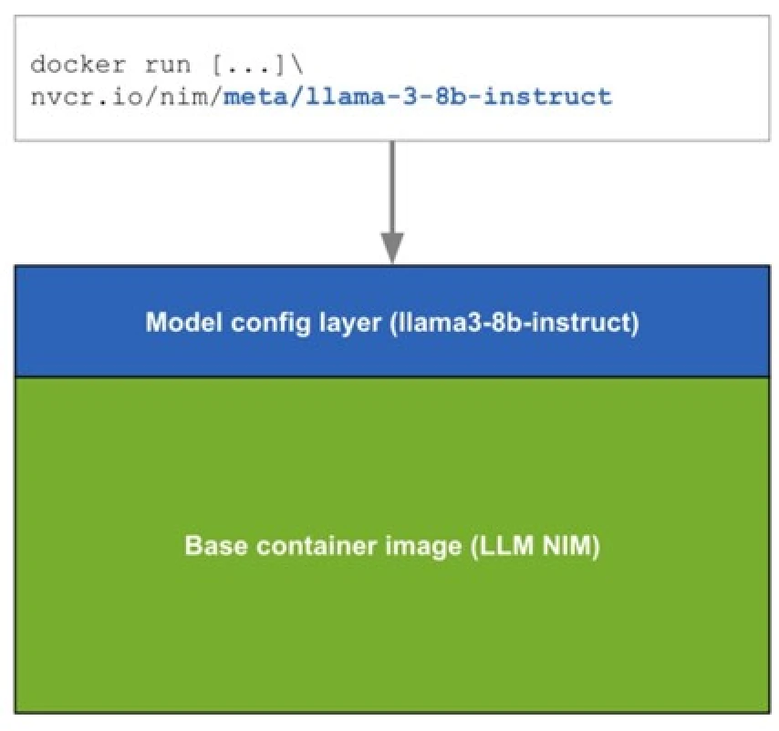

import CollapsibleContent from '../../../src/components/CollapsibleContent';

:::danger

Note: Use of this Llama-3 Instruct model is governed by the Meta license.
In order to download the model weights and tokenizer, please visit the [website](https://huggingface.co/meta-llama/Meta-Llama-3-8B) and accept the license before requesting access.

:::

:::info

We are actively enhancing this blueprint to incorporate improvements in observability, logging, and scalability aspects.
:::

# NVIDIA NIM LLM Deployment on Amazon EKS

## What is NVIDIA NIM?

NVIDIA NIM makes it easy for IT and DevOps teams to self-host large language models (LLMs) in their own managed environments while still providing developers with industry standard APIs that allow them to build powerful copilots, chatbots, and AI assistants that can transform their business. Leveraging NVIDIA’s cutting-edge GPU acceleration and scalable deployment, NIM offers the fastest path to inference with unparalleled performance.

## Why NIM?

NIM abstracts away model inference internals such as execution engine and runtime operations. They are also the most performant option available whether it be with TRT-LLM, vLLM or others.

NIMs are packaged as container images on a per model/model family basis. Each NIM container is with a model, such as `meta/llama3-8b-instruct`. These containers include a runtime that runs on any NVIDIA GPU with sufficient GPU memory, but some model/GPU combinations are optimized. NIM automatically downloads the model from NVIDIA NGC Catalog, leveraging a local filesystem cache if available.



## Overview of this deployment pattern on Amazon EKS

This pattern combines the capabilities of NVIDIA NIM, Amazon Elastic Kubernetes Service (EKS), and various AWS services to deliver a high-performance and cost-optimized model serving infrastructure.

1. NVIDIA NIM Container Images: NVIDIA NIM provides a streamlined approach to hosting LLM models like Llama3 within containerized environments. This allows customers to leverage their private models while ensuring seamless integration with existing infrastructure. We will bring detailed setup steps to NIM deployments.

2. Karpenter for Instance-Level Scaling: Karpenter, an open-source node provisioning project, enables rapid and efficient scaling of Amazon EKS clusters at the instance level. This ensures that the model serving infrastructure can adapt to dynamic workload demands, optimizing resource utilization and cost-effectiveness.

3. Spot instances: Considering LLMs are stateless, customers can leverage spot instances to significantly reduce costs.

4. Amazon Elastic File System (EFS): Amazon EFS provides scalable, elastic file storage for use with Amazon EKS. It allows multiple pods to access the same file system concurrently, making it ideal for storing and sharing model artifacts, datasets, and other persistent data across the cluster. EFS automatically grows and shrinks as you add and remove files, eliminating the need for capacity planning and management.

5. Terraform with EKS Blueprints: To streamline the deployment and management of this solution, we leverage Terraform and EKS Blueprints. This infrastructure-as-code approach enables automated provisioning of the entire stack, ensuring consistency, reproducibility, and efficient resource management.

By combining these components, our proposed solution delivers a powerful and cost-effective model serving infrastructure tailored for large language models. With NVIDIA NIM's seamless integration, Amazon EKS's scalability with Karpenter, customers can achieve high performance while minimizing infrastructure costs.

## Deploying the Solution

### Prerequisites

- An active AWS account with admin equivalent permissions
- [aws cli](https://docs.aws.amazon.com/cli/latest/userguide/install-cliv2.html)
- [kubectl](https://Kubernetes.io/docs/tasks/tools/)
- [Terraform](https://developer.hashicorp.com/terraform/tutorials/aws-get-started/install-cli) installed
- NVIDIA NGC account and API key

### Deploy

Clone the repository

```bash
git clone https://github.com/awslabs/data-on-eks.git
```

**1. Configure the NGC API Key**

Retrieve your NGC API key from [NVIDIA](https://docs.nvidia.com/ai-enterprise/deployment-guide-spark-rapids-accelerator/0.1.0/appendix-ngc.html) and set it as an environment variable:

```bash
export TF_VAR_ngc_api_key=<replace-with-your-NGC-API-KEY>
```

**2. Installation**

Important Note: Ensure that you update the region in the variables.tf file before deploying the blueprint. Additionally, confirm that your local region setting matches the specified region to prevent any discrepancies. For example, set your `export AWS_DEFAULT_REGION="<REGION>"` to the desired region:

Run the installation script:

```bash
cd data-on-eks/ai-ml/nvidia-triton-server
export TF_VAR_enable_nvidia_triton_server=false
./install.sh
```

This process will take approximately 20 minutes to complete.

**3. Verify the Installation**

Once the installation finishes, verify the Amazon EKS Cluster

```bash
# Creates k8s config file to authenticate with EKS
aws eks --region us-west-2 update-kubeconfig --name nvidia-triton-server
```

Check the status of your pods deployed

```bash
kubectl get po -A
```

You should see output similar to the following:
<details>
<summary>Click to expand the deployment details</summary>

```text
NAMESPACE               NAME                                                              READY   STATUS    RESTARTS      AGE
ingress-nginx           ingress-nginx-controller-55474d95c5-994fc                         1/1     Running   0             29h
karpenter               karpenter-57f7f6bc4f-c6cts                                        1/1     Running   0             29h
karpenter               karpenter-57f7f6bc4f-cfwwt                                        1/1     Running   0             29h
kube-prometheus-stack   kube-prometheus-stack-grafana-558586c645-hv7hm                    3/3     Running   0             29h
kube-prometheus-stack   kube-prometheus-stack-kube-state-metrics-6669bff85f-fsmfz         1/1     Running   0             29h
kube-prometheus-stack   kube-prometheus-stack-operator-67b968589d-k6ndp                   1/1     Running   0             29h
kube-prometheus-stack   kube-prometheus-stack-prometheus-node-exporter-58pfp              1/1     Running   0             19h
kube-prometheus-stack   kube-prometheus-stack-prometheus-node-exporter-95xzb              1/1     Running   0             29h
kube-prometheus-stack   kube-prometheus-stack-prometheus-node-exporter-wtpgc              1/1     Running   0             29h
kube-prometheus-stack   prometheus-adapter-6f4ff878bc-64ntq                               1/1     Running   0             24h
kube-prometheus-stack   prometheus-kube-prometheus-stack-prometheus-0                     2/2     Running   0             29h
kube-system             aws-load-balancer-controller-55cb4579f6-9bp8d                     1/1     Running   0             29h
kube-system             aws-load-balancer-controller-55cb4579f6-n2trc                     1/1     Running   0             29h
kube-system             aws-node-rlxwv                                                    2/2     Running   0             29h
kube-system             aws-node-tz56x                                                    2/2     Running   0             19h
kube-system             aws-node-v29s9                                                    2/2     Running   0             29h
kube-system             coredns-848555ff5-kkngd                                           1/1     Running   0             29h
kube-system             coredns-848555ff5-n6dnv                                           1/1     Running   0             29h
kube-system             ebs-csi-controller-657544c77c-hl4z5                               6/6     Running   0             29h
kube-system             ebs-csi-controller-657544c77c-sncv6                               6/6     Running   0             29h
kube-system             ebs-csi-node-9xjnt                                                3/3     Running   0             19h
kube-system             ebs-csi-node-fhphc                                                3/3     Running   0             29h
kube-system             ebs-csi-node-hjg9v                                                3/3     Running   0             29h
kube-system             efs-csi-controller-77c44b5fc7-pqwv9                               3/3     Running   0             25h
kube-system             efs-csi-controller-77c44b5fc7-vxpng                               3/3     Running   0             25h
kube-system             efs-csi-node-5k7k8                                                3/3     Running   0             25h
kube-system             efs-csi-node-l4n5t                                                3/3     Running   0             25h
kube-system             efs-csi-node-wxl97                                                3/3     Running   0             19h
kube-system             kube-proxy-5qg9q                                                  1/1     Running   0             29h
kube-system             kube-proxy-7fzdh                                                  1/1     Running   0             29h
kube-system             kube-proxy-vm56n                                                  1/1     Running   0             19h
nim                     nim-llm-0                                                         1/1     Running   0             15m
nvidia-device-plugin    nvidia-device-plugin-gpu-feature-discovery-64c9v                  1/1     Running   0             19h
nvidia-device-plugin    nvidia-device-plugin-node-feature-discovery-master-568b497ddvx9   1/1     Running   0             29h
nvidia-device-plugin    nvidia-device-plugin-node-feature-discovery-worker-28wvj          1/1     Running   1 (29h ago)   29h
nvidia-device-plugin    nvidia-device-plugin-node-feature-discovery-worker-5nplt          1/1     Running   0             29h
nvidia-device-plugin    nvidia-device-plugin-node-feature-discovery-worker-hztcq          1/1     Running   0             19h
nvidia-device-plugin    nvidia-device-plugin-vn5dn                                        1/1     Running   0             19h
```
</details>

:::info
The `Llama3` model deployed is specified in `ai-ml/nvidia-triton-server/helm-values/nim-llm.yaml` with below config. Please visit [this page](https://build.nvidia.com/explore/discover) to explore more. You may simply update this image configuration if you want to change to deploy another model.
:::

```yaml
image:
  repository: nvcr.io/nim/meta/llama3-8b-instruct
  tag: latest
```

**4. Verify the deployed model**

Once all pods in `nim` namespace is ready with `1/1` status, use below command to verify it's ready to serve the traffic.

```bash
export INGRESS_URL=$(kubectl get ingress -n nim -o jsonpath='{.items[0].status.loadBalancer.ingress[0].hostname}')

curl -X 'POST' \
"http://$INGRESS_URL/v1/completions" \
-H 'accept: application/json' \
-H 'Content-Type: application/json' \
-d '{
"model": "meta/llama3-8b-instruct",
"prompt": "Once upon a time",
"max_tokens": 64
}'
```

you will see similar output like the following

```json
{"id":"cmpl-63a0b66aeda1440c8b6ca1ce3583b173","object":"text_completion","created":1719742336,"model":"meta/llama3-8b-instruct","choices":[{"index":0,"text":", there was a young man named Jack who lived in a small village at the foot of a vast and ancient forest. Jack was a curious and adventurous soul, always eager to explore the world beyond his village. One day, he decided to venture into the forest, hoping to discover its secrets.\nAs he wandered deeper into","logprobs":null,"finish_reason":"length","stop_reason":null}],"usage":{"prompt_tokens":5,"total_tokens":69,"completion_tokens":64}}
```

### Testing the Llama3 model deployed with NIM
It's time to test the Llama3 just deployed. We will run the following commands with the same prompts to verify the generated outputs.

First, expose the model serving service with port-forward using kubectl

```bash
kubectl port-forward -n nim svc/nim-llm 8000
```

Next, open another Terminal window, run the client using the existing prompts:

```bash
cd gen-ai/inference/nvidia-nim/nim-client
python3 client.py --input-prompts prompts.txt --results-file results.txt
```

You will see an output something like below:

```text
Loading inputs from `prompts.txt`...
Model meta/llama3-8b-instruct - Request 14: 4655.84 ms
Model meta/llama3-8b-instruct - Request 10: 6463.45 ms
Model meta/llama3-8b-instruct - Request 3: 7787.67 ms
Model meta/llama3-8b-instruct - Request 15: 7794.37 ms
Model meta/llama3-8b-instruct - Request 1: 8320.75 ms
Model meta/llama3-8b-instruct - Request 12: 8925.80 ms
Model meta/llama3-8b-instruct - Request 5: 9079.14 ms
Model meta/llama3-8b-instruct - Request 16: 9501.56 ms
Model meta/llama3-8b-instruct - Request 18: 9790.65 ms
Model meta/llama3-8b-instruct - Request 0: 10248.90 ms
Model meta/llama3-8b-instruct - Request 6: 10243.54 ms
Model meta/llama3-8b-instruct - Request 4: 10596.04 ms
Model meta/llama3-8b-instruct - Request 11: 10798.81 ms
Model meta/llama3-8b-instruct - Request 17: 10793.39 ms
Model meta/llama3-8b-instruct - Request 8: 10977.41 ms
Model meta/llama3-8b-instruct - Request 2: 12085.08 ms
Model meta/llama3-8b-instruct - Request 19: 12645.12 ms
Model meta/llama3-8b-instruct - Request 9: 13346.84 ms
Model meta/llama3-8b-instruct - Request 13: 13581.21 ms
Model meta/llama3-8b-instruct - Request 7: 14917.04 ms
Storing results into `results.txt`...
Total time for all requests: 202.55 seconds (202552.60 milliseconds)
PASS: NVIDIA NIM example
```

Output for `results.txt` should look like the following

<details>
<summary>Click to expand the partial output</summary>
```text
The key differences between traditional machine learning models and very large language models (vLLM) are:

1. **Scale**: vLLMs are massive, with billions of parameters, whereas traditional models typically have millions.
2. **Training data**: vLLMs are trained on vast amounts of text data, often sourced from the internet, whereas traditional models are trained on smaller, curated datasets.
3. **Architecture**: vLLMs often use transformer architectures, which are designed for sequential data like text, whereas traditional models may use feedforward networks or recurrent neural networks.
4. **Training objectives**: vLLMs are often trained using masked language modeling or next sentence prediction tasks, whereas traditional models may use classification, regression, or clustering objectives.
5. **Evaluation metrics**: vLLMs are typically evaluated using metrics like perplexity, accuracy, or fluency, whereas traditional models may use metrics like accuracy, precision, or recall.
6. **Interpretability**: vLLMs are often less interpretable due to their massive size and complex architecture, whereas traditional models may be more interpretable due to their smaller size and simpler architecture.

These differences enable vLLMs to excel in tasks like language translation, text generation, and conversational AI, whereas traditional models are better suited for tasks like image classification or regression.

=========

TensorRT (Triton Runtime) optimizes LLM (Large Language Model) inference on NVIDIA hardware by:

1. **Model Pruning**: Removing unnecessary weights and connections to reduce model size and computational requirements.
2. **Quantization**: Converting floating-point models to lower-precision integer formats (e.g., INT8) to reduce memory bandwidth and improve performance.
3. **Kernel Fusion**: Combining multiple kernel launches into a single launch to reduce overhead and improve parallelism.
4. **Optimized Tensor Cores**: Utilizing NVIDIA's Tensor Cores for matrix multiplication, which provides significant performance boosts.
5. **Batching**: Processing multiple input batches concurrently to improve throughput.
6. **Mixed Precision**: Using a combination of floating-point and integer precision to balance accuracy and performance.
7. **Graph Optimization**: Reordering and reorganizing the computation graph to minimize memory access and optimize data transfer.

By applying these optimizations, TensorRT can significantly accelerate LLM inference on NVIDIA hardware, achieving faster inference times and improved performance.

=========
```
</details>

## Observability
As part of this blueprint, we have also deployed the Kube Prometheus stack, which provides Prometheus server and Grafana deployments for monitoring and observability.

First, let's verify the services deployed by the Kube Prometheus stack:

```bash
kubectl get svc -n kube-prometheus-stack
```

You should see output similar to this:

```text
kubectl get svc -n kube-prometheus-stack
NAME                                             TYPE        CLUSTER-IP       EXTERNAL-IP   PORT(S)             AGE
kube-prometheus-stack-grafana                    ClusterIP   172.20.225.77    <none>        80/TCP              10m
kube-prometheus-stack-kube-state-metrics         ClusterIP   172.20.237.248   <none>        8080/TCP            10m
kube-prometheus-stack-operator                   ClusterIP   172.20.118.163   <none>        443/TCP             10m
kube-prometheus-stack-prometheus                 ClusterIP   172.20.132.214   <none>        9090/TCP,8080/TCP   10m
kube-prometheus-stack-prometheus-node-exporter   ClusterIP   172.20.213.178   <none>        9100/TCP            10m
prometheus-adapter                               ClusterIP   172.20.171.163   <none>        443/TCP             10m
prometheus-operated                              ClusterIP   None             <none>        9090/TCP            10m
```

The NVIDIA NIM LLM service expose metrics via `/metrics` endpoint from `nim-llm` service at port `8000`. Verify it by running
```bash
kubectl get svc -n nim
kubectl port-forward -n nim svc/nim-llm 8000

curl localhost:8000/metrics # run this in another terminal
```

We also provided a pre-configured Grafana dashboard.

In the Grafana dashboard below, you can see several important metrics:

- **Running Count**: This gauge shows number of requests currently running on GPU.
- **Latency (p95 percentile)**: It includes metrics `Time to First Token`, `Time per Output Token` and `End to End` latency. These metrics illustrate the time taken to compute inference requests, helping identify any latency issues.
- **Token Count**: It includes metrics `Prompt Token Count` and `Generation Token Count`, illustrate the input and output consumption.

You can find more metrics description from this [document](https://docs.nvidia.com/nim/large-language-models/latest/observability.html).


You can visualize these metrics using the Grafana. To view the Grafana dashboard to monitor these metrics, follow the steps below:

```bash
- Port-forward Grafana service:
kubectl port-forward svc/kube-prometheus-stack-grafana 3000:80 -n kube-prometheus-stack

- Grafana Admin user
admin

- Get secret name from Terraform output
terraform output grafana_secret_name

- Get admin user password
aws secretsmanager get-secret-value --secret-id <grafana_secret_name_output> --region $AWS_REGION --query "SecretString" --output text
```

**Login to Grafana:**

- Open your web browser and navigate to [http://localhost:3000](http://localhost:3000).
- Login with the username `admin` and the password retrieved from AWS Secrets Manager.

**Open the NIM Monitoring Dashboard:**

- Once logged in, click "Dashboards" on the left sidebar and search "nim"
- You can find the Dashboard `NVIDIA NIM Monitoring` from the list
- Click and entering to the dashboard.

You should now see the metrics displayed on the Grafana dashboard, allowing you to monitor the performance your NVIDIA NIM service deployment.

## Cleanup

To remove all resources created by this deployment, run:

```bash
./cleanup.sh
```
