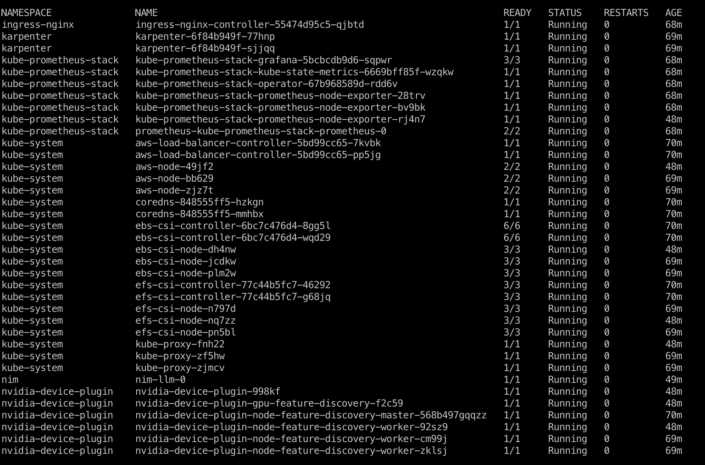

import CollapsibleContent from '../../../src/components/CollapsibleContent';

:::danger

Note: Use of this Llama-3 Instruct model is governed by the Meta license.
In order to download the model weights and tokenizer, please visit the [website](https://huggingface.co/meta-llama/Meta-Llama-3-8B) and accept the license before requesting access.

:::

:::info

We are actively enhancing this blueprint to incorporate improvements in observability, logging, and scalability aspects.
:::

# NVIDIA NIM LLM Deployment on Amazon EKS

## What is NVIDIA NIM?

NVIDIA NIM makes it easy for IT and DevOps teams to self-host large language models (LLMs) in their own managed environments while still providing developers with industry standard APIs that allow them to build powerful copilots, chatbots, and AI assistants that can transform their business. Leveraging NVIDIA’s cutting-edge GPU acceleration and scalable deployment, NIM offers the fastest path to inference with unparalleled performance.

## Why NIM?

NIM abstracts away model inference internals such as execution engine and runtime operations. They are also the most performant option available whether it be with TRT-LLM, vLLM or others.

NIMs are packaged as container images on a per model/model family basis. Each NIM container is with a model, such as `meta/llama3-8b-instruct`. These containers include a runtime that runs on any NVIDIA GPU with sufficient GPU memory, but some model/GPU combinations are optimized. NIM automatically downloads the model from NVIDIA NGC Catalog, leveraging a local filesystem cache if available.


## Overview of this deployment pattern on Amazon EKS

This pattern combines the capabilities of NVIDIA NIM, Amazon Elastic Kubernetes Service (EKS), and various AWS services to deliver a high-performance and cost-optimized model serving infrastructure.

1. NVIDIA NIM Container Images: NVIDIA NIM provides a streamlined approach to hosting LLM models like Llama3 within containerized environments. This allows customers to leverage their private models while ensuring seamless integration with existing infrastructure. We will bring detailed setup steps to NIM deployments.

2. Karpenter for Instance-Level Scaling: Karpenter, an open-source node provisioning project, enables rapid and efficient scaling of Amazon EKS clusters at the instance level. This ensures that the model serving infrastructure can adapt to dynamic workload demands, optimizing resource utilization and cost-effectiveness.

3. Spot instances: Considering LLMs are stateless, customers can leverage spot instances to significantly reduce costs.

4. Amazon Elastic File System (EFS): Amazon EFS provides scalable, elastic file storage for use with Amazon EKS. It allows multiple pods to access the same file system concurrently, making it ideal for storing and sharing model artifacts, datasets, and other persistent data across the cluster. EFS automatically grows and shrinks as you add and remove files, eliminating the need for capacity planning and management.

5. Terraform with EKS Blueprints: To streamline the deployment and management of this solution, we leverage Terraform and EKS Blueprints. This infrastructure-as-code approach enables automated provisioning of the entire stack, ensuring consistency, reproducibility, and efficient resource management.

By combining these components, our proposed solution delivers a powerful and cost-effective model serving infrastructure tailored for large language models. With NVIDIA NIM's seamless integration, Amazon EKS's scalability with Karpenter, customers can achieve high performance while minimizing infrastructure costs.

## Deploying the Solution

### Prerequisites

- An active AWS account with admin equivalent permissions
- [aws cli](https://docs.aws.amazon.com/cli/latest/userguide/install-cliv2.html)
- [kubectl](https://Kubernetes.io/docs/tasks/tools/)
- [Terraform](https://developer.hashicorp.com/terraform/tutorials/aws-get-started/install-cli) installed
- NVIDIA NGC account and API key

### Deploy

Clone the repository

```bash
git clone https://github.com/awslabs/data-on-eks.git
```

**1. Configure the NGC API Key**

Retrieve your NGC API key from [NVIDIA](https://docs.nvidia.com/ai-enterprise/deployment-guide-spark-rapids-accelerator/0.1.0/appendix-ngc.html) and set it as an environment variable:

```bash
export TF_VAR_ngc_api_key=<replace-with-your-NGC-API-KEY>
```

**2. Installation**

Important Note: Ensure that you update the region in the variables.tf file before deploying the blueprint. Additionally, confirm that your local region setting matches the specified region to prevent any discrepancies. For example, set your `export AWS_DEFAULT_REGION="<REGION>"` to the desired region:

Run the installation script:

```bash
cd gen-ai/nvidia-nims
./install.sh
```

This process will take approximately 20 minutes to complete.

**3. Verify the Installation**

Check the status of your pods deployed

```bash
kubectl get po -A
```

You should see output similar to the following:


:::info
The `Llama3` model deployed is specified in `gen-ai/nvidia-nims/helm-values/nim-llm.yaml` with below config. Please visit [this page](https://build.nvidia.com/explore/discover) to explore more. You may simply update this image configuration if you want to change to deploy another model.
:::

```yaml
image:
  repository: nvcr.io/nim/meta/llama3-8b-instruct
  tag: latest
```

**4. Verify the deployed model**

Once all pods in `nim` namespace is ready with `1/1` status, use below command to verify it's ready to serve the traffic.

```bash
export INGRESS_URL=$(kubectl get ingress -n nim -o jsonpath='{.items[0].status.loadBalancer.ingress[0].hostname}')

curl -X 'POST' \
"http://$INGRESS_URL/v1/completions" \
-H 'accept: application/json' \
-H 'Content-Type: application/json' \
-d '{
"model": "meta/llama3-8b-instruct",
"prompt": "Once upon a time",
"max_tokens": 64
}'
```

you will see similar output like the following

```json
{"id":"cmpl-63a0b66aeda1440c8b6ca1ce3583b173","object":"text_completion","created":1719742336,"model":"meta/llama3-8b-instruct","choices":[{"index":0,"text":", there was a young man named Jack who lived in a small village at the foot of a vast and ancient forest. Jack was a curious and adventurous soul, always eager to explore the world beyond his village. One day, he decided to venture into the forest, hoping to discover its secrets.\nAs he wandered deeper into","logprobs":null,"finish_reason":"length","stop_reason":null}],"usage":{"prompt_tokens":5,"total_tokens":69,"completion_tokens":64}}
```

## Cleanup

To remove all resources created by this deployment, run:

```bash
./cleanup.sh
```
