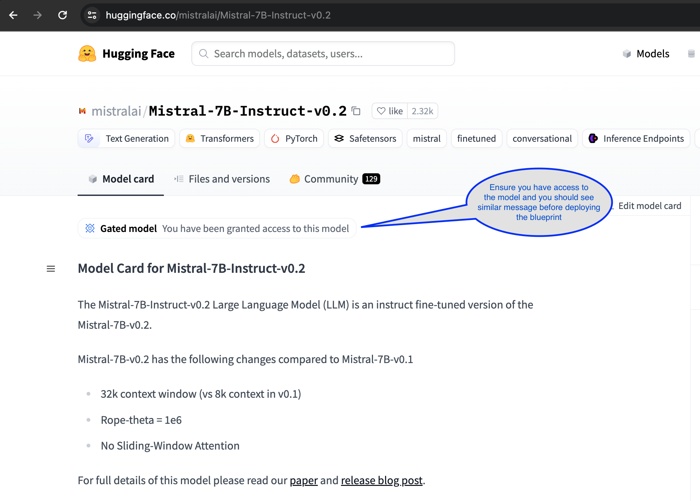
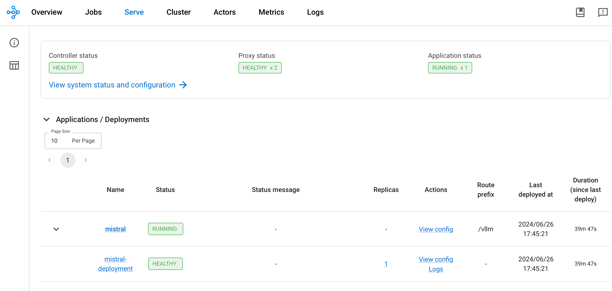
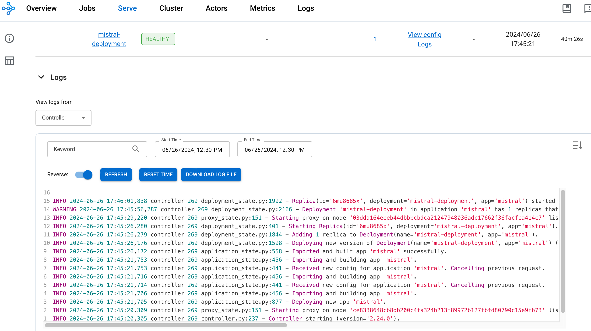

import CollapsibleContent from '../../../src/components/CollapsibleContent';

:::caution

The use of [Mistralai/Mistral-7B-Instruct-v0.2](https://huggingface.co/mistralai/Mistral-7B-Instruct-v0.2) models requires access through a Hugging Face account.

:::


# Deploying LLMs with RayServe and vLLM

In this guide, we'll explore deploying large language models (LLMs) using [Ray Serve](https://docs.ray.io/en/latest/serve/getting_started.html) with a [vLLM](https://github.com/vllm-project/vllm) backend on Amazon EKS (Elastic Kubernetes Service). We'll use the `mistralai/Mistral-7B-Instruct-v0.2` model to demonstrate the pattern.

Using Ray Serve with a vLLM backend for LLM inference offers several compelling benefits, particularly in terms of scalability, efficiency, and ease of deployment. Ray Serve is designed to handle concurrent requests efficiently, making it ideal for real-time applications where multiple requests need to be processed simultaneously. It supports dynamic batching, which groups multiple requests together to optimize throughput and resource utilization, crucial for handling the high demands of LLM inference. Additionally, Ray Serve's ability to auto-scale based on incoming request load ensures that resources are used optimally, adapting to varying traffic without manual intervention. The integration with vLLM further enhances performance by leveraging vLLM's real-time batching capabilities, which are essential for efficient online inference. Moreover, Ray Serve's framework-agnostic nature allows it to be used alongside any Python framework, providing flexibility in model deployment and integration with existing systems. This combination of features makes Ray Serve with a vLLM backend a robust solution for deploying large language models in production environments, ensuring high performance, scalability, and ease of use.

## RayServe and vLLM Backend Integration

**[vLLM](https://github.com/vllm-project/vllm)**: is a high-throughput and memory-efficient inference and serving engine for large language models (LLMs), specifically designed to optimize deployment and inference performance. A standout feature is PagedAttention, an innovative attention algorithm inspired by virtual memory paging in operating systems. PagedAttention efficiently manages the attention key and value tensors (KV cache) by storing them in non-contiguous memory spaces, which significantly reduces memory fragmentation and waste. Checkout the [blog](https://blog.vllm.ai/2023/06/20/vllm.html) for comparing vLLM with HuggingFace Transformers (HF) and HuggingFace Text Generation Inference (TGI).

vLLM employs continuous batching of incoming requests, optimizing the use of computational resources and improving inference speed by grouping multiple requests together. This dynamic batching maximizes throughput and reduces latency. The engine also features optimized CUDA kernels for accelerated model execution on GPUs. Another key advantage is vLLM's efficient memory sharing during parallel sampling, where multiple output sequences are generated from a single prompt. This reduces memory usage by up to 55% and improves throughput by up to 2.2 times.

### Mistralai/Mistral-7B-Instruct-v0.2
In this guide, we are deploying the Mistral-7B-Instruct-v0.2 model with RayServe and vLLM. You can easily adapt these instructions to deploy any large language model, such as Llama2. Mistral-7B-Instruct-v0.2 is a state-of-the-art large language model designed to provide high-quality, instructive responses. Trained on a diverse dataset, it excels in understanding and generating human-like text across a variety of topics, making it suitable for applications requiring detailed explanations, complex queries, and natural language understanding.

<CollapsibleContent header={<h2><span>Deploying the Solution</span></h2>}>

We are utilizing Terraform Infrastructure as Code (IaC) templates to deploy an Amazon EKS cluster, and we dynamically scale GPU nodes using Karpenter when the model is deployed using RayServe YAML configurations.

To get started with deploying mistralai/Mistral-7B-Instruct-v0.2 on Amazon EKS, this guide will cover the necessary prerequisites and walk you through the deployment process step by step. This process includes setting up the infrastructure, deploying the Ray cluster, and creating the client Python application that sends HTTP requests to the RayServe endpoint for inferencing.


:::danger

Important: Deploying on `g5.8xlarge` instances can be expensive. Ensure you carefully monitor and manage your usage to avoid unexpected costs. Consider setting budget alerts and usage limits to keep track of your expenditures.

:::

### Prerequisites
Before we begin, ensure you have all the necessary prerequisites in place to make the deployment process smooth. Make sure you have installed the following tools on your machine:

:::info

To simplify the demo process, we assume the use of an IAM role with administrative privileges due to the complexity of creating minimal IAM roles for each blueprint that may create various AWS services. However, for production deployments, it is strongly advised to create an IAM role with only the necessary permissions. Employing tools such as [IAM Access Analyzer](https://aws.amazon.com/iam/access-analyzer/) can assist in ensuring a least-privilege approach.

:::

1. [aws cli](https://docs.aws.amazon.com/cli/latest/userguide/install-cliv2.html)
2. [kubectl](https://Kubernetes.io/docs/tasks/tools/)
3. [terraform](https://learn.hashicorp.com/tutorials/terraform/install-cli)
4. [envsubst](https://pypi.org/project/envsubst/)

### Deploy

Clone the repository

```bash
git clone https://github.com/awslabs/data-on-eks.git
```

**Important Note:**

**Step1**: Ensure that you update the region in the `variables.tf` file before deploying the blueprint.
Additionally, confirm that your local region setting matches the specified region to prevent any discrepancies.

For example, set your `export AWS_DEFAULT_REGION="<REGION>"` to the desired region:


**Step2**: Run the installation script.

```bash
cd data-on-eks/ai-ml/jark-stack/terraform && chmod +x install.sh
```

```bash
./install.sh
```

### Verify the resources

Once the installation finishes, verify the Amazon EKS Cluster.

Creates k8s config file to authenticate with EKS.

```bash
aws eks --region us-west-2 update-kubeconfig --name jark-stack
```

```bash
kubectl get nodes
```

```text
NAME                                           STATUS   ROLES    AGE    VERSION
ip-100-64-118-130.us-west-2.compute.internal   Ready    <none>   3h9m   v1.30.0-eks-036c24b
ip-100-64-127-174.us-west-2.compute.internal   Ready    <none>   9h     v1.30.0-eks-036c24b
ip-100-64-132-168.us-west-2.compute.internal   Ready    <none>   9h     v1.30.0-eks-036c24b
```

Verify the Karpenter autosclaer Nodepools

```bash
kubectl get nodepools
```

```text
NAME                NODECLASS
g5-gpu-karpenter    g5-gpu-karpenter
x86-cpu-karpenter   x86-cpu-karpenter
```

Verify the NVIDIA Device plugin

```bash
kubectl get pods -n nvidia-device-plugin
```
```text
NAME                                                              READY   STATUS    RESTARTS   AGE
nvidia-device-plugin-gpu-feature-discovery-b4clk                  1/1     Running   0          3h13m
nvidia-device-plugin-node-feature-discovery-master-568b49722ldt   1/1     Running   0          9h
nvidia-device-plugin-node-feature-discovery-worker-clk9b          1/1     Running   0          3h13m
nvidia-device-plugin-node-feature-discovery-worker-cwg28          1/1     Running   0          9h
nvidia-device-plugin-node-feature-discovery-worker-ng52l          1/1     Running   0          9h
nvidia-device-plugin-p56jj                                        1/1     Running   0          3h13m
```

Verify Kuberay Operator which is used to create Ray Clusters

```bash
kubectl get pods -n kuberay-operator
```

```text
NAME                                READY   STATUS    RESTARTS   AGE
kuberay-operator-7894df98dc-447pm   1/1     Running   0          9h
```

</CollapsibleContent>

## Deploying Mistral-7B-Instruct-v0.2 with RayServe and vLLM

Having deployed the EKS cluster with all the necessary components, we can now proceed with the steps to deploy `Mistral-7B-Instruct-v0.2` using `RayServe` and `vLLM`.

**Step1:** As a prerequisite for this deployment, you must ensure that you have access to the model via your Hugging Face account:




**Step2:** Export Hugginface Hub Token

To deploy the `Mistral-7B-Instruct-v0.2` model with RayServe and vLLM backend, it's essential to configure your Hugging Face Hub token as an environment variable. This token is required for authentication and accessing the model. For guidance on how to create and manage your Hugging Face tokens, please visit [Hugging Face Token Management](https://huggingface.co/docs/hub/security-tokens).

Replace `Your-Hugging-Face-Hub-Token-Value` with your actual Hugging Face Hub Token. This step ensures that your deployment has the necessary authentication to access the `Mistral-7B-Instruct-v0.2` model.

```bash
export HUGGING_FACE_HUB_TOKEN=$(echo -n "Your-Hugging-Face-Hub-Token-Value" | base64)
```

**Step3:** To deploy the RayService cluster, navigate to the directory containing the ray-service-vllm.yaml file and execute the deployment command. For more information about the RayService YAML configuration, you can refer to the file located at `data-on-eks/gen-ai/inference/vllm-rayserve-gpu/ray-service-vllm.yaml`.

Execute the following commands in your terminal. This will apply the RayService configuration and deploy the cluster on your EKS setup.

```bash
cd data-on-eks/gen-ai/inference/vllm-rayserve-gpu

envsubst < ray-service-vllm.yaml| kubectl apply -f -
```

**Step4:** Verify the deployment by running the following commands

To ensure that the deployment has been successfully completed, run the following commands:

:::info

Deployment process may take up to **10 minutes**. The Head Pod is expected to be ready within 5 to 6 minutes, while the Ray Serve worker pod may take up to 10 minutes for image retrieval and Model deployment from Huggingface.

:::

According to the RayServe configuration, you will have one Ray head pod running on an `x86` instance and one worker pod running on a `g5` GPU instance. You can modify the RayServe YAML file to run multiple replicas; however, be aware that each additional replica will require a separate GPU, potentially creating new instances.

```bash
kubectl get pod -n rayserve-vllm
```

```text
NAME                                           READY   STATUS    RESTARTS   AGE
vllm-raycluster-nvtxg-head-g2cg8               1/1     Running   0          47m
vllm-raycluster-nvtxg-worker-gpu-group-msl5p   1/1     Running   0          47m
```

This deployment also configures a Mistral service with multiple ports. Port **8265** is designated for the Ray dashboard, and port **8000** is for the Mistral model endpoint.

Run the following command to verify the services:

```bash
kubectl get svc -n rayserve-vllm

NAME             TYPE        CLUSTER-IP       EXTERNAL-IP   PORT(S)                                         AGE
vllm             ClusterIP   172.20.208.16    <none>        6379/TCP,8265/TCP,10001/TCP,8000/TCP,8080/TCP   48m
vllm-head-svc    ClusterIP   172.20.239.237   <none>        6379/TCP,8265/TCP,10001/TCP,8000/TCP,8080/TCP   37m
vllm-serve-svc   ClusterIP   172.20.196.195   <none>        8000/TCP                                        37m
```

To access the Ray dashboard, you can port-forward the relevant port to your local machine:

```bash
kubectl -n rayserve-vllm port-forward svc/vllm 8265:8265
```

You can then access the web UI at [http://localhost:8265](http://localhost:8265), which displays the deployment of jobs and actors within the Ray ecosystem.



Once the deployment is complete, the Controller and Proxy status should be `HEALTHY` and Application status should be `RUNNING`



## Testing Mistral-7b Chat Model
Now it's time to test the Mistral-7B chat model. We'll use a Python client script to send prompts to the RayServe inference endpoint and verify the outputs generated by the model. The script reads prompts from a `prompts.txt` file and writes the responses to a `results.txt` file in the same location. It also logs the response times and token lengths for each response.

First, execute a port forward to the `vllm-serve-svc` Service using kubectl:

```bash
kubectl -n rayserve-vllm port-forward svc/vllm-serve-svc 8000:8000
```

`client.py` uses the HTTP POST method to send a list of prompts to the inference endpoint for text completion and Q&A, targeting the `/vllm` model endpoint.

You can test with your custom prompts by adding them to the `prompts.txt` file.

To run the Python client application in a virtual environment, follow these steps:

```bash
cd gen-ai/inference/vllm-rayserve-gpu
python3 -m venv .venv
source .venv/bin/activate
pip install requests
python3 client.py
```

You will see an output something like below in the terminal:

<details>
<summary>Click to expand Python Client Terminal output</summary>

```text
python3 client.py
INFO:__main__:Warm-up successful
INFO:__main__:Response status: 200
INFO:__main__:Response status: 200
INFO:__main__:Response status: 200
INFO:__main__:Response status: 200
INFO:__main__:Response status: 200
INFO:__main__:Response status: 200
INFO:__main__:Response status: 200
INFO:__main__:Response status: 200
INFO:__main__:Response status: 200
INFO:__main__:Response status: 200
INFO:__main__:Response status: 200
INFO:__main__:Response status: 200
INFO:__main__:Response status: 200
INFO:__main__:Response status: 200
INFO:__main__:Response status: 200
INFO:__main__:Response status: 200
INFO:__main__:Response status: 200
INFO:__main__:Response status: 200
INFO:__main__:Response status: 200
INFO:__main__:Response status: 200
Prompt: [INST] Explain the concept of generative adversarial networks (GANs). [/INST]
Response Time: 20.72 seconds
Token Length: 440
================================================================================
Prompt: [INST] How does a variational autoencoder (VAE) work? [/INST]
Response Time: 18.88 seconds
Token Length: 397
================================================================================
Prompt: [INST] What are the applications of generative AI in healthcare? [/INST]
Response Time: 15.22 seconds
Token Length: 323
================================================================================
Prompt: [INST] Describe the process of training a GAN. [/INST]
Response Time: 20.82 seconds
Token Length: 437
================================================================================
Prompt: [INST] How can generative AI be used in creative arts? [/INST]
Response Time: 21.64 seconds
Token Length: 454
================================================================================
Prompt: [INST] What is the difference between supervised and unsupervised learning in the context of generative AI? [/INST]
Response Time: 13.76 seconds
Token Length: 310
================================================================================
Prompt: [INST] Explain the role of a discriminator in a GAN. [/INST]
Response Time: 11.96 seconds
Token Length: 259
================================================================================
Prompt: [INST] How can generative AI improve natural language processing (NLP)? [/INST]
Response Time: 19.92 seconds
Token Length: 393
================================================================================
Prompt: [INST] What are the ethical considerations of using generative AI? [/INST]
Response Time: 17.59 seconds
Token Length: 361
================================================================================
Prompt: [INST] How is generative AI used in drug discovery? [/INST]
Response Time: 14.31 seconds
Token Length: 311
================================================================================
Prompt: [INST] Describe the architecture of a Transformer model. [/INST]
Response Time: 26.96 seconds
Token Length: 521
================================================================================
Prompt: [INST] How can generative AI be applied in the gaming industry? [/INST]
Response Time: 16.43 seconds
Token Length: 348
================================================================================
Prompt: [INST] What is the purpose of latent space in generative models? [/INST]
Response Time: 11.55 seconds
Token Length: 253
================================================================================
Prompt: [INST] How does text generation with GPT-3 work? [/INST]
Response Time: 12.64 seconds
Token Length: 265
================================================================================
Prompt: [INST] What are the challenges of using generative AI in finance? [/INST]
Response Time: 18.21 seconds
Token Length: 331
================================================================================
Prompt: [INST] Explain the concept of zero-shot learning in generative AI. [/INST]
Response Time: 14.92 seconds
Token Length: 340
================================================================================
Prompt: [INST] How can generative AI be used for image synthesis? [/INST]
Response Time: 17.81 seconds
Token Length: 352
================================================================================
Prompt: [INST] What are some real-world applications of deepfakes? [/INST]
Response Time: 14.39 seconds
Token Length: 284
================================================================================
Prompt: [INST] How can generative AI contribute to personalized medicine? [/INST]
Response Time: 16.90 seconds
Token Length: 338
================================================================================
Prompt: [INST] Describe the use of generative AI in autonomous vehicles. [/INST]
Response Time: 13.99 seconds
Token Length: 299
================================================================================
```
</details>


Verify the `results.txt` file for actual responses for each prompt.

<details>
<summary>Click to expand Mistral results partial output</summary>

```text
Prompt: [INST] Explain the theory of relativity.
Response: [INST] Explain the theory of relativity. [/INST] The theory of relativity, developed by Albert Einstein, is a fundamental theory in physics that describes the relationship between space and time, and how matter and energy interact within that framework. It is actually composed of two parts: the Special Theory of Relativity, published in 1905, and the General Theory of Relativity, published in 1915.

The Special Theory of Relativity is based on two postulates: the first one states that the laws of physics are the same in all inertial frames of reference (frames that are not accelerating); the second one asserts that the speed of light in a vacuum is the same for all observers, regardless of their motion or the source of the light.

From these two postulates, several counter-intuitive consequences follow. For example, the length of an object contracts when it is in motion relative to an observer, and time dilation occurs, meaning that a moving clock appears to tick slower than a stationary one. These phenomena have been confirmed by numerous experiments.

The General Theory of Relativity is a theory of gravitation, which extended the Special Theory of Relativity by incorporating gravity into the fabric of spacetime. In this theory, mass causes a distortion or curvature in spacetime, which is felt as a gravitational force. This is in contrast to the Newtonian view of gravity as a force acting at a distance between two masses.

One of the most famous predictions of General Relativity is the bending of light by gravity, which was first observed during a solar eclipse in 1919. The theory has been extremely successful in explaining various phenomena, such as the precession of Mercury's orbit, the gravitational redshift of light, and the existence of black holes and gravitational waves.

In summary, the theory of relativity is a groundbreaking theory in physics that fundamentally changed our understanding of space, time, and matter. It has been incredibly successful in making accurate predictions about the natural world and has stood the test of time through numerous experiments and observations.
--------------------------------------------------------------------------------
```
</details>


## Conclusion
Integrating Ray Serve with a vLLM backend offers numerous benefits for large language model (LLM) inference, particularly in terms of efficiency, scalability, and cost-effectiveness. Ray Serve's ability to handle concurrent requests and dynamically batch them ensures optimal GPU utilization, which is crucial for high-throughput LLM applications. The integration with vLLM enhances this further by enabling continuous batching, which significantly improves throughput and reduces latency compared to static batching. Overall, the combination of Ray Serve and vLLM provides a robust, scalable, and cost-efficient solution for deploying LLMs in production.

## Cleanup

Finally, we'll provide instructions for cleaning up and deprovisioning the resources when they are no longer needed.

Delete the RayCluster

```bash
cd data-on-eks/gen-ai/inference/vllm-rayserve-gpu

kubectl delete -f ray-service-vllm.yaml
```

Destroy the EKS Cluster and resources

```bash
export AWS_DEAFULT_REGION="DEPLOYED_EKS_CLUSTER_REGION>"

cd data-on-eks/ai-ml/jark-stack/terraform/ && chmod +x cleanup.sh
./cleanup.sh
```
