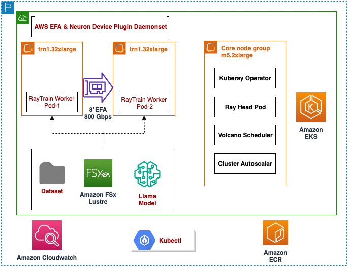
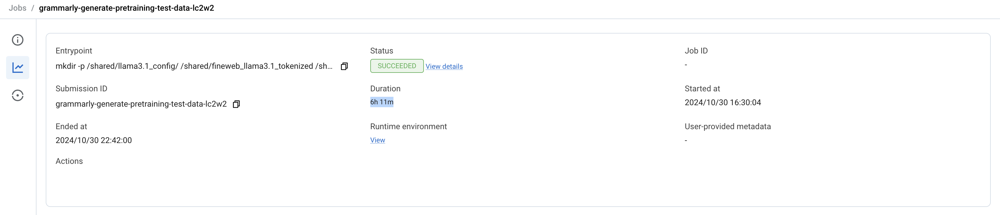
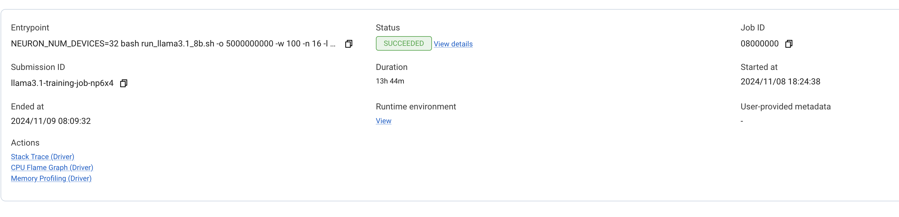
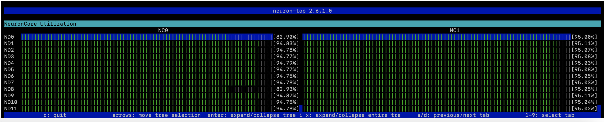
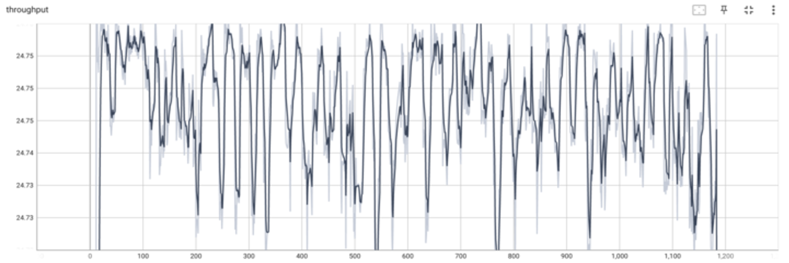
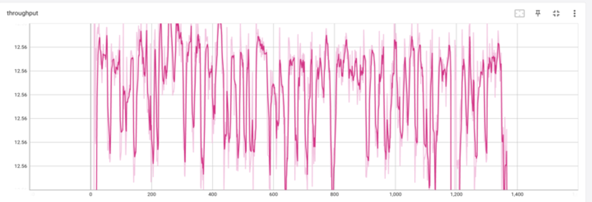

import CollapsibleContent from '../../../../src/components/CollapsibleContent';

:::warning
Deployment of ML models on EKS requires access to GPUs or Neuron instances. If your deployment isn't working, it’s often due to missing access to these resources. Also, some deployment patterns rely on Karpenter autoscaling and static node groups; if nodes aren't initializing, check the logs for Karpenter or Node groups to resolve the issue.
:::

:::danger

Note: Use of this Llama-3.1 model is governed by the Meta license.
In order to download the model weights and tokenizer, please visit the [website](https://ai.meta.com/) and accept the license before requesting access.

:::

:::info

We are actively enhancing this blueprint to incorporate improvements in observability, logging, and scalability aspects.

:::

## Pre-Training LLama3.1 on AWS Trainium using Ray and PyTorch Lightning 

## Overview <a name="overview2"></a>

This tutorial shows how to launch a distributed PyTorch Lightning neuronx-distributed training job on a Ray cluster with multiple Trn1 nodes within an Amazon Elastic Kubernetes Service (EKS) cluster. In this example, the [Llama3.1 8B](https://huggingface.co/NousResearch/Meta-Llama-3.1-8B) model will undergo distributed pre-training with Tensor parallelism, Data parallelism and Sequence parallelism using the ```sample-10BT``` FineWeb opensource dataset available on Hugging Face: [HuggingFaceFW/fineweb](https://huggingface.co/datasets/HuggingFaceFW/fineweb). 

In this tutorial, Ray will be used to launch the pre-training job on 16 trn1.32xlarge (or trn1n.32xlarge) instances, with 32 workers per instance.

### What are Ray, PTL and Neuron?

[PyTorch Lightning](https://lightning.ai/docs/pytorch/stable/starter/introduction.html) (PTL) developed by Lightning AI organization, is a library that provides a high-level interface for PyTorch, and helps you organize your code and reduce boilerplate. By abstracting away engineering code, it makes deep learning experiments easier to reproduce and improves developer productivity.

[Ray](https://docs.ray.io/en/latest/ray-core/examples/overview.html) enhances ML workflows by seamlessly scaling fine-tuning and inference across distributed clusters, transforming single-node code into high-performance, multi-node operations with minimal effort.

[AWS Neuron](https://awsdocs-neuron.readthedocs-hosted.com/en/latest/) is an SDK with a compiler, runtime, and profiling tools that unlocks high-performance and cost-effective deep learning (DL) acceleration. It supports high-performance training on AWS Trainium instances. For model deployment, it supports high-performance and low-latency inference on AWS Inferentia.

### Combining Ray + PTL + Neuron:
The integration of Ray, PyTorch Lightning (PTL), and AWS Neuron combines PTL's intuitive model development API, Ray Train's robust distributed computing capabilities for seamless scaling across multiple nodes, and AWS Neuron's hardware optimization for Trainium, significantly simplifying the setup and management of distributed training environments for large-scale AI projects, particularly those involving computationally intensive tasks like large language models.

# Architecture for Pre-training Llama-3.1 on Trn1 using Ray, PTL and EKS



The tutorial covers all steps required to prepare the EKS environment and launch the training job:

 1. [Sandbox setup](#prepjumphost)
 2. [Cluster and Tools](#clusterandtools)
 3. [Setup Ray cluster](#createcluster)
 4. [Training Job preparation & Launch](#trainingjobprep)
 5. [Monitoring Training ](#monitortraining)
 6. [Deleting the environment](#cleanup)
 7. [Contributors](#contributors)


## 1. Sandbox Setup <a name="prepjumphost"></a>

This tutorial assumes that you will use an x86-based Linux jump host to launch and manage the EKS cluster, Ray and PyTorch Lightning training jobs.

### 1.1 Launch a Linux jump host

Begin by choosing an AWS region that supports both EKS and Trainium (ex: us-east-2). 

In your chosen region, use the AWS Console or AWS CLI to launch an instance with the following configuration:

* **Instance Type:** t3.large
* **AMI:** Amazon Linux 2 AMI (HVM)
* **Key pair name:** (choose a key pair that you have access to) 
* **Auto-assign public IP:** Enabled
* **Storage:** 100 GiB root volume

### 1.2 Configure AWS credentials on the jump host

#### Log into your jump host instance using one of the following techniques:

* Connect to your instance via the AWS Console using [EC2 Instance Connect](https://docs.aws.amazon.com/AWSEC2/latest/UserGuide/Connect-using-EC2-Instance-Connect.html)
* SSH to your instance's public IP using the key pair you specified above.
  * Ex: `ssh -i KEYPAIR.pem ec2-user@INSTANCE_PUBLIC_IP_ADDRESS`

#### Configure the AWS CLI with your IAM user's credentials:

Run `aws configure`, entering the ACCESS_KEY_ID and SECRET_ACCESS_KEY you recorded above. For _Default region name_ be sure to specify the same region used to launch your jump host, ex: `us-east-2`.

```bash
bash> aws configure
AWS Access Key ID [None]:  ACCESS_KEY_ID
AWS Secret Access Key [None]: SECRET_ACCESS_KEY
Default region name [None]: us-east-2
Default output format [None]: json
```

## 2. Cluster and Tools <a name="clusterandtools"></a>

Before we begin, ensure you have all the prerequisites in place to make the deployment process smooth and hassle-free. Ensure that you have installed the following tools on your jump host.

* [AWS CLI](https://docs.aws.amazon.com/cli/latest/userguide/install-cliv2.html)
* [kubectl](https://kubernetes.io/docs/tasks/tools/)
* [terraform](https://learn.hashicorp.com/tutorials/terraform/install-cli)

To install all the pre-reqs above on jump host, you can run this [script](https://github.com/awslabs/data-on-eks/blob/main/ai-ml/trainium-inferentia/examples/llama2/install-pre-requsites-for-ec2.sh) which is compatible with Amazon Linux 2023.

### 2.1 Clone the Data on EKS repository
```
cd ~
git clone https://github.com/awslabs/data-on-eks.git
```

### 2.2 Navigate to the trainium-inferentia directory.
```
cd data-on-eks/ai-ml/trainium-inferentia
```

Let's run the below export commands to set environment variables.

```
# Enable FSx for Lustre, which will mount pre-training data to all pods across multiple nodes
export TF_VAR_enable_fsx_for_lustre=true

# Set the region according to your requirements. Check Trn1 instance availability in the specified region.
export TF_VAR_region=us-east-2

# Enable Volcano custom scheduler with KubeRay Operator
export TF_VAR_enable_volcano=true

# Note: This configuration will create two new Trn1 32xl instances. Ensure you validate the associated costs before proceeding. You can change the number of instances here.
export TF_VAR_trn1_32xl_min_size=16
export TF_VAR_trn1_32xl_desired_size=16
```

Run the installation script to provision an EKS cluster with all the add-ons needed for the solution.

```
./install.sh
```

### 2.3 Verify the resources
Verify the Amazon EKS Cluster
```
aws eks --region us-east-2 describe-cluster --name trainium-inferentia
```

```
# Creates k8s config file to authenticate with EKS
aws eks --region us-east-2 update-kubeconfig --name trainium-inferentia

kubectl get nodes # Output shows the EKS Managed Node group nodes
```

## 3. Setup Ray Cluster<a name="createcluster"></a>

### 3.1 Navigate to the directory
```
cd data-on-eks/gen-ai/training/ray-ptl-llama3.1-pretrain-trn1
```
### 3.2 Build and push the docker image to ECR
```
sh build_docker.sh
```
Enter AWS REGION In this example, us-east-2 as below

`Enter the ECR region (ex: us-east-2): us-east-2`

Ensure that the docker image is successfully built and pushed to ECR.

### 3.3 Create the Ray cluster

Once the docker image is pushed to ECR, edit the file ```1-pretrain-trn1-raycluster.yaml``` and replace the ``<AWS_ACCOUNT_ID>`` with the value of AWS Account ID you are using. 
Ensure that the docker image url is accurate.

Create the Ray cluster using the commands below:

```
kubectl apply -f 1-pretrain-trn1-raycluster.yaml
kubectl get pods # Ensure all head and worker pods are in Running state
```

## 4. Training Job preparation<a name="trainingjobprep"></a>

### 4.1 Download pretraining dataset to the Lustre-hosted persistent volume 

Run the Ray job to download the fineweb dataset containing 10B tokens. Downloading this dataset can take around 6 hours. 

```
kubectl apply -f 2-download_fineweb_dataset.yaml	
```
Monitor the status of the download dataset job using the following command and check if it's in "Completed" status before proceeding further.

```
kubectl get pods
```
You can also monitor this job using Ray Dashboard. Refer to [Monitoring Training ](#monitortraining) section for details on setting up Ray Dashboard. 



### 4.2 Precompile the Llama-3.1 8B graphs using neuron_parallel_compile <a name="precompile"></a>

PyTorch Neuronx comes with a tool called [neuron_parallel_compile](https://awsdocs-neuron.readthedocs-hosted.com/en/latest/frameworks/torch/torch-neuronx/api-reference-guide/training/pytorch-neuron-parallel-compile.html) which reduces graph compilation time by extracting model graphs and then compiling the graphs in parallel. The compiled graphs are stored on the shared storage volume where they can be accessed by the worker nodes during model training.

To precompile the Llama-3.1 8B graphs, run the following command:

```
kubectl apply -f 3-parallel-compile-trn1-rayjob.yaml
```

*Note:* Please check `entrypoint: "NEURON_NUM_DEVICES=32 bash run_llama3.1_8b.sh -r 2 -n 16 -l 4e-4 -s 8192 -p 1"` in `3-parallel-compile-trn1-rayjob.yaml` which got multiple args for the script `run_llama3.1_8b.sh` as below. There are default values assigned for all the args within the script. You may update the args and values **only** if needed. 

```
Syntax: ./run_llama3.1_8b.sh [-t|w|l|m|d|c|s|n]
options:
t	  total number of training steps
w	  warmup steps for training
l	  learning rate
m	  abs path to llama config.json
d   abs path to tokenized dataset
c   abs path to checkpoint directory
s   Sequence length
n   Number of instances to run training
b   tensor board logs location
r   defining steps this run
o   max tokens
g   global batch size
z   mini batch size
p   neuron parallel compile 0 or 1
```

Run `kubectl get pods` and check to ensure that you see `llama3.1-parallel-compile-job` pod that is "Running". If the status shows as "ContainerCreating", please wait a few seconds till the status changes to "Running".

Next, run the following command to monitor the output of the precompilation job:

```
kubectl logs -f <YOUR_PARALLELCOMPILE_POD_NAME>
```

The precompilation job will run for ~15 minutes. Once complete, you will see the following in the output:

```
[36m(RayTrainWorker pid=xxxx, ip=aa.bb.cc.dd)[0m YYYY-MM-DD HH:MM:SS.000XXX:  YYYYY  INFO ||NEURON_PARALLEL_COMPILE||: Total graphs: X
[36m(RayTrainWorker pid=xxxx, ip=aa.bb.cc.dd)[0m YYYY-MM-DD HH:MM:SS.000XXX:  YYYYY  INFO ||NEURON_PARALLEL_COMPILE||: Total successful compilations: X
[36m(RayTrainWorker pid=xxxx, ip=aa.bb.cc.dd)[0m YYYY-MM-DD HH:MM:SS.000XXX:  YYYYY  INFO ||NEURON_PARALLEL_COMPILE||: Total failed compilations: 0
```

### 4.3 Launch Llama-3.1 8B pre-training job using 16 trn1.32xlarge instances <a name="launchtraining"></a>

To run the pre-training job for Llama-3.1 8B, run the following command:

```
kubectl apply -f 4-train-trn1-rayjob.yaml 
```

*Note:* Please check `entrypoint: "NEURON_NUM_DEVICES=32 bash bash run_llama3.1_8b.sh -w 500 -n 16 -l 4e-4 -s 8192"` in `4-train-trn1-rayjob.yaml ` which got multiple args for the script `run_llama3.1_8b.sh` as below. There are default values assigned for all the args within the script. You may update the args and values **only** if needed. 

```
Syntax: ./run_llama3.1_8b.sh [-t|w|l|m|d|c|s|n]
options:
t	  total number of training steps
w	  warmup steps for training
l	  learning rate
m	  abs path to llama config.json
d   abs path to tokenized dataset
c   abs path to checkpoint directory
s   Sequence length
n   Number of instances to run training
b   tensor board logs location
r   defining steps this run
o   max tokens
g   global batch size
z   mini batch size
p   neuron parallel compile 0 or 1
```

Run `kubectl get pods` and check to ensure that you see `llama3.1-training-job` pod that is "Running". If the status shows as "ContainerCreating", wait a few seconds and re-run this command until status changes to "Running".

To continously view the training script output (similar to the `tail -f` command in Linux), you can use the following command. The command can be terminated using CTRL-C.

```
kubectl logs -f YOUR_POD_NAME
```

## 5. Monitor Training  <a name="monitortraining"></a>

### Monitoring using Ray Dashboard -- Optional
Run the following on your localhost to tunnel the ray dashboard from the EKS cluster to your localhost. As a pre-requisite, ensure kubectl is also setup with same AWS credentials in your localhost as the jumphost. Ensure `kubectl get pods` works well from your localhost.

#### Accessing the Ray Dashboard
The Ray dashboard provides valuable insights into your cluster's status and job progress. To access it:

#### Port Forwarding:

This forwards the Ray dashboard port (8265) from your local machine to the head pod within the cluster.
```
kubectl port-forward service/kuberay-trn1-head-svc 8265:8265
```
Open Browser and navigate to http://localhost:8265 in your web browser to view the dashboard.

Once the dashboard has been opened successfully, click ```Jobs``` to view details of the pre-training job such such as Duration etc. You can check the logs of the job for detailed messages. 


The job above shows that it took approximately 13 hours to finish the training job using 16 trn1.32xlarge nodes. 

### Monitor Neuron device utilization using neuron-top <a name="neurontop"></a>

The Neuron SDK provides [Neuron tools](https://awsdocs-neuron.readthedocs-hosted.com/en/latest/tools/index.html#neuron-tools) for monitoring Neuron devices on Inf2 and Trn1 instances. During a training job it is often useful to monitor Neuron device utilization using `neuron-top`, which provides a text-based view of device and memory utilization.

To view `neuron-top` statistics for one of your nodes, begin by choosing one of your running Llama training pods:

```
kubectl get pods | grep Running | grep llama
```

Substitute the name of one of your running pods into the following command to launch a bash prompt within the running pod:

```
kubectl exec -it <YOUR_POD_NAME> -- /bin/bash
```

At the bash prompt, run `neuron-top`:

```
neuron-top
```

It should look something like the below:



When you are finished exploring `neuron-top`, press `q` to quit. At the pod's bash prompt, press `CTRL-D` to return to your jump host.

## 6. Analysis of Results <a name="results"></a>

You can find the results below for the pre-training job, which was run using fineweb dataset with 10B tokens and 1 Epoch in us-east-2 region. 
You can leverage Tensorboard for viewing the visualizations.

#### Results from 16 node run:
Training duration: 13 hours 36 mins and 10secs
Throughput: ~24.75 sequences / second (1 sequence = 1024 tokens)



#### Results from 8 node run:
Training duration: 26 hours 46 mins and 48 secs
Throughput: ~12.56 sequences / second (1 sequence = 1024 tokens)



## 7. Clean-up <a name="cleanup"></a>

When you are finished with the tutorial, run the following commands on the jump host to remove the EKS cluster and associated resources:

```
#Delete all the pods and cluster
kubectl delete -f 4-train-trn1-rayjob.yaml
kubectl delete -f 3-parallel-compile-trn1-rayjob.yaml
kubectl delete -f 1-pretrain-trn1-raycluster.yaml	

# Cleanup the Infra
cd ~/data-on-eks/ai-ml/trainium-inferentia
./cleanup.sh

Lastly, terminate your jump host instance via the AWS Console.
```