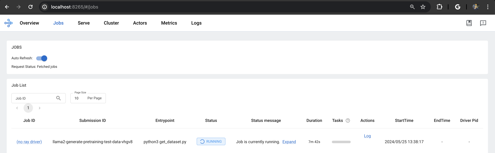
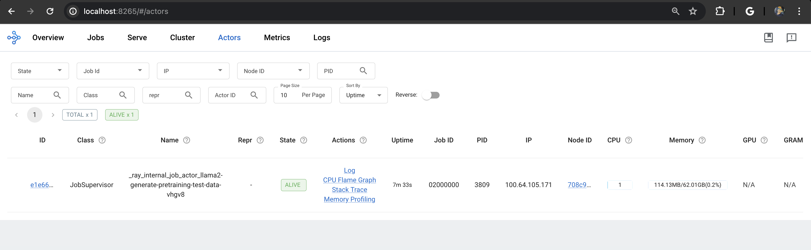
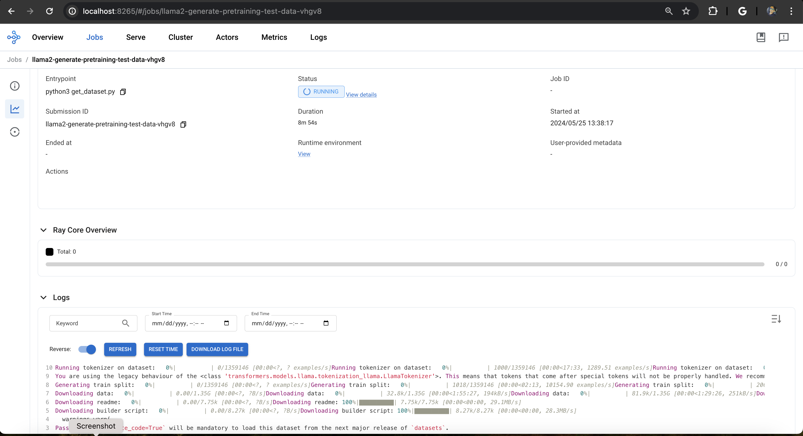
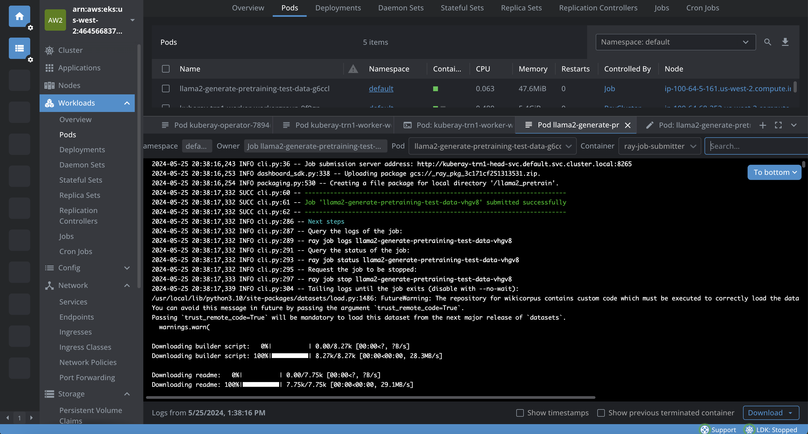
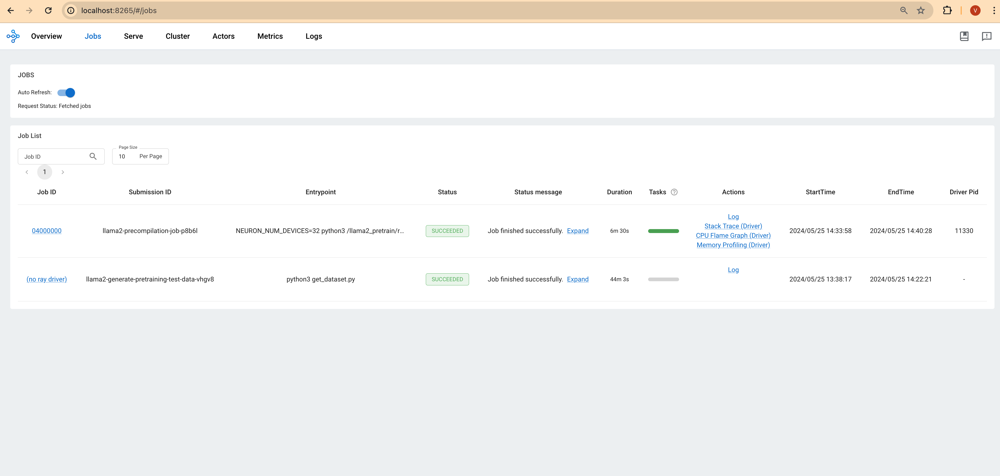
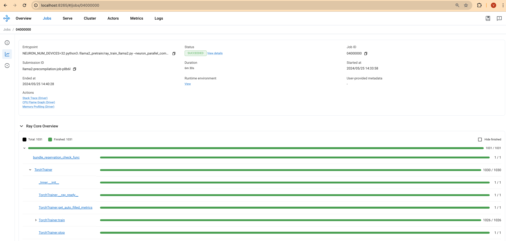
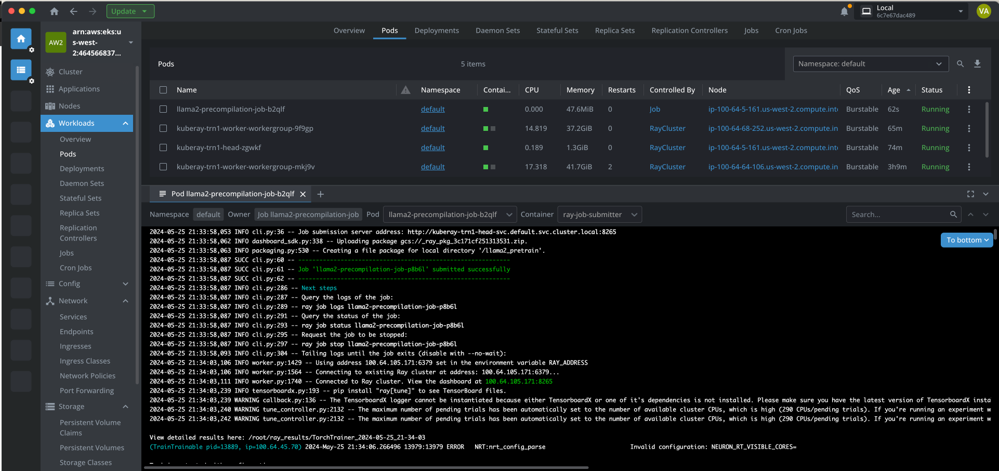
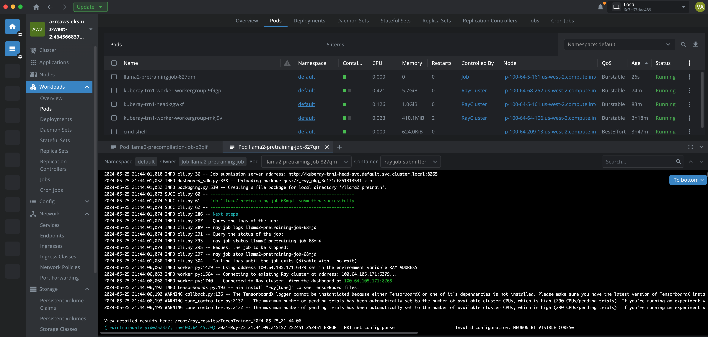
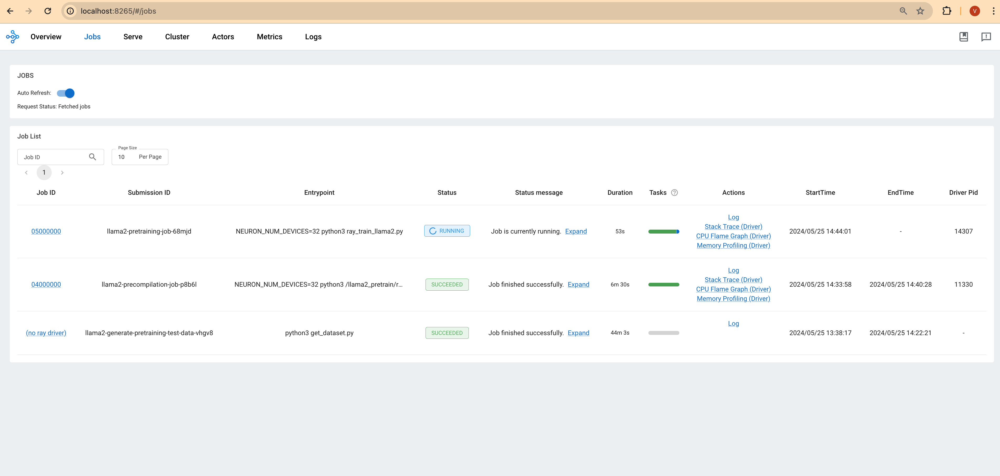
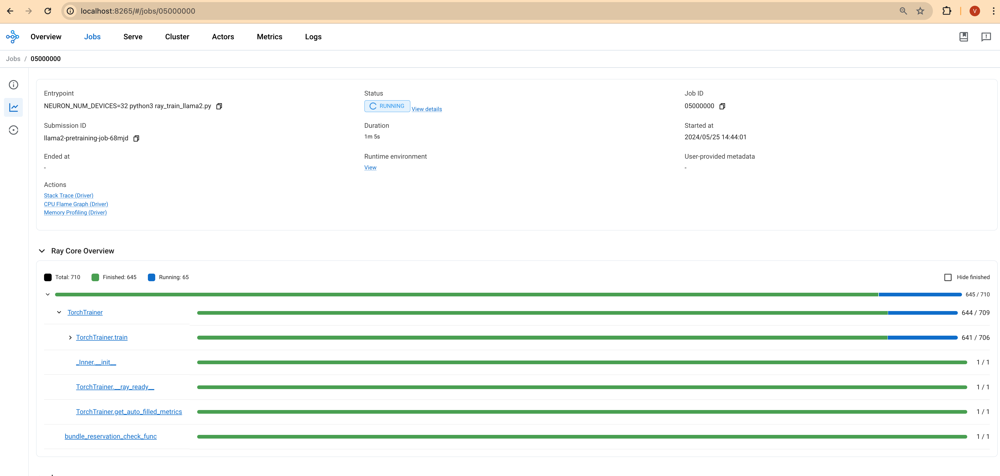

import CollapsibleContent from '../../../../src/components/CollapsibleContent';

:::caution

The **AI on EKS** content **is being migrated** to a new repository.
🔗 👉 [Read the full migration announcement »](https://awslabs.github.io/data-on-eks/docs/migration/migration-announcement)

:::

:::warning
Deployment of ML models on EKS requires access to GPUs or Neuron instances. If your deployment isn't working, it’s often due to missing access to these resources. Also, some deployment patterns rely on Karpenter autoscaling and static node groups; if nodes aren't initializing, check the logs for Karpenter or Node groups to resolve the issue.
:::

:::danger

Note: Use of this Llama-2 model is governed by the Meta license.
In order to download the model weights and tokenizer, please visit the [website](https://ai.meta.com/) and accept the license before requesting access.

:::

:::info

We are actively enhancing this blueprint to incorporate improvements in observability, logging, and scalability aspects.

:::

# Llama2 Distributed Pre-training on Trn1 with RayTrain and KubeRay

This comprehensive guide walks you through pre-training the `Llama2-7B` language model using AWS Trainium (Trn1) instances and the AWS Neuron SDK within a KubeRay cluster on Amazon EKS. This is a tailored version of the original [Llama2 pretraining tutorial](https://awsdocs-neuron.readthedocs-hosted.com/en/latest/libraries/neuronx-distributed/tutorials/training_llama2_7b.html#llama2-7b-tp-zero1-tutorial) optimized for KubeRay's distributed training capabilities.


### What is Llama-2?

Llama-2 is a state-of-the-art large language model (LLM) designed for various natural language processing (NLP) tasks, including text generation, summarization, translation, question answering, and more. It's a powerful tool that can be fine-tuned for specific use cases.

### Why RayTrain and KubeRay for Distributed Training?

Distributed training is essential for large models like Llama-2 due to their extensive computational and memory requirements. The combination of RayTrain and KubeRay, especially when leveraged with AWS Trainium, provides a robust framework for handling these demands efficiently and effectively:

#### RayTrain:
- **Simplified Distributed Training**: RayTrain is a high-level library built on the Ray framework that abstracts the complexities of distributed training. It allows you to scale your Llama-2 training across multiple nodes with minimal code changes. Ray's actor-based architecture and task-based parallelism enable efficient execution of distributed workloads.
- **Flexible Strategies**: RayTrain supports various distributed training strategies such as data parallelism and model parallelism. Data parallelism splits the dataset across multiple nodes, while model parallelism splits the model itself. This flexibility allows you to optimize training based on the specific needs of your model and the architecture of your training environment.
- **Fault Tolerance**: RayTrain includes built-in fault tolerance mechanisms. If a node fails, Ray can reschedule the tasks on other available nodes, ensuring that the training job continues without interruption. This feature is crucial for maintaining robustness in large-scale distributed training environments.
- **Ease of Use**: RayTrain offers intuitive APIs that simplify the setup and execution of distributed training jobs. Integrations with popular machine learning libraries like Hugging Face Transformers make it easier to incorporate RayTrain into your existing workflows without extensive modifications.

#### KubeRay:
- **Integration with Kubernetes**: KubeRay leverages Kubernetes' native capabilities to deploy, manage, and scale Ray clusters. This integration allows you to use Kubernetes' robust orchestration features to handle Ray workloads effectively.
- **Dynamic Scaling**: KubeRay supports dynamic scaling of Ray clusters. Ray's built-in autoscaler can request additional actor replicas based on workload demands, while Kubernetes tools like Karpenter or Cluster Autoscaler manage the creation of new nodes to meet these demands.
- **Horizontal Scaling**: Scale your Ray clusters horizontally by adding more worker nodes as the computational load increases. This allows efficient handling of large-scale distributed training and inference tasks.
- **Custom Resource Definitions (CRDs)**: KubeRay utilizes Kubernetes CRDs to define and manage Ray clusters and jobs. This provides a standardized way to handle Ray workloads within the Kubernetes ecosystem.
- **Fault Tolerance**: KubeRay takes advantage of Kubernetes' self-healing capabilities. If a Ray head node or worker node fails, Kubernetes automatically restarts the failed components, ensuring minimal downtime and continuous operation.
- **Distributed Scheduling**: Ray's actor-based model and distributed task scheduling, combined with Kubernetes' orchestration, ensure high availability and efficient task execution even in the event of node failures.
- **Declarative Configuration**: KubeRay allows you to define Ray clusters and jobs using declarative YAML configurations. This simplifies the deployment and management process, making it easier to set up and maintain Ray clusters.
- **Integrated Logging and Monitoring**: KubeRay integrates with Kubernetes' logging and monitoring tools, such as Prometheus and Grafana. This provides comprehensive insights into the performance and health of Ray clusters, facilitating easier debugging and optimization.
- **Spot Instances**: Use Kubernetes' support for spot instances to run Ray clusters cost-effectively. This allows you to take advantage of lower-cost compute resources while maintaining the ability to scale as needed.

#### AWS Trainium:
- **Optimized for Deep Learning**: AWS Trainium-based Trn1 instances are specifically designed for deep learning workloads. They offer high throughput and low latency, making them ideal for training large-scale models like Llama-2. Trainium chips provide significant performance improvements over traditional processors, accelerating training times.
- **Neuron SDK**: The AWS Neuron SDK is tailored to optimize your deep learning models for Trainium. It includes features like advanced compiler optimizations and support for mixed precision training, which can further accelerate your training workloads while maintaining accuracy.

### Why This Combination is Powerful
- **Simplified Scaling**: RayTrain and KubeRay simplify the process of scaling Llama-2 training across multiple nodes. With Ray's efficient distributed execution and KubeRay's Kubernetes-native orchestration, you can easily scale your training workloads to leverage the full power of AWS Trainium on Trn1 instances.
- **Optimized Performance**: The Neuron SDK enhances the performance of your training jobs by optimizing them specifically for Trainium's architecture. Combined with Ray's ability to efficiently manage distributed tasks and KubeRay's resource orchestration, this setup ensures optimal training performance.
- **Cost-Effective**: Ray's autoscaling capabilities and Kubernetes' resource management help you optimize costs by efficiently allocating resources and scaling your cluster based on demand. This ensures you only use the resources you need, reducing unnecessary expenditure.

By using this combination of technologies, you can take advantage of the latest advancements in distributed training and hardware to pre-train Llama-2 efficiently and effectively.

### What is Volcano?
Volcano is an open-source batch scheduling system built on Kubernetes, specifically designed to manage high-performance computing (HPC) and machine learning workloads. It provides advanced scheduling capabilities such as gang scheduling, fair sharing, and preemption, which are essential for efficiently running large-scale, distributed training jobs in a Kubernetes environment.

### How Volcano Works with Gang Scheduling
Volcano's gang scheduling ensures that all pods in a job (or "gang") are scheduled simultaneously. This is critical for distributed training workloads where multiple pods need to start together to function correctly. If even one pod in the gang cannot be scheduled due to resource constraints, none of the pods in the gang will start. This prevents partial execution and ensures that all resources required for the job are available before execution begins.

## 1. Deploying the Solution

<CollapsibleContent header={<h2><span>Prerequisites</span></h2>}>
    Before we begin, ensure you have all the prerequisites in place to make the deployment process smooth and hassle-free.
    Ensure that you have installed the following tools on your EC2 or Cloud9 instance.

:::info

    * [EC2 Instance](https://docs.aws.amazon.com/AWSEC2/latest/UserGuide/EC2_GetStarted.html) or [Cloud9 instance](https://docs.aws.amazon.com/cloud9/latest/user-guide/tutorial-create-environment.html) → Ensure you have 100GB+ of storage for both options. This is crucial for creating a Docker image with x86 architecture and having the right amount of storage.

    If you are using a local Windows machine or Mac, ensure you have Docker installed locally with builder storage above 100GB and the image is created with x86 architecture.

:::


    * [AWS CLI](https://docs.aws.amazon.com/cli/latest/userguide/install-cliv2.html)
    * [kubectl](https://Kubernetes.io/docs/tasks/tools/)
    * [terraform](https://learn.hashicorp.com/tutorials/terraform/install-cli)

    To install all the pre-reqs on EC2, you can run this [script](https://github.com/awslabs/data-on-eks/blob/main/ai-ml/trainium-inferentia/examples/llama2/install-pre-requsites-for-ec2.sh) which is compatible with Amazon Linux 2023.


    **Clone the Data on EKS repository**

    ```bash
    git clone https://github.com/awslabs/data-on-eks.git
    ```

    **Navigate to the trainium-inferentia directory.**

    ```bash
    cd data-on-eks/ai-ml/trainium-inferentia
    ```

   Let's run the below export commands to set environment variables.

:::info

    **NOTE:** As of 2024/01/04 Trainium instances only available in us-west-2, us-east-1, and us-east-2 regions.

:::


    ```bash
    # Enable FSx for Lustre, which will mount pre-training data to all pods across multiple nodes
    export TF_VAR_enable_fsx_for_lustre=true

    # Set the region according to your requirements. Check Trn1 instance availability in the specified region.
    export TF_VAR_region=us-west-2

    # Enable Volcano custom scheduler with KubeRay Operator
    export TF_VAR_enable_volcano=true

    # Note: This configuration will create two new Trn1 32xl instances. Ensure you validate the associated costs before proceeding.
    export TF_VAR_trn1_32xl_min_size=2
    export TF_VAR_trn1_32xl_desired_size=2
    ```

    Run the installation script to provision an EKS cluster with all the add-ons needed for the solution.

    ```bash
    ./install.sh
    ```

    ### Verify the resources

    Verify the Amazon EKS Cluster

    ```bash
    aws eks --region us-west-2 describe-cluster --name trainium-inferentia
    ```

    ```bash
    # Creates k8s config file to authenticate with EKS
    aws eks --region us-west-2 update-kubeconfig --name trainium-inferentia

    kubectl get nodes # Output shows the EKS Managed Node group nodes
    ```

</CollapsibleContent>

## 2. Build the Docker Image (Optional Step)

To simplify the blueprint deployment, we have already built the Docker image and made it available under the public ECR.
If you want to customize the Docker image, you can update the `Dockerfile` and follow the optional step to build the Docker image.
Please note that you will also need to modify the RayCluster YAML file, `llama2-pretrain-trn1-raycluster.yaml`, with the newly created image using your own private ECR.

```bash
cd gen-ai/training/raytrain-llama2-pretrain-trn1
./kuberay-trn1-llama2-pretrain-build-image.sh
```
After running this script, note the Docker image URL and tag that are produced.
You will need this information for the next step.

## 3. Launch the Ray Cluster with KubeRay Operator

If you skip step 2, you don't need to modify the YAML file.
You can simply run the `kubectl apply` command on the file, and it will use the public ECR image that we published.

If you built a custom Docker image in **Step 2**, update the `gen-ai/training/raytrain-llama2-pretrain-trn1/llama2-pretrain-trn1-raycluster.yaml` file with the Docker image URL and tag obtained from the previous step.

Once you have updated the YAML file (if needed), run the following command to launch the KubeRay cluster pods in your EKS cluster:

```bash
kubectl apply -f llama2-pretrain-trn1-raycluster.yaml
```

**Verify the Pod Status:**

```bash
kubectl get pods -l "ray.io/cluster=kuberay-trn1"
```

### Gang Scheduling of Ray Head and Worker Pods with Volcano

In the context of deploying a Ray cluster for training Llama2, Volcano is crucial for ensuring that the Ray head and worker pods are scheduled together efficiently.
The Ray head pod, typically running on an x86 instance, coordinates the distributed training, while the worker pods, running on AWS Trainium (Trn1) instances, perform the computationally intensive tasks.
By leveraging **Volcano's gang scheduling**, we can ensure that the head and all worker pods are allocated the necessary resources simultaneously, enabling the distributed training job to start without delays.

Here's an example configuration for integrating Volcano with a RayCluster for Llama2 training:

:::info

We are using the default namespace for this deployment because the `fsx-claim` **PVC** is created under the `default` namespace by the Terraform blueprint.

If you want to deploy the cluster in a dedicated namespace, ensure that the FSX for Lustre file system is also created in the same namespace since PVCs are namespace-bound.

:::

```yaml
# Docs for Volcano with KubeRay: https://docs.ray.io/en/master/cluster/kubernetes/k8s-ecosystem/volcano.html
---
apiVersion: scheduling.volcano.sh/v1beta1
kind: Queue
metadata:
  name: llama2-training-queue
  namespace: default
spec:
  weight: 1
  capability:
    cpu: '500'
    memory: 1500Gi

---
apiVersion: ray.io/v1
kind: RayCluster
metadata:
  name: kuberay-trn1
  namespace: default
  labels:
    ray.io/scheduler-name: volcano
    volcano.sh/queue-name: llama2-training-queue
spec:
  rayVersion: 2.22.0
  headGroupSpec:
...
...
```

You should see one ray-head pod and two ray-worker pods in the Running state:

:::warning

Please be aware that it may take up to 10 minutes for the image to be pulled and the pod to become ready.

:::

```bash
NAME                                    READY   STATUS    RESTARTS   AGE
kuberay-trn1-head-67t46                 0/1     Pending   0          2m50s
kuberay-trn1-worker-workergroup-fz8bs   0/1     Pending   0          2m50s
kuberay-trn1-worker-workergroup-gpnxh   0/1     Pending   0          2m50s
```

Check the logs of the head pod:

Look for messages indicating that the Ray head has started and the cluster is operational.

```bash
kubectl logs kuberay-trn1-head-xxxxx
```

### Accessing the Ray Dashboard (Port Forwarding):
The Ray dashboard provides valuable insights into your cluster's status and job progress. To access it:

**Forward the Port:**

This forwards the Ray dashboard port (8265) from your local machine to the head pod within the cluster.

```bash
kubectl port-forward service/kuberay-trn1-head-svc 8265:8265
```

Open Browser and navigate to [http://localhost:8265](http://localhost:8265) in your web browser to view the dashboard.


## 4. Generate Pre-training Data on FSx Shared Filesystem

:::warning

Data generation step can take up to 20 minutes to create all the data in FSx for Lustre.

:::


In this step, we'll leverage KubeRay's Job specification to kickstart the data generation process. We'll submit a job directly to the Ray head pod. This job plays a key role in preparing your model for training.

Check out the `RayJob` definition spec below to leverage the existing RayCluster using `clusterSelector` to submit the jobs to RayCluster.


```yaml
# ----------------------------------------------------------------------------
# RayJob: llama2-generate-pretraining-test-data
#
# Description:
# This RayJob is responsible for generating pre-training test data required for
# the Llama2 model training. It sources data from the specified dataset, processes
# it, and prepares it for use in subsequent training stages. The job runs a Python
# script (`get_dataset.py`) that performs these data preparation steps.

# Usage:
# Apply this configuration to your Kubernetes cluster using `kubectl apply -f 1-llama2-pretrain-trn1-rayjob-create-test-data.yaml`.
# Ensure that the Ray cluster (`kuberay-trn1`) is running and accessible in the specified namespace.
# ----------------------------------------------------------------------------

apiVersion: ray.io/v1
kind: RayJob
metadata:
  name: llama2-generate-pretraining-test-data
  namespace: default
spec:
  submissionMode: K8sJobMode
  entrypoint: "python3 get_dataset.py"
  runtimeEnvYAML: |
    working_dir: /llama2_pretrain
    env_vars:
      PYTHONUNBUFFERED: '0'
    resources:
      requests:
        cpu: "6"
        memory: "30Gi"
  clusterSelector:
    ray.io/cluster: kuberay-trn1
    rayClusterNamespace: default  # Replace with the namespace where your RayCluster is deployed
  ttlSecondsAfterFinished: 60  # Time to live for the pod after completion (in seconds)
```

Execute the following command to run the Test Data creation Ray job:


```bash
kubectl apply -f 1-llama2-pretrain-trn1-rayjob-create-test-data.yaml
```

**What Happens Behind the Scenes:**

**Job Launch:** You'll use kubectl to submit the KubeRay job specification. The Ray head pod in your `kuberay-trn1` cluster receives and executes this job.

**Data Generation:** The job runs the `gen-ai/training/raytrain-llama2-pretrain-trn1/llama2_pretrain/get_dataset.py` script, which harnesses the power of the Hugging Face datasets library to fetch and process the raw English Wikipedia dataset ("wikicorpus").

**Tokenization:** The script tokenizes the text using a pre-trained tokenizer from Hugging Face transformers. Tokenization breaks down the text into smaller units (words or subwords) for the model to understand.

**Data Storage:** The tokenized data is neatly organized and saved to a specific directory (`/shared/wikicorpus_llama2_7B_tokenized_4k/`) within your FSx for Lustre shared filesystem. This ensures all worker nodes in your cluster can readily access this standardized data during pre-training.

### Monitoring the Job:

To keep tabs on the job's progress:

**Ray Dashboard**: Head over to the Ray dashboard, accessible via your Ray head pod's IP address and port 8265. You'll see real-time updates on the job's status.








Alternatively, you can use the following command in your terminal:

```bash
kubectl get pods | grep llama2
```

**Output:**

```
llama2-generate-pretraining-test-data-g6ccl   1/1     Running   0             5m5s
```

The following screenshot taken from Lens K8s IDE to show the logs of the pod.



## 5. Run Pre-compilation Job (Optimization Step)

:::info

Pre-compilation job can take upto 6 min

:::

Before starting the actual training, we'll perform a pre-compilation step to optimize the model for the Neuron SDK. This helps the model run more efficiently on the `Trn1` instances. This script will use the Neuron SDK to compile and optimize the model's computational graph, making it ready for efficient training on the Trn1 processors.

In this step, you will run a pre-compilation job where the Neuron SDK will identify, compile, and cache the compute graphs associated with `Llama2` pretraining.

Check out the `RayJob` definition spec below to run the pre-compilation job:

```yaml
# ----------------------------------------------------------------------------
# RayJob: llama2-precompilation-job
#
# Description:
# This RayJob is responsible for the pre-compilation step required for the Llama2 model
# training. It runs a Python script (`ray_train_llama2.py`) with the `--neuron_parallel_compile`
# option to compile the model in parallel using AWS Neuron devices. This step is crucial for
# optimizing the model for efficient training on AWS infrastructure.

# Usage:
# Apply this configuration to your Kubernetes cluster using `kubectl apply -f 2-llama2-pretrain-trn1-rayjob-precompilation.yaml`.
# Ensure that the Ray cluster (`kuberay-trn1`) is running and accessible in the specified namespace.
# ----------------------------------------------------------------------------

---
apiVersion: ray.io/v1
kind: RayJob
metadata:
  name: llama2-precompilation-job
  namespace: default
spec:
  submissionMode: K8sJobMode
  entrypoint: "NEURON_NUM_DEVICES=32 python3 /llama2_pretrain/ray_train_llama2.py --neuron_parallel_compile"
  runtimeEnvYAML: |
    working_dir: /llama2_pretrain
    env_vars:
      PYTHONUNBUFFERED: '0'
  clusterSelector:
    ray.io/cluster: kuberay-trn1
    rayClusterNamespace: default  # Replace with the namespace where your RayCluster is deployed
  ttlSecondsAfterFinished: 60  # Time to live for the pod after completion (in seconds)
```

Execute the following command to run the pre-compilation job:

```bash
kubectl apply -f 2-llama2-pretrain-trn1-rayjob-precompilation.yaml
```

**Verification Steps:**

To monitor the job's progress and verify that it is running correctly, use the following commands and tools:

**Ray Dashboard:** Access the Ray dashboard via your Ray head pod's IP address and port `8265` to see real-time updates on the job's status.





The following screenshot taken from Lens K8s IDE to show the logs of the pod.



## 6. Run Distributed Pre-training Job

:::warning

This job can run for many hours so feel free to cancel the job using Ctrl+C once you are convinced that the loss is decreasing and the model is learning.

:::

Now, you're ready to begin the actual training of the Llama 2 model! This step involves running the distributed pre-training job using a RayJob. The job will utilize AWS Neuron devices to efficiently train the model with the prepared dataset.

Check out the `RayJob` definition spec below to run the pretraining job:

```yaml
# ----------------------------------------------------------------------------
# RayJob: llama2-pretraining-job
#
# Description:
# This RayJob is responsible for the main pretraining step of the Llama2 model.
# It runs a Python script (`ray_train_llama2.py`) to perform the pretraining using AWS Neuron devices.
# This step is critical for training the language model with the prepared dataset.

# Usage:
# Apply this configuration to your Kubernetes cluster using `kubectl apply -f 3-llama2-pretrain-trn1-rayjob.yaml`.
# Ensure that the Ray cluster (`kuberay-trn1`) is running and accessible in the specified namespace.
# ----------------------------------------------------------------------------

---
apiVersion: ray.io/v1
kind: RayJob
metadata:
  name: llama2-pretraining-job
  namespace: default
spec:
  submissionMode: K8sJobMode
  entrypoint: "NEURON_NUM_DEVICES=32 python3 ray_train_llama2.py"
  runtimeEnvYAML: |
    working_dir: /llama2_pretrain
    env_vars:
      PYTHONUNBUFFERED: '0'
  clusterSelector:
    ray.io/cluster: kuberay-trn1
    rayClusterNamespace: default  # Replace with the namespace where your RayCluster is deployed
  shutdownAfterJobFinishes: true
  activeDeadlineSeconds: 600   # The job will be terminated if it runs longer than 600 seconds (10 minutes)
  ttlSecondsAfterFinished: 60  # Time to live for the pod after completion (in seconds)
```

Execute the following command to run the pretraining job:

```bash
kubectl apply -f 3-llama2-pretrain-trn1-rayjob.yaml
```

**Monitor Progress:**

You can monitor the progress of the training job using the Ray Dashboard or by observing the logs output to your terminal. Look for information like the training loss, learning rate, and other metrics to assess how well the model is learning.



**Ray Dashboard:** Access the Ray dashboard via your Ray head pod's IP address and port 8265 to see real-time updates on the job's status.






### Cleaning up

To remove the resources created using this solution, run the cleanup script:

```bash
# Delete the RayCluster Resources:
cd gen-ai/training/raytrain-llama2-pretrain-trn1
kubectl delete -f llama2-pretrain-trn1-raycluster.yaml

# Clean Up the EKS Cluster and Associated Resources:
cd data-on-eks/ai-ml/trainium-inferentia
./cleanup.sh
```
