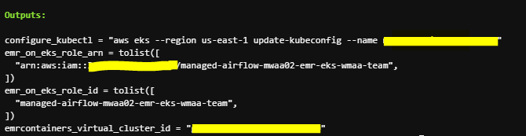

# Amazon Managed Workflows for Apache Airflow (MWAA)
Amazon Managed Workflows for Apache Airflow (MWAA) is a managed orchestration service for Apache Airflow that makes it easier to set up and operate end-to-end data pipelines in the cloud at scale. Apache Airflow is an open-source tool used to programmatically author, schedule, and monitor sequences of processes and tasks referred to as “workflows.” With Managed Workflows, you can use Airflow and Python to create workflows without having to manage the underlying infrastructure for scalability, availability, and security.

The example demonstrates how to use [Amazon Managed Workflows for Apache Airflow (MWAA)](https://docs.aws.amazon.com/mwaa/latest/userguide/what-is-mwaa.html) to assign jobs to Amazon EKS in two ways.
1. Directly create a job and deploy to EKS.
2. Register EKS as a virtual cluster in EMR and assign a spark job to EMR on EKS.

[Code repo](https://github.com/awslabs/data-on-eks/tree/main/schedulers/terraform/managed-airflow-mwaa) for this example.

### Considerations

Ideally we recommend adding the steps to sync requirements/sync dags to the MWAA S3 Bucket as part of a CI/CD pipeline. Generally Dags development have a different lifecycle than the Terraform code to provision infrastructure.
For simplicity, we are providing steps for that using Terraform running AWS CLI commands on `null_resource`.

## Prerequisites:

Ensure that you have the following tools installed locally:

1. [aws cli](https://docs.aws.amazon.com/cli/latest/userguide/install-cliv2.html)
2. [kubectl](https://Kubernetes.io/docs/tasks/tools/)
3. [terraform](https://learn.hashicorp.com/tutorials/terraform/install-cli)

## Deploy

To provision this example:

```bash
git clone https://github.com/awslabs/data-on-eks.git
cd data-on-eks/schedulers/terraform/managed-airflow-mwaa
terraform init
terraform apply -var region=us-west-2  # Change according to your region
```

Enter `yes` at command prompt to apply

Once done, you will see terraform output like below.



The following components are provisioned in your environment:
  - A sample VPC, 3 Private Subnets and 3 Public Subnets
  - Internet gateway for Public Subnets and NAT Gateway for Private Subnets
  - EKS Cluster Control plane with one managed node group
  - EKS Managed Add-ons: VPC_CNI, CoreDNS, Kube_Proxy, EBS_CSI_Driver
  - K8S metrics server and cluster autoscaler
  - A MWAA environment in version 2.2.2
  - An EMR virtual cluster registered with the newly created EKS
  - A S3 bucket with DAG code

## Validate

The following command will update the `kubeconfig` on your local machine and allow you to interact with your EKS Cluster using `kubectl` to validate the deployment.

### Run `update-kubeconfig` command

```bash
aws eks --region us-west-2 update-kubeconfig --name managed-airflow-mwaa
```

### List the nodes

```bash
kubectl get nodes

# Output should look like below
NAME                         STATUS   ROLES    AGE     VERSION
ip-10-0-0-42.ec2.internal    Ready    <none>   5h15m   v1.23.9-eks-ba74326
ip-10-0-22-71.ec2.internal   Ready    <none>   5h15m   v1.23.9-eks-ba74326
ip-10-0-44-63.ec2.internal   Ready    <none>   5h15m   v1.23.9-eks-ba74326
```

### List the namespaces in EKS cluster

```bash
kubectl get ns

# Output should look like below
default           Active   4h38m
emr-mwaa          Active   4h34m
kube-node-lease   Active   4h39m
kube-public       Active   4h39m
kube-system       Active   4h39m
mwaa              Active   4h30m
```

namespace `emr-mwaa` will be used by EMR for running spark jobs.<br />
namespace `mwaa` will be used by MWAA directly.


## Trigger jobs from MWAA

### Log into Apache Airflow UI

- Open the Environments page on the Amazon MWAA console
- Choose an environment
- Under the `Details` section, click the link for the Airflow UI<br />

Note: You will see red error message once login. That is because the EMR connection has not been setup. The message will be gone after following the steps below to set up the connection and login again.

### Trigger the DAG workflow to execute job in EMR on EKS

First, you need to set up the connection to EMR virtual cluster in MWAA


- Click Add button, <br />
- Make sure use `emr_eks` as Connection Id <br />
- `Amazon Web Services` as Connection Type <br />
- Replace the value in `Extra` based on your terraform output <br />
`{"virtual_cluster_id":"<emrcontainers_virtual_cluster_id in terraform output>", "job_role_arn":"<emr_on_eks_role_arn in terraform output>"}`


Go back to Airflow UI main page, enable the example DAG `emr_eks_pi_job` and then trigger the job.


While it is running, use the following command to verify the spark jobs:

```bash
kubectl get all -n emr-mwaa
```

You should see output similar to the following:

```bash
NAME                                   READY   STATUS    RESTARTS   AGE
pod/000000030tk2ihdmr8g-psstj          3/3     Running   0          90s
pod/pythonpi-a8051f83b415c911-exec-1   2/2     Running   0          14s
pod/pythonpi-a8051f83b415c911-exec-2   2/2     Running   0          14s
pod/spark-000000030tk2ihdmr8g-driver   2/2     Running   0          56s

NAME                                                            TYPE        CLUSTER-IP   EXTERNAL-IP   PORT(S)                      AGE
service/spark-000000030tk2ihdmr8g-ee64be83b4151dd5-driver-svc   ClusterIP   None         <none>        7078/TCP,7079/TCP,4040/TCP   57s

NAME                            COMPLETIONS   DURATION   AGE
job.batch/000000030tk2ihdmr8g   0/1           92s        92s
```

You can also check the job status in Amazon EMR console. Under the `Virtual clusters` section, click on Virtual cluster


### Trigger the DAG workflow to execute job in EKS

In the Airflow UI, enable the example DAG kubernetes_pod_example and then trigger it.


Verify that the pod was executed successfully

After it runs and completes successfully, use the following command to verify the pod:

```bash
kubectl get pods -n mwaa
```

You should see output similar to the following:

```bash
NAME                                             READY   STATUS      RESTARTS   AGE
mwaa-pod-test.4bed823d645844bc8e6899fd858f119d   0/1     Completed   0          25s
```

## Destroy

To teardown and remove the resources created in this example:

```bash
terraform destroy -auto-approve
```
---
