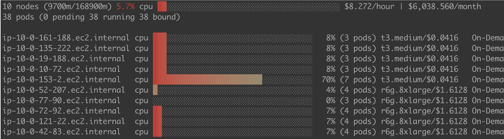

# Bin packing for Amazon EKS

## Introduction
In this post, we will show you how to enable a custom scheduler with Amazon EKS when running DoEKS especially for Spark on EKS, including OSS Spark and EMR on EKS. The custom scheduler is a custom Kubernetes scheduler with ```MostAllocated``` strategy running in data plane.

### Why bin packing
By default, the [scheduling-plugin](https://kubernetes.io/docs/reference/scheduling/config/#scheduling-plugins) NodeResourcesFit use the ```LeastAllocated``` for score strategies. For the long running workloads, that is good because of high availability. But for batch jobs, like Spark workloads, this would lead high cost. By changing the from ```LeastAllocated``` to ```MostAllocated```, it avoids spreading pods across all running nodes, leading to higher resource utilization and better cost efficiency.

Batch jobs like Spark are running on demand with limited or predicted time. With ```MostAllocated``` strategy, Spark executors are always bin packing into one node util the node can not host any pods. You can see the following picture shows the

```MostAllocated``` in EMR on EKS.


```LeastAllocated``` in EMR on EKS


### Pros
1) Improve the node utilizations
2) Save the cost

### Considerations
Although we have provided upgrade guidance, support matrix and high availability design, but maintaining a custom scheduler in data plane needs effort including:
1) Upgrade operations. Plan the upgrading along with your batch jobs, make sure the scheduler are running as desired.
2) Monitoring the scheduler. Monitoring and alerting are required for production purpose.
3) Adjust the scheduler pod resource and other customizations regarding your requirements.

## Deploying the Solution

### Clone the repo

```shell
git clone https://github.com/aws-samples/custom-scheduler-eks
cd custom-scheduler-eks
```

### Manifests

**Amazon EKS 1.24**

```shell
kubectl apply -f deploy/manifests/custom-scheduler/amazon-eks-1.24-custom-scheduler.yaml
```

**Amazon EKS 1.29**

```shell
kubectl apply -f deploy/manifests/custom-scheduler/amazon-eks-1.29-custom-scheduler.yaml
```

**Other Amazon EKS versions**

* replace the related image URL(https://gallery.ecr.aws/eks-distro/kubernetes/kube-scheduler)

Please refer to [custom-scheduler](https://github.com/aws-samples/custom-scheduler-eks) for more info.

### Set up pod template to use the custom scheduler for Spark
We should add custom scheduler name to the pod template as follows
```bash
kind: Pod
spec:
  schedulerName: custom-k8s-scheduler
  volumes:
    - name: spark-local-dir-1
      hostPath:
        path: /local1
  initContainers:
  - name: volume-permission
    image: public.ecr.aws/docker/library/busybox
    # grant volume access to hadoop user
    command: ['sh', '-c', 'if [ ! -d /data1 ]; then mkdir /data1;fi; chown -R 999:1000 /data1']
    volumeMounts:
      - name: spark-local-dir-1
        mountPath: /data1
  containers:
  - name: spark-kubernetes-executor
    volumeMounts:
      - name: spark-local-dir-1
        mountPath: /data1
```


## Verification and Monitor via [eks-node-viewer](https://github.com/awslabs/eks-node-viewer)

Before apply the change in the pod template


After the change:  Higher CPU usage at pod schedule time


## Conclusion

By using the custom scheduler, we can fully improve the node utilizations for the Spark workloads which will save the cost by triggering node scale in.

For the users that running Spark on EKS, we recommend you adopt this custom scheduler before Amazon EKS officially support the [kube-scheduler customization](https://github.com/aws/containers-roadmap/issues/1468).
