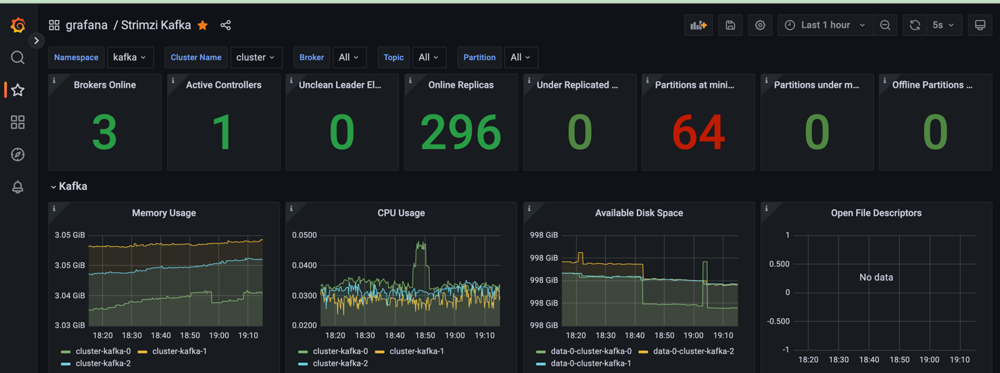
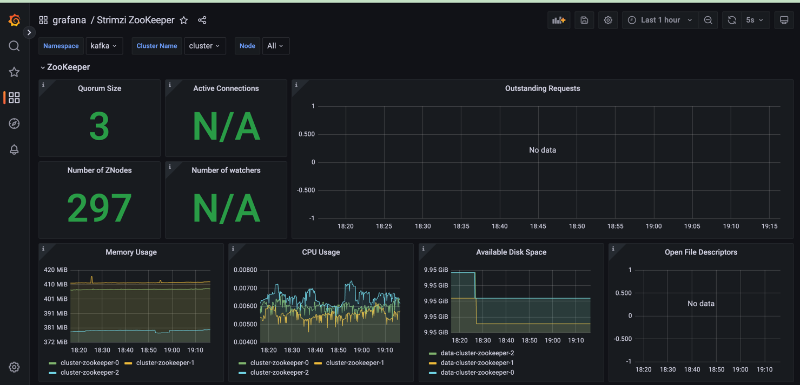

# Apache Kafka
[Apache Kafka](https://kafka.apache.org/) is an open-source distributed event streaming platform used by thousands of companies for high-performance data pipelines, streaming analytics, data integration, and mission-critical applications.

## Strimzi for Apache Kafka
[Strimzi](https://strimzi.io/) provides a way to run an Apache Kafka cluster on Kubernetes in various deployment configurations.
Strimzi combines security and simple configuration to deploy and manage Kafka on Kubernetes using kubectl and/or GitOps based on the Operator Pattern.

## Architecture

:::info

Architecture diagram work in progress

:::

## Managed Alternatives

### Amazon Managed Streaming for Apache Kafka (MSK)
[Amazon Managed Streaming for Apache Kafka (Amazon MSK)](https://aws.amazon.com/msk/) is a fully managed service that enables you to build and run applications that use Apache Kafka to process streaming data. Amazon MSK provides the control-plane operations, such as those for creating, updating, and deleting clusters. It lets you use Apache Kafka data-plane operations, such as those for producing and consuming data. It runs open-source versions of Apache Kafka. This means existing applications, tooling, and plugins from partners and the Apache Kafka community are supported. You can use Amazon MSK to create clusters that use any of the Apache Kafka versions listed under [Supported Apache Kafka versions](https://docs.aws.amazon.com/msk/latest/developerguide/supported-kafka-versions.html). Amazon MSK offers cluster-based or serverless deployment types.

### Amazon Kinesis Data Streams (KDS)
[Amazon Kinesis Data Streams (KDS)](https://aws.amazon.com/kinesis/data-streams/) allows users to collect and process large streams of data records in real time. You can create data-processing applications, known as Kinesis Data Streams applications. A typical Kinesis Data Streams application reads data from a data stream as data records. You can send the processed records to dashboards, use them to generate alerts, dynamically change pricing and advertising strategies, or send data to a variety of other AWS services. Kinesis Data Streams support your choice of stream processing framework including Kinesis Client Library (KCL), Apache Flink, and Apache Spark Streaming. It is serverless, and scales automatically.

## Storage considerations when self-managing Kafka
The most common resource bottlenecks for Kafka clusters are network throughput, storage throughput, and network throughput between brokers and the storage backend for brokers using network attached storage such as [Amazon Elastic Block Store (EBS)](https://aws.amazon.com/ebs/).

### Advantages to using EBS as persistent storage backend
1. **Improved flexibility and faster recovery:** Fault tolerance is commonly achieved via broker (server) replication within
the cluster and/or maintaining cross-AZ or region replicas. Since the lifecycle of EBS volumes is independent of
Kafka brokers, if a broker fails and needs to be replaced, the EBS volume attached to the failed broker can be reattached to a replacement broker. Most of the replicated data for the replacement broker is already available in the
EBS volume, and does not need to be copied over the network from another broker. This avoids most of the
replication traffic required to bring the replacement broker up to speed with current operations.
2. **Just in time scale up:** The characteristics of EBS volumes can be modified while they’re in use. Broker storage can be
automatically scaled over time rather than provisioning storage for peak or adding additional brokers.
3. **Optimized for frequently-accessed-throughput-intensive workloads:** Volume types such as st1 can be a good fit
since these volumes are offered at a relatively low cost, support a large 1 MiB I/O block size, max IOPS of
500/volume, and includes the ability to burst up to 250 MB/s per TB, with a baseline throughput of 40 MB/s per TB,
and a maximum throughput of 500 MB/s per volume.

### What EBS volumes should I use when self-managing Kafka on AWS?
* General purpose SSD volume **gp3** with a balanced price and performance are widely used, and you can **independently** provision storage (up to 16TiB), IOPS (up to 16,000) and throughput (up to 1,000MiB/s)
* **st1** is a low-cost HDD option for frequently accessed and throughput intensive workloads with up to 500 IOPS and 500 MiB/s
* For critical applications such as Zookeeper, provisioned IOPS volumes (**io2 Block Express, io2**) provide higher durability

## Deploying the Solution

In this [example](https://github.com/awslabs/data-on-eks/tree/main/streaming/kafka), you will provision the following resources to run Kafka Cluster on EKS.

This example deploys an EKS Cluster with Kafka into a new VPC.

- Creates a new sample VPC, 3 Private Subnets and 3 Public Subnets.
- Creates Internet gateway for Public Subnets and NAT Gateway for Private Subnets.
- Creates EKS Cluster Control plane with public endpoint (for demo reasons only) with two managed node groups.
- Deploys Metrics server, Cluster Autoscaler, self-managed ebs-csi-driver, Strimzi Kafka Operator, Grafana Operator.
- Strimzi Kafka Operator is a Kubernetes Operator for Apache Kafka deployed to `strimzi-kafka-operator` namespace. The operator by default watches and handles `kafka` in all namespaces.

### Prerequisites
Ensure that you have installed the following tools on your machine.

1. [aws cli](https://docs.aws.amazon.com/cli/latest/userguide/install-cliv2.html)
2. [kubectl](https://Kubernetes.io/docs/tasks/tools/)
3. [terraform](https://learn.hashicorp.com/tutorials/terraform/install-cli)

### Deploy
Clone the repository

```bash
git clone https://github.com/awslabs/data-on-eks.git
```

Navigate into one of the example directories and run `terraform init`

```bash
cd data-on-eks/streaming/kafka
terraform init
```

Run Terraform plan to verify the resources created by this execution.

```bash
export AWS_REGION="us-west-2"   # Select your own region
terraform plan
```

Deploy the pattern

```bash
terraform apply
```

Enter `yes` to apply.

:::info

This deployment may take between 20 to 30mins.

:::

## Verify the deployment

### Create kube config

Create kube config file.

```bash
aws eks --region us-west-2 update-kubeconfig --name kafka-on-eks
```

### Get nodes
Check if the deployment has created 6 nodes. 3 nodes for Core Node group and 3 for Kafka brokers across 3 AZs.

```bash
kubectl get nodes
```
Output

```text
NAME                                        STATUS   ROLES    AGE     VERSION
ip-10-0-10-36.us-west-2.compute.internal    Ready    <none>   5h28m   v1.24.7-eks-fb459a0
ip-10-0-10-47.us-west-2.compute.internal    Ready    <none>   5h20m   v1.24.7-eks-fb459a0
ip-10-0-11-218.us-west-2.compute.internal   Ready    <none>   5h20m   v1.24.7-eks-fb459a0
ip-10-0-11-223.us-west-2.compute.internal   Ready    <none>   5h20m   v1.24.7-eks-fb459a0
ip-10-0-12-202.us-west-2.compute.internal   Ready    <none>   5h20m   v1.24.7-eks-fb459a0
ip-10-0-12-50.us-west-2.compute.internal    Ready    <none>   5h20m   v1.24.7-eks-fb459a0
```

### Verify Kafka Brokers and Zookeeper

Verify the Kafka Broker and Zookeeper pods and the status created by the Strimzi Operator.

```bash
kubectl get strimzipodsets.core.strimzi.io -n kafka
```
Output

    NAME                PODS   READY PODS   CURRENT PODS   AGE
    cluster-kafka       3      3            3              4h35m
    cluster-zookeeper   3      3            3              4h36m

```bash
kubectl get kafka.kafka.strimzi.io -n kafka
```
Output

    NAME      DESIRED KAFKA REPLICAS   DESIRED ZK REPLICAS   READY   WARNINGS
    cluster   3                        3                     True

```bash
kubectl get kafkatopic.kafka.strimzi.io -n kafka
```
Output

    NAME                                                                                               CLUSTER   PARTITIONS   REPLICATION FACTOR   READY
    consumer-offsets---84e7a678d08f4bd226872e5cdd4eb527fadc1c6a                                        cluster   50           3                    True
    strimzi-store-topic---effb8e3e057afce1ecf67c3f5d8e4e3ff177fc55                                     cluster   1            3                    True
    strimzi-topic-operator-kstreams-topic-store-changelog---b75e702040b99be8a9263134de3507fc0cc4017b   cluster   1            3                    True
    strimzi.cruisecontrol.metrics                                                                      cluster   1            3                    True
    strimzi.cruisecontrol.modeltrainingsamples                                                         cluster   32           2                    True
    strimzi.cruisecontrol.partitionmetricsamples                                                       cluster   32           2                    True

### Verify the running Kafka pods

```bash
kubectl get pods -n kafka
```
Output

    NAME                                       READY   STATUS    RESTARTS   AGE
    cluster-cruise-control-79f6457f8d-sm8c2    1/1     Running   0          4h40m
    cluster-entity-operator-5594c965ff-t9nl4   3/3     Running   0          4h40m
    cluster-kafka-0                            1/1     Running   0          4h41m
    cluster-kafka-1                            1/1     Running   0          4h41m
    cluster-kafka-2                            1/1     Running   0          4h41m
    cluster-kafka-exporter-9dbfdff54-wx8vq     1/1     Running   0          4h39m
    cluster-zookeeper-0                        1/1     Running   0          4h42m
    cluster-zookeeper-1                        1/1     Running   0          4h42m
    cluster-zookeeper-2                        1/1     Running   0          4h42m


## Create Kafka Topic and run Sample test
We will create one kafka topic and run sample producer script to produce new messages to the kafka topic.
We can then verify the data in the topic using sample consumer script.

### Create a kafka Topic

Run this command to create a new topic called `test-topic` under `kafka` namespace
```bash
cd streaming/kafka/examples/
kubectl apply -f kafka-topics.yaml
```

Verify the status of the `test-topic` topic.

```bash
kubectl exec -it cluster-kafka-0 -c kafka -n kafka -- /bin/bash -c "/opt/kafka/bin/kafka-topics.sh --list --bootstrap-server localhost:9092"
```
Output

    __consumer_offsets
    __strimzi-topic-operator-kstreams-topic-store-changelog
    __strimzi_store_topic
    strimzi.cruisecontrol.metrics
    strimzi.cruisecontrol.modeltrainingsamples
    strimzi.cruisecontrol.partitionmetricsamples
    test-topic

### Execute sample Kafka Producer

Open two terminals one for Kafka producer and one for Kafka Consumer.

Execute the following command and press enter twice until you see the `>` prompt.
Start typing some random content. This data will be written to the `test-topic`.

```bash
kubectl -n kafka run kafka-producer -ti --image=strimzi/kafka:0.14.0-kafka-2.3.0 --rm=true --restart=Never -- bin/kafka-console-producer.sh --broker-list cluster-kafka-bootstrap:9092 --topic test-topic
```

### Execute sample Kafka Consumer

Now, you can verify the data written to `test-topic` by running Kafka consumer pod in another terminal

```bash
kubectl -n kafka run kafka-consumer -ti --image=strimzi/kafka:0.14.0-kafka-2.3.0 --rm=true --restart=Never -- bin/kafka-console-consumer.sh --bootstrap-server cluster-kafka-bootstrap:9092 --topic test-topic
```

### Kafka Producer and Consumer output


## Grafana Dashboard for Kafka

### Login to Grafana
Login to Grafana dashboard by running the following command.

```bash
kubectl port-forward svc/grafana-service 3000:3000 -n grafana
```
Open browser with local [Grafana Web UI](http://localhost:3000/)

Enter username as `admin` and **password** can be extracted from the below command.

```bash
kubectl get secrets/grafana-admin-credentials --template={{.data.GF_SECURITY_ADMIN_PASSWORD}} -n grafana | base64 -D
```

### Open Strimzi Kafka Dashboard

The below are builtin Kafka dashboards which created during the deployment.



### Open Strimzi Zookeeper Dashboard



### Open Strimzi Zookeeper Dashboard
You can verify the `test-topic` with three partitions below.


## Cleanup

To clean up your environment, destroy the Terraform modules in reverse order with `--target` option to avoid destroy failures.

Destroy the Kubernetes Add-ons, EKS cluster with Node groups and VPC

```bash
terraform destroy -target="module.eks_blueprints_kubernetes_addons" -auto-approve
terraform destroy -target="module.eks_blueprints" -auto-approve
terraform destroy -target="module.vpc" -auto-approve
```

Finally, destroy any additional resources that are not in the above modules

```bash
terraform destroy -auto-approve
```
:::caution

To avoid unwanted charges to your AWS account, delete all the AWS resources created during this deployment

ex. Delete kafka-on-eks EBS volumes
:::
