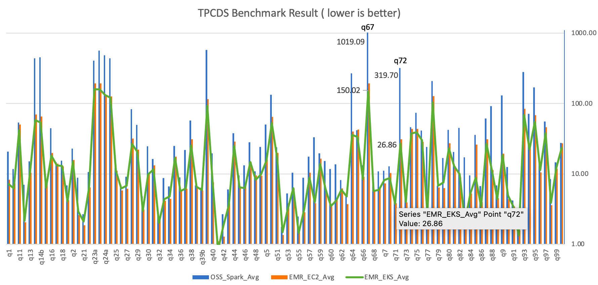

# Amazon EMR on Amazon EKS는 Spark 워크로드에서 최대 61% 낮은 비용과 최대 68% 성능 향상을 제공합니다

Amazon EMR on Amazon EKS는 Amazon EMR에서 제공하는 배포 옵션으로, 비용 효율적인 방식으로 Amazon Elastic Kubernetes Service(Amazon EKS)에서 Apache Spark 애플리케이션을 실행할 수 있게 해줍니다. Apache Spark용 EMR 런타임을 사용하여 성능을 향상시켜 작업이 더 빠르게 실행되고 비용이 절감됩니다.

TPC-DS 데이터셋 3TB 규모를 사용한 벤치마크 테스트에서, Amazon EMR on EKS가 동등한 구성으로 Amazon EKS에서 오픈소스 Apache Spark를 실행하는 것과 비교하여 최대 61% 낮은 비용과 최대 68% 향상된 성능을 제공하는 것을 확인했습니다. 이 글에서는 성능 테스트 과정을 안내하고, 결과를 공유하며, 벤치마크를 재현하는 방법을 설명합니다. 또한 Spark 워크로드의 추가적인 비용 최적화로 이어질 수 있는 작업 성능 최적화 기법들도 공유합니다.

## Amazon EMR on EKS는 어떻게 비용을 절감하고 성능을 향상시키나요?

Spark용 EMR 런타임은 오픈소스 Apache Spark와 100% API 호환되는 성능 최적화 런타임입니다. Amazon EMR on EKS에서 기본적으로 활성화되어 있습니다. Spark 워크로드를 더 빠르게 실행하여 실행 비용을 절감합니다. Adaptive Query Execution(AQE), 동적 파티션 프루닝(dynamic partition pruning), 스칼라 서브쿼리 평탄화(flattening scalar subqueries), 블룸 필터 조인(bloom filter join) 등 다양한 성능 최적화 기능이 포함되어 있습니다.

Spark용 EMR 런타임의 비용 이점 외에도, Amazon EMR on EKS는 다른 AWS 기능을 활용하여 비용을 더욱 최적화할 수 있습니다. 예를 들어, Amazon Elastic Compute Cloud(Amazon EC2) Spot 인스턴스에서 Amazon EMR on EKS 작업을 실행하여 온디맨드 인스턴스 대비 최대 90% 비용 절감을 얻을 수 있습니다. 또한 Amazon EMR on EKS는 ARM 기반 Graviton EC2 인스턴스를 지원하여, Graviton2 기반 M6g를 M5 인스턴스 유형과 비교할 때 15% 성능 향상과 최대 30% 비용 절감을 제공합니다.

최근의 우아한 실행기 해제(graceful executor decommissioning) 기능은 Spark가 Spot 인스턴스 중단을 예측할 수 있게 하여 Amazon EMR on EKS 워크로드를 더욱 견고하게 만듭니다. 영향받은 Spark 작업을 재계산하거나 다시 실행할 필요 없이, Amazon EMR on EKS는 중요한 안정성 및 성능 개선을 통해 작업 비용을 더욱 절감할 수 있습니다.

또한 컨테이너 기술을 통해 Amazon EMR on EKS는 Spark 작업을 디버깅하고 모니터링하는 더 많은 옵션을 제공합니다. 예를 들어, Spark History Server, Amazon CloudWatch 또는 Amazon Managed Prometheus와 Amazon Managed Grafana를 선택할 수 있습니다(자세한 내용은 Monitoring and Logging 워크샵을 참조하세요). 선택적으로 kubectl과 같은 익숙한 명령줄 도구를 사용하여 작업 처리 환경과 상호작용하고 Spark 작업을 실시간으로 관찰할 수 있어 빠른 실패 감지와 생산적인 개발 경험을 제공합니다.

Amazon EMR on EKS는 멀티 테넌트 요구 사항을 지원하고 작업 실행 역할(job execution role)을 통해 애플리케이션 수준의 보안 제어를 제공합니다. Amazon EKS에서 키 페어 설정 없이 다른 AWS 네이티브 서비스와 원활한 통합을 가능하게 합니다. 단순화된 보안 설계는 엔지니어링 오버헤드를 줄이고 데이터 유출 위험을 낮출 수 있습니다. 또한 Amazon EMR on EKS는 보안 및 성능 패치를 처리하므로 애플리케이션 구축에 집중할 수 있습니다.

## 벤치마킹
이 글에서는 성능 테스트 프로세스를 직접 체험할 수 있는 엔드투엔드 Spark 벤치마크 솔루션을 제공합니다. 이 솔루션은 수정되지 않은 TPC-DS 데이터 스키마와 테이블 관계를 사용하지만, Spark SQL 테스트 케이스를 지원하기 위해 TPC-DS에서 쿼리를 파생합니다. 이는 다른 공개된 TPC-DS 벤치마크 결과와 비교할 수 없습니다.

주요 개념
Transaction Processing Performance Council-Decision Support(TPC-DS)는 빅데이터 기술의 분석 성능을 평가하는 데 사용되는 의사 결정 지원 벤치마크입니다. 테스트 데이터는 TPC-DS 표준 사양 개정판 2.4 문서를 기반으로 한 TPC-DS 준수 데이터셋으로, 비즈니스 모델, 데이터 스키마, 관계 등을 설명합니다. 백서에서 설명하듯이, 테스트 데이터는 평균 18개 열을 가진 7개의 팩트 테이블과 17개의 차원 테이블을 포함합니다. 스키마는 매장, 카탈로그, 인터넷의 클래식 판매 채널에 대한 고객, 주문, 상품 데이터와 같은 필수 소매업 비즈니스 정보로 구성됩니다. 이 소스 데이터는 계절별 판매 및 자주 사용되는 이름과 같은 일반적인 데이터 편향이 있는 실제 비즈니스 시나리오를 나타내도록 설계되었습니다. 또한 TPC-DS 벤치마크는 원시 데이터의 대략적인 크기를 기반으로 한 개별 스케일링 포인트(스케일 팩터) 세트를 제공합니다. 테스트에서 우리는 177억 개의 레코드를 생성하는 3TB 스케일 팩터를 선택했으며, 이는 Parquet 파일 형식으로 약 924GB의 압축 데이터입니다.

테스트 접근 방식
단일 테스트 세션은 순차적으로 실행되는 104개의 Spark SQL 쿼리로 구성됩니다. 공정한 비교를 위해 Amazon EMR on EKS와 같은 다른 배포 유형의 각 세션을 세 번 실행했습니다. 이 세 번의 반복에서 쿼리당 평균 실행 시간이 이 글에서 분석하고 논의하는 내용입니다. 가장 중요한 것은 Spark 성능을 나타내는 두 가지 요약 지표를 도출한다는 것입니다:

총 실행 시간 - 세 번의 반복에서 평균 실행 시간의 합
기하 평균(Geomean) - 평균 실행 시간의 기하 평균
테스트 결과
테스트 결과 요약(아래 그림 참조)에서, Amazon EMR on EKS에서 사용하는 Amazon EMR 최적화 Spark 런타임이 기하 평균에서 Amazon EKS의 오픈소스 Spark보다 약 2.1배, 총 실행 시간에서는 3.5배 빠른 것으로 나타났습니다.

다음 그림은 쿼리별 성능 요약 분석입니다. EMR Spark 런타임이 오픈소스 Spark와 비교하여 모든 쿼리에서 더 빠른 것을 관찰했습니다. q67 쿼리는 성능 테스트에서 가장 긴 쿼리였습니다. 오픈소스 Spark의 평균 실행 시간은 1019.09초였습니다. 그러나 Amazon EMR on EKS에서는 150.02초가 걸려 6.8배 빨랐습니다. 이러한 장시간 실행 쿼리에서 가장 높은 성능 향상은 q72였습니다 - 319.70초(오픈소스 Spark) 대 26.86초(Amazon EMR on EKS), 11.9배 개선입니다.

전체 [블로그 링크](https://aws.amazon.com/blogs/big-data/amazon-emr-on-amazon-eks-provides-up-to-61-lower-costs-and-up-to-68-performance-improvement-for-spark-workloads/)
