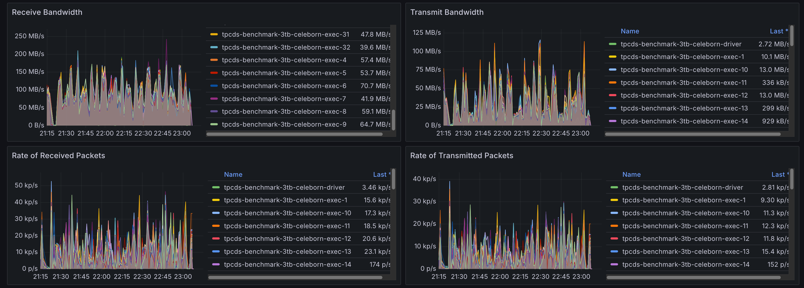
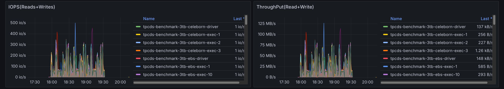
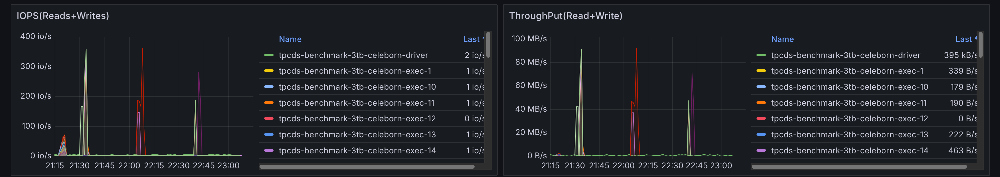
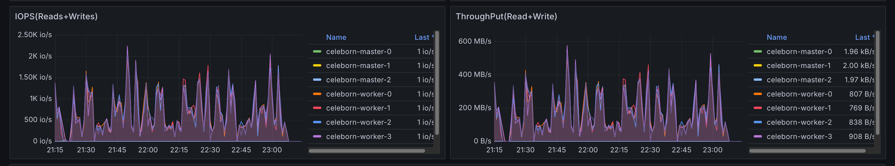

import Tabs from '@theme/Tabs';
import TabItem from '@theme/TabItem';
import PerformanceDashboard from '@site/src/components/BenchmarkDashboard/PerformanceDashboard';
import BarChart from '@site/src/components/Charts/BarChart';
import PieChart from '@site/src/components/Charts/PieChart';

# Apache Spark와 Apache Celeborn 벤치마크

## 소개

Apache Celeborn은 Apache Spark 및 Flink와 같은 빅데이터 컴퓨팅 엔진을 최적화하도록 설계된 오픈소스 중간 데이터 서비스입니다. 주로 빅데이터 처리에서 성능, 안정성 및 유연성을 향상시키기 위해 셔플(shuffle) 및 스필(spill) 데이터를 관리합니다. Remote Shuffle Service(RSS)로 작동하여 기존 셔플 메커니즘의 낮은 I/O 효율성 문제를 해결합니다. Celeborn은 비동기 처리와 고가용성 아키텍처를 통해 높은 성능을 제공하여 더욱 견고한 빅데이터 분석에 기여합니다.

이 문서는 3TB TPC-DS 벤치마크에서 Apache Spark와 Apache Celeborn을 함께 사용할 때의 성능 특성을 제시합니다.

## 요약 (TL;DR)

Celeborn은 특정 사용 사례에서 상당한 운영상 이점을 제공하지만, 범용 성능 가속기로는 작동하지 않습니다. 표준화된 TPC-DS 3TB 벤치마크에서 **전체 실행 시간이 네이티브 Spark 셔플 서비스 대비 16% 증가**했습니다.

주요 관찰 사항:
- **쿼리 의존적 성능:** 결과는 쿼리에 따라 크게 달랐습니다. 최고 성능 쿼리(`q99-v2.4`)는 **10.1%** 개선되었지만, 최악의 쿼리(`q91-v2.4`)는 **100%** 이상 성능 저하를 보였습니다. 성능 향상은 대규모 셔플 작업이 있는 쿼리와 관련이 있는 것으로 보이며, 원격 서비스의 오버헤드는 작은 셔플이 있는 쿼리에서 불이익을 줍니다.
- **운영 안정성:** Celeborn의 주요 장점은 중앙 집중화되고 장애 허용이 가능한 셔플 서비스를 제공하는 것입니다. 이 아키텍처는 실행기 손실로 인한 작업 실패를 방지하고 장기 실행되는 복잡한 쿼리의 신뢰성을 향상시킬 수 있습니다.
- **인프라 오버헤드:** Celeborn 사용은 더 높은 비용을 초래하며, 전용 마스터 및 워커 노드, 고처리량 스토리지(예: EBS), 고대역폭 네트워킹이 필요합니다. 피크 셔플 트래픽을 처리하기 위한 신중한 용량 계획이 필수적입니다.

**요약하면,** Celeborn은 대규모 셔플 데이터가 있는 Spark 작업의 안정성을 개선하기 위한 전략적 선택이지만, 일반 워크로드의 경우 성능 및 비용 오버헤드를 신중하게 평가해야 합니다.

## 네이티브 Spark vs. Celeborn을 사용한 Spark 벤치마크

## 벤치마크 구성

전용 Amazon EKS 클러스터에서 [TPC-DS](https://www.tpc.org/tpcds/) **3TB** 워크로드를 벤치마크하여 네이티브 Spark SQL 실행과 Apache Celeborn으로 강화된 Spark를 비교했습니다. 정확한 비교를 위해 네이티브 Spark와 Celeborn 작업 모두 동일한 하드웨어, 스토리지 및 데이터에서 실행되었습니다. 각 테스트는 10회 실행하여 평균을 구했습니다.

### 테스트 환경

| 구성 요소 | 구성 |
|-----------|---------------|
| **EKS 클러스터** | [Amazon EKS](https://aws.amazon.com/eks/) 1.33 |
| **데이터셋** | [TPC-DS](https://www.tpc.org/tpcds/) 3TB (Parquet 형식) |
| **Spark 노드 인스턴스** | r6g.8xlarge |
| **Spark 노드 그룹** | 벤치마크 워크로드 전용 8개 노드 |
| **Spark 스토리지** | EBS GP3, 1000 처리량, 16000 IOPS |
| **Celeborn 노드 인스턴스** | r6g.8xlarge |
| **Celeborn 노드 그룹** | 8개 노드 (Master Pod용 3개, Worker Pod용 5개) |
| **Celeborn 스토리지** | Worker당 2 x EBS GP3 볼륨, 각각 1000 처리량, 16000 IOPS |


### 애플리케이션 및 엔진 구성

#### Spark 실행기 및 드라이버

| 구성 요소 | 구성 |
|-----------|---------------|
| **실행기 구성** | 32개 실행기 × 14 코어 × 100GB RAM 각각 |
| **드라이버 구성** | 5 코어 × 20GB RAM |

#### Celeborn용 Spark 설정

Celeborn 셔플 매니저를 활성화하기 위해 다음 속성이 설정되었습니다.

```yaml
spark.shuffle.manager: org.apache.spark.shuffle.celeborn.SparkShuffleManager
spark.shuffle.service.enabled: false
spark.celeborn.master.endpoints: celeborn-master-0.celeborn-master-svc.celeborn.svc.cluster.local,celeborn-master-1.celeborn-master-svc.celeborn.svc.cluster.local,celeborn-master-2.celeborn-master-svc.celeborn.svc.cluster.local
```

#### Celeborn 워커 구성

Celeborn 워커는 셔플 스토리지로 두 개의 마운트된 EBS 볼륨을 사용하도록 구성되었습니다.

```yaml
# EBS 볼륨은 /mnt/disk1 및 /mnt/disk2에 마운트됨
celeborn.worker.storage.dirs: /mnt/disk1:disktype=SSD:capacity=100Gi,/mnt/disk2:disktype=SSD:capacity=100Gi
```

## 성능 결과 및 분석

### 전체 벤치마크 성능

<BarChart
  title="TPC-DS 3TB 전체 실행 시간 비교"
  data={{
    labels: ['네이티브 Spark 셔플', 'Celeborn'],
    datasets: [
      {
        label: '총 실행 시간 (초)',
        data: [1792.8, 2079.6],
        backgroundColor: ['#27ae60', '#e74c3c'], // 네이티브는 녹색, Celeborn(회귀)은 빨간색
        borderColor: ['#229954', '#c0392b'],
        borderWidth: 1,
      },
    ],
  }}
  options={{
    scales: {
      y: {
        title: {
          display: true,
          text: '실행 시간 (초)',
        },
      },
      x: {
        title: {
          display: true,
          text: '셔플 메커니즘',
        },
      },
    },
  }}
/>

3TB TPC-DS 벤치마크의 총 실행 시간이 **1792.8초**(네이티브 Spark 셔플)에서 **2079.6초**(Celeborn)로 증가하여 전체적으로 **16% 성능 저하**를 나타냈습니다.

이 결과는 TPC-DS와 같은 광범위하고 혼합된 워크로드에서 네트워크를 통해 셔플 데이터를 전송하는 오버헤드가 많은 쿼리에서 이점보다 클 수 있음을 보여줍니다.

<PieChart
  title="기준 대비 쿼리 성능 분포"
  type="doughnut"
  data={{
    labels: [
      '10%+ 개선 (Celeborn 더 빠름)',
      '+/- 9% (유사한 성능)',
      '10-20% 저하 (Celeborn 더 느림)',
      '20%+ 저하 (Celeborn 더 느림)',
    ],
    datasets: [
      {
        label: '쿼리 수',
        data: [2, 55, 15, 29],
        backgroundColor: [
          '#27ae60', // 개선은 녹색
          '#bdc3c7', // 유사는 회색 (중립)
          '#e67e22', // 보통 저하는 주황색
          '#e74c3c', // 심각한 저하는 빨간색
        ],
        borderColor: '#ffffff',
        borderWidth: 2,
      },
    ],
  }}
/>

### 쿼리별 성능 분석

전체 시간이 증가했지만, 개별 쿼리 수준의 성능은 매우 다양했습니다.

<BarChart
  title="쿼리별 성능: 상위 10개 향상 및 저하"
  height="600px"
  data={{
    labels: [
      'q99-v2.4', 'q21-v2.4', 'q22-v2.4', 'q15-v2.4', 'q45-v2.4', 'q62-v2.4', 'q39av2.4', 'q79-v2.4', 'q66-v2.4', 'q26-v2.4',
      'q31-v2.4', 'q32-v2.4', 'q84-v2.4', 'q8-v2.4', 'q50-v2.4', 'q68-v2.4', 'q65-v2.4', 'q39b-v2.4', 'q92-v2.4', 'q91-v2.4'
    ],
    datasets: [
      {
        label: '기준 대비 % 개선',
        data: [
          10.1, 9.2, 6.8, 6.5, 5.8, 4.8, 4.7, 1.5, 1.2,
          -57.9, -61.2, -63.2, -66.9, -68.0, -73.3, -78.9, -100.9, -121.3, -135.8
        ],
        backgroundColor: [
          '#27ae60', '#27ae60', '#27ae60', '#27ae60', '#27ae60', '#27ae60', '#27ae60', '#27ae60', '#27ae60', '#27ae60',
          '#e74c3c', '#e74c3c', '#e74c3c', '#e74c3c', '#e74c3c', '#e74c3c', '#e74c3c', '#e74c3c', '#e74c3c', '#e74c3c'
        ],
        borderColor: [
            '#229954', '#229954', '#229954', '#229954', '#229954', '#229954', '#229954', '#229954', '#229954', '#229954',
            '#c0392b', '#c0392b', '#c0392b', '#c0392b', '#c0392b', '#c0392b', '#c0392b', '#c0392b', '#c0392b', '#c0392b'
        ],
        borderWidth: 1,
      },
    ],
  }}
  options={{
    indexAxis: 'y', // 가로 막대 차트로 만듦
    responsive: true,
    maintainAspectRatio: false, // 사용자 정의 높이에 중요
    scales: {
      x: {
        title: {
          display: true,
          text: '% 개선 (양수가 더 좋음)',
        },
      },
      y: {
        title: {
          display: true,
          text: 'TPC-DS 쿼리',
        },
      },
    },
  }}
/>

아래 표는 가장 큰 개선과 가장 심각한 저하를 보인 쿼리를 강조합니다.

#### 성능이 향상된 쿼리

Celeborn은 99개 쿼리 중 20개에서 성능을 개선했습니다. 가장 큰 향상은 상당한 셔플 단계가 있는 것으로 알려진 쿼리에서 관찰되었습니다.

| 순위 | TPC-DS 쿼리 | 성능 변화 (%) |
|------|-------------|-----------------|
| 1 | q99-v2.4 | 10.1 |
| 2 | q21-v2.4 | 9.2 |
| 3 | q22-v2.4 | 6.8 |
| 4 | q15-v2.4 | 6.5 |
| 5 | q45-v2.4 | 5.8 |
| 6 | q62-v2.4 | 4.8 |
| 7 | q39a-v2.4 | 4.8 |
| 8 | q79-v2.4 | 4.7 |
| 9 | q66-v2.4 | 1.5 |
| 10 | q26-v2.4 | 1.2 |


#### 성능이 저하된 쿼리

반대로, 많은 쿼리가 상당히 더 나쁜 성능을 보였으며, 일부는 100% 이상의 성능 저하를 보였습니다. 이들은 일반적으로 셔플 데이터 볼륨이 작아 원격 서비스 관여 비용이 이점보다 큰 쿼리입니다.

| 순위 | TPC-DS 쿼리 | 성능 변화 (%) |
|------|-------------|-----------------|
| 1 | q91-v2.4| -135.8|
| 2 | q92-v2.4 | -121.3 |
| 3 | q39b-v2.4 | -100.9 |
| 4 | q65-v2.4 | -78.9 |
| 5 | q68-v2.4 | -73.3 |
| 6 | q50-v2.4 | -68.0 |
| 7 | q8-v2.4 | -66.9 |
| 8 | q84-v2.4 | -63.2 |
| 9 | q32-v2.4 | -61.2 |
| 10 | q31-v2.4 | -57.9 |


## 리소스 활용 분석

원격 셔플 서비스를 사용하면 Spark 애플리케이션의 리소스 활용 방식이 근본적으로 변경됩니다. 실행기 Pod의 로컬 디스크 I/O에서 실행기와 Celeborn 워커 간의 네트워크 I/O로 명확한 전환을 관찰했습니다.

### 네트워크 I/O 분석

네이티브 셔플러를 사용하면 네트워크 트래픽은 일반적으로 소스에서 데이터를 읽고 태스크를 위한 노드 간 통신으로 제한됩니다. Celeborn을 사용하면 모든 셔플 데이터가 네트워크를 통해 전송되어 Spark Pod의 네트워크 활용도가 크게 증가하고 Celeborn 워커 Pod에서 높은 인그레스가 발생합니다.

#### 기본 셔플러를 사용하는 Spark Pod
아래 그래프는 TPC-DS 데이터 읽기에 해당하는 Spark Pod의 최소 네트워크 트래픽을 보여줍니다.


#### Celeborn을 사용하는 Spark Pod
여기서는 실행기가 이제 원격 Celeborn 워커에게 셔플 데이터를 전송하므로 네트워크 이그레스가 상당히 높습니다.



#### Celeborn 워커 Pod
Celeborn 워커 Pod는 모든 Spark 실행기로부터 수신되는 셔플 데이터에 해당하는 높은 네트워크 인그레스를 보여줍니다.


### 스토리지 I/O 분석

스토리지에서는 반대 효과가 관찰되었습니다. 네이티브 셔플러는 중간 데이터를 각 실행기 노드의 로컬 디스크에 쓰며 상당한 디스크 I/O를 생성합니다. Celeborn은 이러한 쓰기를 원격 워커의 전용 고성능 볼륨에 중앙화합니다.

#### 기본 셔플러를 사용하는 Spark Pod
로컬 셔플 읽기/쓰기 작업을 수행하므로 Spark Pod에서 높은 디스크 I/O가 표시됩니다.



#### Celeborn을 사용하는 Spark Pod
셔플 작업이 오프로드되어 Spark Pod의 로컬 디스크 I/O가 무시할 수 있을 정도가 됩니다.



#### Celeborn 워커 Pod
스토리지 I/O 부하가 이제 Celeborn 워커에 집중되어 연결된 EBS 볼륨에 집계된 셔플 데이터를 쓰고 있습니다.




## Celeborn 성능 구성 비교

이 섹션에서는 특정 Celeborn 구성 값을 조정한 후의 성능 비교를 상세히 설명하며, Helm 차트에서 일반적으로 발견되는 기본 설정과 대조합니다. 목표는 메모리 및 버퍼 크기를 최적화하여 잠재적인 성능 개선을 조사하는 것이었습니다.

### 구성 조정

Celeborn 문서(https://celeborn.apache.org/docs/latest/configuration/)를 기반으로 다음 매개변수가 성능에 미치는 영향을 탐색하기 위해 수정되었습니다:

| 구성 매개변수           | 사용된 값 |
|-----------------------------------|------------|
| `CELEBORN_WORKER_MEMORY`          | 12g        |
| `CELEBORN_WORKER_OFFHEAP_MEMORY`  | 100g       |
| `celeborn.worker.flusher.buffer.size` | 10m        |

### 성능 영향 개요

조정 결과 쿼리별로 다양한 성능 영향이 나타났습니다. 일부 쿼리는 개선을 보였지만, 대다수는 거의 변화가 없었고 일부는 상당한 저하를 경험했습니다.

### 상세 쿼리 성능 비교

다음 표는 기본 설정과 조정된 메모리 및 버퍼 구성 간의 성능을 비교합니다. 양수 백분율은 성능 개선을, 음수 백분율은 저하를 나타냅니다.

<PieChart
  title="쿼리 성능 분포 (구성 조정 vs. 기준)"
  type="doughnut"
  data={{
    labels: [
      '9%+ 개선',
      '+/- 9% (유사한 성능)',
      '9%+ 저하',
    ],
    datasets: [
      {
        label: '쿼리 수',
        data: [2, 88, 14],
        backgroundColor: [
          '#27ae60', // 개선은 녹색
          '#bdc3c7', // 유사는 회색 (중립)
          '#e74c3c', // 저하는 빨간색
        ],
        borderColor: '#ffffff',
        borderWidth: 2,
      },
    ],
  }}
/>

소수의 쿼리만 성능 개선을 보였고, 더 많은 부분이 저하를 경험하여 이러한 구성 조정이 TPC-DS 워크로드 전반에서 순 긍정적인 성능 향상을 가져오지 않았음을 나타냅니다.

### 성능이 향상된 쿼리

다음 쿼리들은 구성 조정 후 가장 큰 성능 개선을 보였습니다:

| 순위 | TPC-DS 쿼리 | 성능 변화 (%) |
|------|--------------|---------------|
| 1    | q31-v2.4     | 10.9        |
| 2    | q34-v2.4     | 9.4         |
| 3    | q12-v2.4     | 5.8         |
| 4    | q23a-v2.4    | 5.1         |
| 5    | q98-v2.4     | 4.9         |
| 6    | q77-v2.4     | 4.7         |
| 7    | q41-v2.4     | 2.4         |
| 8    | q35-v2.4     | 2.3         |
| 9    | q69-v2.4     | 2.1         |
| 10   | q86-v2.4     | 1.9         |

### 성능이 저하된 쿼리

반대로, 상당수의 쿼리가 이러한 구성 변경으로 성능 저하를 경험했습니다:

| 순위 | TPC-DS 쿼리 | 성능 변화 (%) |
|------|--------------|---------------|
| 1    | q13-v2.4     | -59.5       |
| 2    | q3-v2.4      | -56.7       |
| 3    | q9-v2.4      | -36.2       |
| 4    | q91-v2.4     | -22.7       |
| 5    | q11-v2.4     | -22.3       |
| 6    | q55-v2.4     | -20.0       |
| 7    | q42-v2.4     | -19.0       |
| 8    | q7-v2.4      | -17.7       |
| 9    | q28-v2.4     | -14.1       |
| 10   | q2-v2.4      | -11.1       |


#### 스토리지 구성 영향

스토리지 구성 분석 결과 EBS 볼륨과 임시(ephemeral) 로컬 스토리지 간에 의미 있는 성능 차이가 발견되었습니다. Celeborn 워커에 대해 EBS 볼륨과 임시 로컬 스토리지를 비교할 때, 임시 스토리지에서 약 **5.7% 전체 성능 향상**을 관찰했습니다.

<BarChart
  title="스토리지 유형 성능 비교 - 최고 성능 쿼리"
  data={{
    labels: ['q50-v2.4', 'q93-v2.4', 'q29-v2.4', 'q17-v2.4', 'q75-v2.4'],
    datasets: [
      {
        label: '% 성능 개선 (임시 vs EBS)',
        data: [26.4, 25.12, 21.23, 19.8, 18.9],
        backgroundColor: '#27ae60',
        borderColor: '#229954',
        borderWidth: 1,
      },
    ],
  }}
  options={{
    scales: {
      y: {
        title: {
          display: true,
          text: '% 성능 개선',
        },
      },
      x: {
        title: {
          display: true,
          text: 'TPC-DS 쿼리',
        },
      },
    },
  }}
/>

**그러나 임시 스토리지에는 중요한 운영상 트레이드오프가 있습니다:**
- **노드 교체 시 데이터 손실:** 노드가 종료되거나 교체될 때 모든 셔플 데이터가 영구적으로 손실되어 작업 재시작 및 잠재적인 데이터 재처리가 필요합니다. Celeborn은 장애 허용을 위해 셔플 데이터를 다른 워커에 복제할 수 있지만, 복제본 노드에서 임시 스토리지를 사용할 때 이 복제본도 손실됩니다
- **이동성 없음:** EBS 볼륨과 달리 임시 스토리지는 분리하여 다른 인스턴스에 다시 연결할 수 없어 유지 관리 또는 스케일링 작업 중 유연성이 제한됩니다
- **용량 제약:** 임시 스토리지 용량은 인스턴스 유형별로 고정되어 있으며 워크로드 요구 사항에 따라 독립적으로 확장할 수 없습니다
- **백업/복구 없음:** 임시 데이터는 백업하거나 복구할 수 없어 장기 실행 또는 중요한 워크로드의 위험이 증가합니다

프로덕션 환경에서는 이러한 신뢰성 및 운영 고려 사항과 성능 향상을 비교해야 합니다.

또한 스토리지 레이아웃이 성능에 미치는 영향을 이해하기 위해 다양한 디스크 구성을 평가했습니다. 구체적으로, I/O와 처리량을 최대화하기 위해 RAID 0 스트라이프로 구성된 4개의 임시 디스크와 개별 스토리지 장치로 제공되는 4개의 임시 디스크를 비교했습니다. 결과는 구성 간에 0.0008%의 차이만 있어 **전체 성능 차이가 없음**을 보여주었습니다.

<BarChart
  title="RAID 0 vs 개별 디스크 - 쿼리 성능 차이"
  data={{
    labels: ['q2-v2.4', 'q58-v2.4', 'q68-v2.4', 'q59-v2.4', 'q23a-v2.4'],
    datasets: [
      {
        label: '% 성능 개선 (RAID 0 vs 개별)',
        data: [16.3, 13.2, 8.1, 5.3, 4.6],
        backgroundColor: '#3498db',
        borderColor: '#2980b9',
        borderWidth: 1,
      },
    ],
  }}
  options={{
    scales: {
      y: {
        title: {
          display: true,
          text: '% 성능 개선',
        },
      },
      x: {
        title: {
          display: true,
          text: 'TPC-DS 쿼리',
        },
      },
    },
  }}
/>

#### Spark 파라미터 최적화

Celeborn 문서에서 권장하는 튜닝 파라미터 테스트는 혼합되었지만 중요한 결과를 가져왔습니다. 가장 중요한 발견은 `spark.sql.adaptive.localShuffleReader.enabled` 파라미터와 관련이 있습니다. 이 파라미터를 **false**로 설정하면 쿼리 성능 안정성에 극적인 영향을 미쳐 최악의 성능 쿼리의 저하가 ~240%에서 ~40%로 감소했습니다.

<BarChart
  title="spark.sql.adaptive.localShuffleReader.enabled 비활성화의 영향"
  height="600px"
  data={{
    labels: [
      'q91-v2.4', 'q84-v2.4', 'q39b-v2.4', 'q92-v2.4', 'q31-v2.4',
      'q73-v2.4', 'q34-v2.4', 'q68-v2.4', 'q85-v2.4', 'q8-v2.4',
      'q32-v2.4', 'q10-v2.4', 'q65-v2.4', 'q94-v2.4'
    ],
    datasets: [
      {
        label: '% 성능 개선',
        data: [62.9, 59.5, 58.7, 53.2, 47.9, 46.6, 44.6, 43.0, 36.7, 32.8, 32.7, 29.5, 24.0, 15.1],
        backgroundColor: '#e67e22',
        borderColor: '#d35400',
        borderWidth: 1,
      },
    ],
  }}
  options={{
    indexAxis: 'y',
    responsive: true,
    maintainAspectRatio: false,
    scales: {
      x: {
        title: {
          display: true,
          text: '% 성능 개선',
        },
      },
      y: {
        title: {
          display: true,
          text: 'TPC-DS 쿼리',
        },
      },
    },
  }}
/>

스레드 구성 조정은 전체적으로 주요 성능 영향을 생성하지 않았습니다. 그러나 이러한 변경으로 Celeborn이 더 많은 컴퓨팅 리소스를 효과적으로 활용할 수 있게 되어 워커 노드에서 사용 가능한 64개 코어 중 최대 **15개 코어**를 사용할 수 있게 되었습니다. 이러한 리소스 활용 증가가 상당한 성능 향상으로 이어지지는 않았지만, Celeborn이 적절히 구성되면 리소스 소비를 확장할 수 있는 능력을 보여줍니다.

#### Celeborn 기본 CPU 사용량


#### 4배 스레드 구성된 Celeborn


#### 전체 성능 평가

스토리지, Spark 파라미터 및 Celeborn 특정 구성에 걸친 광범위한 튜닝 노력에도 불구하고, 모든 Celeborn 구성은 기본 Spark 셔플러보다 전체 완료 시간이 더 길었습니다. 이 일관된 결과는 Celeborn이 운영상 이점을 제공하지만, 네이티브 Spark 셔플과 성능 동등성 또는 개선을 달성하려면 신중한 워크로드별 최적화가 필요하며 모든 사용 사례에서 달성 가능하지 않을 수 있음을 강화합니다.

## 전체 결론

이 벤치마크 보고서는 3TB TPC-DS 워크로드에서 Apache Spark와 Apache Celeborn의 성능 특성을 평가하는 것을 목표로 했습니다. 네이티브 Spark 셔플과의 초기 비교 결과, Celeborn이 상당한 운영 안정성 이점(예: 대규모 셔플 작업에 대한 장애 허용)을 제공하지만, 이 혼합 워크로드에 대해 전체적으로 16% 성능 저하를 초래했습니다. 성능은 쿼리에 따라 크게 달랐으며, 일부 쿼리는 적당히 개선되고 다른 쿼리는 심각하게 저하되었습니다.

또한 특정 Celeborn 구성 조정(`CELEBORN_WORKER_MEMORY`, `CELEBORN_WORKER_OFFHEAP_MEMORY`, `celeborn.worker.flusher.buffer.size`)에 대한 조사 결과, 이러한 최적화가 순 긍정적인 성능 향상을 가져오지 않았습니다. 대부분의 쿼리가 무시할 수 있는 변화 또는 상당한 성능 저하를 보여 일반적인 튜닝이 보편적으로 효과적이지 않을 수 있다는 아이디어를 강화합니다.

요약하면, Apache Celeborn은 운영 안정성, 특히 크고 복잡한 셔플 데이터에 대해 최우선인 경우 전략적 선택입니다. 그러나 일반 분석 워크로드의 경우 배포에는 성능 오버헤드 및 관련 인프라 비용에 대한 신중한 평가가 필요합니다. Celeborn을 사용한 최적의 성능 튜닝은 워크로드 특성에 크게 의존하며 일반화된 구성 조정에 의존하기보다는 상세한 워크로드별 분석이 필요합니다.
