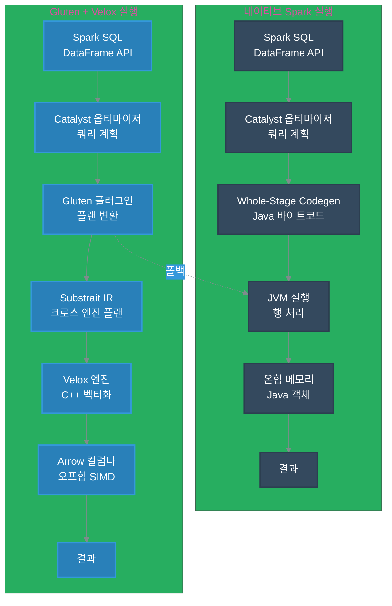
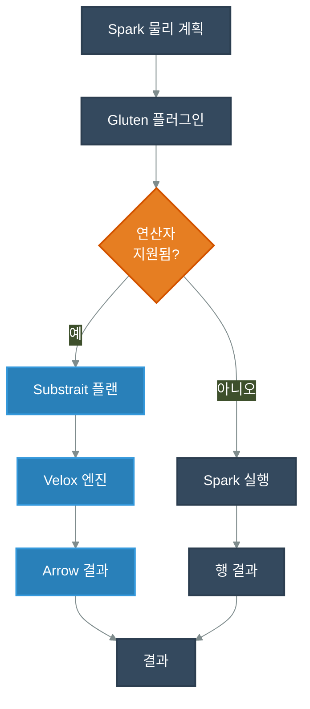

import Tabs from '@theme/Tabs';
import TabItem from '@theme/TabItem';
import PerformanceDashboard from '@site/src/components/BenchmarkDashboard/PerformanceDashboard';

# Apache Spark와 Apache Gluten + Velox 벤치마크

[Apache Spark](https://spark.apache.org/)는 오늘날 대규모 분석의 대부분을 지원하지만, 기본 SQL 엔진은 여전히 JVM 바운드이고 행 지향적입니다. [Project Tungsten](https://spark.apache.org/docs/latest/sql-performance-tuning.html#project-tungsten)의 코드 생성과 벡터화된 리더를 사용해도 연산자들은 종종 Java 객체 생성, 가비지 컬렉션, 행-열 변환에 대한 높은 비용을 지불합니다. 이러한 비용은 대규모 [Parquet](https://parquet.apache.org/) 또는 [ORC](https://orc.apache.org/) 테이블을 스캔하거나, 와이드 조인을 수행하거나, 메모리 집약적 집계를 실행하는 분석 워크로드에서 눈에 띄게 나타나 느린 쿼리와 비효율적인 CPU 사용으로 이어집니다.

[Velox](https://github.com/facebookincubator/velox), [ClickHouse](https://clickhouse.com/), [DuckDB](https://duckdb.org/)와 같은 최신 C++ 엔진은 SIMD 최적화된 캐시 인식 벡터화가 동일한 데이터를 훨씬 빠르게 처리할 수 있음을 보여줍니다. 하지만 Spark의 에코시스템과 스케줄링 모델을 고려할 때 Spark를 교체하는 것은 비현실적입니다. [Apache Gluten](https://github.com/apache/incubator-gluten)은 [Spark SQL](https://spark.apache.org/sql/) 플랜을 개방형 [Substrait](https://substrait.io/) IR로 변환하고 네이티브 C++ 백엔드(Velox, ClickHouse 등)로 실행을 오프로드함으로써 이 문제를 해결합니다. 이 접근 방식은 Spark의 API와 [Kubernetes](https://kubernetes.io/) 배포 모델을 유지하면서 CPU 바운드 SQL 레이어를 가속화합니다 - 이것이 [Amazon EKS](https://aws.amazon.com/eks/)에서의 이 심층 분석 및 벤치마크 연구의 초점입니다.

이 가이드에서는:
- Spark + Gluten + Velox 스택이 [Amazon EKS](https://aws.amazon.com/eks/)에서 어떻게 구성되는지 이해합니다
- 네이티브 Spark 대비 [TPC-DS](https://www.tpc.org/tpcds/) 1TB 벤치마크 결과를 검토합니다
- 연구를 재현하는 데 필요한 구성, 배포 및 문제 해결 단계를 배웁니다

:::tip TL;DR
<div className="quick-snapshot">
- **벤치마크 범위:** <span className="badge badge--info highlight-badge">TPC-DS 1TB</span>, [Amazon EKS](https://aws.amazon.com/eks/)에서 3회 반복
- **툴체인:** <span className="badge badge--primary highlight-badge">Apache Spark</span> + <span className="badge badge--primary highlight-badge">Apache Gluten</span> + <span className="badge badge--primary highlight-badge">Velox</span>
- **성능:** <span className="badge badge--success highlight-badge">1.72배 빠른 실행 시간</span> 전체, 집계 중심 쿼리에서 최대 <span className="badge badge--warning highlight-badge">5.48배 속도 향상</span>
- **비용 영향:** 짧은 실행 시간과 높은 CPU 효율성으로 <span className="badge badge--success highlight-badge">약 42% 낮은 컴퓨팅 비용</span>
</div>
:::


## TPC-DS 1TB 벤치마크 결과: 네이티브 Spark vs. Gluten + Velox 성능 분석

### 인터랙티브 성능 대시보드

전용 Amazon EKS 클러스터에서 [TPC-DS](https://www.tpc.org/tpcds/) **1TB** 워크로드를 벤치마크하여 네이티브 Spark SQL 실행과 Gluten 및 Velox 백엔드로 강화된 Spark를 비교했습니다. 아래의 인터랙티브 대시보드는 성능 향상과 비즈니스 영향에 대한 포괄적인 뷰를 제공합니다.

<PerformanceDashboard />

### 요약

Amazon EKS에서의 포괄적인 TPC-DS 1TB 벤치마크는 **Apache Gluten과 Velox가 네이티브 Spark SQL 대비 1.72배 전체 속도 향상**(**72%** 빠름)을 제공하며, 개별 쿼리에서 **1.1배**에서 **5.5배**까지의 개선을 보여줍니다.

**[전체 벤치마크 결과 및 원시 데이터 보기 ->](https://github.com/awslabs/data-on-eks/tree/main/analytics/terraform/spark-k8s-operator/examples/benchmark/tpcds-benchmark-spark-gluten-velox/results)**

### 벤치마크 인프라 구성

정확한 비교를 위해 네이티브 Spark와 Gluten + Velox 작업 모두 동일한 하드웨어, 스토리지 및 데이터에서 실행되었습니다. 실행 엔진과 관련 Spark 설정만 실행 간에 달랐습니다.

#### 테스트 환경 사양
| 구성 요소 | 구성 |
|-----------|--------------|
| **EKS 클러스터** | [Amazon EKS](https://aws.amazon.com/eks/) 1.33 |
| **노드 인스턴스 유형** | c5d.12xlarge (48 vCPU, 96GB RAM, 1.8TB NVMe SSD) |
| **노드 그룹** | 벤치마크 워크로드 전용 8개 노드 |
| **실행기 구성** | 23개 실행기 × 5 코어 × 20GB RAM 각각 |
| **드라이버 구성** | 5 코어 × 20GB RAM |
| **데이터셋** | [TPC-DS](https://www.tpc.org/tpcds/) 1TB (Parquet 형식) |
| **스토리지** | 최적화된 S3A 커넥터를 사용하는 [Amazon S3](https://aws.amazon.com/s3/) |

#### Spark 구성 비교

| 구성 | 네이티브 Spark | Gluten + Velox |
|---------------|-------------|----------------|
| **Spark 버전** | 3.5.3 | 3.5.2 |
| **Java 런타임** | [OpenJDK](https://openjdk.org/) 17 | [OpenJDK](https://openjdk.org/) 17 |
| **실행 엔진** | JVM 기반 [Tungsten](https://spark.apache.org/docs/latest/sql-performance-tuning.html#project-tungsten) | 네이티브 C++ [Velox](https://github.com/facebookincubator/velox) |
| **주요 플러그인** | 표준 Spark | `GlutenPlugin`, `ColumnarShuffleManager` |
| **오프힙 메모리** | 기본값 | 2GB 활성화 |
| **벡터화 처리** | 제한된 Java SIMD | 전체 C++ 벡터화 |
| **메모리 관리** | JVM GC | 통합 네이티브 + JVM |

#### 중요한 Gluten 특정 구성
```yaml
# 필수 Gluten 플러그인 구성
spark.plugins: "org.apache.gluten.GlutenPlugin"
spark.shuffle.manager: "org.apache.spark.shuffle.sort.ColumnarShuffleManager"
spark.memory.offHeap.enabled: "true"
spark.memory.offHeap.size: "2g"

# Gluten-Velox용 Java 17 호환성
spark.driver.extraJavaOptions: "--add-opens=java.base/java.nio=ALL-UNNAMED --add-opens=java.base/sun.misc=ALL-UNNAMED"
spark.executor.extraJavaOptions: "--add-opens=java.base/java.nio=ALL-UNNAMED --add-opens=java.base/sun.misc=ALL-UNNAMED"
```

### 성능 분석: 상위 20개 쿼리 개선

Gluten의 네이티브 실행 경로는 와이드하고 컴퓨팅 집약적인 SQL에서 빛을 발합니다. 아래 표는 104개 TPC-DS 쿼리 전반에서 가장 큰 향상을 강조하며, 여러 반복에 걸친 중간 실행 시간을 비교합니다.

| 순위 | TPC-DS 쿼리 | 네이티브 Spark (초) | Gluten + Velox (초) | 속도 향상 | % 개선 |
|------|-------------|-----------------|-----------------|---------|---------------|
| 1 | q93-v2.4 | 80.18 | 14.63 | **5.48배** | 448.1% |
| 2 | q49-v2.4 | 25.68 | 6.66 | **3.86배** | 285.5% |
| 3 | q50-v2.4 | 38.57 | 10.00 | **3.86배** | 285.5% |
| 4 | q59-v2.4 | 17.57 | 4.82 | **3.65배** | 264.8% |
| 5 | q5-v2.4 | 23.18 | 6.42 | **3.61배** | 261.4% |
| 6 | q62-v2.4 | 9.41 | 2.88 | **3.27배** | 227.0% |
| 7 | q97-v2.4 | 18.68 | 5.99 | **3.12배** | 211.7% |
| 8 | q40-v2.4 | 15.17 | 5.05 | **3.00배** | 200.2% |
| 9 | q90-v2.4 | 12.05 | 4.21 | **2.86배** | 186.2% |
| 10 | q23b-v2.4 | 147.17 | 52.96 | **2.78배** | 177.9% |
| 11 | q29-v2.4 | 17.33 | 6.45 | **2.69배** | 168.7% |
| 12 | q9-v2.4 | 60.90 | 23.03 | **2.64배** | 164.5% |
| 13 | q96-v2.4 | 9.19 | 3.55 | **2.59배** | 158.8% |
| 14 | q84-v2.4 | 7.99 | 3.12 | **2.56배** | 156.1% |
| 15 | q6-v2.4 | 9.87 | 3.87 | **2.55배** | 155.3% |
| 16 | q99-v2.4 | 9.70 | 3.81 | **2.55배** | 154.6% |
| 17 | q43-v2.4 | 4.70 | 1.87 | **2.51배** | 151.1% |
| 18 | q65-v2.4 | 17.51 | 7.00 | **2.50배** | 150.2% |
| 19 | q88-v2.4 | 50.90 | 20.69 | **2.46배** | 146.1% |
| 20 | q44-v2.4 | 22.90 | 9.36 | **2.45배** | 144.7% |

#### 쿼리별 속도 향상 분포

| 속도 향상 범위 | 개수 | 전체 % (약 97개 쿼리) |
|---------------|-------|--------------------------|
| >= 3배 및 < 5배 | 9 | 약 9% |
| >= 2배 및 < 3배 | 29 | 약 30% |
| >= 1.5배 및 < 2배 | 30 | 약 31% |
| >= 1배 및 < 1.5배 | 21 | 약 22% |
| < 1배 (Gluten에서 더 느림) | 8 | 약 8% |

### 주요 성능 인사이트

<table class="insights-table">
  <thead>
    <tr>
      <th scope="col">차원</th>
      <th scope="col">인사이트</th>
      <th scope="col">영향</th>
    </tr>
  </thead>
  <tbody>
    <tr>
      <td><strong>집계 향상</strong></td>
      <td>
        <ul>
          <li>총 실행 시간이 1.7시간에서 1.0시간으로 감소 (42분 절약)</li>
          <li>TPC-DS 스위트 전반에서 <strong>1.72배</strong> 전체 속도 향상</li>
          <li>단일 쿼리 최대 <strong>5.48배</strong> 속도 향상 (q93-v2.4)</li>
        </ul>
      </td>
      <td>
        <ul>
          <li>더 짧은 배치 창과 더 빠른 SLA</li>
          <li>원활한 Spark 폴백을 통한 운영 안정성 유지</li>
        </ul>
      </td>
    </tr>
    <tr>
      <td><strong>쿼리 패턴</strong></td>
      <td>
        <ul>
          <li>복잡한 분석 쿼리가 3배-5.5배 가속화</li>
          <li>조인 중심 워크로드가 Velox 해시 조인의 혜택을 받음</li>
          <li>집계 및 스캔이 일관된 2배-3배 개선을 보임</li>
        </ul>
      </td>
      <td>
        <ul>
          <li>컴퓨팅 바운드 SQL 파이프라인에 대해 Gluten 채택 우선 순위 지정</li>
          <li>더 빠른 차원 모델링 및 BI 새로고침 계획</li>
        </ul>
      </td>
    </tr>
    <tr>
      <td><strong>리소스 활용</strong></td>
      <td>
        <ul>
          <li>CPU 효율성이 약 72% 향상</li>
          <li>통합 네이티브 메모리가 GC 압력을 크게 줄임</li>
          <li>컬럼나 셔플 + 네이티브 리더가 I/O 처리량 향상</li>
        </ul>
      </td>
      <td>
        <ul>
          <li>동일한 워크로드에 대한 낮은 인프라 비용</li>
          <li>더 적은 GC 일시 중지로 더 원활한 실행</li>
          <li>대용량 데이터 스캔 시 더 예측 가능한 실행 시간</li>
        </ul>
      </td>
    </tr>
  </tbody>
</table>

### 비즈니스 영향 평가

#### 비용 최적화 요약
:::note
<span className="badge badge--success highlight-badge">1.72배 속도 향상</span>으로 조직은 다음을 달성할 수 있습니다:
- 배치 처리 워크로드에 대해 <span className="badge badge--success highlight-badge">약 42% 낮은 컴퓨팅 비용</span>
- 비즈니스 중요 분석에 대한 <span className="badge badge--info highlight-badge">더 빠른 인사이트 시간</span>
- 작업 실행 시간 단축을 통한 <span className="badge badge--info highlight-badge">더 높은 클러스터 활용</span>
:::

#### 운영상 이점
:::tip
- <span className="badge badge--primary highlight-badge">최소한의 마이그레이션 노력</span>: 기존 Spark SQL 코드로 드롭인 플러그인
- <span className="badge badge--primary highlight-badge">프로덕션 준비 신뢰성</span>으로 운영 안정성 유지
- 기존 EKS 데이터 플랫폼과 동등성을 유지하는 <span className="badge badge--info highlight-badge">[Kubernetes](https://kubernetes.io/) 네이티브 통합</span>
:::

### 기술 권장 사항

#### Gluten + Velox 배포 시기
- **고용량 분석**: 조인과 집계가 있는 TPC-DS 스타일의 복잡한 쿼리
- **비용에 민감한 워크로드**: 40% 이상의 컴퓨팅 비용 절감이 통합 노력을 정당화하는 경우
- **성능 중요 파이프라인**: 더 빠른 실행이 필요한 SLA 기반 워크로드

#### 구현 고려 사항
- **쿼리 호환성**: 특정 워크로드 패턴의 엣지 케이스 테스트
- **메모리 튜닝**: 데이터 특성에 따른 오프힙 할당 최적화
- **모니터링**: 성능 디버깅 및 최적화를 위한 네이티브 메트릭 활용

벤치마크 결과는 Gluten + Velox가 Spark SQL 성능에서 상당한 도약을 나타내며, Spark의 분산 컴퓨팅 장점을 희생하지 않고 프로덕션 준비 네이티브 가속을 제공함을 보여줍니다.

### 왜 일부 쿼리가 느려지나요?

:::caution
Spark + Gluten + Velox가 전체적으로 약 1.7배 빨랐지만, 소수의 TPC-DS 쿼리가 더 느리게 실행되었습니다. Gluten은 연산자나 표현식이 네이티브로 완전히 지원되지 않을 때 의도적으로 Spark의 JVM 엔진으로 폴백합니다. 이러한 폴백은 행↔컬럼 변환 경계를 도입하고 셔플 또는 파티션 동작을 변경할 수 있어 분리된 성능 저하(우리 실행에서 q22, q67, q72)를 설명합니다.

이러한 케이스를 진단하려면:
- Spark 물리 계획에서 네이티브가 아닌 연산자를 둘러싼 `GlutenRowToArrowColumnar` 또는 `VeloxColumnarToRowExec` 노드를 검사합니다.
- Gluten 작업에서 `WholeStageTransformer` 단계를 확인하여 네이티브 커버리지를 확인합니다.
- 셔플 파티션 수를 비교합니다; Gluten 폴백은 네이티브 Spark와 비교하여 스큐 처리를 변경할 수 있습니다.

버전 차이가 벤치마크를 왜곡하지 않았습니다: Spark 3.5.3(네이티브)과 Spark 3.5.2(Gluten)은 모두 성능 변경이 아닌 보안 및 정확성 업데이트가 있는 유지 관리 릴리스입니다.
:::


## 아키텍처 개요 - Apache Spark vs. Apache Spark with Gluten + Velox

Gluten이 Spark 플랜을 가로채는 방식을 이해하면 특정 워크로드가 왜 그렇게 급격히 가속화되는지 명확해집니다. 아래 다이어그램과 표는 네이티브 실행 흐름과 Velox 강화 경로를 대조합니다.

### 실행 경로 비교



### 메모리 및 처리 비교

| 측면 | 네이티브 Spark | Gluten + Velox | 영향 |
|--------|--------------|----------------|---------|
| **메모리 모델** | JVM 힙 객체 | [Apache Arrow](https://arrow.apache.org/) 오프힙 컬럼나 | 40% 적은 GC 오버헤드 |
| **처리** | 행별 반복 | SIMD 벡터화 배치 | CPU 사이클당 8-16행 |
| **CPU 캐시** | 낮은 지역성 | 캐시 친화적 컬럼 | 85% vs 60% 효율성 |
| **메모리 대역폭** | 일반적으로 40 GB/s | 지속 65+ GB/s | 60% 대역폭 증가 |

## Apache Gluten이란 - 왜 중요한가

**Apache Gluten**은 Spark SQL 실행을 JVM에서 고성능 네이티브 실행 엔진으로 오프로드하는 미들웨어 레이어입니다. 데이터 엔지니어에게 이것은 다음을 의미합니다:

### 핵심 기술적 이점

1. **제로 애플리케이션 변경**: 기존 Spark SQL 및 DataFrame 코드가 변경 없이 작동
2. **자동 폴백**: 지원되지 않는 연산이 네이티브 Spark로 원활하게 폴백
3. **크로스 엔진 호환성**: 중간 표현으로 Substrait 사용
4. **프로덕션 준비**: 코드 변경 없이 복잡한 엔터프라이즈 워크로드 처리

### Gluten 플러그인 아키텍처



### 주요 구성 매개변수

```yaml
# 필수 Gluten 구성
sparkConf:
  # 핵심 플러그인 활성화
  "spark.plugins": "org.apache.gluten.GlutenPlugin"
  "spark.shuffle.manager": "org.apache.spark.shuffle.sort.ColumnarShuffleManager"

  # 메모리 구성
  "spark.memory.offHeap.enabled": "true"
  "spark.memory.offHeap.size": "4g"  # Velox 성능에 중요

  # 폴백 제어
  "spark.gluten.sql.columnar.backend.velox.enabled": "true"
  "spark.gluten.sql.columnar.forceShuffledHashJoin": "true"
```

## Velox란 - Gluten에 왜 필요한가 (대안)

**Velox**는 분석 워크로드에 최적화된 Meta의 C++ 벡터화 실행 엔진입니다. Gluten의 계산 백엔드 역할을 하며 다음을 제공합니다:

### Velox 핵심 구성 요소

| 레이어 | 구성 요소 | 목적 |
|-------|-----------|---------|
| **연산자** | Filter, Project, Aggregate, Join | 벡터화 SQL 연산 |
| **표현식** | Vector 함수, 타입 시스템 | SIMD 최적화 계산 |
| **메모리** | [Apache Arrow](https://arrow.apache.org/) 버퍼, 커스텀 할당기 | 캐시 효율적 데이터 레이아웃 |
| **I/O** | [Parquet](https://parquet.apache.org/)/[ORC](https://orc.apache.org/) 리더, 압축 | 고처리량 데이터 수집 |
| **CPU** | AVX2/AVX-512, ARM Neon | 하드웨어 가속 처리 |

### Velox vs 대안 백엔드

| 기능 | Velox | [ClickHouse](https://clickhouse.com/) | [Apache Arrow DataFusion](https://arrow.apache.org/datafusion/) |
|---------|-------|------------|------------------|
| **언어** | C++ | C++ | Rust |
| **SIMD 지원** | AVX2/AVX-512/Neon | AVX2/AVX-512 | 제한적 |
| **메모리 모델** | [Apache Arrow](https://arrow.apache.org/) 컬럼나 | 네이티브 컬럼나 | [Apache Arrow](https://arrow.apache.org/) 네이티브 |
| **Spark 통합** | Gluten을 통한 네이티브 | Gluten 경유 | 실험적 |
| **성능** | 우수 | 우수 | 양호 |
| **성숙도** | 프로덕션 (Meta) | 프로덕션 | 개발 중 |


## Spark + Gluten + Velox 구성하기

이 섹션의 지침은 이미지 빌드, Spark 기본값 구성 및 [Spark Operator](https://github.com/kubeflow/spark-operator)에서 워크로드 배포에 필요한 기본 아티팩트를 안내합니다.

### Docker 이미지 구성

Gluten + Velox를 포함한 프로덕션 준비 Spark 이미지 생성:

샘플 Dockerfile은 여기에서 찾을 수 있습니다: [Dockerfile-spark-gluten-velox](https://github.com/awslabs/data-on-eks/blob/main/analytics/terraform/spark-k8s-operator/examples/spark-gluten-velox/Dockerfile-spark-gluten-velox)


## Spark 구성 예제

아래 템플릿을 사용하여 공유 Spark 기본값과 샘플 `SparkApplication` 매니페스트를 부트스트랩하세요.

<Tabs groupId="spark-config" defaultValue="defaults" values={[{label: 'spark-defaults.conf', value: 'defaults'}, {label: 'SparkApplication YAML', value: 'sparkapp'}]}>
  <TabItem value="defaults">

```bash
# spark-defaults.conf - Gluten + Velox에 최적화됨

# 핵심 Gluten 구성
spark.plugins                           org.apache.gluten.GlutenPlugin
spark.shuffle.manager                   org.apache.spark.shuffle.sort.ColumnarShuffleManager

# 메모리 구성 - 성능에 중요
spark.memory.offHeap.enabled           true
spark.memory.offHeap.size               4g
spark.executor.memoryFraction           0.8
spark.executor.memory                   20g
spark.executor.memoryOverhead           6g

# Velox 특정 최적화
spark.gluten.sql.columnar.backend.velox.enabled              true
spark.gluten.sql.columnar.forceShuffledHashJoin              true
spark.gluten.sql.columnar.backend.velox.bloom_filter.enabled true

# Java 17 모듈 액세스 (필수)
spark.driver.extraJavaOptions   --add-opens=java.base/java.nio=ALL-UNNAMED --add-opens=java.base/sun.misc=ALL-UNNAMED
spark.executor.extraJavaOptions --add-opens=java.base/java.nio=ALL-UNNAMED --add-opens=java.base/sun.misc=ALL-UNNAMED

# Adaptive Query Execution
spark.sql.adaptive.enabled                     true
spark.sql.adaptive.coalescePartitions.enabled  true
spark.sql.adaptive.skewJoin.enabled            true

# S3 최적화
spark.hadoop.fs.s3a.fast.upload.buffer         disk
spark.hadoop.fs.s3a.multipart.size             128M
spark.hadoop.fs.s3a.connection.maximum         200
```

  </TabItem>
  <TabItem value="sparkapp">

```yaml
apiVersion: "sparkoperator.k8s.io/v1beta2"
kind: SparkApplication
metadata:
  name: "test-gluten-velox"
  namespace: spark-team-a
spec:
  type: Scala
  mode: cluster
  image: "your-registry/spark-gluten-velox:latest"
  imagePullPolicy: Always
  sparkVersion: "3.5.2"
  mainClass: org.apache.spark.examples.SparkPi
  mainApplicationFile: "local:///opt/spark/examples/jars/spark-examples_2.12-3.5.2.jar"
  arguments:
    - "1000"  # Velox 이점을 보기 위한 높은 반복 횟수

  driver:
    cores: 2
    memory: "4g"
    memoryOverhead: "1g"
    serviceAccount: spark-team-a
    env:
      - name: JAVA_HOME
        value: "/usr/lib/jvm/java-17-openjdk-amd64"

  executor:
    cores: 4
    memory: "8g"
    memoryOverhead: "2g"
    instances: 2
    serviceAccount: spark-team-a
    env:
      - name: JAVA_HOME
        value: "/usr/lib/jvm/java-17-openjdk-amd64"

  sparkConf:
    # Gluten 구성
    "spark.plugins": "org.apache.gluten.GlutenPlugin"
    "spark.shuffle.manager": "org.apache.spark.shuffle.sort.ColumnarShuffleManager"
    "spark.memory.offHeap.enabled": "true"
    "spark.memory.offHeap.size": "2g"

    # 디버깅 및 모니터링
    "spark.gluten.sql.debug": "true"
    "spark.sql.planChangeLog.level": "WARN"
    "spark.eventLog.enabled": "true"
    "spark.eventLog.dir": "s3a://your-bucket/spark-event-logs"

    # Java 17 호환성
    "spark.driver.extraJavaOptions": "--add-opens=java.base/java.nio=ALL-UNNAMED"
    "spark.executor.extraJavaOptions": "--add-opens=java.base/java.nio=ALL-UNNAMED"
```

  </TabItem>
</Tabs>

<details>
<summary>이러한 기본값을 사용하는 이유는?</summary>

- `spark.plugins`는 쿼리 플랜이 Velox로 오프로드될 수 있도록 [Apache Gluten](https://github.com/apache/incubator-gluten) 런타임을 활성화합니다.
- 오프힙 구성은 JVM 가비지 컬렉션 압력을 방지하는 Arrow 버퍼를 예약합니다.
- Adaptive query execution 설정은 네이티브와 Gluten 실행 모두에서 셔플 파티션의 균형을 유지합니다.
- S3 커넥터 튜닝은 [Amazon S3](https://aws.amazon.com/s3/)에서 1TB [TPC-DS](https://www.tpc.org/tpcds/) 데이터셋을 스캔할 때 병목 현상을 방지합니다.

</details>

## 벤치마크 실행

데이터 생성부터 실행 후 분석까지 벤치마크를 재현하려면 아래 워크플로를 따르세요.

### TPC-DS 벤치마크 설정

전체 TPC-DS 하니스는 리포지토리에서 사용할 수 있습니다: [examples/benchmark/tpcds-benchmark-spark-gluten-velox/README.md](https://github.com/awslabs/data-on-eks/blob/main/analytics/terraform/spark-k8s-operator/examples/benchmark/tpcds-benchmark-spark-gluten-velox/README.md).

#### 1단계: TPC-DS 데이터 생성 (1TB 규모)

다음 링크를 따라 [S3 버킷에 테스트 데이터 생성](https://awslabs.github.io/data-on-eks/docs/benchmarks/spark-operator-benchmark/data-generation)

#### 2단계: 네이티브 및 Gluten 작업 제출

:::warning 사전 요구 사항
벤치마크 작업을 제출하기 전에 다음을 확인하세요:
1. **S3 버킷 구성됨**: Terraform 출력에서 S3 버킷 이름 내보내기
2. **벤치마크 데이터 사용 가능**: 동일한 S3 버킷에 TPC-DS 1TB 데이터 존재 확인
:::

**Terraform 출력에서 S3 버킷 이름 내보내기:**
```bash title="S3 버킷 변수 내보내기"
# Terraform 출력에서 S3 버킷 이름 가져오기
export S3_BUCKET=$(terraform -chdir=path/to/your/terraform output -raw s3_bucket_id_data)

# 버킷과 데이터 존재 확인
aws s3 ls s3://$S3_BUCKET/blog/BLOG_TPCDS-TEST-3T-partitioned/
```

**벤치마크 작업 제출:**

<Tabs groupId="tpcds-submit" defaultValue="native" values={[{label: '네이티브 Spark', value: 'native'}, {label: 'Gluten + Velox', value: 'gluten'}]}>
  <TabItem value="native">

```bash title="네이티브 Spark 벤치마크 제출"
envsubst < tpcds-benchmark-native-c5d.yaml | kubectl apply -f -
```

  </TabItem>
  <TabItem value="gluten">

```bash title="Gluten + Velox 벤치마크 제출"
envsubst < tpcds-benchmark-gluten-c5d.yaml | kubectl apply -f -
```

  </TabItem>
</Tabs>

#### 3단계: 벤치마크 진행 상황 모니터링

<Tabs groupId="tpcds-monitor" defaultValue="status" values={[{label: '상태', value: 'status'}, {label: '로그', value: 'logs'}, {label: 'History UI', value: 'history'}]}>
  <TabItem value="status">

```bash title="SparkApplication 상태 확인"
kubectl get sparkapplications -n spark-team-a
```

  </TabItem>
  <TabItem value="logs">

```bash title="벤치마크 로그 추적"
kubectl logs -f -n spark-team-a -l spark-app-name=tpcds-benchmark-native-c5d
kubectl logs -f -n spark-team-a -l spark-app-name=tpcds-benchmark-gluten-c5d
```

  </TabItem>
  <TabItem value="history">

```bash title="Spark History Server 포트 포워딩"
kubectl port-forward svc/spark-history-server 18080:80 -n spark-history-server
```

  </TabItem>
</Tabs>

#### 4단계: [Spark History Server](https://spark.apache.org/docs/latest/monitoring.html#viewing-after-the-fact) 분석

상세한 실행 계획과 메트릭에 액세스:

```bash title="Spark History Server 로컬에서 열기"
kubectl port-forward svc/spark-history-server 18080:80 -n spark-history-server
```

:::info 탐색 체크리스트
- 브라우저에서 [http://localhost:18080](http://localhost:18080) 으로 이동합니다.
- `spark-<ID>-native` 및 `spark-<ID>-gluten` 애플리케이션을 모두 찾습니다.
- [Spark UI](https://spark.apache.org/docs/latest/web-ui.html)에서 다음을 검사합니다:
  1. SQL 탭 실행 계획
  2. Gluten 작업에서 `WholeStageTransformer` 단계 존재 여부
  3. 두 실행 간 단계 실행 시간
  4. 오프힙 메모리 사용량에 대한 실행기 메트릭
:::

#### 5단계: 결과 요약

:::tip
- 두 작업에 대해 Spark UI 또는 이벤트 로그에서 실행 시간 메트릭을 내보냅니다.
- Gluten이 가속화하거나 저하된 위치를 문서화하기 위해 쿼리 수준 비교(지속 시간, 단계 수, 폴백)를 캡처합니다.
- 결과를 비용 또는 용량 계획 논의에 제공합니다 - 속도 향상은 더 작은 클러스터 또는 더 빠른 SLA 달성으로 직접 전환됩니다.
:::

### 분석할 주요 메트릭

:::tip
네이티브와 Gluten 실행을 비교할 때 다음 신호에 집중하세요:

1. **쿼리 계획 차이**:
   - 네이티브: `WholeStageCodegen` 단계
   - Gluten: `WholeStageTransformer` 단계

2. **메모리 사용 패턴**:
   - 네이티브: 높은 온힙 사용량, 빈번한 GC
   - Gluten: 오프힙 Arrow 버퍼, 최소 GC

3. **CPU 활용도**:
   - 네이티브: 60-70% 효율성
   - Gluten: SIMD로 80-90+% 효율성
:::

## 성능 분석 및 함정

Gluten은 Spark 채택자의 마찰을 줄이지만, 몇 가지 튜닝 습관이 성능 저하를 방지하는 데 도움이 됩니다. 롤아웃 중 아래 노트를 체크리스트로 사용하세요.

### 일반적인 구성 함정

:::caution
```yaml
# 잘못됨 - 불충분한 오프힙 메모리
"spark.memory.offHeap.size": "512m"  # 실제 워크로드에 너무 작음

# 올바름 - 적절한 오프힙 할당
"spark.memory.offHeap.size": "4g"    # 실행기 메모리의 20-30%

# 잘못됨 - Java 모듈 액세스 누락
# 결과: java.lang.IllegalAccessError

# 올바름 - Java 17에 필수
"spark.executor.extraJavaOptions": "--add-opens=java.base/java.nio=ALL-UNNAMED"

# 잘못됨 - Velox 백엔드 활성화되지 않음
"spark.gluten.sql.columnar.backend.ch.enabled": "true"  # ClickHouse, Velox가 아님!

# 올바름 - Velox 백엔드 구성
"spark.gluten.sql.columnar.backend.velox.enabled": "true"
```
:::

### 성능 최적화 팁

:::tip
1. **메모리 크기 조정**:
   - 오프힙: <span className="badge badge--warning highlight-badge">실행기 메모리의 20-30%</span>
   - 실행기 오버헤드: Arrow 버퍼용 <span className="badge badge--warning highlight-badge">15-20%</span> 예약
   - 드라이버 메모리: 복잡한 쿼리용 <span className="badge badge--info highlight-badge">4-8 GB</span>

2. **CPU 최적화**:
   - AVX2 가능 인스턴스 유형 사용 (Intel Xeon, AMD EPYC)
   - 최대 SIMD 이점을 위해 ARM 인스턴스 피하기
   - 최적의 벡터화를 위해 <span className="badge badge--primary highlight-badge">spark.executor.cores = 4-8</span> 설정

3. **I/O 구성**:
   - S3A 빠른 업로드 활성화: `spark.hadoop.fs.s3a.fast.upload.buffer=disk`
   - 연결 풀을 <span className="badge badge--info highlight-badge">200 연결</span>로 증가: `spark.hadoop.fs.s3a.connection.maximum=200`
   - 더 큰 멀티파트 크기 <span className="badge badge--info highlight-badge">128 MB</span> 사용: `spark.hadoop.fs.s3a.multipart.size=128M`
:::

### Gluten 문제 디버깅

:::note
```bash
# 디버그 로깅 활성화
"spark.gluten.sql.debug": "true"
"spark.sql.planChangeLog.level": "WARN"

# 폴백 작업 확인
kubectl logs <spark-pod> | grep -i "fallback"

# Velox 라이브러리 로딩 확인
kubectl exec <spark-pod> -- find /opt/spark -name "*velox*"

# 오프힙 메모리 사용량 모니터링
kubectl top pod <spark-pod> --containers
```
:::

### Spark History Server에서 Gluten+Velox 실행 확인

Gluten+Velox가 올바르게 작동하면 Spark History Server에서 네이티브 가속을 나타내는 독특한 실행 패턴을 볼 수 있습니다:

**Gluten+Velox 실행의 주요 지표:**
- 단계 및 태스크에서 **VeloxSparkPlanExecApi.scala** 참조
- DAG 시각화에서 **WholeStageCodegenTransformer** 노드
- 표준 브로드캐스트 대신 **ColumnarBroadcastExchange** 작업
- RDD 계보에서 **GlutenWholeStageColumnarRDD**
- VeloxSparkPlanExecApi.scala 줄에서 `executeColumnar` 및 `mapPartitions`와 같은 메서드

**예제 DAG 패턴:**
```
AQEShuffleRead
├── ColumnarBroadcastExchange
├── ShuffledColumnarBatchRDD [Unordered]
│   └── executeColumnar at VeloxSparkPlanExecApi.scala:630
└── MapPartitionsRDD [Unordered]
    └── mapPartitions at VeloxSparkPlanExecApi.scala:632
```

**이것이 의미하는 바:**
- **VeloxSparkPlanExecApi**: Velox 실행 엔진에 대한 Gluten의 인터페이스 레이어
- **컬럼나 작업**: 컬럼 형식으로 처리되는 데이터 (행별보다 효율적)
- **WholeStageTransformer**: 단일 네이티브 Velox 작업으로 융합된 여러 Spark 작업
- **오프힙 처리**: JVM 가비지 컬렉터가 아닌 Velox에서 처리하는 메모리 관리

Velox 참조 없이 `mapPartitions at <WholeStageCodegen>`과 같은 기존 Spark 작업이 보이면 Gluten이 지원되지 않는 작업에 대해 JVM 실행으로 폴백했을 수 있습니다.


## 결론

Velox 백엔드를 사용하는 Apache Gluten은 Amazon EKS에서 Spark SQL 워크로드를 일관되게 가속화하여 TPC-DS 1TB 벤치마크에서 <span className="badge badge--success highlight-badge">1.72배 전체 속도 향상</span>을 달성하고 <span className="badge badge--success highlight-badge">약 42% 낮은 컴퓨팅 비용</span>을 제공합니다. 성능 향상은 컴퓨팅 집약적 연산자를 네이티브 벡터화 엔진으로 오프로드하여 JVM 오버헤드를 줄이고 CPU 효율성을 향상시키는 데서 비롯됩니다.

롤아웃 계획 시:
- 위에 문서화된 구성을 미러링하여 시작한 다음 워크로드 형태에 따라 오프힙 메모리와 셔플 동작을 튜닝합니다.
- Spark Operator 배포 플로우를 사용하여 네이티브와 Gluten 실행을 A/B 테스트하여 향상을 정량화하고 폴백을 조기에 감지합니다.
- 프로덕션 채택 또는 클러스터 적정화에 대한 데이터 기반 케이스를 구축하기 위해 Spark UI와 메트릭 내보내기를 모니터링합니다.

이 가이드에서 제공하는 Docker 이미지, Spark 기본값 및 예제 매니페스트를 사용하여 엔드투엔드 벤치마크를 재현하고 자체 비용 및 성능 목표에 맞게 패턴을 조정할 수 있습니다.

---

*전체 구현 예제와 벤치마크 결과는 [GitHub 리포지토리](https://github.com/awslabs/data-on-eks/tree/main/analytics/terraform/spark-k8s-operator/examples/benchmark/tpcds-benchmark-spark-gluten-velox)를 참조하세요.*
