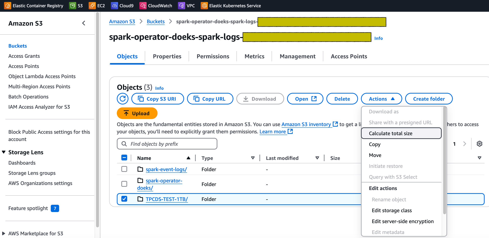
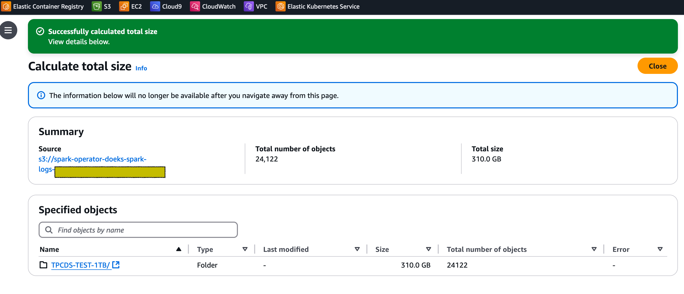
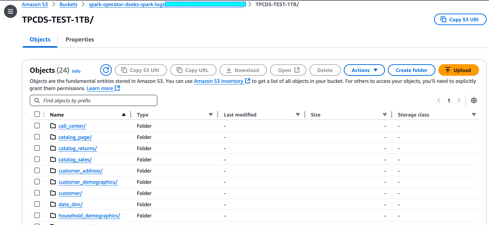

import Tabs from '@theme/Tabs';
import TabItem from '@theme/TabItem';
import CollapsibleContent from '@site/src/components/CollapsibleContent';
import ReplaceS3BucketPlaceholders from './_replace_s3_bucket_placeholders.mdx';

# Amazon EKS에서 Spark 벤치마크 테스트 실행을 위한 데이터 생성

다음 가이드는 Spark용 TPCDS 벤치마크 테스트를 실행하기 위한 데이터셋을 생성하는 방법에 대한 지침을 제공합니다.

## 데이터 생성 툴킷 배포

이 [예제](https://github.com/awslabs/data-on-eks/tree/main/analytics/terraform/spark-k8s-operator)에서는 오픈소스 Spark Operator로 Spark 작업을 실행하는 데 필요한 다음 리소스를 프로비저닝합니다.

이 예제는 새로운 VPC에 Spark K8s Operator를 실행하는 EKS 클러스터를 배포합니다.

- 새로운 샘플 VPC, 2개의 프라이빗 서브넷, 2개의 퍼블릭 서브넷, EKS Pod용 RFC6598 공간(100.64.0.0/10)에 2개의 서브넷을 생성합니다.
- 퍼블릭 서브넷용 인터넷 게이트웨이와 프라이빗 서브넷용 NAT 게이트웨이를 생성합니다.
- 퍼블릭 엔드포인트(데모 목적으로만)가 있는 EKS 클러스터 컨트롤 플레인을 벤치마킹 및 핵심 서비스용 관리형 노드 그룹과 Spark 워크로드용 Karpenter NodePool과 함께 생성합니다.
- Metrics 서버, Spark-operator, Apache Yunikorn, Karpenter, Cluster Autoscaler, Grafana, AMP 및 Prometheus 서버를 배포합니다.

### 사전 요구 사항

머신에 다음 도구가 설치되어 있는지 확인하세요.

1. [aws cli](https://docs.aws.amazon.com/cli/latest/userguide/install-cliv2.html)
2. [kubectl](https://Kubernetes.io/docs/tasks/tools/)
3. [terraform](https://learn.hashicorp.com/tutorials/terraform/install-cli)

### 배포

리포지토리를 복제합니다.

```bash
git clone https://github.com/awslabs/data-on-eks.git
cd data-on-eks
export DOEKS_HOME=$(pwd)
```

DOEKS_HOME이 설정 해제된 경우 data-on-eks 디렉토리에서 `export DATA_ON_EKS=$(pwd)`를 사용하여 수동으로 설정할 수 있습니다.

SSD가 장착된 `c5d12xlarge` 인스턴스의 최소 및 원하는 개수를 설정하기 위해 다음 환경 변수를 내보내세요. 테스트에서는 데이터셋 크기에 따라 둘 다 `6`으로 설정했습니다. 실행하려는 데이터셋의 크기와 요구 사항에 따라 인스턴스 수를 조정하세요.

```bash
export TF_VAR_spark_benchmark_ssd_min_size=6
export TF_VAR_spark_benchmark_ssd_desired_size=6
```

**참고:** `c5d` 인스턴스에 액세스할 수 없는 경우 로컬 NVMe 기반 SSD 블록 레벨 스토리지가 장착된 다른 EC2 인스턴스를 사용해도 됩니다. NVMe 기반 SSD 인스턴스 스토리지가 장착된 EC2 인스턴스는 Spark 벤치마크 데이터 생성 툴킷을 실행하기에 매우 적합합니다.

다음 디렉토리로 이동하여 `install.sh` 스크립트를 실행합니다.

```bash
cd ${DOEKS_HOME}/analytics/terraform/spark-k8s-operator
chmod +x install.sh
./install.sh
```

이제 설치 중에 생성된 버킷 이름을 보유하는 S3_BUCKET 변수를 생성합니다. 이 버킷은 나중에 예제에서 출력 데이터를 저장하는 데 사용됩니다. S3_BUCKET이 설정 해제된 경우 다음 명령을 다시 실행할 수 있습니다.

```bash
export S3_BUCKET=$(terraform output -raw s3_bucket_id_spark_history_server)
echo $S3_BUCKET
```

## TPCDS 벤치마크 실행을 위한 테스트 데이터셋 생성

TPCDS 벤치마크 테스트용 데이터셋을 생성하려면 데이터 생성 매니페스트에서 S3 버킷 이름을 구성해야 합니다.

<!-- Docusaurus will not render the {props.filename} inside of a ```codeblock``` -->
<ReplaceS3BucketPlaceholders filename="./tpcds-benchmark-data-generation-1t.yaml" />
```bash
cd ${DOEKS_HOME}/analytics/terraform/spark-k8s-operator/examples/benchmark
sed -i.old s/\<S3_BUCKET\>/${S3_BUCKET}/g ./tpcds-benchmark-data-generation-1t.yaml
```

그런 다음 데이터 생성을 시작하려면 아래 명령을 실행합니다

```bash

kubectl apply -f tpcds-benchmark-data-generation-1t.yaml
```

`tpcds-benchmark-data-generation-1t.yaml` 매니페스트를 적용하면 드라이버 및 실행기 Pod가 생성되는 것을 볼 수 있습니다. 테스트 데이터 생성 스크립트의 실행이 완료되는 데 약 1시간이 걸립니다. 실행이 완료되면 AWS S3 콘솔로 이동하여 버킷 크기를 확인할 수 있습니다.

블루프린트 실행의 일부로 생성된 S3 버킷으로 이동합니다. `TPCDS-TEST-1TB`라는 폴더 옆의 체크박스를 선택하고 `Actions` 드롭다운을 클릭한 다음 아래와 같이 `Calculate total size` 옵션을 클릭합니다.



데이터셋의 총 크기는 310 GB입니다.



`TPCDS-TEST-1TB` 폴더 안으로 들어가면 아래와 같이 생성된 많은 하위 폴더를 볼 수 있습니다.


각 하위 폴더에는 생성된 데이터를 포함하는 .parquet 파일이 있어야 합니다.



또한 Spark 드라이버 Pod 실행 상태와 로그를 확인하여 오류가 있는지 확인하세요.

```bash
kubectl get pod -n spark-team-a
```

출력:

```text
NAME                               READY   STATUS      RESTARTS   AGE
tpcds-data-generation-1tb-driver   0/1     Completed   0          59m
```

`tpcds-data-generation-1tb-driver` Pod의 로그 스니펫은 아래와 같아야 합니다

<CollapsibleContent header={<h2><span>드라이버 Pod 로그 스니펫</span></h2>}>

```text
24/11/01 15:29:42 INFO FileFormatWriter: Start to commit write Job xxxx.
24/11/01 15:29:42 INFO FileFormatWriter: Write Job xxxx committed. Elapsed time: 158 ms.
24/11/01 15:29:42 INFO FileFormatWriter: Finished processing stats for write job xxxx.
Data generated at s3a://spark-operator-doeks-spark-logs-xxx/TPCDS-TEST-1TB
24/11/01 15:29:42 INFO SparkContext: SparkContext is stopping with exitCode 0.
24/11/01 15:29:42 INFO SparkUI: Stopped Spark web UI at http://tpcds-data-generation-1tb-yyyyy-driver-svc.spark-team-a.svc:4040
24/11/01 15:29:42 INFO KubernetesClusterSchedulerBackend: Shutting down all executors
24/11/01 15:29:42 INFO KubernetesClusterSchedulerBackend$KubernetesDriverEndpoint: Asking each executor to shut down
24/11/01 15:29:42 WARN ExecutorPodsWatchSnapshotSource: Kubernetes client has been closed.
24/11/01 15:29:42 INFO MapOutputTrackerMasterEndpoint: MapOutputTrackerMasterEndpoint stopped!
24/11/01 15:29:42 INFO MemoryStore: MemoryStore cleared
24/11/01 15:29:42 INFO BlockManager: BlockManager stopped
24/11/01 15:29:42 INFO BlockManagerMaster: BlockManagerMaster stopped
24/11/01 15:29:42 INFO OutputCommitCoordinator$OutputCommitCoordinatorEndpoint: OutputCommitCoordinator stopped!
24/11/01 15:29:42 INFO SparkContext: Successfully stopped SparkContext
```
</CollapsibleContent>

## 비용 고려 사항

데이터 생성을 위해 c5d 인스턴스를 사용할 때는 비용 영향을 염두에 두는 것이 중요합니다. 로컬 NVMe 스토리지가 있는 이러한 컴퓨팅 최적화 인스턴스는 높은 성능을 제공하지만 표준 c5 인스턴스보다 비쌀 수 있습니다. 비용을 최적화하려면 사용량을 신중하게 모니터링하고 리소스를 적절히 확장하는 것이 중요합니다. 로컬 NVMe 스토리지는 빠른 I/O를 제공하지만 데이터 지속성이 보장되지 않으므로 데이터 전송 및 백업 솔루션 비용을 고려해야 합니다. Spot 인스턴스는 중단 가능한 워크로드에 대해 상당한 절감을 제공할 수 있습니다. 또한 장기적이고 예측 가능한 사용량에 대해 인스턴스를 예약하면 상당한 할인을 받을 수 있습니다. 또한 노드 그룹의 최소 및 원하는 크기를 0으로 조정하여 더 이상 필요하지 않을 때 이러한 인스턴스를 종료하는 것이 필수적입니다. 이 관행은 유휴 리소스로 인한 불필요한 비용을 피하는 데 도움이 됩니다.

:::caution
AWS 계정에 원치 않는 요금이 부과되는 것을 방지하려면 이 배포 중에 생성된 모든 AWS 리소스를 삭제하세요
:::

이 스크립트는 `-target` 옵션을 사용하여 모든 리소스가 올바른 순서로 삭제되도록 환경을 정리합니다.

```bash
cd ${DOEKS_HOME}/analytics/terraform/spark-k8s-operator && chmod +x cleanup.sh
./cleanup.sh
```
