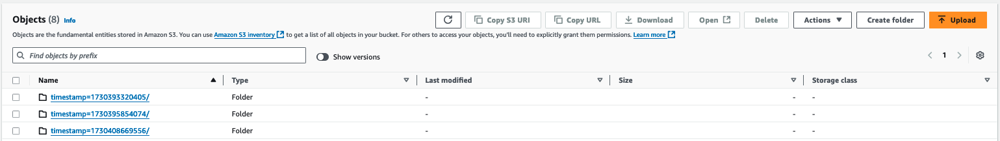
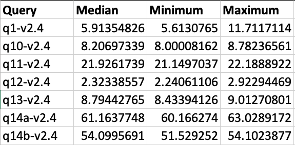

import ReplaceS3BucketPlaceholders from './_replace_s3_bucket_placeholders.mdx';

# Amazon EKS에서 Spark 벤치마크 테스트 실행

다음 가이드는 Spark용 TPCDS 벤치마크 테스트를 실행하는 방법에 대한 지침을 제공합니다.

## 벤치마크 툴킷 배포

이 [예제](https://github.com/awslabs/data-on-eks/tree/main/analytics/terraform/spark-k8s-operator)에서는 오픈소스 Spark Operator로 Spark 작업을 실행하는 데 필요한 다음 리소스를 프로비저닝합니다.

이 예제는 새로운 VPC에 Spark K8s Operator를 실행하는 EKS 클러스터를 배포합니다.

- 새로운 샘플 VPC, 2개의 프라이빗 서브넷, 2개의 퍼블릭 서브넷, EKS Pod용 RFC6598 공간(100.64.0.0/10)에 2개의 서브넷을 생성합니다.
- 퍼블릭 서브넷용 인터넷 게이트웨이와 프라이빗 서브넷용 NAT 게이트웨이를 생성합니다.
- 퍼블릭 엔드포인트(데모 목적으로만)가 있는 EKS 클러스터 컨트롤 플레인을 벤치마킹 및 핵심 서비스용 관리형 노드 그룹과 Spark 워크로드용 Karpenter NodePool과 함께 생성합니다.
- Metrics 서버, Spark-operator, Apache Yunikorn, Karpenter, Cluster Autoscaler, Grafana, AMP 및 Prometheus 서버를 배포합니다.

### 사전 요구 사항

머신에 다음 도구가 설치되어 있는지 확인하세요.

1. [aws cli](https://docs.aws.amazon.com/cli/latest/userguide/install-cliv2.html)
2. [kubectl](https://Kubernetes.io/docs/tasks/tools/)
3. [terraform](https://learn.hashicorp.com/tutorials/terraform/install-cli)


### 배포

리포지토리를 복제합니다.

```bash
git clone https://github.com/awslabs/data-on-eks.git
cd data-on-eks
export DOEKS_HOME=$(pwd)
```

DOEKS_HOME이 설정 해제된 경우 data-on-eks 디렉토리에서 `export DATA_ON_EKS=$(pwd)`를 사용하여 수동으로 설정할 수 있습니다.

다음 디렉토리로 이동하여 `install.sh` 스크립트를 실행합니다.

```bash
cd ${DOEKS_HOME}/analytics/terraform/spark-k8s-operator
chmod +x install.sh
./install.sh
```

이제 설치 중에 생성된 버킷 이름을 보유하는 S3_BUCKET 변수를 생성합니다. 이 버킷은 나중에 예제에서 출력 데이터를 저장하는 데 사용됩니다. S3_BUCKET이 설정 해제된 경우 다음 명령을 다시 실행할 수 있습니다.

```bash
export S3_BUCKET=$(terraform output -raw s3_bucket_id_spark_history_server)
echo $S3_BUCKET
```


### TPCDS 벤치마크 실행을 위한 테스트 데이터셋 생성
벤치마크는 쿼리하고 결과를 다시 저장할 입력 데이터가 있는 S3 버킷이 필요합니다.
S3에 데이터셋이 없는 경우 동일한 클러스터를 사용하여 [데이터 생성 작업을 실행](./data-generation.md)하여 하나를 생성할 수 있습니다.

예제 데이터셋이 있는 S3 버킷이 있으면 벤치마크 작업을 실행할 수 있습니다


## TPCDS 벤치마크 실행

### 워커 노드 확장
이 벤치마크에서는 스케일링 속도가 아닌 Spark SQL 쿼리의 성능과 작업 실행 시간에 초점을 맞추고 있습니다. 작업이 스케일링 활동이나 Spot 중단으로 인해 방해받지 않도록 벤치마크에 관리형 노드 그룹을 사용하고 작업 제출 전에 용량을 확장하는 것을 권장합니다

블루프린트는 이러한 벤치마크에 사용하는 [두 개의 관리형 노드 그룹을 생성합니다](https://github.com/awslabs/data-on-eks/blob/main/analytics/terraform/spark-k8s-operator/eks.tf#L120-L207):
- `spark_benchmark_ebs` - 이 노드 그룹은 r6g 또는 c5와 같이 NVMe 스토리지가 없는 인스턴스용으로 구성됩니다
- `spark_benchmark_ssd` - 이 노드 그룹은 인스턴스에서 사용 가능한 NVMe 장치에 대해 RAID를 설정합니다. 이는 r6gd 및 c5d와 같이 NVMe 스토리지가 있는 인스턴스에 완벽합니다.
이 노드 그룹은 비용을 절약하기 위해 기본적으로 0으로 스케일링되지만, 벤치마크할 인스턴스 유형을 구성하고 노드 그룹의 `min_size`와 `desired_size`를 설정할 수 있습니다.

:::tip
필요한 노드 수는 인스턴스 크기와 벤치마크에 사용된 실행기 Pod의 리소스 요청에 따라 다릅니다. 현재 벤치마크는 36개의 실행기를 요청하며, 각각 5vCPU와 26Gi 메모리를 요청하여 총 180vCPU와 936Gi 메모리가 됩니다. 이는 6개의 r6g.12xlarge 인스턴스에 맞습니다. 사용하려는 인스턴스 유형과 벤치마크 매니페스트를 비교하여 필요한 EC2 인스턴스 수를 찾을 수 있습니다.
:::


### 입력/출력용 S3 버킷 설정

<!-- Docusaurus will not render the {props.filename} inside of a ```codeblock``` -->
<ReplaceS3BucketPlaceholders filename="./tpcds-benchmark-1t-ebs.yaml" />
```bash
cd ${DOEKS_HOME}/analytics/terraform/spark-k8s-operator/examples/benchmark
sed -i.old s/\<S3_BUCKET\>/${S3_BUCKET}/g ./tpcds-benchmark-1t-ebs.yaml
```

### 벤치마크 작업 제출

그런 다음 데이터 생성을 시작하려면 아래 명령을 실행합니다

```bash

kubectl apply -f tpcds-benchmark-1t-ebs.yaml
```

`tpcds-benchmark-1t-ebs.yaml` 매니페스트를 적용하면 드라이버 및 실행기 Pod가 생성되는 것을 볼 수 있습니다. 벤치마크 쿼리의 단일 반복 실행을 완료하는 데 약 1시간이 걸립니다.

Spark 드라이버 Pod 실행 상태와 로그를 확인하여 작업 상태를 모니터링할 수 있습니다

```bash
kubectl get pod -n spark-team-a
```

출력:
```bash
NAME                             READY   STATUS    RESTARTS   AGE     IP               NODE                             NOMINATED NODE   READINESS GATES
benchmark-exec-ebs-exec-1        1/1     Running   0          75s     100.64.251.188   ip-100-64-219-156.ec2.internal   <none>           <none>
benchmark-exec-ebs-exec-10       1/1     Running   0          73s     100.64.213.1     ip-100-64-146-124.ec2.internal   <none>           <none>
...
benchmark-exec-ebs-exec-8        1/1     Running   0          74s     100.64.202.23    ip-100-64-219-156.ec2.internal   <none>           <none>
benchmark-exec-ebs-exec-9        1/1     Running   0          73s     100.64.238.20    ip-100-64-175-12.ec2.internal    <none>           <none>
tpcds-benchmark-1tb-ebs-driver   1/1     Running   0          2m33s   100.64.228.162   ip-100-64-213-174.ec2.internal   <none>           <none>
```

벤치마크는 메트릭과 로그를 내보내도록 구성되어 있어 [여기에 설명된 Spark 관측성 도구](/data-on-eks/docs/datastacks/processing/spark-on-eks/observability#spark-history-server)를 사용하여 벤치마크를 검토할 수 있습니다.

벤치마크가 얼마나 진행되었는지 알아보려면 Spark Web UI를 사용하여 현재 실행 중인 쿼리를 검토할 수 있습니다.
벤치마크 드라이버로 포트 포워딩하여 UI를 확인하세요:
```bash
kubectl port-forward -n spark-team-a service/tpcds-benchmark-1tb-ebs-ui-svc 4040:4040
```
그런 다음 브라우저를 열고 localhost:4040을 입력합니다. 실행 중인 작업과 완료된 작업을 검토할 수 있습니다. 벤치마크는 SQL 쿼리를 순차적으로 실행하므로 쿼리 번호를 확인하여 작업이 얼마나 진행되었는지 추정할 수 있습니다.


벤치마크가 완료되면 비용을 절약하기 위해 노드 그룹을 다시 0으로 스케일링하고 아래 명령으로 남은 SparkApplication을 삭제할 수 있습니다:
```bash
cd ${DOEKS_HOME}/analytics/terraform/spark-k8s-operator/examples/benchmark
kubectl delete -f tpcds-benchmark-1t-ebs.yaml
```

## 결과 검토

벤치마크가 완료되면 매니페스트 파일에 지정된 S3 버킷에 결과를 저장합니다(기본값: `s3a://<S3_BUCKET>/TPCDS-TEST-1T-RESULT`). 해당 S3 버킷의 S3 콘솔로 이동하여 디렉토리로 들어갈 수 있습니다:


결과 디렉토리로 들어가면 작업이 실행된 타임스탬프에 해당하는 폴더 목록이 표시됩니다:



가장 큰 타임스탬프를 선택하여 최신 결과를 찾거나 테스트 시간에 해당하는 폴더를 찾을 수 있습니다.
이 폴더 안에는 `part-00000-000000000-0000-0000-0000-000000000-0000.json`과 같은 이름의 파일이 있으며, 이 파일에는 작업에 사용된 전체 spark 구성이 포함되어 있습니다.


`summary.csv`라는 하위 폴더 안에 `part-00000-000000000-0000-0000-0000-000000000-0000.csv` 파일에 벤치마크 결과가 포함되어 있습니다.


이 csv 파일을 열면 각 쿼리를 처리하는 데 걸린 시간을 보여주는 4개의 열 데이터가 표시됩니다. 파일에는 열 헤더가 포함되어 있지 않으며, 왼쪽에서 오른쪽으로 열은 다음과 같습니다:
- TPCDS 쿼리 번호
- 해당 쿼리를 처리하는 데 걸린 중앙값 시간
- 해당 쿼리를 처리하는 데 걸린 최소 시간
- 해당 쿼리를 처리하는 데 걸린 최대 시간

:::tip
벤치마크가 단일 반복으로 실행된 경우(기본값) 세 열 모두 동일한 시간을 표시합니다.
:::

이 이미지는 명확성을 위해 열 헤더가 추가된 3회 반복의 출력을 보여줍니다:


## 비용 고려 사항

데이터 생성을 위해 c5d 인스턴스를 사용할 때는 비용 영향을 염두에 두는 것이 중요합니다. 로컬 NVMe 스토리지가 있는 이러한 컴퓨팅 최적화 인스턴스는 높은 성능을 제공하지만 표준 c5 인스턴스보다 비쌀 수 있습니다. 비용을 최적화하려면 사용량을 신중하게 모니터링하고 리소스를 적절히 확장하는 것이 중요합니다. 로컬 NVMe 스토리지는 빠른 I/O를 제공하지만 데이터 지속성이 보장되지 않으므로 데이터 전송 및 백업 솔루션 비용을 고려해야 합니다. Spot 인스턴스는 중단 가능한 워크로드에 대해 상당한 절감을 제공할 수 있습니다. 또한 장기적이고 예측 가능한 사용량에 대해 인스턴스를 예약하면 상당한 할인을 받을 수 있습니다. 또한 노드 그룹의 최소 및 원하는 크기를 0으로 조정하여 더 이상 필요하지 않을 때 이러한 인스턴스를 종료하는 것이 필수적입니다. 이 관행은 유휴 리소스로 인한 불필요한 비용을 피하는 데 도움이 됩니다.

:::caution
AWS 계정에 원치 않는 요금이 부과되는 것을 방지하려면 이 배포 중에 생성된 모든 AWS 리소스를 삭제하세요
:::

이 스크립트는 `-target` 옵션을 사용하여 모든 리소스가 올바른 순서로 삭제되도록 환경을 정리합니다.

```bash
cd ${DOEKS_HOME}/analytics/terraform/spark-k8s-operator && chmod +x cleanup.sh
./cleanup.sh
```
