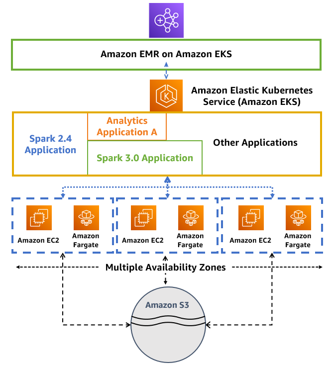

# EMR on EKS 모범 사례

## [EMR Containers 모범 사례 가이드](https://aws.github.io/aws-emr-containers-best-practices/)

Amazon EMR on Amazon EKS를 사용하면 클러스터를 프로비저닝하지 않고도 Amazon Elastic Kubernetes Service(EKS)에서 온디맨드로 Apache Spark 작업을 제출할 수 있습니다. EMR on EKS를 사용하면 동일한 Amazon EKS 클러스터에서 분석 워크로드와 다른 Kubernetes 기반 애플리케이션을 통합하여 리소스 활용도를 개선하고 인프라 관리를 단순화할 수 있습니다.

이 링크는 Amazon EMR on EKS를 시작하기 위한 모범 사례와 템플릿을 제공합니다. 콘텐츠를 빠르게 반복하고, 다양한 문제에 대해 시기적절하고 효과적인 권장 사항을 제공하며, 더 넓은 커뮤니티의 제안을 쉽게 수용할 수 있도록 이 가이드를 GitHub에 게시합니다.

EMR on EKS 모범 사례 GitHub 문서는 [여기](https://aws.github.io/aws-emr-containers-best-practices/)에서 확인하세요.

### 아키텍처
다음 다이어그램은 Amazon EMR on EKS의 솔루션 아키텍처를 보여줍니다.

