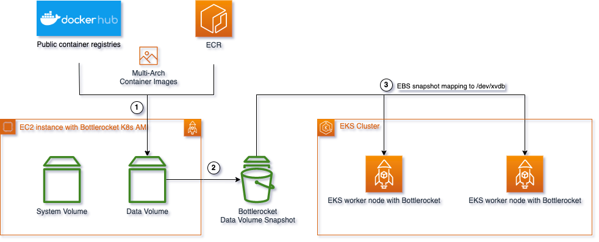

import CollapsibleContent from '@site/src/components/CollapsibleContent';

# EBS 스냅샷으로 데이터 볼륨에 컨테이너 이미지 사전 로드

이 패턴의 목적은 Bottlerocket OS의 데이터 볼륨에 이미지를 캐시하여 대용량 이미지를 가진 컨테이너의 콜드 스타트 시간을 줄이는 것입니다.

데이터 분석 및 머신 러닝 워크로드는 종종 대용량 컨테이너 이미지(보통 기가바이트 단위)를 필요로 하며, Amazon ECR 또는 다른 이미지 레지스트리에서 풀링하고 추출하는 데 몇 분이 걸릴 수 있습니다. 이미지 풀링 시간을 줄이는 것이 이러한 컨테이너 시작 속도를 개선하는 핵심입니다.

Bottlerocket OS는 컨테이너 실행을 위해 AWS가 특별히 구축한 Linux 기반 오픈 소스 운영 체제입니다. OS 볼륨과 데이터 볼륨 두 개의 볼륨이 있으며, 후자는 아티팩트 및 컨테이너 이미지를 저장하는 데 사용됩니다. 이 샘플은 데이터 볼륨을 활용하여 이미지를 풀링하고 나중에 사용할 스냅샷을 생성합니다.

EBS 스냅샷에 이미지를 캐시하고 EKS 클러스터에서 시작하는 프로세스를 보여주기 위해 이 샘플은 Amazon EKS 최적화 Bottlerocket AMI를 사용합니다.

자세한 내용은 GitHub 샘플 및 블로그 게시물을 참조하세요:
- [GitHub - AWS Bottlerocket 인스턴스용 컨테이너 이미지 캐싱](https://github.com/aws-samples/bottlerocket-images-cache/tree/main)
- [블로그 게시물 - Bottlerocket 데이터 볼륨으로 Amazon EKS에서 컨테이너 시작 시간 단축](https://aws.amazon.com/blogs/containers/reduce-container-startup-time-on-amazon-eks-with-bottlerocket-data-volume/)

## 이 스크립트 개요



1. EKS AMI용 Bottlerocket으로 EC2 인스턴스를 시작합니다.
2. Amazon System Manager를 통해 인스턴스에 액세스합니다.
3. Amazon System Manager Run Command를 사용하여 이 EC2에 캐시할 이미지를 풀링합니다.
4. 인스턴스를 종료하고 데이터 볼륨에 대한 EBS 스냅샷을 빌드합니다.
5. 인스턴스를 종료합니다.

## 사용 예

```
git clone https://github.com/aws-samples/bottlerocket-images-cache/
cd bottlerocket-images-cache/

# 연결 끊김을 방지하기 위해 터미널에서 nohup 사용
❯ nohup ./snapshot.sh --snapshot-size 150 -r us-west-2 \
  docker.io/rayproject/ray-ml:2.10.0-py310-gpu,public.ecr.aws/data-on-eks/ray2.11.0-py310-gpu-stablediffusion:latest &

❯ tail -f nohup.out

2024-07-15 17:18:53 I - [1/8] Deploying EC2 CFN stack ...
2024-07-15 17:22:07 I - [2/8] Launching SSM .
2024-07-15 17:22:08 I - SSM launched in instance i-07d10182abc8a86e1.
2024-07-15 17:22:08 I - [3/8] Stopping kubelet.service ..
2024-07-15 17:22:10 I - Kubelet service stopped.
2024-07-15 17:22:10 I - [4/8] Cleanup existing images ..
2024-07-15 17:22:12 I - Existing images cleaned
2024-07-15 17:22:12 I - [5/8] Pulling images:
2024-07-15 17:22:12 I - Pulling docker.io/rayproject/ray-ml:2.10.0-py310-gpu - amd64 ...
2024-07-15 17:27:50 I - docker.io/rayproject/ray-ml:2.10.0-py310-gpu - amd64 pulled.
2024-07-15 17:27:50 I - Pulling docker.io/rayproject/ray-ml:2.10.0-py310-gpu - arm64 ...
2024-07-15 17:27:58 I - docker.io/rayproject/ray-ml:2.10.0-py310-gpu - arm64 pulled.
2024-07-15 17:27:58 I - Pulling public.ecr.aws/data-on-eks/ray2.11.0-py310-gpu-stablediffusion:latest - amd64 ...
2024-07-15 17:31:34 I - public.ecr.aws/data-on-eks/ray2.11.0-py310-gpu-stablediffusion:latest - amd64 pulled.
2024-07-15 17:31:34 I - Pulling public.ecr.aws/data-on-eks/ray2.11.0-py310-gpu-stablediffusion:latest - arm64 ...
2024-07-15 17:31:36 I - public.ecr.aws/data-on-eks/ray2.11.0-py310-gpu-stablediffusion:latest - arm64 pulled.
2024-07-15 17:31:36 I - [6/8] Stopping instance ...
2024-07-15 17:32:25 I - Instance i-07d10182abc8a86e1 stopped
2024-07-15 17:32:25 I - [7/8] Creating snapshot ...
2024-07-15 17:38:36 I - Snapshot snap-0c6d965cf431785ed generated.
2024-07-15 17:38:36 I - [8/8] Cleanup.
2024-07-15 17:38:37 I - Stack deleted.
2024-07-15 17:38:37 I - --------------------------------------------------
2024-07-15 17:38:37 I - All done! Created snapshot in us-west-2: snap-0c6d965cf431785ed
```

스냅샷 ID `snap-0c6d965cf431785ed`를 복사하여 워커 노드의 스냅샷으로 구성할 수 있습니다.

# Amazon EKS 및 Karpenter에서 스냅샷 사용

Karpenter 노드 클래스에서 `snapshotID`를 지정할 수 있습니다. EC2NodeClass에 다음 내용을 추가하세요:

```
apiVersion: karpenter.k8s.aws/v1beta1
kind: EC2NodeClass
metadata:
  name: default
spec:
  amiFamily: Bottlerocket # OS가 BottleRocket인지 확인
  blockDeviceMappings:
    - deviceName: /dev/xvdb
      ebs:
        volumeSize: 150Gi
        volumeType: gp3
        kmsKeyID: "arn:aws:kms:<REGION>:<ACCOUNT_ID>:key/1234abcd-12ab-34cd-56ef-1234567890ab" # 사용자 정의 KMS 키를 사용하는 경우 KMS ID 지정
        snapshotID: snap-0123456789 # 여기에 스냅샷 ID 지정
```

# 엔드 투 엔드 배포 예제

엔드 투 엔드 배포 예제는 위에 링크된 GitHub 샘플 및 문서를 참조하거나 이 저장소의 다양한 데이터 분석 블루프린트를 탐색하세요.
