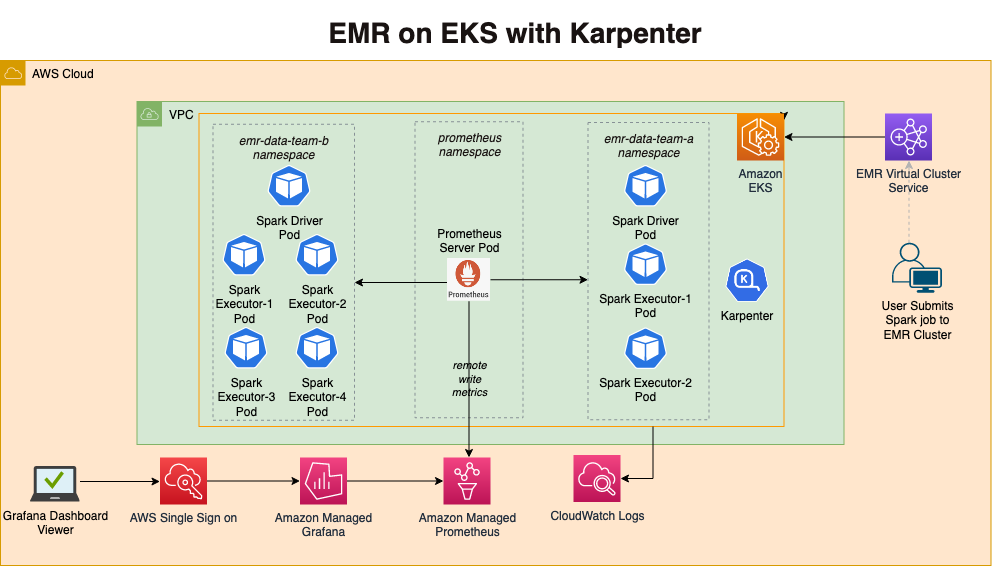
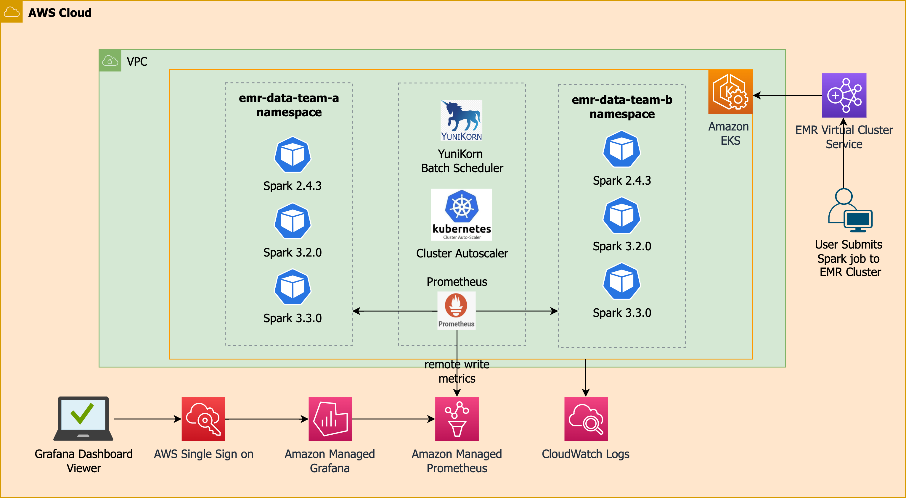
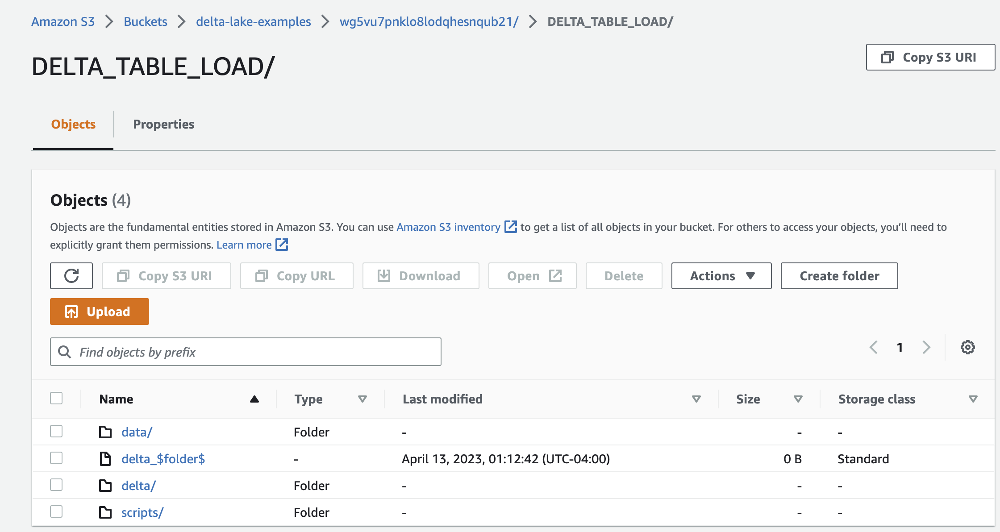
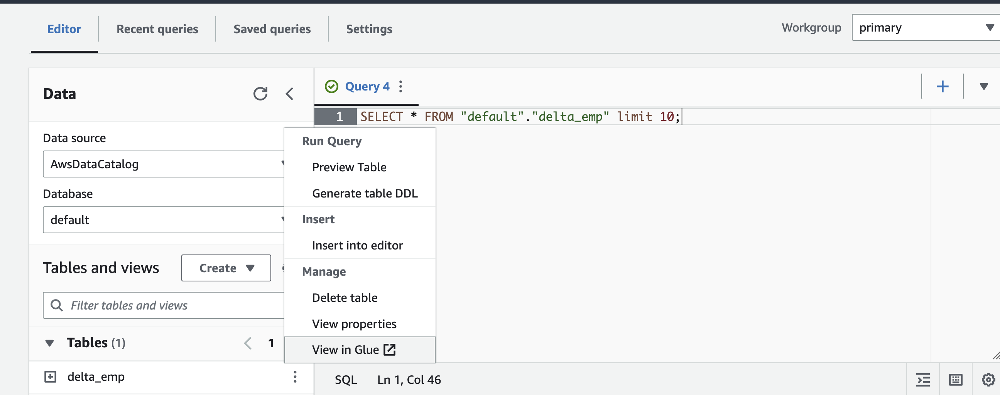

import Tabs from '@theme/Tabs';
import TabItem from '@theme/TabItem';
import CollapsibleContent from '@site/src/components/CollapsibleContent';

# [Karpenter](https://karpenter.sh/)가 포함된 EMR on EKS

## 소개

이 [패턴](https://github.com/awslabs/data-on-eks/tree/main/analytics/terraform/emr-eks-karpenter)에서는 EMR on EKS 클러스터를 배포하고 Spark 작업 스케일링을 위해 [Karpenter](https://karpenter.sh/) NodePool을 사용합니다.

**아키텍처**


이 패턴은 배포 경험을 단순하게 유지하면서도 배포 중에 필요한 애드온을 선택할 수 있도록 유연성을 유지하기 위해 의견이 반영된 기본값을 사용합니다. EMR on EKS를 처음 사용하는 경우 기본값을 유지하는 것이 좋으며, 교체할 수 있는 실행 가능한 대안 옵션이 있는 경우에만 커스터마이즈하세요.

인프라 측면에서 이 패턴에서 생성되는 리소스는 다음과 같습니다.

- 퍼블릭 엔드포인트(데모/poc 환경에 권장)가 있는 EKS 클러스터 컨트롤 플레인 생성
- 하나의 관리형 노드 그룹
  - 시스템 중요 파드를 실행하기 위해 다중 AZ에 걸쳐 3개의 인스턴스가 있는 코어 노드 그룹. 예: Cluster Autoscaler, CoreDNS, 관측성, 로깅 등
- EMR on EKS 활성화
  - 데이터 팀을 위한 두 개의 네임스페이스(`emr-data-team-a`, `emr-data-team-b`) 생성
  - 두 네임스페이스에 대한 Kubernetes 역할 및 역할 바인딩(`emr-containers` 사용자) 생성
  - 작업 실행에 필요한 두 팀의 IAM 역할
  - `emr-containers` 사용자 및 `AWSServiceRoleForAmazonEMRContainers` 역할로 `AWS_AUTH` 구성 맵 업데이트
  - 작업 실행 역할과 EMR 관리형 서비스 계정의 ID 간에 신뢰 관계 생성
  - `emr-data-team-a` 및 `emr-data-team-b`에 대한 EMR 가상 클러스터 및 두 팀의 IAM 정책 생성

아래에서 사용 가능한 애드온 목록을 볼 수 있습니다.
:::tip
이 패턴에서 제공하는 `core-node-group`과 같은 전용 EKS 관리형 노드 그룹에서 모든 기본 시스템 애드온을 실행하는 것이 좋습니다.
:::
:::danger
중요한 애드온(`Amazon VPC CNI`, `CoreDNS`, `Kube-proxy`)은 제거하지 않는 것이 좋습니다.
:::
| 애드온 | 기본적으로 활성화? | 이점 | 링크 |
| :---  | :----: | :---- | :---- |
| Amazon VPC CNI | 예 | VPC CNI는 [EKS 애드온](https://docs.aws.amazon.com/eks/latest/userguide/eks-networking-add-ons.html)으로 사용 가능하며 Spark 애플리케이션 파드에 대한 ENI 및 IPv4 또는 IPv6 주소 생성을 담당합니다 | [VPC CNI 문서](https://docs.aws.amazon.com/eks/latest/userguide/managing-vpc-cni.html) |
| CoreDNS | 예 | CoreDNS는 [EKS 애드온](https://docs.aws.amazon.com/eks/latest/userguide/eks-networking-add-ons.html)으로 사용 가능하며 Spark 애플리케이션 및 Kubernetes 클러스터에 대한 DNS 쿼리 해결을 담당합니다 | [EKS CoreDNS 문서](https://docs.aws.amazon.com/eks/latest/userguide/managing-coredns.html) |
| Kube-proxy | 예 | Kube-proxy는 [EKS 애드온](https://docs.aws.amazon.com/eks/latest/userguide/eks-networking-add-ons.html)으로 사용 가능하며 노드에서 네트워크 규칙을 유지하고 Spark 애플리케이션 파드에 대한 네트워크 통신을 활성화합니다 | [EKS kube-proxy 문서](https://docs.aws.amazon.com/eks/latest/userguide/managing-kube-proxy.html) |
| Amazon EBS CSI 드라이버 | 예 | EBS CSI 드라이버는 [EKS 애드온](https://docs.aws.amazon.com/eks/latest/userguide/eks-networking-add-ons.html)으로 사용 가능하며 EKS 클러스터가 EBS 볼륨의 수명 주기를 관리할 수 있게 합니다 | [EBS CSI 드라이버 문서](https://docs.aws.amazon.com/eks/latest/userguide/ebs-csi.html)
| Karpenter | 예 | Karpenter는 Kubernetes 클러스터의 Spark 애플리케이션에 적시에 컴퓨팅 용량을 제공하는 노드 그룹이 없는 오토스케일러입니다 | [Karpenter 문서](https://karpenter.sh/) |
| Cluster Autoscaler | 예 | Kubernetes Cluster Autoscaler는 Kubernetes 클러스터의 크기를 자동으로 조정하며 클러스터의 노드 그룹(예: `core-node-group`) 스케일링에 사용할 수 있습니다 | [Cluster Autoscaler 문서](https://github.com/kubernetes/autoscaler/blob/master/cluster-autoscaler/cloudprovider/aws/README.md) |
| Cluster proportional autoscaler | 예 | Kubernetes 클러스터에서 CoreDNS 파드 스케일링을 담당합니다 | [Cluster Proportional Autoscaler 문서](https://github.com/kubernetes-sigs/cluster-proportional-autoscaler) |
| Metrics 서버 | 예 | Kubernetes 메트릭 서버는 클러스터 내에서 cpu, 메모리 및 기타 컨테이너 리소스 사용량을 집계합니다 | [EKS Metrics Server 문서](https://docs.aws.amazon.com/eks/latest/userguide/metrics-server.html) |
| Prometheus | 예 | Prometheus는 EKS 클러스터의 Spark 애플리케이션을 포함한 EKS 클러스터 모니터링을 담당합니다. Amazon Managed Prometheus 및 Kubecost로 메트릭을 스크래핑하고 수집하기 위해 Prometheus 배포를 사용합니다 | [Prometheus 문서](https://prometheus.io/docs/introduction/overview/) |
| Amazon Managed Prometheus | 예 | EKS 클러스터 및 Spark 애플리케이션 메트릭의 저장 및 스케일링을 담당합니다 | [Amazon Managed Prometheus 문서](https://docs.aws.amazon.com/prometheus/latest/userguide/what-is-Amazon-Managed-Service-Prometheus.html) |
| Kubecost | 예 | Kubecost는 Spark 애플리케이션별 비용 분석을 제공합니다. 작업별, 네임스페이스별 또는 레이블별로 비용을 모니터링할 수 있습니다 | [EKS Kubecost 문서](https://docs.aws.amazon.com/eks/latest/userguide/cost-monitoring.html) |
| CloudWatch 메트릭 | 아니오 | CloudWatch 컨테이너 인사이트 메트릭은 AWS 리소스뿐만 아니라 CloudWatch 대시보드의 EKS 리소스도 모니터링하는 간단하고 표준화된 방법을 제공합니다 | [CloudWatch Container Insights 문서](https://docs.aws.amazon.com/AmazonCloudWatch/latest/monitoring/Container-Insights-metrics-EKS.html) |
|AWS for Fluent-bit | 아니오 | EKS 클러스터 및 워커 노드 로그를 CloudWatch Logs 또는 타사 로깅 시스템에 게시하는 데 사용할 수 있습니다 | [AWS For Fluent-bit 문서](https://github.com/aws/aws-for-fluent-bit) |
| FSx for Lustre CSI 드라이버 | 아니오 | FSx for Lustre를 사용하여 Spark 애플리케이션을 실행하는 데 사용할 수 있습니다 | [FSx for Lustre CSI 드라이버 문서](https://docs.aws.amazon.com/eks/latest/userguide/fsx-csi.html) |


<CollapsibleContent header={<h3><span>애드온 커스터마이징</span></h3>}>

### 애드온 커스터마이징

`addons.tf`에서 권장 시스템 애드온을 변경하거나 `variables.tf`에서 선택적 애드온을 변경하여 언제든지 배포를 커스터마이즈할 수 있습니다.

예를 들어 Prometheus 메트릭을 캡처하는 다른 애플리케이션이 있어서 Amazon Managed Prometheus를 제거하려는 경우, 즐겨 사용하는 편집기를 사용하여 `addons.tf`를 편집하고 Amazon Managed Prometheus를 찾아 `false`로 변경할 수 있습니다.
```yaml
  enable_prometheus = false
  prometheus_helm_config = {
    name       = "prometheus"
    repository = "https://prometheus-community.github.io/helm-charts"
    chart      = "prometheus"
    version    = "15.10.1"
    namespace  = "prometheus"
    timeout    = "300"
    values     = [templatefile("${path.module}/helm-values/prometheus-values.yaml", {})]
  }
```

shuffle 파일을 저장하거나 S3에서 데이터에 액세스하기 위해 Spark 애플리케이션을 실행하는 동안 FSx for Lustre 스토리지를 사용하려면 `variables.tf`에서 FSx를 검색하여 FSx CSI 드라이버를 설치하고 파일을 편집할 수 있습니다.
```yaml
variable "enable_fsx_for_lustre" {
  default     = false
  description = "Deploys fsx for lustre addon, storage class and static FSx for Lustre filesystem for EMR"
  type        = bool
}
```
변경 사항이 저장되면 새 설치인 경우 [배포 가이드](#솔루션-배포)를 따르거나 기존 설치에 대해 Terraform을 사용하여 이러한 변경 사항을 적용합니다.
```
terraform apply
```

</CollapsibleContent>

<CollapsibleContent header={<h2><span>솔루션 배포</span></h2>}>

배포 단계를 살펴보겠습니다.

### 사전 요구 사항:

머신에 다음 도구가 설치되어 있는지 확인하세요.

1. [aws cli](https://docs.aws.amazon.com/cli/latest/userguide/install-cliv2.html)
2. [kubectl](https://Kubernetes.io/docs/tasks/tools/)
3. [terraform](https://learn.hashicorp.com/tutorials/terraform/install-cli)

_참고: 현재 Amazon Managed Prometheus는 일부 리전에서만 지원됩니다. 지원되는 리전은 이 [사용자 가이드](https://docs.aws.amazon.com/prometheus/latest/userguide/what-is-Amazon-Managed-Service-Prometheus.html)를 참조하세요._

먼저 저장소를 복제합니다.

```bash
git clone https://github.com/awslabs/data-on-eks.git
```

예제 디렉토리 중 하나로 이동하여 `install.sh` 스크립트를 실행합니다.

```bash
cd data-on-eks/analytics/terraform/emr-eks-karpenter

chmod +x install.sh

./install.sh

```

### 리소스 확인

Amazon EKS 클러스터 및 Amazon Managed Service for Prometheus를 확인합니다.

```bash
aws eks describe-cluster --name emr-eks-karpenter

aws amp list-workspaces --alias amp-ws-emr-eks-karpenter
```


EKS 클러스터와 인증하기 위한 k8s 구성 파일을 생성합니다.

```bash
aws eks --region us-west-2 update-kubeconfig --name emr-eks-karpenter
```

출력에 EKS 관리형 노드 그룹 노드가 표시됩니다.

```bash
kubectl get nodes
```

EMR on EKS 네임스페이스 `emr-data-team-a` 및 `emr-data-team-b`를 확인합니다.

```bash
kubectl get ns | grep emr-data-team
```

</CollapsibleContent>

## 샘플 Spark 작업 실행

이 패턴은 멀티 테넌트 EKS 클러스터에서 Spark 작업을 실행하는 방법을 보여줍니다. 예제에서는 EMR 가상 클러스터에 매핑된 네임스페이스 `emr-data-team-a` 및 `emr-data-team-b`를 사용하는 두 데이터 팀을 보여줍니다. 각 팀이 고유한 워크로드에 맞는 작업을 제출할 수 있도록 각 팀에 대해 다른 Karpenter NodePool을 사용할 수 있습니다. 팀은 Spark 작업을 실행하기 위해 다른 스토리지 요구 사항을 사용할 수도 있습니다. 예를 들어 `taints`가 있는 컴퓨팅 최적화 NodePool을 사용하고 파드 템플릿을 사용하여 `tolerations`를 지정하여 컴퓨팅 최적화 EC2 인스턴스에서 Spark를 실행할 수 있습니다. 스토리지 측면에서는 데이터 처리를 위해 [EC2 인스턴스 스토어](https://docs.aws.amazon.com/AWSEC2/latest/UserGuide/InstanceStorage.html), [EBS](https://docs.aws.amazon.com/AWSEC2/latest/UserGuide/AmazonEBS.html) 또는 [FSx for Lustre](https://docs.aws.amazon.com/fsx/latest/LustreGuide/what-is.html) 볼륨을 사용할지 결정할 수 있습니다. 이 예제에서 사용되는 기본 스토리지는 성능 이점 때문에 EC2 인스턴스 스토어입니다.

- `c5d` 인스턴스에서 Spark 작업을 실행하기 위한 `spark-compute-optimized` NodePool
- `r5d` 인스턴스에서 Spark 작업을 실행하기 위한 `spark-memory-optimized` NodePool
- `r6gd` Graviton 인스턴스(`ARM64`)에서 Spark 작업을 실행하기 위한 `spark-graviton-memory-optimized` NodePool

<Tabs>
<TabItem value="spark-compute-optimized" lebal="spark-compute-optimized"default>

이 튜토리얼에서는 컴퓨팅 최적화 인스턴스를 사용하는 Karpenter NodePool을 사용합니다. 이 템플릿은 Karpenter AWSNodeTemplates를 활용합니다.

<details>
<summary> 컴퓨팅 최적화 인스턴스용 Karpenter NodePool을 보려면 클릭하세요!</summary>

Karpenter NodeClass 및 NodePool 코드를 [여기](https://github.com/awslabs/data-on-eks/blob/35e09a8fbe64266778e0d86fe2eb805b8373e590/analytics/terraform/emr-eks-karpenter/addons.tf#L204)에서 확인하세요.

</details>

이 NodePool을 사용할 수 있는 Spark 작업을 실행하려면 파드 템플릿에 `tolerations`를 추가하여 작업을 제출해야 합니다.

예:

```yaml
spec:
  tolerations:
    - key: "spark-compute-optimized"
      operator: "Exists"
      effect: "NoSchedule"
```

**컴퓨팅 최적화 Karpenter NodePool을 트리거하는 샘플 PySpark 작업 실행**

다음 스크립트는 PySpark 스크립트, 파드 템플릿 및 입력 데이터를 저장하기 위해 `virtual_cluster_id`, `job_execution_role_arn`, `cloudwatch_log_group_name` 및 `S3_Bucket` 네 가지 입력 매개변수가 필요합니다. 이 값들은 `execute_emr_eks_job.sh`에 의해 자동으로 채워집니다.


:::caution

이 셸 스크립트는 테스트 데이터를 로컬 머신에 다운로드하고 S3 버킷에 업로드합니다. 작업을 실행하기 전에 셸 스크립트를 확인하세요.

:::


```bash
cd data-on-eks/analytics/terraform/emr-eks-karpenter/examples/nvme-ssd/karpenter-compute-provisioner/

./execute_emr_eks_job.sh

```

```
Enter the EMR Virtual Cluster ID: 4ucrncg6z4nd19vh1lidna2b3
Enter the EMR Execution Role ARN: arn:aws:iam::123456789102:role/emr-eks-karpenter-emr-eks-data-team-a
Enter the CloudWatch Log Group name: /emr-on-eks-logs/emr-eks-karpenter/emr-data-team-a
Enter the S3 Bucket for storing PySpark Scripts, Pod Templates and Input data. For e.g., s3://<bucket-name>: s3://example-bucket
```

Karpenter는 Spark 작업을 실행하기 전에 NodePool 템플릿에 지정된 대로 새 컴퓨팅 노드를 가동하는 데 1~2분이 걸릴 수 있습니다.
작업이 완료되면 노드가 드레인됩니다.


**작업 실행 확인**

```bash
kubectl get pods --namespace=emr-data-team-a -w
```


</TabItem>

<TabItem value="spark-memory-optimized" label="spark-memory-optimized">

이 튜토리얼에서는 메모리 최적화 인스턴스를 사용하는 Karpenter NodePool을 사용합니다. 이 템플릿은 Userdata가 있는 AWS 노드 템플릿을 사용합니다.

<details>
<summary> 메모리 최적화 인스턴스용 Karpenter NodePool을 보려면 클릭하세요!</summary>

Karpenter NodeClass 및 NodePool 코드를 [여기](https://github.com/awslabs/data-on-eks/blob/35e09a8fbe64266778e0d86fe2eb805b8373e590/analytics/terraform/emr-eks-karpenter/addons.tf#L204)에서 확인하세요.

</details>

이 NodePool을 사용할 수 있는 Spark 작업을 실행하려면 파드 템플릿에 `tolerations`를 추가하여 작업을 제출해야 합니다.

예:

```yaml
spec:
  tolerations:
    - key: "spark-memory-optimized"
      operator: "Exists"
      effect: "NoSchedule"
```
**메모리 최적화 Karpenter NodePool을 트리거하는 샘플 PySpark 작업 실행**

다음 스크립트는 PySpark 스크립트, 파드 템플릿 및 입력 데이터를 저장하기 위해 `virtual_cluster_id`, `job_execution_role_arn`, `cloudwatch_log_group_name` 및 `S3_Bucket` 네 가지 입력 매개변수가 필요합니다. `terraform apply` 출력 값이나 `terraform output`을 실행하여 이러한 값을 얻을 수 있습니다. `S3_BUCKET`의 경우 새 S3 버킷을 생성하거나 기존 S3 버킷을 사용하세요.

:::caution

이 셸 스크립트는 테스트 데이터를 로컬 머신에 다운로드하고 S3 버킷에 업로드합니다. 작업을 실행하기 전에 셸 스크립트를 확인하세요.

:::

```bash
cd data-on-eks/analytics/terraform/emr-eks-karpenter/examples/nvme-ssd/karpenter-memory-provisioner/
./execute_emr_eks_job.sh
```
```
Enter the EMR Virtual Cluster ID: 4ucrncg6z4nd19vh1lidna2b3
Enter the EMR Execution Role ARN: arn:aws:iam::123456789102:role/emr-eks-karpenter-emr-eks-data-team-a
Enter the CloudWatch Log Group name: /emr-on-eks-logs/emr-eks-karpenter/emr-data-team-a
Enter the S3 Bucket for storing PySpark Scripts, Pod Templates and Input data. For e.g., s3://<bucket-name>: s3://example-bucket
```

Karpenter는 Spark 작업을 실행하기 전에 NodePool 템플릿에 지정된 대로 새 컴퓨팅 노드를 가동하는 데 1~2분이 걸릴 수 있습니다.
작업이 완료되면 노드가 드레인됩니다.

**작업 실행 확인**

```bash
kubectl get pods --namespace=emr-data-team-a -w
```
</TabItem>

<TabItem value="spark-graviton-memory-optimized" label="spark-graviton-memory-optimized">

이 튜토리얼에서는 Graviton 메모리 최적화 인스턴스를 사용하는 Karpenter NodePool을 사용합니다. 이 템플릿은 Userdata가 있는 AWS 노드 템플릿을 사용합니다.

<details>
<summary> Graviton 메모리 최적화 인스턴스용 Karpenter NodePool을 보려면 클릭하세요!</summary>

Karpenter NodeClass 및 NodePool 코드를 [여기](https://github.com/awslabs/data-on-eks/blob/35e09a8fbe64266778e0d86fe2eb805b8373e590/analytics/terraform/emr-eks-karpenter/addons.tf#L204)에서 확인하세요.

</details>

이 NodePool을 사용할 수 있는 Spark 작업을 실행하려면 파드 템플릿에 `tolerations`를 추가하여 작업을 제출해야 합니다.

예:

```yaml
spec:
  tolerations:
    - key: "spark-graviton-memory-optimized"
      operator: "Exists"
      effect: "NoSchedule"
```
**Graviton 메모리 최적화 Karpenter NodePool을 트리거하는 샘플 PySpark 작업 실행**

다음 스크립트는 PySpark 스크립트, 파드 템플릿 및 입력 데이터를 저장하기 위해 `virtual_cluster_id`, `job_execution_role_arn`, `cloudwatch_log_group_name` 및 `S3_Bucket` 네 가지 입력 매개변수가 필요합니다. `terraform apply` 출력 값이나 `terraform output`을 실행하여 이러한 값을 얻을 수 있습니다. `S3_BUCKET`의 경우 새 S3 버킷을 생성하거나 기존 S3 버킷을 사용하세요.

:::caution

이 셸 스크립트는 테스트 데이터를 로컬 머신에 다운로드하고 S3 버킷에 업로드합니다. 작업을 실행하기 전에 셸 스크립트를 확인하세요.

:::

```bash
cd data-on-eks/analytics/terraform/emr-eks-karpenter/examples/nvme-ssd/karpenter-graviton-memory-provisioner/
./execute_emr_eks_job.sh
```
```
Enter the EMR Virtual Cluster ID: 4ucrncg6z4nd19vh1lidna2b3
Enter the EMR Execution Role ARN: arn:aws:iam::123456789102:role/emr-eks-karpenter-emr-eks-data-team-a
Enter the CloudWatch Log Group name: /emr-on-eks-logs/emr-eks-karpenter/emr-data-team-a
Enter the S3 Bucket for storing PySpark Scripts, Pod Templates and Input data. For e.g., s3://<bucket-name>: s3://example-bucket
```

Karpenter는 Spark 작업을 실행하기 전에 NodePool 템플릿에 지정된 대로 새 컴퓨팅 노드를 가동하는 데 1~2분이 걸릴 수 있습니다.
작업이 완료되면 노드가 드레인됩니다.

**작업 실행 확인**

```bash
kubectl get pods --namespace=emr-data-team-a -w
```
</TabItem>

</Tabs>

### EBS 볼륨 및 컴퓨팅 최적화 Karpenter NodePool을 사용하는 샘플 PySpark 작업 실행

이 패턴은 데이터 처리 및 컴퓨팅 최적화 NodePool에 EBS 볼륨을 사용합니다. 드라이버 및 익스큐터 파드 템플릿에서 nodeselector를 변경하여 NodePool을 수정할 수 있습니다. NodePool을 변경하려면 파드 템플릿을 원하는 NodePool로 업데이트하면 됩니다.
```yaml
  nodeSelector:
    NodeGroupType: "SparkComputeOptimized"
```
필요한 경우 이 연습을 위해 인스턴스 스토어 볼륨이 포함되지 않은 [EC2 인스턴스](https://aws.amazon.com/ec2/instance-types/#Compute_Optimized)(예: c5.xlarge)를 업데이트하고 c5d를 제거할 수도 있습니다.

드라이버와 익스큐터에서 사용할 Storageclass를 만듭니다. 드라이버 파드에 대한 정적 Persistent Volume Claim(PVC)을 만들지만 익스큐터에 대해서는 동적으로 생성된 EBS 볼륨을 사용합니다.

제공된 예제를 사용하여 StorageClass 및 PVC를 생성합니다.
```bash
cd data-on-eks/analytics/terraform/emr-eks-karpenter/examples/ebs-pvc/karpenter-compute-provisioner-ebs/
kubectl apply -f ebs-storageclass-pvc.yaml
```
작업을 실행해 보겠습니다.

```bash
cd data-on-eks/analytics/terraform/emr-eks-karpenter/examples/ebs-pvc/karpenter-compute-provisioner-ebs/
./execute_emr_eks_job.sh
Enter the EMR Virtual Cluster ID: 4ucrncg6z4nd19vh1lidna2b3
Enter the EMR Execution Role ARN: arn:aws:iam::123456789102:role/emr-eks-karpenter-emr-eks-data-team-a
Enter the CloudWatch Log Group name: /emr-on-eks-logs/emr-eks-karpenter/emr-data-team-a
Enter the S3 Bucket for storing PySpark Scripts, Pod Templates and Input data. For e.g., s3://<bucket-name>: s3://example-bucket
```

PVC `spark-driver-pvc`가 드라이버 파드에서 사용되지만 Spark는 Storageclass `emr-eks-karpenter-ebs-sc`에 매핑된 익스큐터용 여러 EBS 볼륨을 생성합니다. 동적으로 생성된 모든 EBS 볼륨은 작업이 완료되면 삭제됩니다.

### FSx for Lustre를 사용하여 샘플 Spark 작업 실행

Amazon FSx for Lustre는 세계에서 가장 인기 있는 고성능 파일 시스템을 기반으로 구축된 완전 관리형 공유 스토리지 옵션입니다. FSx를 사용하여 shuffle 파일을 저장하고 데이터 파이프라인의 중간 데이터 처리 작업을 저장할 수 있습니다. FSx for Lustre에 대한 자세한 내용은 [문서](https://docs.aws.amazon.com/fsx/latest/LustreGuide/what-is.html)에서 읽을 수 있으며 [모범 사례 가이드](https://aws.github.io/aws-emr-containers-best-practices/storage/docs/spark/fsx-lustre/)에서 EMR on EKS와 함께 이 스토리지를 사용하는 방법을 알아볼 수 있습니다.

이 예제에서는 FSx for Lustre를 shuffle 스토리지로 배포, 구성 및 사용하는 방법을 알아봅니다. FSx for Lustre를 사용하는 두 가지 방법이 있습니다.
- 정적 FSx for Lustre 볼륨 사용
- 동적으로 생성된 FSx for Lustre 볼륨 사용

<Tabs>
<TabItem value="fsx-static" lebal="fsx-static"default>

**정적으로 프로비저닝된 볼륨과 컴퓨팅 최적화 Karpenter NodePool로 `FSx for Lustre`를 사용하여 Spark 작업 실행.**

FSx for Lustre Terraform 모듈은 기본적으로 비활성화되어 있습니다. Spark 작업을 실행하기 전에 [애드온 커스터마이징](#애드온-커스터마이징) 단계를 따르세요.

아래 셸 스크립트를 사용하여 Spark 작업을 실행합니다.

이 스크립트는 `terraform apply` 출력 값에서 추출할 수 있는 입력 매개변수가 필요합니다.

:::caution

이 셸 스크립트는 테스트 데이터를 로컬 머신에 다운로드하고 S3 버킷에 업로드합니다. 작업을 실행하기 전에 셸 스크립트를 확인하세요.

:::

```bash
cd analytics/terraform/emr-eks-karpenter/examples/fsx-for-lustre/fsx-static-pvc-shuffle-storage

./fsx-static-spark.sh
```
Karpenter는 Spark 작업을 실행하기 전에 NodePool 템플릿에 지정된 대로 새 컴퓨팅 노드를 가동하는 데 1~2분이 걸릴 수 있습니다.
작업이 완료되면 노드가 드레인됩니다.

**작업 실행 이벤트 확인**

```bash
kubectl get pods --namespace=emr-data-team-a -w
```
FSx DNS 이름이 있는 마운트된 `/data` 디렉토리가 표시됩니다.

```bash
kubectl exec -ti taxidata-exec-1 -c spark-kubernetes-executor -n emr-data-team-a -- df -h

kubectl exec -ti taxidata-exec-1 -c spark-kubernetes-executor -n emr-data-team-a -- ls -lah /static
```
</TabItem>

<TabItem value="fsx-dynamic" lebal="fsx-dynamic"default>

**동적으로 프로비저닝된 볼륨과 컴퓨팅 최적화 Karpenter NodePool로 `FSx for Lustre`를 사용하여 Spark 작업 실행.**

FSx for Lustre Terraform 모듈은 기본적으로 비활성화되어 있습니다. Spark 작업을 실행하기 전에 [애드온 커스터마이징](#애드온-커스터마이징) 단계를 따르세요.

동적으로 프로비저닝된 FSx 파일 시스템 및 Persistent 볼륨으로 드라이버 및 익스큐터 파드의 Shuffle 스토리지로 `FSx for Lustre`를 사용하여 Spark 작업을 실행합니다.
아래 셸 스크립트를 사용하여 Spark 작업을 실행합니다.

이 스크립트는 `terraform apply` 출력 값에서 추출할 수 있는 입력 매개변수가 필요합니다.

:::caution

이 셸 스크립트는 테스트 데이터를 로컬 머신에 다운로드하고 S3 버킷에 업로드합니다. 작업을 실행하기 전에 셸 스크립트를 확인하세요.

:::

```bash
cd analytics/terraform/emr-eks-karpenter/examples/fsx-for-lustre/fsx-dynamic-pvc-shuffle-storage

./fsx-dynamic-spark.sh
```
Karpenter는 Spark 작업을 실행하기 전에 NodePool 템플릿에 지정된 대로 새 컴퓨팅 노드를 가동하는 데 1~2분이 걸릴 수 있습니다.
작업이 완료되면 노드가 드레인됩니다.

**작업 실행 이벤트 확인**

```bash
kubectl get pods --namespace=emr-data-team-a -w
```

```bash
kubectl exec -ti taxidata-exec-1 -c spark-kubernetes-executor -n emr-data-team-a -- df -h

kubectl exec -ti taxidata-exec-1 -c spark-kubernetes-executor -n emr-data-team-a -- ls -lah /dynamic
```
</TabItem>
</Tabs>

### Apache YuniKorn 배치 스케줄러를 사용하여 샘플 Spark 작업 실행

Apache YuniKorn은 Spark, Flink 및 Storm과 같은 분산 빅 데이터 처리 워크로드를 관리하기 위한 오픈 소스 범용 리소스 스케줄러입니다. 공유 멀티 테넌트 클러스터 환경에서 여러 테넌트 간에 리소스를 효율적으로 관리하도록 설계되었습니다.
Apache YuniKorn의 주요 기능에는 다음이 포함됩니다:
 - **유연성**: YuniKorn은 장기 실행 서비스에서 배치 작업에 이르기까지 다양한 워크로드를 처리할 수 있는 유연하고 확장 가능한 아키텍처를 제공합니다.
 - **동적 리소스 할당**: YuniKorn은 필요에 따라 워크로드에 리소스를 할당하는 동적 리소스 할당 메커니즘을 사용하여 리소스 낭비를 최소화하고 전반적인 클러스터 활용도를 개선합니다.
 - **우선 순위 기반 스케줄링**: YuniKorn은 우선 순위 기반 스케줄링을 지원하여 사용자가 비즈니스 요구 사항에 따라 워크로드에 다른 우선 순위 수준을 할당할 수 있습니다.
 - **멀티 테넌시**: YuniKorn은 멀티 테넌시를 지원하여 리소스 격리 및 공정성을 보장하면서 여러 사용자가 동일한 클러스터를 공유할 수 있습니다.
 - **플러그 가능한 아키텍처**: YuniKorn은 사용자가 커스텀 스케줄링 정책 및 플러그 가능한 컴포넌트로 기능을 확장할 수 있는 플러그 가능한 아키텍처를 가지고 있습니다.

Apache YuniKorn은 높은 리소스 활용도와 워크로드 성능을 보장하면서 조직이 빅 데이터 워크로드를 효율적으로 관리하는 데 도움이 되는 강력하고 다양한 리소스 스케줄러입니다.

**Apache YuniKorn 아키텍처**


**Karpenter가 포함된 Apache YuniKorn Gang 스케줄링**

Apache YuniKorn 스케줄러 애드온은 기본적으로 비활성화되어 있습니다. Apache YuniKorn 애드온을 배포하고 Spark 작업을 실행하려면 다음 단계를 따르세요.

1. `analytics/terraform/emr-eks-karpenter/variables.tf` 파일을 다음과 같이 업데이트합니다.

```terraform
variable "enable_yunikorn" {
  default     = true
  description = "Enable Apache YuniKorn Scheduler"
  type        = bool
}
```

2. `terraform apply`를 다시 실행합니다. 그러면 FSx for Lustre 애드온과 필요한 모든 리소스가 배포됩니다.

```terraform
terraform apply -auto-approve
```

이 예제는 Karpenter Autoscaler를 사용한 [Apache YuniKorn Gang 스케줄링](https://yunikorn.apache.org/docs/user_guide/gang_scheduling/)을 보여줍니다.

```bash
cd analytics/terraform/emr-eks-karpenter/examples/nvme-ssd/karpenter-yunikorn-gangscheduling

./execute_emr_eks_job.sh
```

**작업 실행 확인**
Apache YuniKorn Gang 스케줄링은 요청된 총 익스큐터 수에 대한 pause 파드를 생성합니다.

```bash
kubectl get pods --namespace=emr-data-team-a -w
```
`tg-`로 시작하는 드라이버 및 익스큐터 파드가 pause 파드임을 확인합니다.
이러한 파드는 Karpenter에 의해 노드가 스케일링되고 준비되면 실제 Spark 드라이버 및 익스큐터 파드로 대체됩니다.


<CollapsibleContent header={<h2><span>Delta Lake 테이블 형식</span></h2>}>

Delta Lake는 데이터를 구성하고 저장하는 데 사용되는 선도적인 테이블 형식입니다.
테이블 형식을 통해 객체로 저장된 다양한 데이터 파일을 단일 데이터 세트, 즉 테이블로 추상화할 수 있습니다.

소스 형식은 트랜잭션 및 확장 가능한 레이어를 제공하여 효율적이고 관리하기 쉬운 데이터 처리를 가능하게 합니다.
다음과 같은 기능을 제공합니다.

  - ACID(원자성, 일관성, 격리성, 내구성) 트랜잭션
  - 데이터 병합 작업
  - 데이터 버전 관리
  - 처리 성능

아래 퀵스타트 예제는 Delta Lake 테이블 형식의 기능과 사용법을 보여줍니다.

<Tabs>
  <TabItem value="deltalake" label="삽입 및 병합 작업" default>
이 예제에서는 EMR on EKS 클러스터에서 Spark 작업을 실행하여 csv 파일을 Delta Lake 테이블 형식으로 로드합니다.

### 사전 요구 사항:

이 페이지 시작 부분의 지침에 따라 필요한 EMR on EKS 클러스터가 프로비저닝되었습니다.
이 스크립트는 `terraform apply` 출력 값에서 추출할 수 있는 입력 매개변수가 필요합니다.
아래 셸 스크립트를 사용하여 Spark 작업을 실행합니다.


```bash
폴더로 이동하여 스크립트 실행:

cd analytics/terraform/emr-eks-karpenter/examples/nvme-ssd/deltalake
./execute-deltacreate.sh
```

:::tip
    이 셸 스크립트는 테스트 데이터와 pyspark 스크립트를 S3 버킷에 업로드합니다.
    아티팩트를 업로드하고 delta 테이블을 생성할 S3 버킷을 지정합니다.

    EMR on EKS 가상 클러스터로 이동하여 작업 상태를 확인하여 성공적인 작업 완료를 확인합니다.
    작업 실패 시 S3 버킷 emr-on-eks-logs로 이동하여 작업 폴더로 드릴다운하고 spark 드라이버 stdout 및 stderr 로그를 조사합니다.
:::

**스크립트가 실행되고 EMR on EKS 작업이 성공적으로 완료되면 S3에 다음 아티팩트가 생성됩니다.**



  - data 폴더에는 두 개의 csv 파일이 있습니다.(initial_emp.csv 및 update_emp.csv)
  - scripts 폴더에는 초기 로드 및 후속 병합을 위한 두 개의 pyspark 스크립트가 있습니다.(delta-create.py 및 delta-merge.py)
  - Delta Lake 테이블은 delta\delta_emp 폴더에 생성됩니다.
  - Athena가 초기 테이블을 쿼리할 수 있도록 delta\delta_emp\_symlink_format_manifest에 생성되고 Glue 카탈로그에 등록된 symlink 매니페스트 파일도 있습니다.


** Athena를 사용하여 생성된 Delta 테이블 쿼리. **

Athena는 AWS에서 제공하는 서버리스 쿼리 서비스입니다.
Glue 카탈로그에 등록된 Delta 테이블에 대한 symlink 파일이 필요합니다.
이는 Delta Lake가 데이터와 메타데이터를 저장하기 위해 특정 디렉토리 구조를 사용하기 때문에 필요합니다.
symlink 파일은 최신 버전의 Delta 로그 파일에 대한 포인터 역할을 합니다. 이 symlink가 없으면
Athena는 주어진 쿼리에 사용할 메타데이터 파일의 올바른 버전을 결정할 수 없습니다.

  - Athena 쿼리 편집기로 이동합니다.
  - 아래와 같이 AWSDataCatalog의 기본 데이터베이스 아래에 Delta 테이블이 표시됩니다.
  - 테이블을 선택하고 데이터를 미리 보고 initial_emp.csv의 모든 레코드가 표시되는지 확인합니다.



**테이블로 쿼리 출력**


두 번째 예제에서는 병합 Spark 작업을 실행하여 업데이트된 csv 파일을 이전에 생성된 Delta Lake 테이블에 로드합니다.

```bash
폴더로 이동하여 스크립트 실행:

cd analytics/terraform/emr-eks-karpenter/examples/nvme-ssd/deltalake
./execute-deltamerge.sh
```

** 성공적인 작업 완료를 확인합니다. Athena에서 쿼리를 다시 실행하고 데이터가 병합(삽입 및 업데이트)되어 Delta Lake 테이블에 올바르게 표시되는지 확인합니다.**

  </TabItem>
</Tabs>

</CollapsibleContent>

## 관리형 엔드포인트로 대화형 워크로드 실행

관리형 엔드포인트는 대화형 워크로드를 실행할 수 있도록 EMR Studio에서 EMR on EKS로의 연결을 제공하는 게이트웨이입니다. 자세한 내용은 [여기](https://docs.aws.amazon.com/emr/latest/EMR-on-EKS-DevelopmentGuide/how-it-works.html)에서 확인할 수 있습니다.

### 관리형 엔드포인트 생성

이 예제에서는 데이터 팀 중 하나 아래에 관리형 엔드포인트를 생성합니다.

```bash
폴더로 이동하여 스크립트 실행:

cd analytics/terraform/emr-eks-karpenter/examples/managed-endpoints
./create-managed-endpoint.sh
```
```
Enter the EMR Virtual Cluster Id: 4ucrncg6z4nd19vh1lidna2b3
Provide your EMR on EKS team (emr-data-team-a or emr-data-team-b): emr-eks-data-team-a
Enter your AWS Region: us-west-2
Enter a name for your endpoint: emr-eks-team-a-endpoint
Provide an S3 bucket location for logging (i.e. s3://my-bucket/logging/): s3://<bucket-name>/logs
Enter the EMR Execution Role ARN (i.e. arn:aws:00000000000000000:role/EMR-Execution-Role): arn:aws:iam::181460066119:role/emr-eks-karpenter-emr-data-team-a
```

스크립트는 다음을 제공합니다:
- 관리형 엔드포인트용 JSON 구성 파일
- 구성 설정:
  - 기본 8G Spark 드라이버
  - CloudWatch 모니터링, 제공된 S3 버킷에 로그 저장
- Karpenter 사용을 허용하는 적절한 보안 그룹이 있는 적절한 엔드포인트 생성
- 출력: 관리형 엔드포인트 ID 및 로드 밸런서 ARN.

관리형 엔드포인트를 생성한 후에는 [여기](https://docs.aws.amazon.com/emr/latest/ManagementGuide/emr-studio-configure.html) 지침에 따라 EMR Studio를 구성하고 관리형 엔드포인트를 워크스페이스에 연결할 수 있습니다.

### 엔드포인트 리소스 정리

관리형 엔드포인트를 삭제하려면 다음 명령을 실행하면 됩니다:

```bash
aws emr-containers delete-managed-endpoint --id <Managed Endpoint ID> --virtual-cluster-id <Virtual Cluster ID>
```

## 정리
<CollapsibleContent header={<h2><span>정리</span></h2>}>
이 스크립트는 모든 리소스가 올바른 순서로 삭제되도록 `-target` 옵션을 사용하여 환경을 정리합니다.

```bash
cd analytics/terraform/emr-eks-karpenter && chmod +x cleanup.sh
./cleanup.sh
```
</CollapsibleContent>

:::caution
AWS 계정에 원치 않는 비용이 청구되지 않도록 이 배포 중에 생성된 모든 AWS 리소스를 삭제하세요.
:::
