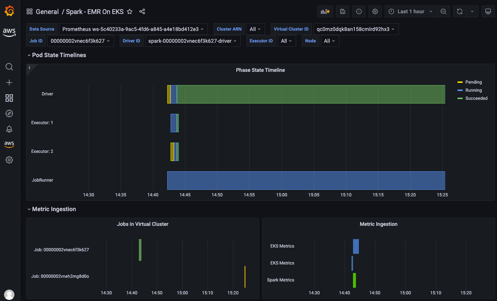

# EMR on EKS 관측성

## [Amazon Managed Prometheus 및 Amazon Managed Grafana로 Amazon EMR on EKS 모니터링](https://aws.amazon.com/blogs/mt/monitoring-amazon-emr-on-eks-with-amazon-managed-prometheus-and-amazon-managed-grafana/)

이 게시물에서는 Amazon Managed Service for Prometheus를 활용하여 Spark 애플리케이션에서 생성된 메트릭을 수집하고 저장하여 EMR on EKS Spark 워크로드에 대한 엔드투엔드 관측성을 구축하는 방법을 알아봅니다. 그런 다음 Amazon Managed Grafana를 사용하여 모니터링 사용 사례를 위한 대시보드를 구축합니다.

전체 블로그는 [여기](https://aws.amazon.com/blogs/mt/monitoring-amazon-emr-on-eks-with-amazon-managed-prometheus-and-amazon-managed-grafana/) 에서 확인하세요.

### 아키텍처
다음 다이어그램은 Spark 드라이버 및 익스큐터의 메트릭을 스크래핑하고 Amazon Managed Service for Prometheus에 쓰기 위한 솔루션 아키텍처를 보여줍니다.

### Spark용 Grafana 대시보드
다음 Grafana 대시보드는 드라이버 및 익스큐터 세부 정보가 포함된 EMR on EKS Spark 작업 메트릭을 표시합니다.

