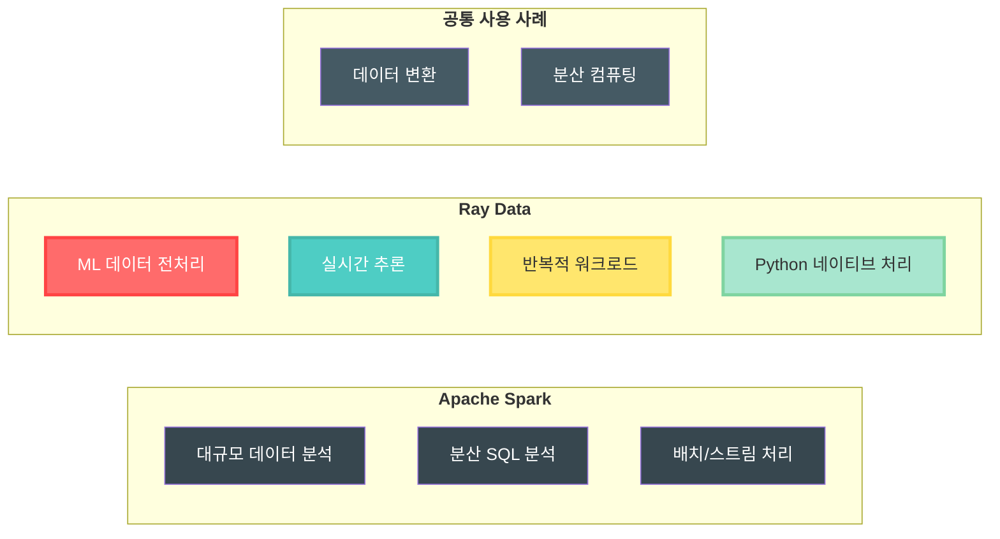
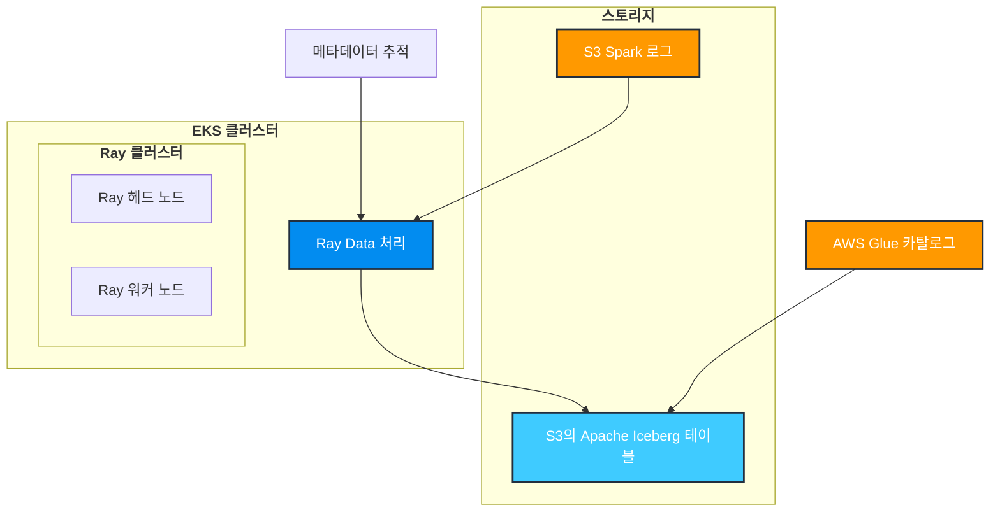

import Tabs from '@theme/Tabs';
import TabItem from '@theme/TabItem';
import CollapsibleContent from '@site/src/components/CollapsibleContent';

# Ray Data를 사용한 분산 데이터 처리

## Ray Data란?

[Ray Data](https://docs.ray.io/en/latest/data/data.html)는 분산 데이터 분석 및 머신 러닝 워크로드를 위해 설계된 Ray 기반의 확장 가능한 프레임워크 독립적 데이터 처리 라이브러리입니다. 다음을 제공합니다:

- **분산 처리(Distributed Processing)**: 여러 Ray 워커 노드에 걸친 병렬 데이터 처리
- **지연 평가(Lazy Evaluation)**: 작업은 결과가 필요할 때만 최적화되어 실행됩니다
- **풍부한 데이터 커넥터**: S3, 데이터베이스 및 파일 시스템을 포함한 다양한 데이터 소스에 대한 기본 지원
- **메모리 관리**: 메모리에 맞지 않는 대규모 데이터 세트의 효율적인 처리
- **ML 라이브러리와의 통합**: pandas, NumPy 및 PyArrow와의 원활한 통합

## Ray Data를 사용하는 이유는? Spark의 대안 도구인가요?

Ray Data는 직접적인 대체가 아닌 **Spark를 보완**합니다. 둘 다 분산 데이터 처리 프레임워크이지만 서로 다른 사용 사례를 제공합니다:



**Ray Data가 뛰어난 경우:**
- 익숙한 pandas/NumPy API를 사용한 Python 네이티브 데이터 처리
- 머신 러닝 파이프라인과의 긴밀한 통합
- 실시간 또는 스트리밍 데이터 처리
- 복잡한 반복 알고리즘

**Spark가 이상적인 경우:**
- 대규모 ETL 작업
- 복잡한 SQL 기반 분석
- 엔터프라이즈 데이터 웨어하우스 워크로드
- 다국어 지원 (Scala, Java, Python, R)

### 문제 정의

Apache Spark 애플리케이션이 Kubernetes에서 실행될 때 Fluent Bit에 의해 캡처되어 S3에 기록되는 광범위한 로그를 생성합니다. 그러나 이러한 로그는 데이터 엔지니어에게 여러 가지 과제를 제시합니다:

1. **비정형 형식**: Spark 로그는 일관된 스키마 없이 원시 텍스트 파일로 작성됩니다
2. **쿼리 기능 없음**: 엔지니어가 Amazon Athena와 같은 SQL 기반 도구를 사용하여 로그를 쉽게 쿼리할 수 없습니다
3. **메타데이터 보강**: Fluent Bit이 Kubernetes 메타데이터를 JSON으로 추가하여 혼합 형식을 생성합니다
4. **성능 문제**: 문제 해결을 위해 원시 로그 파일을 스캔하는 것은 시간이 많이 걸리고 비용이 많이 듭니다


**솔루션**: Ray Data를 사용하여 이러한 비정형 로그를 주기적으로 처리하고 일관된 스키마를 적용한 후 Apache Iceberg 테이블에 기록합니다. 이를 통해 다음이 가능합니다:
- Amazon Athena를 통한 SQL 쿼리
- 정의된 스키마가 있는 구조화된 데이터
- 효율적인 컬럼형 스토리지 형식
- 타임 트래블 및 버전 관리 기능

### 처리 전 S3의 로그 스니펫

Fluent Bit에 의해 S3에 기록된 Spark 로그의 모습은 다음과 같습니다:

```json
{
  "log": "2024-01-15 14:23:45 INFO SparkContext: Running Spark version 3.5.0\n",
  "stream": "stdout",
  "time": "2024-01-15T14:23:45.123456Z",
  "kubernetes": {
    "pod_name": "spark-driver-abc123",
    "namespace_name": "spark-team-a",
    "pod_id": "12345678-1234-1234-1234-123456789012",
    "labels": {
      "spark-role": "driver",
      "spark-app-id": "spark-application-12345"
    },
    "container_name": "spark-driver",
    "container_image": "spark:3.5.0"
  }
}
{
  "log": "2024-01-15 14:23:46 INFO ResourceUtils: Using Spark's default log4j profile\n",
  "stream": "stdout",
  "time": "2024-01-15T14:23:46.234567Z",
  "kubernetes": {
    "pod_name": "spark-driver-abc123",
    "namespace_name": "spark-team-a",
    "pod_id": "12345678-1234-1234-1234-123456789012",
    "labels": {
      "spark-role": "driver",
      "spark-app-id": "spark-application-12345"
    },
    "container_name": "spark-driver",
    "container_image": "spark:3.5.0"
  }
}
```

**주요 과제:**

- 각 로그 라인은 Kubernetes 메타데이터와 함께 JSON으로 래핑됩니다
- 실제 로그 메시지는 `log` 필드에 포함됩니다
- 특정 로그 레벨이나 컴포넌트를 쿼리하기 위한 구조화된 스키마가 없습니다
- 각 로그 라인에 대해 중복된 메타데이터가 반복됩니다

:::info Fluent Bit 보강
Fluent Bit은 pod 이름, 네임스페이스, 레이블 및 컨테이너 정보를 포함한 Kubernetes 메타데이터로 각 로그 라인을 자동으로 보강합니다. 이 보강은 [aws-for-fluentbit-values.yaml](https://github.com/awslabs/data-on-eks/blob/main/analytics/terraform/spark-k8s-operator/helm-values/aws-for-fluentbit-values.yaml) 파일에서 구성됩니다. 이 메타데이터는 디버깅에 유용하지만 효율적으로 쿼리하기 어려운 혼합 형식을 생성합니다.
:::

## 아키텍처 개요

### Ray Data가 로그 처리를 변환하는 방법

Ray Data는 주기적으로 S3에서 새 로그를 가져와 병렬로 처리하고 구조화된 데이터를 Apache Iceberg 테이블에 기록합니다. 솔루션에는 다음이 포함됩니다:



### Ray Data 처리의 주요 기능

#### **스키마 추출 및 파싱**

Ray Data는 비정형 로그에서 구조화된 필드를 지능적으로 추출합니다:

- **`timestamp`** - 로그 메시지에서 파싱됨
- **`log_level`** - 추출된 레벨 (INFO, WARN, ERROR, DEBUG)
- **`component`** - Spark 컴포넌트 (SparkContext, ResourceUtils 등)
- **`message`** - 실제 로그 내용
- **`pod_name`** & **`namespace`** - Kubernetes 메타데이터에서
- **`spark_role`** - 드라이버 또는 익스큐터 식별
- **`application_id`** - 고유한 Spark 애플리케이션 식별자

#### **지능형 필터링 및 쿼리**

처리 후 SQL을 사용하여 로그를 쉽게 쿼리할 수 있습니다:

```sql
-- 특정 애플리케이션의 모든 ERROR 로그 찾기
SELECT timestamp, component, message
FROM spark_logs
WHERE log_level = 'ERROR'
  AND application_id = 'spark-application-12345'
  AND timestamp > '2024-01-15 00:00:00'
ORDER BY timestamp DESC;

-- 컴포넌트별 로그 패턴 분석
SELECT component, log_level, COUNT(*) as count
FROM spark_logs
WHERE namespace = 'spark-team-a'
GROUP BY component, log_level
ORDER BY count DESC;

-- 애플리케이션 라이프사이클 이벤트 추적
SELECT timestamp, message
FROM spark_logs
WHERE component = 'SparkContext'
  AND (message LIKE '%Starting%' OR message LIKE '%Stopping%')
ORDER BY timestamp;
```

#### **메타데이터 관리**

- **멱등 처리(Idempotent Processing)** - 처리된 폴더를 추적하여 재처리 방지
- **메타데이터 테이블** - 처리 기록 및 상태 유지
- **자동 검색(Auto-Discovery)** - S3에서 새 로그 폴더를 자동으로 찾음
- **증분 업데이트** - 효율성을 위해 새 데이터만 처리


## 시작하기

### 사전 요구 사항

이 블루프린트를 배포하기 전에 다음이 있는지 확인하세요:

- **Spark 애플리케이션 로그가 있는 S3 버킷**: Spark 로그를 생성하려면 [Spark Operator 블루프린트](https://awslabs.github.io/data-on-eks/docs/blueprints/data-analytics/spark-operator-yunikorn) 를 따르세요.
  **참고:** S3 버킷을 Spark 애플리케이션 로그로 채우려면 **Execute Sample Spark job with Karpenter** 단계의 **Put sample data in S3** 섹션의 단계를 실행하세요.
- 적절한 권한으로 구성된 **AWS CLI**
- kubectl
- **Terraform** (>= 1.0) 설치됨

:::tip 먼저 Spark 로그 생성
Ray Data 파이프라인은 Spark 애플리케이션 로그를 처리합니다. S3 버킷을 로그로 채우려면 [Spark Operator 블루프린트](https://awslabs.github.io/data-on-eks/docs/blueprints/data-analytics/spark-operator-yunikorn#put-sample-data-in-s3) 의 taxi-trip 예제를 실행했는지 확인하세요.

**S3의 Spark 로그 파일 구조:**
```
s3://${S3_BUCKET}/
└── spark-application-logs/
    └── spark-team-a/
        ├── spark-application-1234567890-driver/
        │   └── stdout
        ├── spark-application-1234567890-exec-1/
        │   └── stdout
        └── spark-application-1234567890-exec-2/
            └── stdout
```

각 `stdout` 파일에는 Fluent Bit의 Kubernetes 메타데이터 보강이 포함된 JSON 형식의 로그가 있습니다.
:::

### 단계 1: Ray Data 처리 활성화

`enable_raydata` 변수를 활성화하여 Ray Data 컴포넌트가 포함된 EKS 클러스터를 배포합니다. 다음이 설치됩니다:
- **KubeRay Operator** - Kubernetes에서 Ray 클러스터 관리
- **Ray 커스텀 리소스** - RayJob 및 RayCluster CRD
- **AWS 리소스** - IAM 역할, S3 접근 정책 및 Glue 데이터베이스
- **Ray Data 파이프라인** - 네임스페이스, 서비스 계정 및 RBAC

<Tabs>
<TabItem value="terraform" label="Terraform 사용">

```bash
cd analytics/terraform/spark-k8s-operator

# Ray Data 지원이 활성화된 EKS 클러스터 배포
export TF_VAR_enable_raydata=true

terraform init
terraform plan
terraform apply -auto-approve
```

</TabItem>
<TabItem value="install-script" label="설치 스크립트 사용">

```bash
cd analytics/terraform/spark-k8s-operator

# 환경 변수 설정 및 설치 스크립트 실행
export TF_VAR_enable_raydata=true

./install.sh
```

</TabItem>
</Tabs>

:::info 배포 시간
전체 배포는 EKS 클러스터를 생성하고 오퍼레이터를 설치하며 모든 Ray Data 컴포넌트를 구성하는 데 약 20-25분이 소요됩니다.
:::

이 배포는 다음을 생성합니다:
- Ray 작업 오케스트레이션을 위한 **KubeRay Operator**
- IRSA(서비스 계정용 IAM 역할)가 있는 **Ray 서비스 계정**
- S3 및 Glue 권한이 있는 **IAM 역할**
- Iceberg 카탈로그용 **AWS Glue 데이터베이스**
- **Kubernetes 네임스페이스** (`raydata`)

### 단계 2: KubeRay Operator 설치 확인

KubeRay Operator가 성공적으로 실행되고 있는지 확인합니다:

```bash
kubectl get po -n kuberay-operator
```

예상 출력:
```
NAME                                READY   STATUS    RESTARTS   AGE
kuberay-operator-74fcdcc6bf-gpl5p   1/1     Running   0          10h
```

### 단계 3: Ray Job 구성

예제 디렉토리로 이동하여 배포 스크립트에서 S3 구성을 업데이트합니다.

```bash
cd examples/raydata-sparklogs-processing-job
```

실행하기 전에 `execute-rayjob.sh` 셸 스크립트에서 **S3_BUCKET**, **CLUSTER_NAME** 및 **AWS_REGION** 변수를 교체합니다.

### 단계 4: Ray 클러스터 배포 및 Ray Job 실행

```bash
# 스크립트 실행 가능하게 만들기
chmod +x execute-rayjob.sh

# 처리 작업 배포
./execute-rayjob.sh deploy
```

## RayJob 배포 모니터링

### 작업 상태 확인

다음 명령으로 Ray 작업을 모니터링합니다:

```bash
# 실시간으로 작업 진행 상황 모니터링
./execute-rayjob.sh monitor

# 현재 상태 확인
./execute-rayjob.sh status

# 처리 로그 보기
./execute-rayjob.sh logs

```

#### RayJob 로그 확인

```text
2025-07-27 22:04:46,324 - spark-log-processor - INFO - Successfully processed 1287 records from spark-fb094270bf654473b372d0f773e86687
2025-07-27 22:04:46,324 - spark-log-processor - INFO - Processing Summary:
2025-07-27 22:04:46,324 - spark-log-processor - INFO -   Total records processed: 1287
2025-07-27 22:04:46,324 - spark-log-processor - INFO -   Successful folders: 1
2025-07-27 22:04:46,324 - spark-log-processor - INFO -   Failed folders: 0
2025-07-27 22:04:46,324 - spark-log-processor - INFO -   Successfully processed: ['spark-fb094270bf654473b372d0f773e86687']
2025-07-27 22:04:46,324 - spark-log-processor - INFO - Metadata-driven incremental processing completed
```

:::tip 백그라운드에서 무슨 일이 일어나고 있나요?

RayJob을 배포하면 다음과 같은 자동화된 프로세스가 발생합니다:

1. **Ray 클러스터 초기화** - KubeRay Operator가 헤드 및 워커 노드가 있는 Ray 클러스터를 생성합니다
2. **S3 검색** - Ray Data가 `spark-*` 패턴과 일치하는 폴더를 위해 구성된 S3 버킷 경로를 스캔합니다
3. **메타데이터 확인** - Iceberg 메타데이터 테이블을 쿼리하여 처리되지 않은 폴더를 식별합니다
4. **병렬 처리** - Ray 워커가 S3에서 JSON 로그 파일을 병렬로 읽습니다
5. **데이터 변환** - JSON 로그에서 구조화된 필드를 추출합니다 (timestamp, log level, component 등)
6. **Iceberg 쓰기** - ACID 보장과 함께 변환된 데이터를 Apache Iceberg 테이블에 기록합니다
7. **메타데이터 업데이트** - 멱등성을 위해 메타데이터 테이블에 처리 상태를 기록합니다
8. **완료** - 성공적인 처리 후 Ray 클러스터를 종료합니다

전체 프로세스는 **멱등**입니다 - 새 로그 폴더만 처리하므로 데이터를 복제하지 않고 안전하게 다시 실행할 수 있습니다.
:::

### Ray 대시보드 접근

<CollapsibleContent header={<h3>Ray 대시보드 접근</h3>}>

```bash
# 대시보드 접근 정보 가져오기
./execute-rayjob.sh dashboard

# 로컬 머신으로 포트 포워드
kubectl port-forward svc/spark-log-processor-head-svc 8265:8265 -n raydata
```

[http://localhost:8265](http://localhost:8265) 를 열어 다음을 확인합니다:
- 작업 실행 진행 상황
- 리소스 활용도
- 태스크 수준 메트릭
- 클러스터 토폴로지

</CollapsibleContent>

## 데이터 검증

### S3 버킷 구조

Ray Data는 입력 Spark 로그와 출력 Iceberg 데이터 모두에 **동일한 S3 버킷**을 사용하며 별도의 경로로 구성됩니다:

```
s3://your-spark-logs-bucket/
├── spark-application-logs/           # 입력: Fluent Bit의 원시 Spark 로그
│   └── spark-team-a/
│       ├── spark-application-1234567890-driver/
│       │   └── stdout                # Kubernetes 메타데이터가 있는 JSON 로그
│       ├── spark-application-1234567890-exec-1/
│       │   └── stdout
│       └── spark-application-1234567890-exec-2/
│           └── stdout
│
└── iceberg-warehouse/                # 출력: 처리된 Iceberg 데이터
    └── raydata_spark_logs.db/
        └── spark_logs/
            ├── metadata/             # Iceberg 메타데이터 파일
            │   ├── 00000-xxx.metadata.json
            │   ├── snap-xxx.avro     # 타임 트래블용 스냅샷
            │   └── version-hint.text
            └── data/                 # Parquet 형식의 실제 데이터
                ├── 00000-0-xxx.parquet
                ├── 00001-0-xxx.parquet
                └── ...
```

:::tip 동일한 버킷, 다른 경로
- **입력 경로**: `s3://bucket/spark-application-logs/` - 원시 JSON 로그 포함
- **출력 경로**: `s3://bucket/iceberg-warehouse/` - 구조화된 Parquet 파일 포함
- **스토리지 형식**: Iceberg는 ACID 트랜잭션을 위한 메타데이터와 함께 효율적인 컬럼형 Parquet 형식을 사용합니다
:::

AWS S3 콘솔에서는 아래와 같이 보입니다:


### RayData 처리 후 로그 스니펫

Ray Data 처리 전후의 데이터 변환 모습은 다음과 같습니다:

<Tabs>
<TabItem value="before" label="처리 전 (원시 S3 JSON)">

**S3의 원시 Fluent Bit 로그** - 각 로그 라인이 중복 메타데이터와 함께 JSON으로 래핑됩니다:

```json
{
  "log": "2024-01-15 14:23:45 INFO SparkContext: Running Spark version 3.5.0\n",
  "stream": "stdout",
  "time": "2024-01-15T14:23:45.123456Z",
  "kubernetes": {
    "pod_name": "spark-driver-abc123",
    "namespace_name": "spark-team-a",
    "pod_id": "12345678-1234-1234-1234-123456789012",
    "labels": {
      "spark-role": "driver",
      "spark-app-id": "spark-application-12345"
    },
    "container_name": "spark-driver",
    "container_image": "spark:3.5.0"
  }
}
{
  "log": "2024-01-15 14:23:46 ERROR TaskSchedulerImpl: Lost executor 1: Container killed\n",
  "stream": "stderr",
  "time": "2024-01-15T14:23:46.234567Z",
  "kubernetes": {
    "pod_name": "spark-executor-def456",
    "namespace_name": "spark-team-a",
    "labels": {
      "spark-role": "executor",
      "spark-app-id": "spark-application-12345"
    }
  }
}
```

</TabItem>
<TabItem value="after" label="처리 후 (구조화된 Iceberg)">

**Apache Iceberg의 처리된 데이터** - 쿼리에 최적화된 깨끗하고 구조화된 스키마:

```sql
-- 처리된 데이터 쿼리
SELECT * FROM raydata_spark_logs.spark_logs LIMIT 2;
```

| timestamp | log_level | component | message | pod_name | namespace | spark_role | application_id |
|-----------|-----------|-----------|---------|----------|-----------|------------|----------------|
| 2024-01-15 14:23:45 | INFO | SparkContext | Running Spark version 3.5.0 | spark-driver-abc123 | spark-team-a | driver | spark-application-12345 |
| 2024-01-15 14:23:46 | ERROR | TaskSchedulerImpl | Lost executor 1: Container killed | spark-executor-def456 | spark-team-a | executor | spark-application-12345 |

**주요 개선 사항:**
- **구조화된 필드** - 특정 로그 레벨, 컴포넌트 및 시간 범위를 쉽게 쿼리
- **중복 제거된 메타데이터** - 로그 라인당 중복 Kubernetes 메타데이터 없음
- **컬럼형 스토리지** - Parquet 형식으로 효율적인 스토리지 및 쿼리 성능
- **스키마 진화** - 기존 쿼리를 중단하지 않고 새 필드 추가
- **ACID 트랜잭션** - 동시 처리 중에도 일관된 읽기

</TabItem>
</Tabs>

### 옵션 1: Iceberg 테이블 쿼리

Python 가상 환경과 필요한 모든 종속성을 자동으로 설정하는 블루프린트에서 제공하는 내장 데이터 검증 스크립트를 사용합니다.

```bash
# 스크립트 실행 가능하게 만들기
chmod +x verify-iceberg-data.sh
```
실행하기 전에 `verify-iceberg-data.sh` 셸 스크립트에서 **S3_BUCKET** 및 **AWS_REGION** 변수를 교체합니다.

```bash
./verify-iceberg-data.sh
```

스크립트는 자동으로...
- 격리된 Python 가상 환경 생성
- PyIceberg 및 모든 종속성 설치 (`pyiceberg[glue,s3fs]==0.7.0`)
- AWS Glue 카탈로그 및 Iceberg 테이블에 연결
- 포괄적인 데이터 검증 수행
- 완료 후 임시 파일 및 환경 정리

<CollapsibleContent header={<h4>샘플 스크립트 출력</h4>}>

```text
Connecting to Iceberg catalog...
Connected to Iceberg catalog in region: us-west-2
Loading table: raydata_spark_logs.spark_logs
Table loaded successfully

Table Schema:
  - timestamp: timestamp (optional)
  - log_level: string (optional)
  - message: string (optional)
  - pod_name: string (optional)
  - namespace_name: string (optional)
  - app: string (optional)
  - spark_app_selector: string (optional)
  - queue: string (optional)
  - spark_app_name: string (optional)
  - spark_role: string (optional)
  - spark_version: string (optional)
  - submission_id: string (optional)
  - container_name: string (optional)
  - container_image: string (optional)

Scanning table data...
SUCCESS! Found 1287 records in Iceberg table

Data Summary:
   Total Records: 1287
   Date Range: 2025-07-08 19:52:43.079161 to 2025-07-08 20:00:29.393901
   Unique Pods: 5

Log Level Distribution:
   INFO: 1269
   WARN: 14
   ERROR: 4

Sample Records:

  Record 1:
    timestamp: 2025-07-08 19:52:43.079161
    log_level: WARN
    message: Unable to load native-hadoop library for your platform... using builtin-java classes where applicabl...

  Record 2:
    timestamp: 2025-07-08 19:52:43.460063
    log_level: WARN
    message: Cannot locate configuration: tried hadoop-metrics2-s3a-file-system.properties,hadoop-metrics2.proper...

  Record 3:
    timestamp: 2025-07-08 19:52:46.170113
    log_level: INFO
    message: Running Spark version 3.5.3

VERIFICATION SUCCESSFUL!
Ray Data successfully processed and stored Spark logs in Iceberg format
Data is accessible and queryable via PyIceberg
You can now query this data using Amazon Athena or other SQL tools
[SUCCESS] Verification completed successfully!
==== Cleaning Up ====
[INFO] Removed verification script
[INFO] Removed virtual environment
[SUCCESS] Cleanup completed
```

</CollapsibleContent>


### 옵션 2: AWS CLI 사용

데이터를 쿼리하지 않고 테이블 메타데이터를 확인합니다:

```bash
# Glue 카탈로그에서 Iceberg 테이블 보기
aws glue get-table \
  --database-name raydata_spark_logs \
  --name spark_logs \
  --query 'Table.StorageDescriptor.Location'
```

## 정리

리소스를 정리하려면:

```bash
# Ray 작업만 제거 (인프라 유지)
./execute-rayjob.sh cleanup

# 모든 인프라 제거
cd analytics/terraform/spark-k8s-operator
terraform destroy -var="enable_raydata_processing=true"
```

## 데이터 파이프라인 확장

- **처리 확장**: 더 큰 워크로드를 위해 `rayjob.yaml`에서 Ray 워커 수를 조정합니다
- **분석 추가**: Amazon QuickSight 또는 Grafana를 사용하여 대시보드를 생성합니다
- **자동화**: Kubernetes CronJobs로 정기적인 처리를 예약합니다
- **확장**: 메트릭, 이벤트 또는 애플리케이션 데이터와 같은 다른 데이터 유형을 처리합니다

:::info 자세히 알아보기
- [Ray Data 문서](https://docs.ray.io/en/latest/data/data.html)
- [Apache Iceberg 문서](https://iceberg.apache.org/)
- [KubeRay 문서](https://ray-project.github.io/kuberay/)
- [AWS Glue 카탈로그](https://docs.aws.amazon.com/glue/latest/dg/catalog-and-crawler.html)
:::

이 블루프린트는 Ray Data와 Apache Iceberg가 함께 작동하여 Amazon EKS에서 확장 가능하고 안정적인 데이터 처리 파이프라인을 구축하는 방법을 보여줍니다. 이 조합은 분산 처리 기능, ACID 트랜잭션 및 지능형 메타데이터 관리를 갖춘 현대적인 데이터 레이크 아키텍처를 제공합니다.

<style>{`
.feature-grid {
  display: grid;
  grid-template-columns: repeat(auto-fit, minmax(250px, 1fr));
  gap: 1.5rem;
  margin: 2rem 0;
}

.feature-card {
  padding: 1.5rem;
  border: 1px solid var(--ifm-color-emphasis-300);
  border-radius: 8px;
  background: var(--ifm-background-surface-color);
  transition: transform 0.2s, box-shadow 0.2s;
}

.feature-card:hover {
  transform: translateY(-2px);
  box-shadow: 0 4px 12px rgba(0, 0, 0, 0.1);
}

.feature-card h3 {
  margin-top: 0;
  margin-bottom: 0.5rem;
  font-size: 1.2rem;
}

.feature-card p {
  margin: 0;
  color: var(--ifm-color-content-secondary);
}
`}</style>
