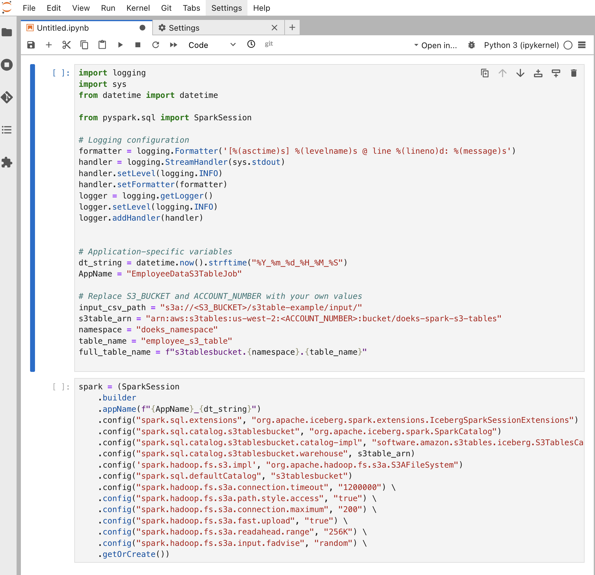

import Tabs from '@theme/Tabs';
import TabItem from '@theme/TabItem';
import CollapsibleContent from '@site/src/components/CollapsibleContent';

import TaxiTripExecute from './_taxi_trip_exec.md'
import ReplaceS3BucketPlaceholders from './_replace_s3_bucket_placeholders.mdx';

import CodeBlock from '@theme/CodeBlock';

# Amazon EKS에서 S3 Tables


## S3 Tables란?

Amazon S3 Tables는 대규모 분석 워크로드를 위해 성능 최적화, 보안 단순화 및 비용 효율적인 스토리지를 제공하도록 특별히 설계된 완전 관리형 테이블형 데이터 저장소입니다. Amazon EMR, Amazon Athena, Amazon Redshift, AWS Glue 및 AWS Lake Formation과 같은 서비스와 직접 통합되어 분석 및 머신 러닝 워크로드를 실행하기 위한 원활한 경험을 제공합니다.

## Amazon EKS에서 S3 Tables를 실행하는 이유는?

Spark 워크로드를 위해 Amazon EKS를 채택하고 Iceberg와 같은 테이블 형식을 사용하는 사용자에게 S3 Tables를 활용하면 성능, 비용 효율성 및 보안 제어 측면에서 이점을 제공합니다. 이 통합을 통해 조직은 Kubernetes 네이티브 기능과 S3 Tables의 기능을 결합하여 기존 환경 내에서 쿼리 성능과 리소스 스케일링을 잠재적으로 개선할 수 있습니다. 이 문서에 자세히 설명된 단계를 따르면 사용자는 S3 Tables를 EKS 설정에 원활하게 통합하여 분석 워크로드를 위한 유연하고 보완적인 솔루션을 제공할 수 있습니다.

## S3 Tables와 Iceberg 테이블 형식의 차이점

S3 Tables는 Apache Iceberg를 기본 구현으로 사용하지만 AWS 고객을 위해 특별히 설계된 향상된 기능을 제공합니다:

- **자동 압축(Automatic Compaction)**: S3 Tables는 작은 파일을 더 크고 효율적인 파일로 결합하여 백그라운드에서 데이터 스토리지를 지능적으로 최적화하는 자동 압축을 구현합니다. 이 프로세스는 스토리지 비용을 줄이고 쿼리 속도를 향상시키며 수동 개입 없이 지속적으로 작동합니다.

- **테이블 유지 관리**: 스냅샷 관리 및 참조되지 않은 파일 제거와 같은 중요한 유지 관리 작업을 제공합니다. 이 지속적인 최적화는 수동 개입 없이 테이블이 성능을 유지하고 비용 효율적으로 유지되도록 하여 운영 오버헤드를 줄이고 팀이 데이터 인사이트에 집중할 수 있게 합니다.

- **Apache Iceberg 지원**: Apache Iceberg에 대한 내장 지원을 제공하여 쿼리 성능을 개선하고 비용을 줄이면서 대규모 데이터 레이크 관리를 단순화합니다. 다음과 같은 결과를 경험하려면 데이터 레이크에 S3 Tables를 사용하는 것을 고려하세요.

- **단순화된 보안**: S3 Tables는 테이블을 AWS 리소스로 취급하여 테이블 수준에서 세분화된 AWS Identity and Access Management (IAM) 권한을 사용할 수 있게 합니다. 이를 통해 데이터 거버넌스를 단순화하고 보안을 강화하며 익숙한 AWS 서비스로 액세스 제어를 더 직관적이고 관리하기 쉽게 만듭니다.

- **향상된 성능**: Amazon S3 Tables는 Apache Iceberg 테이블을 저장하기 위해 특별히 설계된 새로운 유형의 버킷을 도입합니다. 테이블 버킷은 범용 S3 버킷에 Iceberg 테이블을 저장하는 것과 비교하여 최대 3배 더 빠른 쿼리 성능과 최대 10배 더 높은 초당 트랜잭션을 제공합니다. 이 성능 향상은 고빈도 업데이트, 실시간 수집 및 더 까다로운 워크로드를 지원하여 데이터 볼륨이 증가함에 따라 확장성과 응답성을 보장합니다.

- **AWS 서비스와의 통합**: S3 Tables는 Athena, Redshift, EMR 및 Glue와 같은 AWS 분석 서비스와 긴밀하게 통합되어 분석 워크로드에 대한 네이티브 지원을 제공합니다.


<CollapsibleContent header={<h2><span>솔루션 배포</span></h2>}>

이 [예제](https://github.com/awslabs/data-on-eks/tree/main/analytics/terraform/spark-k8s-operator)에서는 오픈 소스 Spark Operator 및 Apache YuniKorn으로 Spark 작업을 실행하는 데 필요한 다음 리소스를 프로비저닝합니다.

이 예제는 새 VPC에 Spark K8s Operator를 실행하는 EKS 클러스터를 배포합니다.

- 새 샘플 VPC, 2개의 프라이빗 서브넷, 2개의 퍼블릭 서브넷 및 EKS 파드용 RFC6598 공간(100.64.0.0/10)에 2개의 서브넷을 생성합니다.
- 퍼블릭 서브넷용 인터넷 게이트웨이와 프라이빗 서브넷용 NAT 게이트웨이를 생성합니다.
- 퍼블릭 엔드포인트(데모 목적으로만)가 있는 EKS 클러스터 컨트롤 플레인을 생성하고 벤치마킹 및 코어 서비스용 관리형 노드 그룹과 Spark 워크로드용 Karpenter NodePool을 생성합니다.
- Metrics 서버, Spark-operator, Apache Yunikorn, Karpenter, Grafana 및 Prometheus 서버를 배포합니다.

### 사전 요구 사항

머신에 다음 도구가 설치되어 있는지 확인하세요.

1. [aws cli](https://docs.aws.amazon.com/cli/latest/userguide/install-cliv2.html)
2. [kubectl](https://Kubernetes.io/docs/tasks/tools/)
3. [terraform](https://learn.hashicorp.com/tutorials/terraform/install-cli)

### 배포

저장소를 복제합니다.

```bash
git clone https://github.com/awslabs/data-on-eks.git
cd data-on-eks
export DOEKS_HOME=$(pwd)
```

DOEKS_HOME이 설정 해제된 경우 data-on-eks 디렉토리에서 `export DATA_ON_EKS=$(pwd)`를 사용하여 항상 수동으로 설정할 수 있습니다.

예제 디렉토리 중 하나로 이동하여 `install.sh` 스크립트를 실행합니다.

```bash
cd ${DOEKS_HOME}/analytics/terraform/spark-k8s-operator
chmod +x install.sh
./install.sh
```

이제 설치 중에 생성된 버킷 이름을 보유하는 `S3_BUCKET` 변수를 만듭니다. 이 버킷은 이후 예제에서 출력 데이터를 저장하는 데 사용됩니다. S3_BUCKET이 설정 해제된 경우 다음 명령을 다시 실행할 수 있습니다.

```bash
export S3_BUCKET=$(terraform output -raw s3_bucket_id_spark_history_server)
echo $S3_BUCKET
```

</CollapsibleContent>

## 샘플 Spark 작업 실행

### 단계 1: S3 Tables 호환 Apache Spark Docker 이미지 생성

S3 Tables 통신에 필요한 jar가 포함된 Docker 이미지를 만듭니다.

- 샘플 [Dockerfile](https://github.com/awslabs/data-on-eks/blob/main/analytics/terraform/spark-k8s-operator/examples/s3-tables/Dockerfile-S3Table)을 검토합니다
- Iceberg, AWS SDK 번들 및 Iceberg 런타임용 S3 Tables 카탈로그를 포함한 S3 Tables 상호 작용을 위한 [주요 jar 파일](https://github.com/awslabs/data-on-eks/blob/e3f1a6b08d719fc69f61d18b57cd5ad09cb01bd5/analytics/terraform/spark-k8s-operator/examples/s3-tables/Dockerfile-S3Table#L43C1-L48C1)을 참고합니다
- 환경에 맞게 Dockerfile을 커스터마이즈합니다
- Docker 이미지를 빌드하고 선호하는 컨테이너 레지스트리에 푸시합니다

데모 목적으로만 Docker 이미지를 생성하고 ECR에 게시했습니다.

### 단계 2: 작업용 테스트 데이터 생성

예제 디렉토리로 이동하고 이 [셸](https://github.com/awslabs/data-on-eks/blob/main/analytics/terraform/spark-k8s-operator/examples/s3-tables/input-data-gen.sh) 스크립트를 사용하여 Spark 작업 입력용 샘플 직원 데이터를 생성합니다.

```sh
cd analytics/terraform/spark-k8s-operator/examples/s3-tables
./input-data-gen.sh
```

이 스크립트는 현재 디렉토리에 `employee_data.csv`라는 파일을 생성합니다. 기본적으로 100개의 레코드를 생성합니다.

참고: 레코드 수를 조정해야 하는 경우 input-data-gen.sh 스크립트를 수정할 수 있습니다. 데이터를 생성하는 루프를 찾아 필요에 따라 반복 횟수를 변경하세요.

### 단계 3: Amazon S3 버킷에 테스트 입력 데이터 업로드

`<YOUR_S3_BUCKET>`을 블루프린트에서 생성한 S3 버킷 이름으로 바꾸고 아래 명령을 실행합니다.

```bash
aws s3 cp employee_data.csv s3://<S3_BUCKET>/s3table-example/input/
```

이 명령은 CSV 파일을 S3 버킷에 업로드합니다. Spark 작업은 나중에 이 경로를 참조하여 입력 데이터를 읽습니다. 명령을 실행하기 전에 이 버킷에 쓸 수 있는 필요한 권한이 있는지 확인하세요.

### 단계 4: S3 버킷에 PySpark 스크립트 업로드

다음 스크립트는 S3 Tables와 작동하는 데 필요한 Spark 구성을 볼 수 있는 [Spark 작업](https://github.com/awslabs/data-on-eks/blob/main/analytics/terraform/spark-k8s-operator/examples/s3-tables/s3table-iceberg-pyspark.py)의 일부입니다.

```python
def main(args):
    if len(args) != 3:
        logger.error("Usage: spark-etl [input-csv-path] [s3table-arn]")
        sys.exit(1)

    # Input parameters
    input_csv_path = args[1]    # Path to the input CSV file
    s3table_arn = args[2]       # s3table arn

    # Initialize Spark session
    logger.info("Initializing Spark Session")
    spark = (SparkSession
             .builder
             .appName(f"{AppName}_{dt_string}")
             .config("spark.sql.extensions", "org.apache.iceberg.spark.extensions.IcebergSparkSessionExtensions")
             .config("spark.sql.catalog.s3tablesbucket", "org.apache.iceberg.spark.SparkCatalog")
             .config("spark.sql.catalog.s3tablesbucket.catalog-impl", "software.amazon.s3tables.iceberg.S3TablesCatalog")
             .config("spark.sql.catalog.s3tablesbucket.warehouse", s3table_arn)
             .config('spark.hadoop.fs.s3.impl', "org.apache.hadoop.fs.s3a.S3AFileSystem")
             .config("spark.sql.defaultCatalog", "s3tablesbucket")
             .getOrCreate())

    spark.sparkContext.setLogLevel("INFO")
    logger.info("Spark session initialized successfully")

    namespace = "doeks_namespace"
    table_name = "employee_s3_table"
    full_table_name = f"s3tablesbucket.{namespace}.{table_name}"

...

```

`S3_BUCKET`을 블루프린트에서 생성한 S3 버킷 이름으로 바꾸고 아래 명령을 실행하여 샘플 [Spark 작업](https://github.com/awslabs/data-on-eks/blob/main/analytics/terraform/spark-k8s-operator/examples/s3-tables/s3table-iceberg-pyspark.py)을 S3 버킷에 업로드합니다.

```bash
aws s3 cp s3table-iceberg-pyspark.py s3://<S3_BUCKET>/s3table-example/scripts/
```

예제 디렉토리로 이동하여 Spark 작업을 제출합니다.

### 단계 5: Amazon S3 테이블 버킷 생성

PySpark 작업이 나중에 액세스할 S3 Tables에 사용할 S3 테이블 버킷을 생성하는 주요 단계입니다.

`<S3TABLE_BUCKET_NAME>`을 원하는 버킷 이름으로 바꿉니다. `<REGION>`을 AWS 리전으로 바꿉니다.


```bash
aws s3tables create-table-bucket \
    --region "<REGION>" \
    --name "<S3TABLE_BUCKET_NAME>"
```

이 명령으로 생성된 S3TABLE BUCKET ARN을 기록해 두세요. AWS 콘솔에서 S3 테이블 버킷 ARN을 확인하세요.


### 단계 6: Spark Operator YAML 파일 업데이트

Spark Operator YAML 파일을 다음과 같이 업데이트합니다:

- 선호하는 텍스트 편집기에서 [s3table-spark-operator.yaml](https://github.com/awslabs/data-on-eks/blob/main/analytics/terraform/spark-k8s-operator/examples/s3-tables/s3table-spark-operator.yaml) 파일을 엽니다.
- `<S3_BUCKET>`을 이 블루프린트에서 생성한 S3 버킷으로 바꿉니다(Terraform 출력 확인). S3 버킷은 위 단계에서 테스트 데이터와 샘플 Spark 작업을 복사한 위치입니다.
- `<S3TABLE_BUCKET_ARN>`을 이전 단계에서 캡처한 S3 테이블 버킷 ARN으로 바꿉니다.

아래에서 Spark Operator 작업 구성의 일부를 볼 수 있습니다.


```yaml
---
apiVersion: "sparkoperator.k8s.io/v1beta2"
kind: SparkApplication
metadata:
  name: "s3table-example"
  namespace: spark-team-a
  labels:
    app: "s3table-example"
    applicationId: "s3table-example-nvme"
spec:
  type: Python
  sparkVersion: "3.5.3"
  mode: cluster
  # CAUTION: Unsupported test image
  # This image is created solely for testing and reference purposes.
  # Before use, please:
  # 1. Review the Dockerfile used to create this image
  # 2. Create your own image that meets your organization's security requirements
  image: "public.ecr.aws/data-on-eks/spark:3.5.3-scala2.12-java17-python3-ubuntu-s3table0.1.3-iceberg1.6.1"
  imagePullPolicy: IfNotPresent
  mainApplicationFile: "s3a://<S3_BUCKET>/s3table-example/scripts/s3table-iceberg-pyspark.py"
  arguments:
    - "s3a://<S3_BUCKET>/s3table-example/input/"
    - "<S3TABLE_BUCKET_ARN>"
  sparkConf:
    "spark.app.name": "s3table-example"
    "spark.kubernetes.driver.pod.name": "s3table-example"
    "spark.kubernetes.executor.podNamePrefix": "s3table-example"
    "spark.local.dir": "/data"
    "spark.speculation": "false"
    "spark.network.timeout": "2400"
    "spark.hadoop.fs.s3a.connection.timeout": "1200000"
    "spark.hadoop.fs.s3a.path.style.access": "true"
    "spark.hadoop.fs.s3a.connection.maximum": "200"
    "spark.hadoop.fs.s3a.fast.upload": "true"
    "spark.hadoop.fs.s3a.readahead.range": "256K"
    "spark.hadoop.fs.s3a.input.fadvise": "random"
    "spark.hadoop.fs.s3a.aws.credentials.provider.mapping": "com.amazonaws.auth.WebIdentityTokenCredentialsProvider=software.amazon.awssdk.auth.credentials.WebIdentityTokenFileCredentialsProvider"
    "spark.hadoop.fs.s3a.aws.credentials.provider": "software.amazon.awssdk.auth.credentials.WebIdentityTokenFileCredentialsProvider"  # AWS SDK V2 https://hadoop.apache.org/docs/stable/hadoop-aws/tools/hadoop-aws/aws_sdk_upgrade.html
...

```

### 단계 7: Spark 작업 실행

업데이트된 YAML 구성 파일을 Kubernetes 클러스터에 적용하여 Spark 작업을 제출하고 실행합니다:

```bash
cd ${DOEKS_HOME}/analytics/terraform/spark-k8s-operator/examples/s3-tables
kubectl apply -f s3table-spark-operator.yaml
```

그러면 EKS 클러스터에 Spark 작업이 예약됩니다. Spark Operator가 Kubernetes API 서버에 작업 제출을 처리합니다.

Kubernetes는 Spark 드라이버 및 익스큐터 파드를 별도의 워커 노드에서 실행하도록 예약합니다. Karpenter는 Terraform 스크립트의 NodePool 구성에 따라 필요한 경우 새 노드를 자동으로 프로비저닝합니다.

Spark 드라이버 파드의 로그를 모니터링하여 작업 진행 상황을 추적합니다. 파드는 기본적으로 `c5d` 인스턴스를 사용하지만 필요한 경우 YAML 및 Karpenter NodePool을 수정하여 다른 EC2 인스턴스 유형을 사용할 수 있습니다.

### 단계 8: Spark 드라이버 로그에서 출력 확인

spark-team-a 네임스페이스에서 실행 중인 파드를 나열합니다:

```bash
kubectl get pods -n spark-team-a
```

드라이버 로그를 확인하여 Spark 작업의 전체 출력을 봅니다. 작업은 S3 버킷에서 CSV 데이터를 읽고 Iceberg 형식을 사용하여 S3 Tables 버킷에 다시 씁니다. 또한 처리된 레코드 수를 세고 처음 10개의 레코드를 표시합니다:

```bash
kubectl logs <spark-driver-pod-name> -n spark-team-a
```

작업이 성공적으로 완료되면 Spark 드라이버 파드가 `Succeeded` 상태로 전환되고 로그에 아래와 같은 출력이 표시됩니다.

```text
...
[2025-01-07 22:07:44,185] INFO @ line 59: Previewing employee data schema
root
 |-- id: integer (nullable = true)
 |-- name: string (nullable = true)
 |-- level: string (nullable = true)
 |-- salary: double (nullable = true)

....

25/01/07 22:07:44 INFO CodeGenerator: Code generated in 10.594982 ms
+---+-----------+------+--------+
|id |name       |level |salary  |
+---+-----------+------+--------+
|1  |Employee_1 |Mid   |134000.0|
|2  |Employee_2 |Senior|162500.0|
|3  |Employee_3 |Senior|174500.0|
|4  |Employee_4 |Exec  |69500.0 |
|5  |Employee_5 |Senior|54500.0 |
|6  |Employee_6 |Mid   |164000.0|
|7  |Employee_7 |Junior|119000.0|
|8  |Employee_8 |Senior|54500.0 |
|9  |Employee_9 |Senior|57500.0 |
|10 |Employee_10|Mid   |152000.0|
+---+-----------+------+--------+
only showing top 10 rows

....
```

작업이 성공하면 아래 이미지와 같이 새 테이블과 네임스페이스가 표시됩니다.


다음 명령은 S3 Tables에 대한 추가 정보를 표시합니다.

### S3Table API를 사용하여 S3Table 확인

S3Table API를 사용하여 테이블이 성공적으로 생성되었는지 확인합니다. `<ACCOUNT_ID>`만 바꾸고 명령을 실행합니다.

```bash
aws s3tables get-table --table-bucket-arn arn:aws:s3tables:<REGION>:<ACCOUNT_ID>:bucket/doeks-spark-on-eks-s3table \
--namespace doeks_namespace \
--name employee_s3_table
```

출력은 아래와 같습니다:

```text
Output looks like below.

{
    "name": "employee_s3_table",
    "type": "customer",
    "tableARN": "arn:aws:s3tables:us-west-2:<ACCOUNT_ID>:bucket/doeks-spark-on-eks-s3table/table/55511111-7a03-4513-b921-e372b0030daf",
    "namespace": [
        "doeks_namespace"
    ],
    "versionToken": "aafc39ddd462690d2a0c",
    "metadataLocation": "s3://55511111-7a03-4513-asdfsafdsfdsf--table-s3/metadata/00004-62cc4be3-59b5-4647-a78d-1cdf69ec5ed8.metadata.json",
    "warehouseLocation": "s3://55511111-7a03-4513-asdfsafdsfdsf--table-s3",
    "createdAt": "2025-01-07T22:14:48.689581+00:00",
    "createdBy": "<ACCOUNT_ID>",
    "modifiedAt": "2025-01-09T00:06:09.222917+00:00",
    "ownerAccountId": "<ACCOUNT_ID>",
    "format": "ICEBERG"
}
```

### 테이블 유지 관리 작업 상태 모니터링:

```bash
aws s3tables get-table-maintenance-job-status --table-bucket-arn arn:aws:s3tables:us-west-2:"\<ACCOUNT_ID>:bucket/doeks-spark-on-eks-s3table --namespace doeks_namespace --name employee_s3_table
```

이 명령은 Iceberg 압축, 스냅샷 관리 및 참조되지 않은 파일 제거 프로세스에 대한 정보를 제공합니다.

```json
{
    "tableARN": "arn:aws:s3tables:us-west-2:<ACCOUNT_ID>:bucket/doeks-spark-on-eks-s3table/table/55511111-7a03-4513-b921-e372b0030daf",
    "status": {
        "icebergCompaction": {
            "status": "Successful",
            "lastRunTimestamp": "2025-01-08T01:18:08.857000+00:00"
        },
        "icebergSnapshotManagement": {
            "status": "Successful",
            "lastRunTimestamp": "2025-01-08T22:17:08.811000+00:00"
        },
        "icebergUnreferencedFileRemoval": {
            "status": "Successful",
            "lastRunTimestamp": "2025-01-08T22:17:10.377000+00:00"
        }
    }
}

```


:::info

EKS에서 S3 Tables와 작업하려면 노드 수준 정책과 파드 수준 정책이 모두 필요합니다.

	1.	**노드 수준 정책**: Karpenter 노드 IAM 역할에 추가됩니다. 참조를 위해 [addons.tf](https://github.com/awslabs/data-on-eks/blob/e3f1a6b08d719fc69f61d18b57cd5ad09cb01bd5/analytics/terraform/spark-k8s-operator/addons.tf#L649C1-L687C5) 파일에서 권한 구성을 볼 수 있습니다.

	2.	**파드 수준 정책**: 네임스페이스 생성, 테이블 관리 및 테이블에 데이터 읽기/쓰기에 필요합니다. [https://github.com/awslabs/data-on-eks/blob/e3f1a6b08d719fc69f61d18b57cd5ad09cb01bd5/analytics/terraform/spark-k8s-operator/main.tf#L98C1-L156C2](https://github.com/awslabs/data-on-eks/blob/e3f1a6b08d719fc69f61d18b57cd5ad09cb01bd5/analytics/terraform/spark-k8s-operator/main.tf#L98C1-L156C2) 는 `spark-team-a` 네임스페이스에 대한 서비스 계정용 IAM 역할(IRSA)을 통해 부여됩니다. 이를 통해 Spark 작업 파드가 S3 Tables에서 작업을 수행하는 데 필요한 액세스 권한을 갖게 됩니다.

이러한 권한을 적절히 구성하면 Spark 작업의 원활한 실행과 리소스에 대한 안전한 액세스를 보장할 수 있습니다.

이러한 정책은 보안 요구 사항에 따라 더 세분화하여 조정할 수 있습니다.

:::


<CollapsibleContent header={<h2><span>JupyterLab에서 S3 Tables 사용</span></h2>}>

S3 Tables를 대화형으로 작업하기 위해 JupyterLab을 사용하려면 이 블루프린트를 통해 클러스터에 JupyterLab 단일 사용자 인스턴스를 배포할 수 있습니다.

> :warning: 여기에 제공된 JupyterHub 구성은 테스트 목적으로만 사용됩니다.
>
> :warning: 구성을 검토하고 보안 표준을 충족하도록 필요한 변경을 수행하세요.

### Terraform 변수 업데이트 및 적용

```bash
cd ${DOEKS_HOME}/analytics/terraform/spark-k8s-operator

echo 'enable_jupyterhub = true' >> spark-operator.tfvars
terraform apply -var-file spark-operator.tfvars
```

### S3 버킷에서 테스트 데이터가 사용 가능한지 확인

```bash
cd analytics/terraform/spark-k8s-operator/examples/s3-tables
./input-data-gen.sh
aws s3 cp employee_data.csv s3://${S3_BUCKET}/s3table-example/input/
```

### JupyterHub UI 액세스 및 JupyterLab 서버 프로비저닝

1. 프록시 서비스를 로컬 머신으로 포트 포워드합니다.

    ```bash
    kubectl port-forward svc/proxy-public 8888:80 -n jupyterhub
    ```

1. [`http://localhost:8888`](http://localhost:8888) 로 이동합니다. 사용자 이름을 입력하고 비밀번호 필드는 비워둔 다음 "Sign in"을 클릭합니다.

   

1. start를 클릭합니다. 직접 커스터마이즈하려면 드롭다운 목록에서 업스트림 PySpark NoteBook 이미지를 선택할 수도 있습니다.

    

1. S3 Tables 기능을 대화형으로 테스트하기 위한 시작점으로 [예제 Jupyter Notebook](https://github.com/awslabs/data-on-eks/blob/main/analytics/terraform/spark-k8s-operator/examples/s3-tables/s3table-iceberg-pyspark.ipynb)에서 예제를 복사합니다.

    **노트북에서 `S3_BUCKET` 및 `s3table_arn` 값을 업데이트해야 합니다**

    

</CollapsibleContent>

<CollapsibleContent header={<h2><span>정리</span></h2>}>

:::caution
AWS 계정에 원치 않는 비용이 청구되지 않도록 이 배포 중에 생성된 모든 AWS 리소스를 삭제하세요.
:::

## S3 테이블 삭제

```bash
aws s3tables delete-table \
  --namespace doeks_namespace \
  --table-bucket-arn ${S3TABLE_ARN} \
  --name employee_s3_table
```

## 네임스페이스 삭제

```bash
aws s3tables delete-namespace \
  --namespace doeks_namespace \
  --table-bucket-arn ${S3TABLE_ARN}
```

## 버킷 테이블 삭제

```bash
aws s3tables delete-table-bucket \
  --region "<REGION>" \
  --table-bucket-arn ${S3TABLE_ARN}
```

## Jupyter Notebook 서버 삭제

Jupyter notebook 서버를 생성한 경우

```bash
kubectl delete pods -n jupyterhub -l component=singleuser-server
```


## EKS 클러스터 삭제

이 스크립트는 모든 리소스가 올바른 순서로 삭제되도록 `-target` 옵션을 사용하여 환경을 정리합니다.

```bash
cd ${DOEKS_HOME}/analytics/terraform/spark-k8s-operator && chmod +x cleanup.sh
./cleanup.sh
```

</CollapsibleContent>
